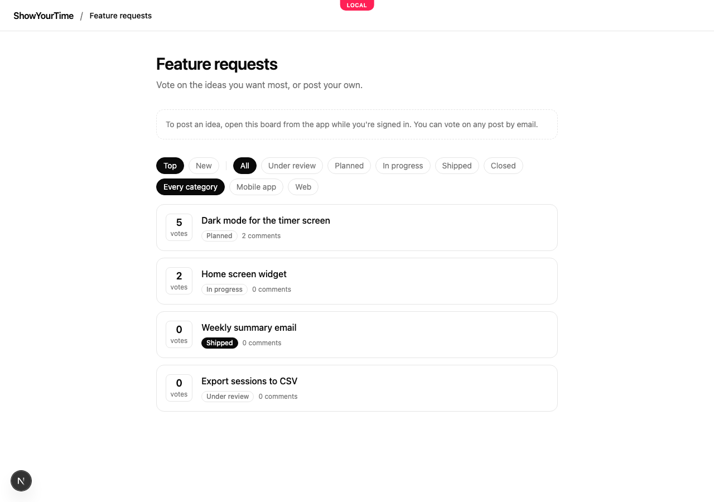
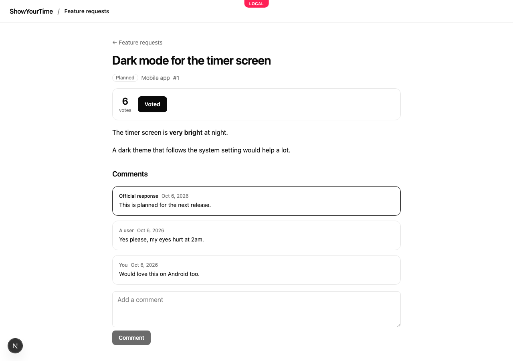
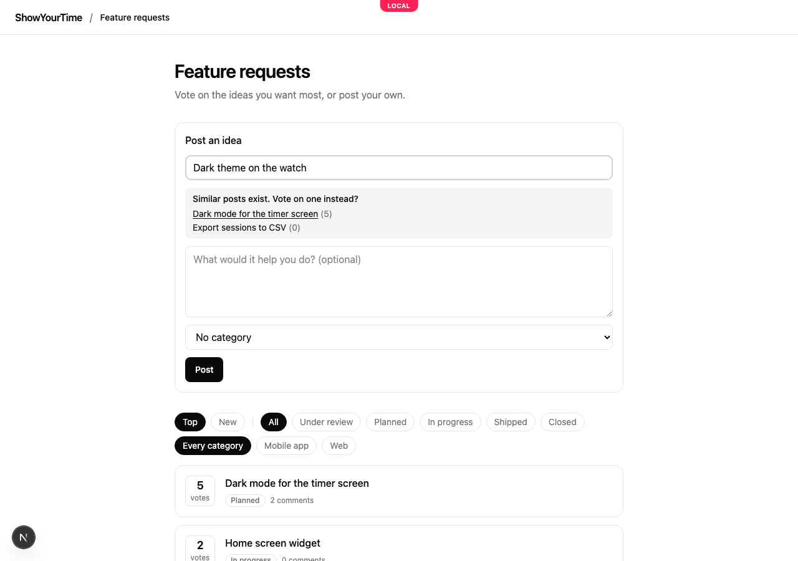
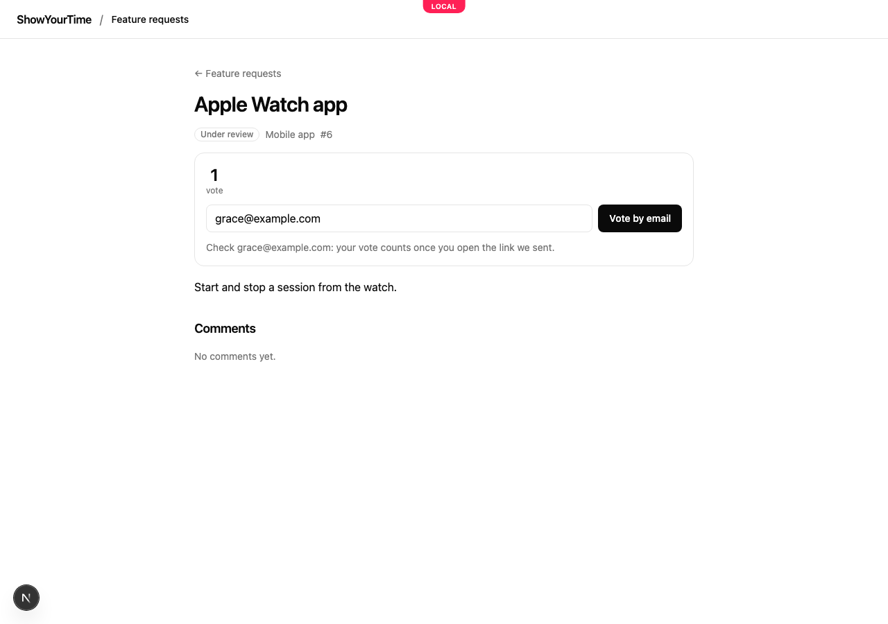

# Open a public feedback board

A feedback board collects what your users want next. On its public page they read the ideas others posted, vote for the ones they want, comment, and post their own. Your team sees the same posts in Mocco, answers them and moves them from under review to planned, in progress and shipped.

## 1. Before you start

The public board is served on your project's help center site, so the project needs one (see [Publish a help center](../help/help-center.md); the site doesn't need any articles). A board whose site is `showyourtime.help.mocco.club` is at:

```text
https://showyourtime.help.mocco.club/feedback/<board>
```

When the help center has its own domain, such as `help.showyourtime.app`, the board is there too: `https://help.showyourtime.app/feedback/<board>`.

Boards are public when they are created. A board marked private has no public page.

## 2. What visitors see

The board lists its posts, most voted first. Anyone can read it, and search engines index it. Each post shows its votes, its status and how many comments it has.



**Top** and **New** sort the list. The status and category buttons filter it, and the filter is kept in the address (`?status=planned&category=mobile`), so a filtered list can be shared as a link. Duplicates your team merged into another post are left out.

A post's page has its description, the team's official response, and the public comments. Your team's internal notes never appear on the public page, and comments never show who wrote them: they read "Official response", "The team", "A user", or "You" for the reader's own.



A merged duplicate's address sends the reader to the post it was merged into.

## 3. Sign your users in from your app

Posting and commenting need to know who the user is. Your app's server signs a short-lived token for its signed-in user, the same token your app sends to the feedback API (see [In-app contact with Mocco Messenger](../messenger/contact-us.md) for the identity secret). It is an HS256 JWT signed with the project's identity secret (the one Messenger setup shows), with the user's id as `sub` and an expiry at most an hour ahead.

Link to the board with the token in the address:

```ts
import { SignJWT } from 'jose';

// On your server, for the signed-in user.
const now = Math.floor(Date.now() / 1000);
const token = await new SignJWT({})
  .setProtectedHeader({ alg: 'HS256' })
  .setSubject(user.id)
  .setIssuedAt(now)
  .setExpirationTime(now + 15 * 60)
  .sign(new TextEncoder().encode(process.env.MOCCO_IDENTITY_SECRET));

const boardUrl = `https://showyourtime.help.mocco.club/feedback/ideas?token=${token}`;
```

The page keeps the token for that browser tab and removes it from the address, so it isn't bookmarked or passed on. When the token expires, the user follows the link from your app again.

A signed-in user can post an idea. While they type a title, the board shows similar posts, so they can vote on one of those instead of posting a duplicate. A new post starts **Under review** with the author's own vote.



On a post, a signed-in user votes with one click, and clicking again takes the vote back. The count updates at once. They can also comment.

## 4. Visitors without an account

Someone your app hasn't signed in can still vote, with their email address. Mocco mails them a link, and the vote counts once they open it. They can't post or comment.



Voting by email needs Mocco to send mail. On a self-hosted Mocco without an email sender, the form says it isn't available.

## 5. Limits

Each user can vote 30 times, comment 20 times and post 5 times an hour, and one network address can make 120 changes an hour, whoever signs in. An email address gets 3 vote mails an hour.

The list a search engine or a first-time visitor sees is refreshed at least once a minute. Vote counts on a post's page are always current.
