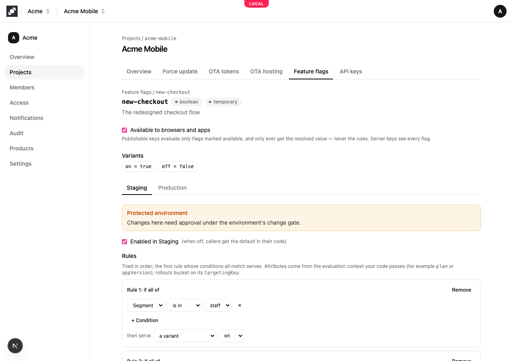
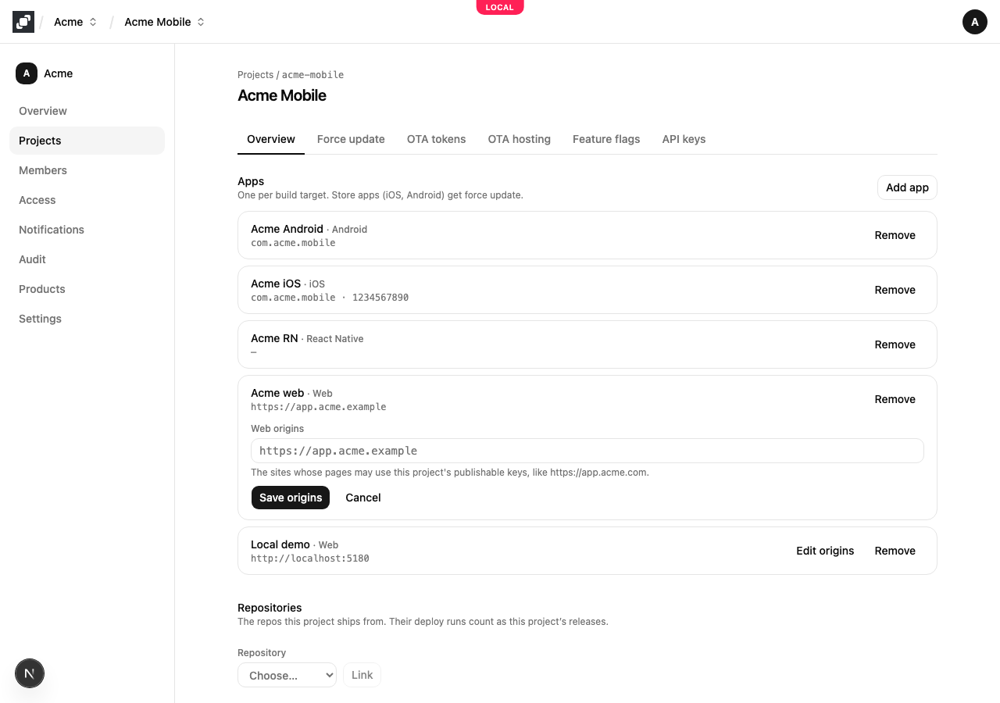
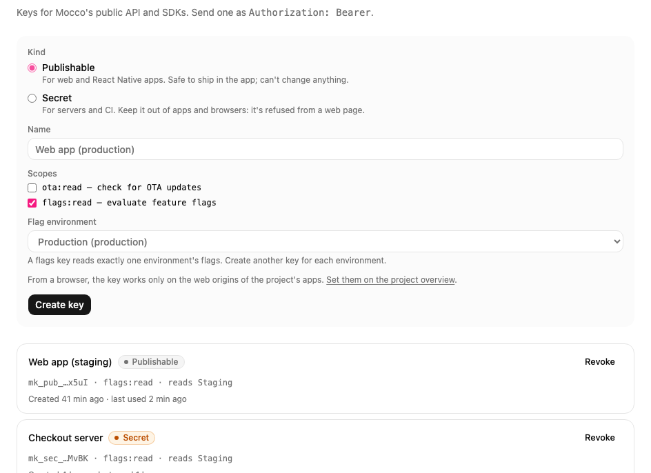

# Feature flags in browsers and apps

Code that runs on your users' devices can't hold your flag rules: rules can name customers, internal accounts or plans you haven't announced. In a browser or an app, Mocco evaluates flags itself and sends back only the answers, such as `new-checkout = true`. Your code still uses the standard [OpenFeature](https://openfeature.dev) API, and Mocco's provider tells it at once when a flag changes.

This guide assumes you have a project with feature flags and an environment, as in the [quickstart](./quickstart.md).

## 1. Choose which flags devices may see

Open a flag and tick **Available to browsers and apps**. Only flags marked this way are answered for a publishable key; any other flag looks like it doesn't exist (`FLAG_NOT_FOUND`), so an internal flag's name never reaches a device.



## 2. Allow your site's origin

A publishable key works on a web page only if the page's origin belongs to one of the project's **Web** apps. On the project's **Overview** page, add a Web app (or choose **Edit origins** on one) and enter each origin your pages are served from, such as `https://app.acme.com` or `http://localhost:5173` for local development. An origin is a scheme and host, with no path.



Apps (React Native) don't send an origin, so this step is only for web pages.

## 3. Create a publishable key for one environment

On the **API keys** page, create a **Publishable** key with **flags:read** and choose the environment it reads. Like a server key, it reads exactly one environment, so build each environment of your app with its own key. A publishable key is safe to ship: it can only read the answers for the flags you marked in step 1.



## 4a. A web page or React app

Install the OpenFeature web SDK and Mocco's web provider:

```bash
npm install @openfeature/web-sdk @mocco/openfeature-web
```

Register the provider once, with the user's context:

```ts
import { MoccoWebProvider } from '@mocco/openfeature-web';
import { OpenFeature } from '@openfeature/web-sdk';

await OpenFeature.setContext({ targetingKey: user.id, plan: user.plan });
await OpenFeature.setProviderAndWait(new MoccoWebProvider({ publishableKey: 'mk_pub_…' }));

const showNewCheckout = OpenFeature.getClient().getBooleanValue('new-checkout', false);
```

Evaluations read the answers the provider already has, so they never wait on the network. The provider fetches all of them in one request and listens to Mocco's change stream: when you change a flag in the console, open pages update within a second or two and OpenFeature emits `PROVIDER_CONFIGURATION_CHANGED`. If the stream can't connect, it checks every 60 seconds instead (`pollInterval`). It also checks when the tab becomes visible again, and keeps the last answers in `localStorage` so a reload shows them before the network answers.

When the user signs in or changes plan, call `OpenFeature.setContext(...)` again; the provider fetches the answers for the new context.

### React

With [`@openfeature/react-sdk`](https://openfeature.dev/docs/reference/technologies/client/web/react), wrap the app once and read flags with hooks. Components re-render when a flag changes:

```tsx
import { MoccoWebProvider } from '@mocco/openfeature-web';
import { OpenFeature, OpenFeatureProvider, useBooleanFlagValue } from '@openfeature/react-sdk';

OpenFeature.setProvider(new MoccoWebProvider({ publishableKey: 'mk_pub_…' }));

export function App() {
  return (
    <OpenFeatureProvider>
      <Checkout />
    </OpenFeatureProvider>
  );
}

function Checkout() {
  const isNew = useBooleanFlagValue('new-checkout', false);
  return isNew ? <NewCheckout /> : <OldCheckout />;
}
```

## 4b. A React Native app

Install the OpenFeature SDKs, Mocco's React Native provider, and the storage and event-stream libraries it uses:

```bash
npm install @openfeature/web-sdk @openfeature/react-sdk @mocco/openfeature-react-native \
  @react-native-async-storage/async-storage react-native-sse
```

React Native has no `localStorage`, page visibility or `EventSource`, so you pass them in:

```tsx
import AsyncStorage from '@react-native-async-storage/async-storage';
import { MoccoReactNativeProvider } from '@mocco/openfeature-react-native';
import { OpenFeature, OpenFeatureProvider, useBooleanFlagValue } from '@openfeature/react-sdk';
import { AppState } from 'react-native';
import EventSource from 'react-native-sse';

OpenFeature.setProvider(
  new MoccoReactNativeProvider({
    publishableKey: 'mk_pub_…',
    storage: AsyncStorage,
    appState: AppState,
    EventSource,
  }),
);
```

Then use `OpenFeatureProvider` and the hooks as in the React example above.

What each piece does:

- **`storage`** keeps the last answers on the device. On the next launch the app starts with them straight away, even offline, and refreshes in the background; while Mocco can't be reached the provider reports `PROVIDER_STALE` and keeps answering from the stored copy.
- **`appState`** fetches fresh answers whenever the app comes back to the foreground, and pauses checking in the background.
- **`EventSource`** listens to Mocco's change stream while the app is open, so changes arrive within seconds. Without it the provider checks every 60 seconds while the app is active (`pollIntervalMs`).

Only the very first launch, with nothing stored and no network, starts without answers: every flag then returns your code's default.

## Server-side: the Vercel Flags SDK

In a Next.js app that uses the [Flags SDK](https://flags-sdk.dev), evaluate on the server with a **secret** key and Mocco's server provider, through the Flags SDK's OpenFeature adapter:

```bash
npm install flags @flags-sdk/openfeature @openfeature/server-sdk @mocco/openfeature-server
```

```ts
import { createOpenFeatureAdapter } from '@flags-sdk/openfeature';
import { MoccoProvider } from '@mocco/openfeature-server';
import { OpenFeature } from '@openfeature/server-sdk';
import { flag } from 'flags/next';

const mocco = createOpenFeatureAdapter(async () => {
  await OpenFeature.setProviderAndWait(new MoccoProvider({ secretKey: process.env.MOCCO_FLAGS_KEY! }));
  return OpenFeature.getClient();
});

export const newCheckout = flag<boolean>({
  key: 'new-checkout',
  defaultValue: false,
  adapter: mocco.booleanValue(),
  identify: async () => ({ targetingKey: (await currentUser()).id }),
});
```

`await newCheckout()` in a server component or route then evaluates in memory, as described in the [quickstart](./quickstart.md#7-evaluate-flags-from-node).
