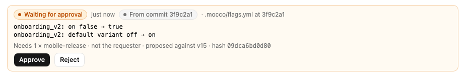
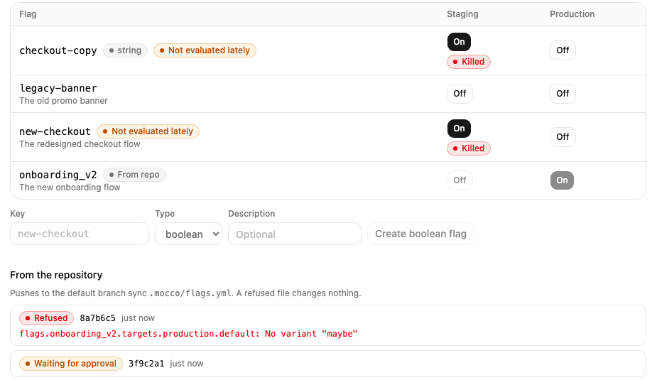
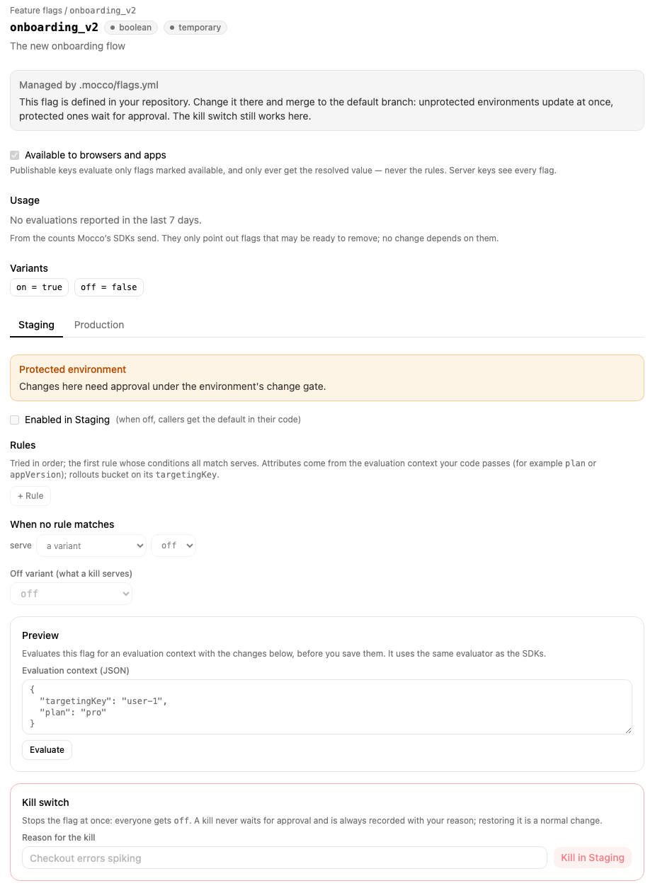

# Flags as code

You can keep your feature flags in your repository, next to the code that reads them. Changes to the file go through your usual pull requests, and merging them updates Mocco. Merging is not the same as releasing: environments you protect still wait for their approvers.

## 1. Connect the repository

The repository must be connected to Mocco through the GitHub App and linked to the project, as for pipelines. Mocco reads the file on every push to the repository's **default branch**.

## 2. Add `.mocco/flags.yml`

```yaml
version: 1
flags:
  onboarding_v2:
    description: The new onboarding flow
    client_visible: true        # browsers and apps may evaluate it
    targets:
      staging:
        default: on
      production:
        default: off
        rules:
          - when: { attribute: plan, op: in, values: [pro] }
            serve: on
```

Each flag lists its **targets**, the environments it is on in (by environment key), with what it serves by default and its rules. A flag is off in every environment the file doesn't list for it. Boolean flags get the variants `on` and `off`. Other types list their own:

```yaml
  checkout_copy:
    type: string
    variants: { short: Pay, long: Pay securely }
    off_variant: short          # what a kill serves
    targets:
      production:
        default: long
        rollout: { short: 50, long: 50 }   # instead of `default`, when no rule matches
```

A rule's `when` is one condition or a list that must all match: `{ attribute, op, values }` or `{ segment }`. Its `serve` is a variant or `{ rollout: { variant: weight, … } }`.

| Field | Where | Meaning |
|---|---|---|
| `type` | flag | `boolean` (default), `string`, `number` or `json` |
| `description` | flag | Shown in the console |
| `lifecycle` | flag | `temporary` (default) or `permanent`; permanent flags aren't suggested for cleanup |
| `client_visible` | flag | `true` lets browsers and apps evaluate it (default `false`) |
| `variants`, `off_variant` | flag | Required unless the flag is boolean |
| `enabled` | target | Default `true`; `false` gives callers the default in their code |
| `default` | target | The variant served when no rule matches |
| `rules` | target | Tried in order; the first whose conditions all match serves |
| `rollout` | target | Served instead of `default` when no rule matches |

The operators are the ones the console's rule editor offers: `in`, `not_in`, `starts_with`, `ends_with`, `lt`, `lte`, `gt`, `gte` and the `semver_` comparisons. Unknown fields are refused, so a misspelled key is caught instead of ignored.

## 3. Merge, and approve where it's protected

When the change reaches the default branch:

- **Unprotected environments** update at once.
- **Protected environments** get a change waiting for approval, marked with the commit it came from. A newer push replaces it.
- **Who can't approve:** the change counts as proposed by the person who pushed or merged (the member signed in with that GitHub account) and by the commit's author (the member with that verified email). Neither can approve it.



The flags screen marks flags that come from the repository and lists the last syncs. If the file has a mistake, such as an environment that doesn't exist or a variant a flag doesn't have, nothing changes, and the sync shows where the problem is:



## In the console

A flag from the repository is read-only in the console: its rules, switches and settings change only through the file. The **kill switch** still works, because in an incident you shouldn't have to wait for a merge. A sync never undoes a kill: restore the flag in the console once it's safe.



To hand a flag back to the console, remove it from the file. Mocco turns it off everywhere and lets you edit it again. To take over a flag made in the console, add it to the file with the same type and variants. Variants can be added later, but not removed or changed.
