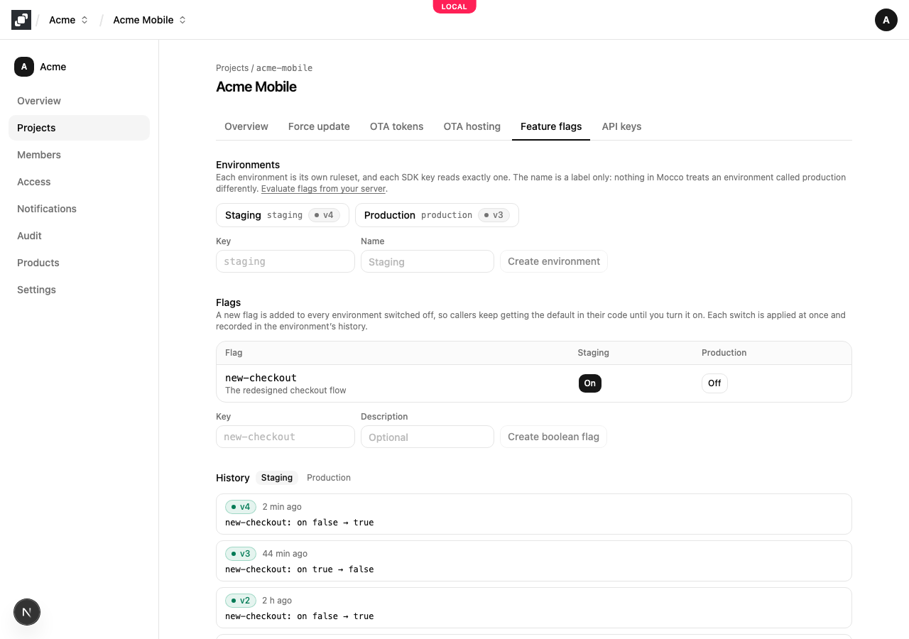
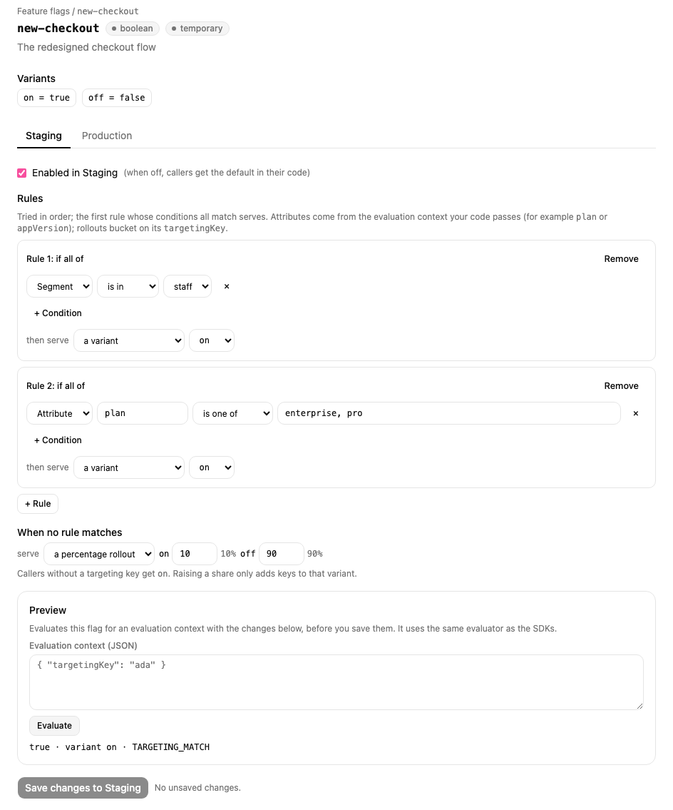
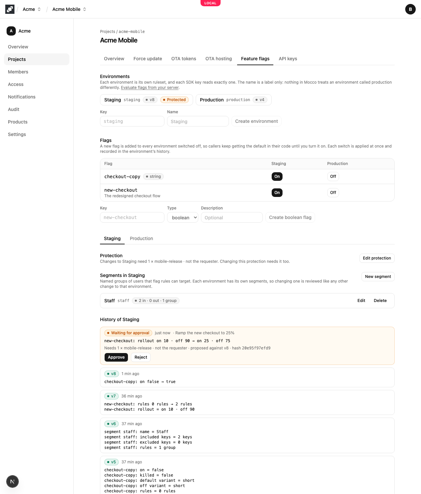
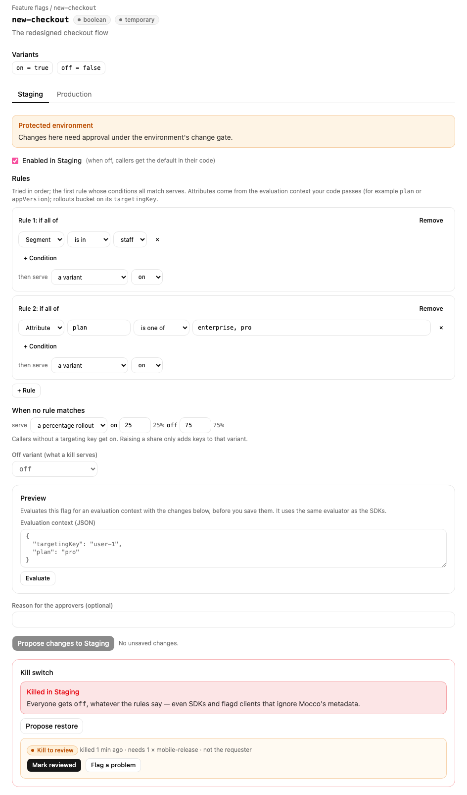
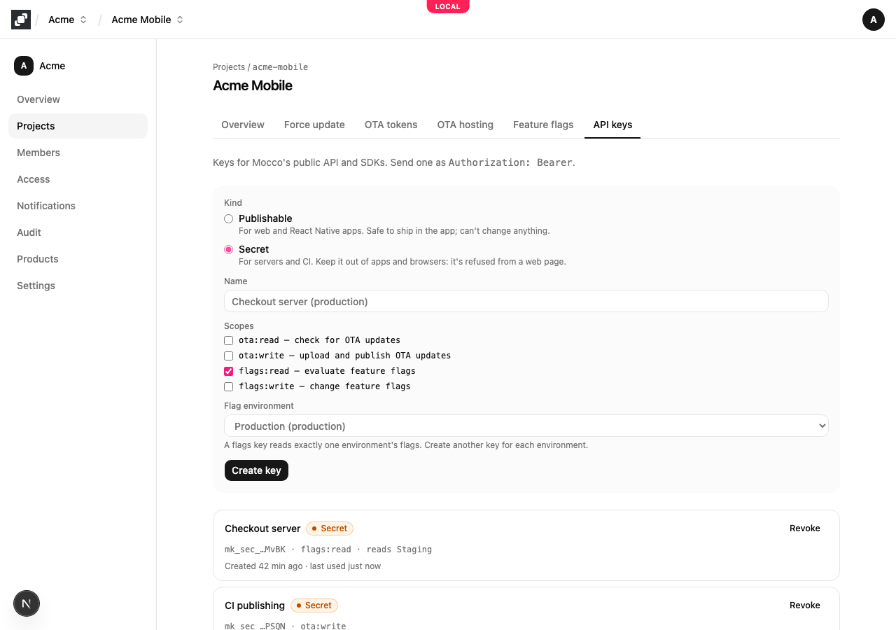

# Feature flags quickstart

Mocco's feature flags work with [OpenFeature](https://openfeature.dev), so your code calls the standard OpenFeature API and Mocco is the provider behind it. Your server downloads its environment's rules and evaluates every flag in memory: an evaluation never waits on the network, and the server keeps using the last rules it received if Mocco can't be reached.

## 1. Turn on feature flags

A workspace owner turns on **Feature flags** on the workspace's **Products** page. The project then shows a **Feature flags** tab.

## 2. Create environments and a flag

On the **Feature flags** tab, create an environment for each place your code runs, for example `staging` and `production`. An environment is just a separate set of rules: its name means nothing special to Mocco.

Then create a flag, for example `new-checkout`. A flag is `boolean` by default; choose `string`, `number` or `json` to give it named variants instead, such as `{ "short": "Pay", "long": "Pay securely" }`. A new flag is added to every environment switched **off**, so your code keeps using its own default until you switch the flag on. Each change applies at once and is recorded in the environment's history, with who changed what.



## 3. Target users

Open a flag to decide who gets which variant, per environment:

- **Rules** are tried in order, and the first rule whose conditions all match serves its variant. A condition compares an attribute of the evaluation context your code passes (`plan is one of pro, enterprise`, `appVersion version ≥ 2.1.0`, `email ends with @acme.com`) or checks membership of a segment.
- **Segments** are named groups for an environment, defined on the Feature flags tab: targeting keys that are always in or never in, plus attribute conditions.
- **When no rule matches**, the flag serves a variant or a **percentage rollout**. Rollouts are bucketed on the context's `targetingKey`, so a user always lands in the same bucket, and raising a share from 10% to 20% only adds users.

**Preview** evaluates your unsaved changes for any context before you save, with the same evaluator the SDKs use.



## 4. Protect an environment

On the Feature flags tab, pick an environment and choose **Edit protection**. Choose the role whose members approve changes, how many approvals are needed, and whether the person who proposed a change may approve it. A role is defined on the workspace's **Access** page.

Once an environment is protected, saving a change sends it for approval instead of applying it:

- The change waits in the environment's history with its diff, the reason, and the protection it needs. People with the role get a notification if a workspace notification rule includes flag changes (the **Mocco** preset does).
- An approver approves or rejects it right there. An approval is tied to the exact change on screen, so a change that was replaced in the meantime can't be approved by mistake.
- When enough people approve, the change applies. If someone else changed the environment first, it is marked **conflicted** and nothing is applied; the person who proposed it can **rebase** it onto the current version, which sends it for approval again.
- The proposer can withdraw a waiting change. A change nobody decides on within 7 days expires.

Changing or removing an environment's protection is itself approved under its current protection. A change that is already waiting keeps the protection it was proposed under.



## 5. Kill a flag in an emergency

If a flag causes trouble, open it, enter a reason in **Kill switch** and choose **Kill**. Everyone in that environment gets the flag's **off variant** at once, whatever its rules say. That includes SDKs and flagd clients that don't know about Mocco: the served rules themselves say "off".

A kill never waits for approval, even in a protected environment, and is always recorded with who did it and why. In a protected environment, the kill is then up for review by the environment's approvers, who mark it reviewed or flag a problem. The **off variant** is set on the flag's page; changing it, and restoring a killed flag, are normal changes, so they need approval in a protected environment. On the Feature flags tab, **Edit protection** also sets which roles may kill flags in that environment (by default, any workspace member).



## 6. Create a server key for one environment

On the project's **API keys** tab, create a **Secret** key with the **flags:read** scope and choose the environment it reads. A key reads exactly one environment, so create one key per environment and give each server the key for its own environment. Copy the key from the notice; it is shown only once.



Keep this key on the server. Mocco refuses secret keys sent from a browser, because the rules can hold user lists and other details your users shouldn't see.

## 7. Evaluate flags from Node

Install OpenFeature's server SDK and the Mocco provider:

```bash
npm install @openfeature/server-sdk @mocco/openfeature-server
```

Register the provider once when your server starts, then ask for flags anywhere:

```ts
import { MoccoProvider } from '@mocco/openfeature-server';
import { OpenFeature } from '@openfeature/server-sdk';

await OpenFeature.setProviderAndWait(new MoccoProvider({ secretKey: process.env.MOCCO_FLAGS_KEY! }));
const flags = OpenFeature.getClient();

if (await flags.getBooleanValue('new-checkout', false, { targetingKey: user.id, plan: user.plan })) {
  // the new checkout
}
```

The provider listens to Mocco's change stream, so when you switch a flag in the console, servers pick it up within a second or two, and OpenFeature emits `PROVIDER_CONFIGURATION_CHANGED` with the flags that changed. It also checks every 30 seconds in case the stream drops (`pollIntervalMs` changes that); when nothing changed, Mocco answers with an empty `304 Not Modified`.

If Mocco can't be reached, the provider keeps answering from the last rules it received and reports `PROVIDER_STALE` until it reconnects. To start even when Mocco is unreachable at boot, pass a saved copy of the rules as `bootstrap`.

A flag that is switched off returns your code's default with the reason `DISABLED`. A flag key Mocco doesn't know returns your default with the error `FLAG_NOT_FOUND`, so a typo never breaks a request.

## Use flagd instead

Mocco serves standard flagd flag definitions, so a [flagd](https://flagd.dev) instance can sync from Mocco and serve flags to any OpenFeature flagd provider, in any language. Point flagd's HTTP sync at Mocco with the server key:

```bash
flagd start --sources='[{"uri":"https://api.mocco.club/v1/flags/ruleset","provider":"http","authHeader":"Bearer mk_sec_…","interval":30}]'
```

flagd sends the last `ETag` with each poll, so unchanged rules cost one small request.

## Browsers and apps

For web pages, React and React Native apps, see [Feature flags in browsers and apps](./browsers-and-apps.md): devices get only the answers, never the rules.
