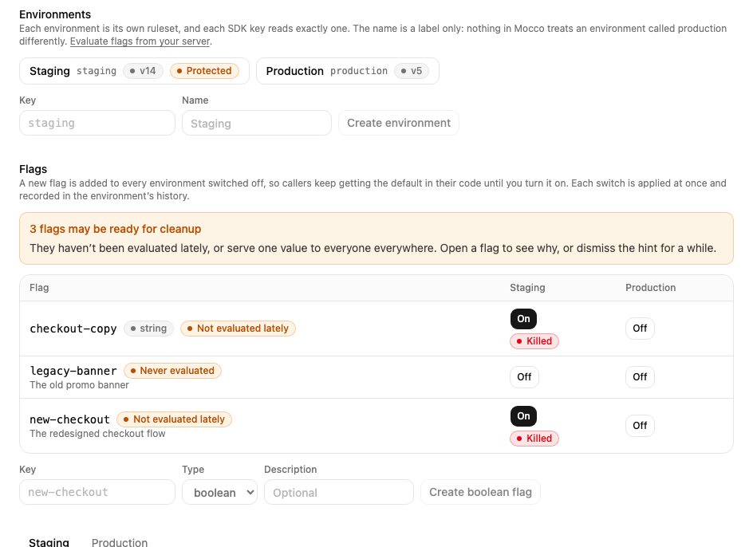
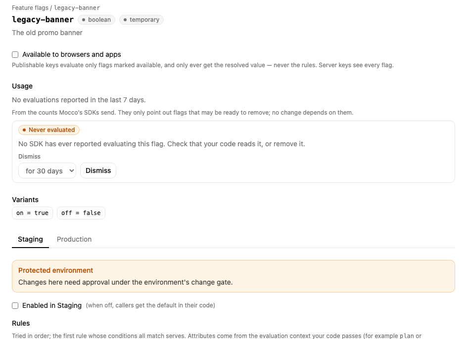

# Clean up stale flags

A flag that has done its job, such as a release that reached everyone, should come out of your code. Otherwise it keeps an old code path alive and makes the next change harder to reason about. Mocco points out the flags that look ready to go.

## Where the hints come from

Mocco's SDKs count how often each flag is read and send the counts at most once a minute. A count is just a number per flag and variant: no users, no contexts. Mocco adds them up per hour.

Once a day Mocco checks every **temporary** flag that is at least 30 days old and marks it if it is:

- **Never evaluated**: no SDK has ever reported reading it. Often the code that reads it was never shipped, or was already removed.
- **Not evaluated lately**: it was read before, but not in the last 30 days.
- **Fully rolled out**: in every environment it has served the same value to everyone, with no rules, for 30 days. The flag no longer decides anything.

Flags marked **permanent** (for example an operational switch you keep on purpose) are never marked.

## See and dismiss the hints

The **Feature flags** page shows how many flags may be ready for cleanup, with a badge on each.



Open a flag to see its **Usage** (evaluations in the last 7 days and when it was last read) and why it was marked. If the hint is wrong for now, for example the code that reads the flag ships next month, choose how long to **Dismiss** it for: 30 days, 90 days or a year. A dismissed hint comes back by itself when that time is up and the flag still looks stale; **Show again** brings it back sooner.



## The weekly digest

Once a week Mocco sends each project's list of flags that look ready for cleanup as a notification, `flags.stale.digest`. Dismissed hints are left out. To receive it, apply the **Mocco** preset on a channel's **Rules**, which includes it, or add a rule for the event by hand (see [Mocco events](../notifications/mocco-events.md#the-mocco-preset)).

## Turning the counts off

Each SDK takes `telemetry: false`:

```ts
new MoccoProvider({ secretKey, telemetry: false }); // @mocco/openfeature-server
new MoccoWebProvider({ publishableKey, telemetry: false }); // @mocco/openfeature-web
new MoccoReactNativeProvider({ publishableKey, telemetry: false }); // @mocco/openfeature-react-native
```

Without counts, every flag eventually shows as **never evaluated**, so leave telemetry on wherever the flag is actually read. flagd and other OpenFeature providers don't send counts.

The counts only drive these hints. Nothing else in Mocco reads them: approvals, protected environments and the kill switch work the same with telemetry on or off.
