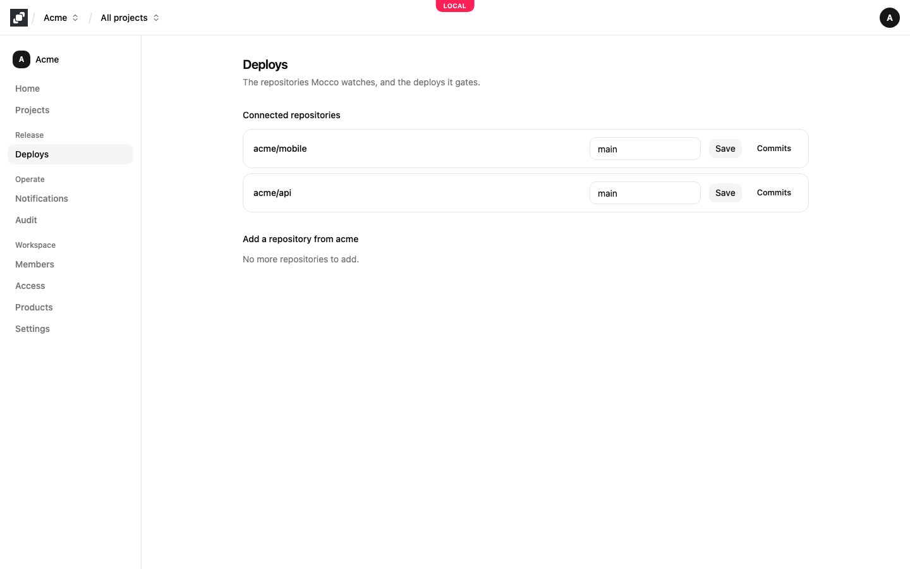
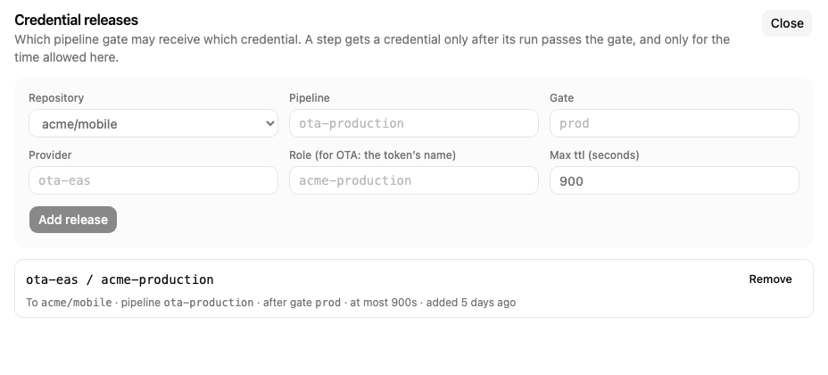

# Deploy governance

On GitHub, anyone who can push to a repository can usually deploy it too. Mocco separates the two. Your pipeline runs as a list of steps, and between them you put **gates**: a gate pauses the run until enough people with the right roles approve it. A step that needs a production credential gets it from Mocco, and Mocco hands it out only after that step's gate was approved. Removing the gate from the workflow doesn't help anyone skip it, because the credential is never released without it.

Deploy governance is always on in every workspace. The pieces are:

- **Repositories** on the workspace's **Deploys** page: the GitHub repositories Mocco watches.
- **A `.mocco.yml` file** in each repository: its pipeline, with steps and gates.
- **Commits** and **runs**: each commit on the watched branch can be run through its pipeline, and the run page is where approvers act.
- **Roles** and **Credential releases** on the **Access** page: who approves, and which gate unlocks which credential.

## Connect GitHub

Open the workspace's **Deploys** page. With no repositories yet, it shows **Connect GitHub**. Choose it and install the Mocco GitHub App on your GitHub account or organization, giving it access to the repositories you want. If your organization requires an admin to approve app installs, Mocco says the installation is awaiting approval until they do.

Back in Mocco, each repository the app can see is listed under **Add a repository from** your account; choose **Add** next to it. It then appears under **Connected repositories**.



Each connected repository has a watched branch, its default branch unless you change it. Type the branch and choose **Save**. Once a watched branch is saved, **Commits** lists the commits Mocco has synced from it, newest first, and **Load more** shows older ones. Each commit opens its own page.

To use the repository's releases in a project, link it on the project's **Overview** page; see [Set up a workspace and projects](../start/workspace-and-projects.md#5-link-repositories).

## Describe the pipeline

Add a `.mocco.yml` at the root of the repository. It doesn't replace your GitHub Actions workflows: each step names the executor that runs it, and Mocco starts the step there. Version 2 of the format mixes steps and gates:

```yaml
version: 2
pipeline: deploy
steps:
  - kind: step
    run: deploy-staging
    executor: github-actions
  - kind: gate
    name: production
    resume:
      - { role: deployer, count: 2 }
      - { role: security, count: 1 }
    prevent_self: true
    reason_required: true
  - kind: step
    run: deploy-production
    executor: github-actions
```

A step has a `run` name and an `executor`; `github-actions` starts the step in your repository's GitHub Actions with a `repository_dispatch` event, as [Release a token to your pipeline](../ota/pipeline.md#4-fetch-it-in-the-workflow) shows. A gate has a `name` and `resume`, the roles that must approve and how many people from each. Every requirement in `resume` must be met. `prevent_self: true` stops the person who started the run from approving it, and `reason_required: true` makes every approver or rejecter give a reason. Both are off unless you set them. Step and gate names must be unique in the file. Version 1 files, with steps only and no `kind`, still work.

The role names refer to the roles on the workspace's **Access** page; the file never lists people. See [Members and access](../start/members-and-access.md#roles-on-the-access-page).

## The commit page

Mocco reads `.mocco.yml` at each synced commit and keeps that version with the commit, so a run always follows the file as it was at its commit. The commit page shows the commit's message, author and time, then one of:

- the pipeline, with its steps in order and each gate as **Gate:** and its name, followed by what it needs, such as "Requires 2× deployer, 1× security · no self-approval · reason required"
- **Invalid .mocco.yml**, with each problem and where in the file it is
- **No .mocco.yml at this commit**
- **Config pending**, while Mocco is still reading the commit

**Run** starts a run of that commit and opens it. It is available only when the commit has a valid `.mocco.yml`. Any workspace member can start a run.

## Runs and gates

The run page shows the run's state, its steps with the status of each, and its gates. While the run is still moving, it shows **Live** and updates by itself.

A run is `queued`, then `running`. When it reaches a gate it stops at `awaiting_gate`, and ends as `succeeded`, `failed`, `canceled` or `rejected`. Each step goes from `pending` to `dispatched` and `running`, and ends as `succeeded`, `failed`, `skipped` or `canceled`.

Each gate card shows its state (`pending`, `resumed`, `rejected` or `expired`) and, for each required role, how many approvals it has, such as "1 / 2 approvals". When the run is waiting at that gate, the card has a reason box with **Approve** and **Reject**:

- Only people in one of the gate's roles can vote, and each person votes once. Someone in several of the roles still counts as one person.
- When every role has enough approvals, the gate is `resumed` and the run continues with the next step.
- A single **Reject** stops the run at once: the gate is `rejected` and so is the run.
- The card says why you can't vote when you have already voted, or when you started the run and the gate bars self-approval.

With notifications set up, Mocco can post to Discord when a run reaches a gate, when a gate is approved or rejected, and when a run fails or succeeds. See [Mocco events](../notifications/mocco-events.md).

## Credentials behind a gate

A gate on its own pauses the pipeline; holding back the credential is what makes it binding. A step asks for a credential in `.mocco.yml` with `credential: { provider, role, ttl, gate }`, where `gate` names a gate earlier in `steps`. Mocco rejects the file if that gate doesn't come before the step.

The request alone grants nothing. A workspace owner or admin allows it on the **Access** page under **Credential releases**: the repository, the pipeline, the gate, the provider and role, and the longest time in seconds the credential may be valid. When the step asks, Mocco hands over the credential only if the run is one Mocco started, the named gate was approved, and a release matches. It records every credential it hands out or refuses in the [audit log](../start/audit-log.md).



Today Mocco releases the publishing tokens of your OTA tool this way; [Release a token to your pipeline](../ota/pipeline.md) walks through it end to end. Cloud credentials, such as short-lived AWS credentials issued to a deploy step, are not available yet.

## What is recorded

Mocco adds an entry to the workspace's [audit log](../start/audit-log.md) when a run is started (`run.triggered`), when a gate is resumed or rejected (`gate.resumed`, `gate.rejected`, with who approved under which role), and for every credential it hands out or refuses (`credential.issued`, `credential.denied`).
