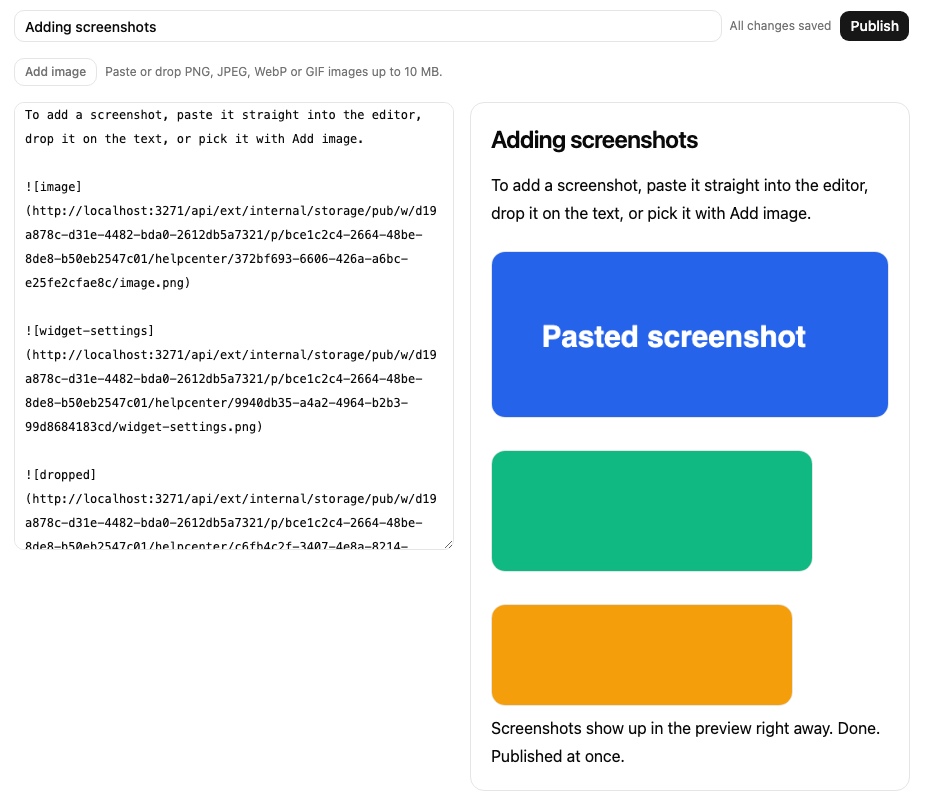
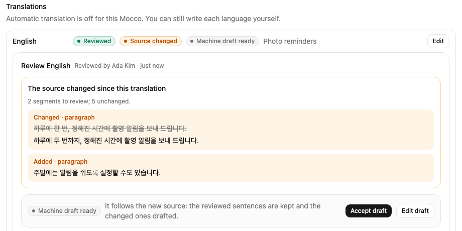
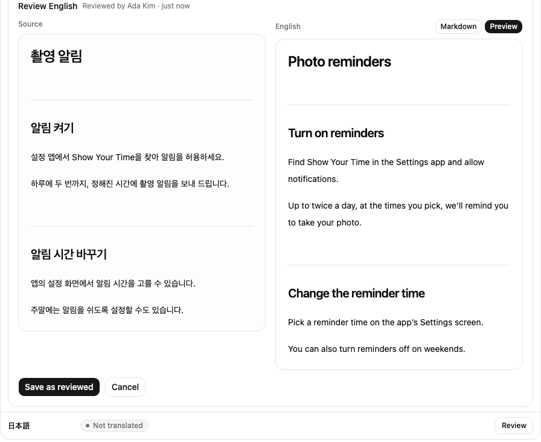
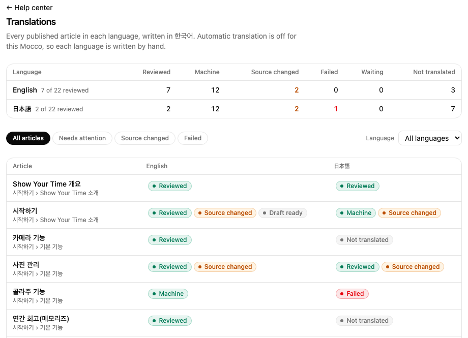
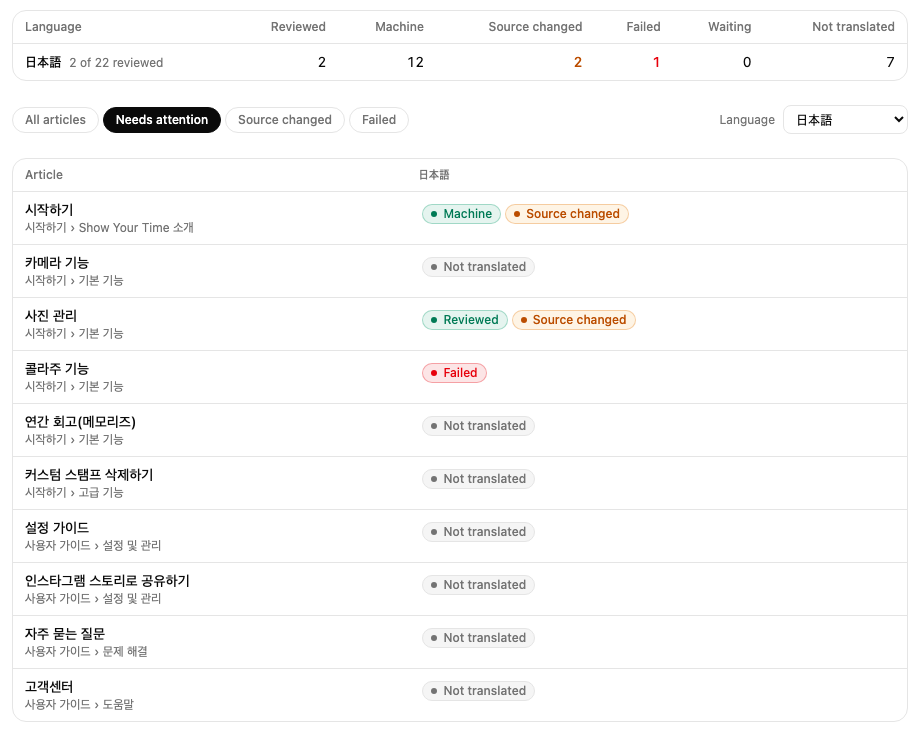
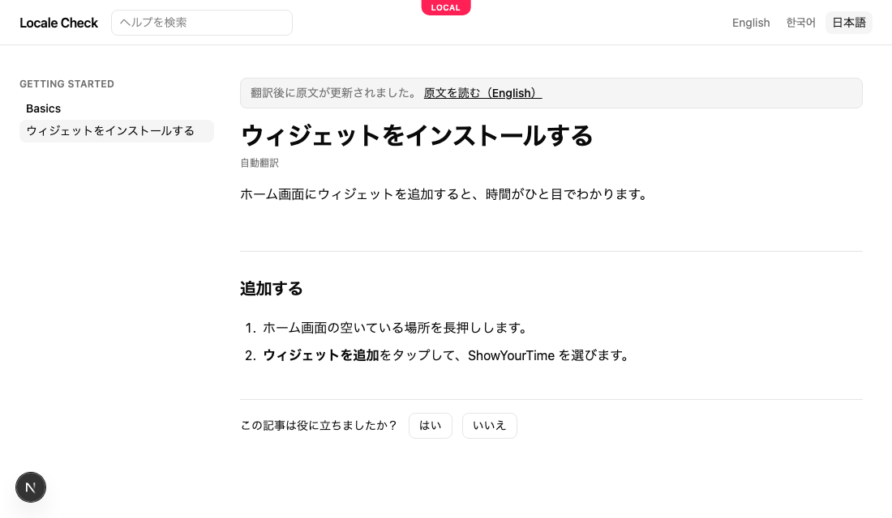
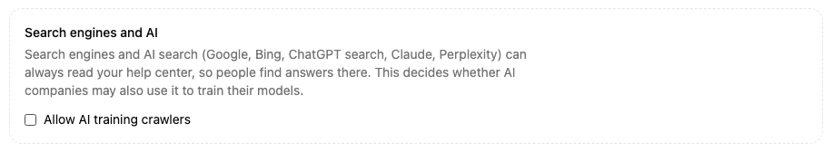
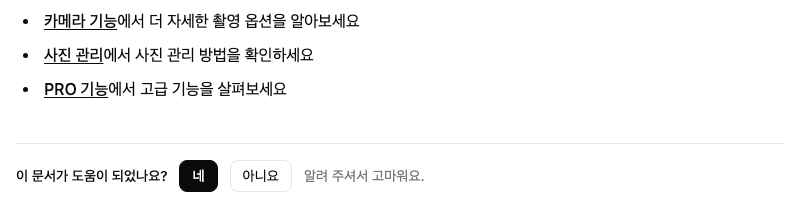
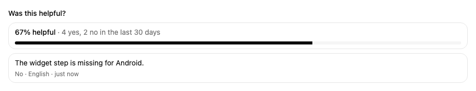

# Publish a help center

A help center is a public site with your product's help articles. You write them in Mocco in Markdown, see each one as readers will while you type, and publish when it's ready. Readers open the site in a browser, or from a link in your app.

## 1. Turn on the help center

A workspace member turns on **Help center** on the workspace's **Products** page. Each project then shows a **Help center** page.

## 2. Set up the site

On the project's **Help center** page, pick:

- **Address**: the site's name in its web address, such as `showyourtime` for `showyourtime.help.mocco.club`. It must be unique across Mocco.
- **Written in**: the language you write articles in.
- **Also offered in**: the languages you plan to offer. Until an article is translated, readers who pick another language get it in the language you write in.

Then choose **Set up help center**.


## 3. Organize and add articles

A help center has **collections** (the top level, such as "Getting started"), which hold **sections** (such as "Basics"), which hold **articles**. Add a collection at the bottom of the page, a section inside a collection, and an article inside a section. A new article opens in the editor.

The page shows every article with its state: **Draft** has never been published, **Published** is on the site, and **Unpublished changes** means the site still shows an earlier version than the one you saved. The site's address is at the top; select it to open the site.


## Import from Mintlify

If your help site is on Mintlify, bring it over instead of writing it again. On the **Help center** page, under **Import from Mintlify**, pick your docs folder (the one with `docs.json`), leave **Publish the imported articles** on if they should go live at once, and choose **Import**.

- `docs.json`'s tabs, groups and pages become collections, sections and articles, in the same order.
- Mintlify's components become plain Markdown: steps become a numbered list, tips and notes become quoted notes, and update entries become headings.
- The images your pages use are uploaded to Mocco.
- Each page's old address (such as `/features/widget-features`) redirects to its article, so links to the old site keep working once the address points at Mocco.
- Importing again updates the same articles and only changes the ones whose text changed.

When it's done, Mocco lists anything it couldn't bring over: images missing from the folder, and pages that aren't in `docs.json`'s navigation.


## 4. Write and publish

The editor has the article's title and its text in Markdown on the left, and the article as readers will see it on the right, updated as you type. You can use headings (`##`), numbered and bulleted lists, **bold**, links, notes (lines starting with `>`) and tables. Links can go to web pages (`https://…`), email addresses (`mailto:…`) or other pages of the site (`/en/articles/…`). Images must be `https://` addresses, or images you add as below.

The draft saves itself a couple of seconds after you stop typing. Next to the title you see **Saving…**, then **All changes saved**. If a save fails, it says **Couldn't save** with **Try again**; your text stays in the editor. Saving never touches the site.

- **Publish** saves anything unsaved and puts the draft on the site.
- **Unpublish** takes the article off the site. Its text and history stay.
- **Delete article** removes it and its history, after you confirm.


**History** below the editor keeps one entry per editing session: your saves over ten minutes land in the same entry, and publishing or restoring starts a new one. **Restore** makes an earlier version the draft again, as a new entry, so nothing in the history is lost. Publish it to put it back on the site.

### Add images

Paste a screenshot into the text, drop an image file on it, or pick files with **Add image**. Each image is uploaded and lands where the cursor is, as ``, and shows in the preview at once. PNG, JPEG, WebP and GIF images up to 10 MB can be added; anything else is refused with a message saying why. Images are public once uploaded, like the published site, so don't paste anything you wouldn't publish.



## Translate

When you publish, Mocco translates the article into each language the site offers, if your Mocco has automatic translation turned on (otherwise you write each language yourself). The **Translations** section of the article shows every language and where it stands:

- **Machine translated**: Mocco's translation, made from the published article.
- **Reviewed**: a person wrote or fixed it. Mocco never replaces it on its own.
- **Source changed**: the article was published again after this translation was made; review it to bring it up to date.
- **Machine draft ready**: on a reviewed language whose source changed, Mocco has drafted a version for the new source. Your sentences are kept and only the changed ones are machine-translated. Readers keep seeing your reviewed text until you accept it.
- **Failed**: the translation changed the article's structure (a heading, a code block or a link), so Mocco didn't use it. The reason is shown.
- **Not translated**: nothing yet. Readers in that language get the article in the language you write in.


### Review a translation

Choose **Review** (or **Edit**) on a language. The article you wrote is on the left and the translation on the right; switch the right side between **Markdown** and **Preview**. The top line says who last reviewed the language and when.

When the source changed since the translation was made, the review opens with what changed: each changed, added or removed paragraph, heading or table cell, with the old text struck through above the new. Unchanged parts are only counted, so you can see exactly what to look at.



If a machine draft is ready, **Accept draft** makes it the reviewed text as it is. **Edit draft** puts it in the editor so you can fix it first.



**Save as reviewed** keeps your text and marks the language reviewed. If the machine's translation is already right, the button reads **Mark reviewed**: saving it unchanged marks it reviewed. Mocco never replaces a reviewed text on its own, and every review is recorded in the workspace's audit log with who did it.

**Translate again** asks for a new machine translation. On a reviewed language it asks you to confirm first, because the machine's text replaces yours on the site. Your version stays in the article's history.

### See every translation at once

Once the site offers another language, the **Help center** page links to **Translations**. At the top, each language shows how many published articles are reviewed, machine translated, out of date with the original (**Source changed**), failed, waiting for a translation, or not translated yet.



Below is every published article with its status in each language. Choose **Needs attention** to list only the articles with a language that is out of date, failed or not translated, or **Source changed** or **Failed** for just those. Pick a language to see only its column. Each status opens that language's review in the article, so you can go down the list and bring each one up to date.



The page's address keeps the filter and language, so you can bookmark the view or send it to a teammate.

Readers who pick a language see its translation, and the article list shows translated titles, collections and sections included.


A machine translation nobody has reviewed says **Automatically translated** under its title, in the reader's language. Once you save a translation yourself, the label goes away.

When you publish the article again, a translation made from the earlier version keeps being shown until it's updated, with a note at the top: the original changed since it was translated, and a link to the article in the language you write in. A machine translation loses the note as soon as Mocco translates the new version; a reviewed one keeps it until you review it again.



## Use your own domain

Your help center is at `<address>.help.mocco.club` from the start. To serve it on your own domain, such as `help.example.com`, ask the Mocco team to add the domain, then point it at Mocco with a DNS record (a `CNAME` to the target they give you). Once the record resolves, the site and every old address of an imported site answer on your domain. The **Help center** page then links your domain.

## Search engines and AI

Your help center tells search engines where every article is, in every language it's offered in, at `/sitemap.xml` on its address (your own domain, once you have one). Search engines and AI search — Google, Bing, ChatGPT search, Claude, Perplexity — can always read it, so people asking them find your answers.

A link to an article shared in Slack, Discord, KakaoTalk or X shows a card with your help center's name, the article's collection, its title and its opening line; a changed article gets a new card.

AI assistants and coding agents can read it as Markdown too: `/llms.txt` on your help center's address lists every article (`/<language>/llms.txt` in another language), and adding `.md` to an article's address gives its text.

AI companies also send crawlers that collect text to train their models. They're allowed by default. To keep them out, clear **Allow AI training crawlers** at the bottom of the **Help center** page. Your site's `/robots.txt` then turns away GPTBot, ClaudeBot, Google-Extended, Applebot-Extended, CCBot, meta-externalagent and Bytespider, while search keeps working. Crawlers honor robots.txt on their next visit; it doesn't remove what they collected before.



## 5. What readers see

The site lists your collections and their articles in the language the reader picked, with a language switcher at the top. On an article, the switcher goes to the same article in each language it's translated into, and to that language's home otherwise. Each article has its own address, `/<language>/articles/<id>-<name>`. The `<id>` part never changes, so links keep working if you rename an article. A published change, an unpublished or deleted article, and a new translation appear on the article and the site's home right away; the article lists on other pages catch up within a minute.

Readers can search from the box at the top of every page. Every word they type has to appear in an article's title or text, in the language they're reading (or yours, for articles not translated yet); articles whose title matches come first. The search box and results speak the reader's language.


Under every article, readers can answer **Was this article helpful?** with Yes or No, in their language. Changing their mind the same day replaces the first answer, so each reader counts once a day.



The article's page in Mocco shows what readers answered in the last 30 days: the share of Yes, the counts, and the newest comments sent from your app. Use it to find articles that need work.



## Suggest articles in your app

Your app can search the help center too, for example to show related articles while someone writes to you, so they may find the answer before they send. Create a **Publishable** key with the **help:read** scope on the **API keys** page (an app that already uses Messenger can add the scope to its key). Then, in React Native:

```tsx
import { createHelp, useHelpSearch } from '@mocco/react-native/messenger';

const help = createHelp({ publishableKey: 'mk_pub_…' });

function Suggestions({ text }: { text: string }) {
  // Waits until typing pauses; `any` finds articles that share any word with the text.
  const { hits } = useHelpSearch(help, text, { locale: 'en', limit: 3, match: 'any' });
  return hits.map(hit => <ArticleLink key={hit.path} title={hit.title} url={hit.url} />);
}
```


Each hit has the article's `title`, a `snippet` of its text and its `url` on your help site, in the reader's language where it is translated. Any other client can call `GET https://api.mocco.club/v1/help/search?q=…&locale=en&match=any` with the key as `Authorization: Bearer mk_pub_…`.

## Show articles in your app

The same key can open the help center inside your app instead of sending people to the browser. `getSite` lists your collections, sections and article titles, and `getArticle` gives one article's Markdown, to render with any Markdown component:

```ts
import { createHelp } from '@mocco/js'; // or '@mocco/react-native/messenger'

const help = createHelp({ publishableKey: 'mk_pub_…' });

const site = await help.getSite({ locale: navigator.language });
const article = await help.getArticle(site.collections[0].sections[0].articles[0].id, { locale: 'en' });
```

Pass the device's language as it comes (`en-GB` counts as English). An article that isn't translated into it yet arrives in your own language, and `article.locale` says which language you got. Only published articles are there: a draft, or an article you unpublish, answers `null`. On the web, add your site's address to the **Web origins** of the project's web app ([Workspaces and projects](../start/workspace-and-projects.md)) so the browser may call Mocco with the key.

Ask "Was this helpful?" in the app too, with an optional comment that only your team sees. Give `createHelp` an id your app keeps for the install, so a reader counts once a day; Mocco stores only a scrambled form of it.

```ts
const help = createHelp({ publishableKey: 'mk_pub_…', visitorId: installId });

await help.sendFeedback(article.id, { helpful: false, locale: article.locale, comment: 'Missing Android steps' });
```
