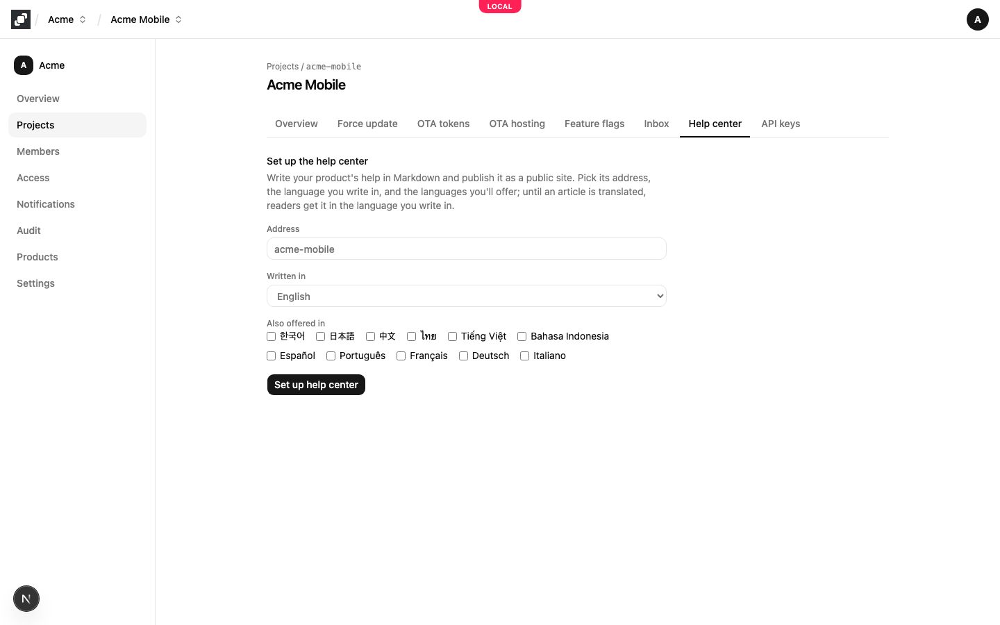
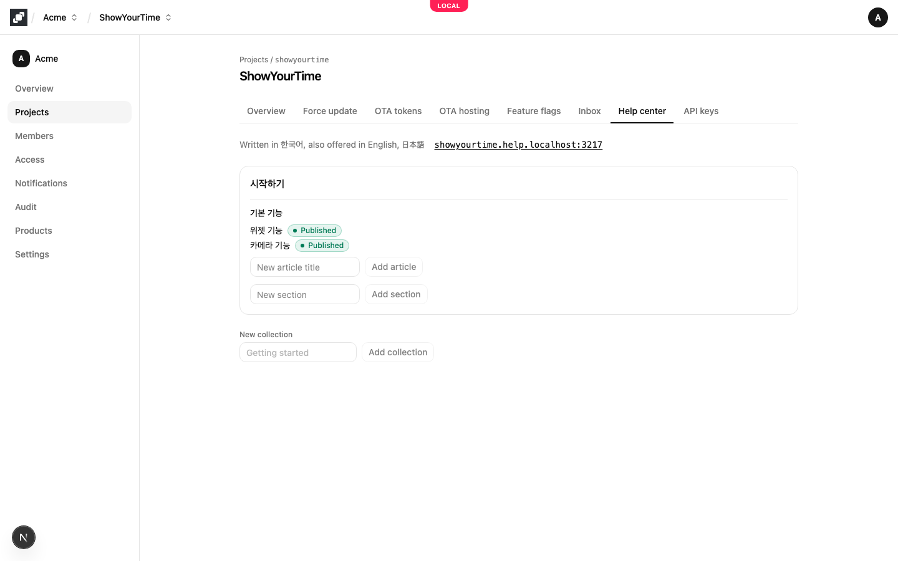
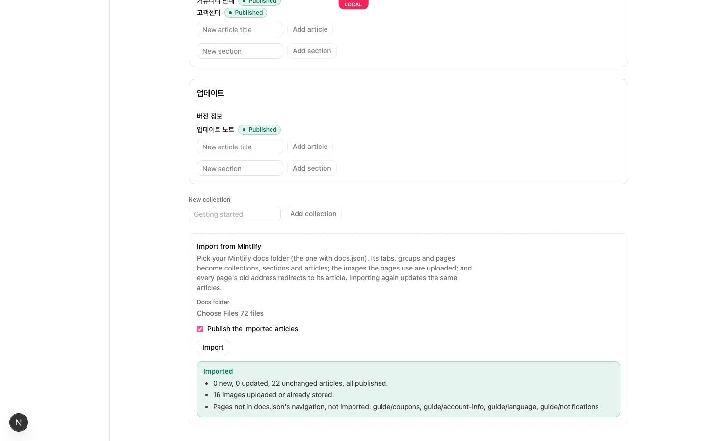
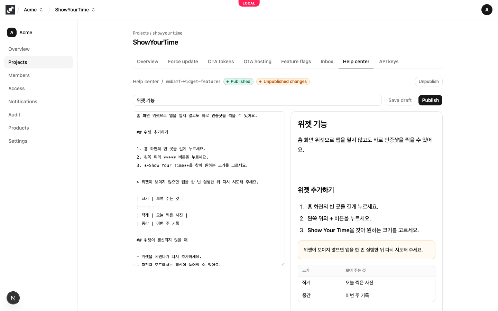
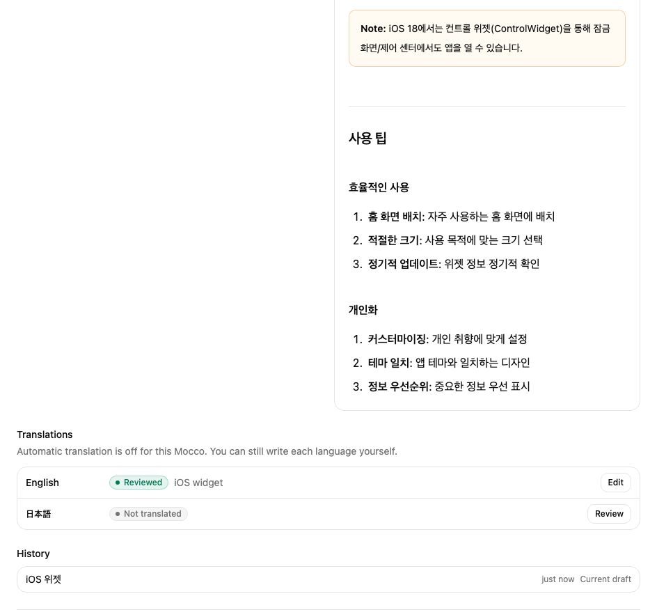
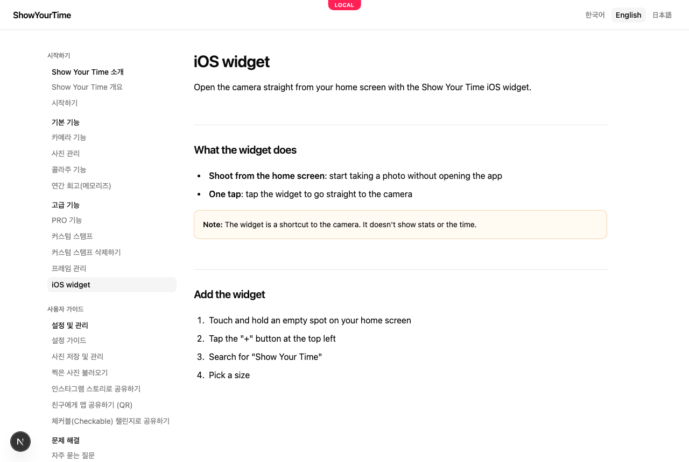
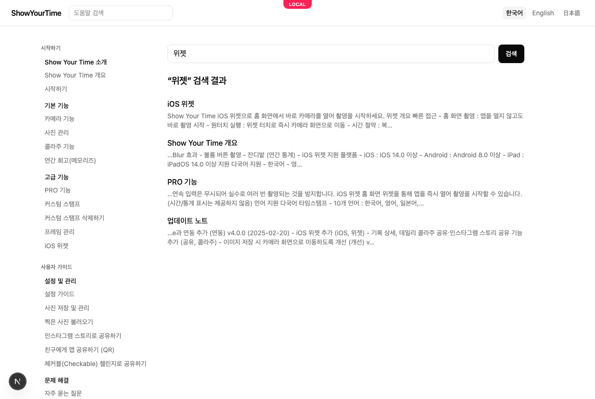
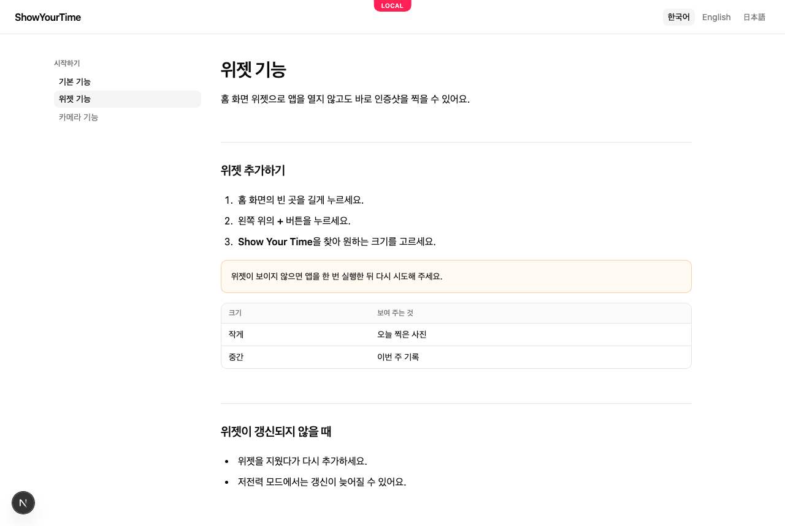
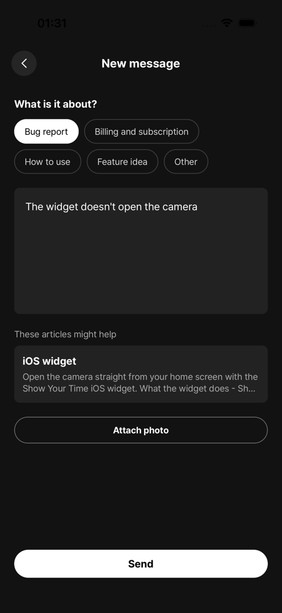

# Publish a help center

A help center is a public site with your product's help articles. You write them in Mocco in Markdown, see each one as readers will while you type, and publish when it's ready. Readers open the site in a browser, or from a link in your app.

## 1. Turn on the help center

A workspace member turns on **Help center** on the workspace's **Products** page. Each project then shows a **Help center** tab.

## 2. Set up the site

On the project's **Help center** tab, pick:

- **Address**: the site's name in its web address, such as `showyourtime` for `showyourtime.help.mocco.club`. It must be unique across Mocco.
- **Written in**: the language you write articles in.
- **Also offered in**: the languages you plan to offer. Until an article is translated, readers who pick another language get it in the language you write in.

Then choose **Set up help center**.



## 3. Organize and add articles

A help center has **collections** (the top level, such as "Getting started"), which hold **sections** (such as "Basics"), which hold **articles**. Add a collection at the bottom of the tab, a section inside a collection, and an article inside a section. A new article opens in the editor.

The tab shows every article with its state: **Draft** has never been published, **Published** is on the site, and **Unpublished changes** means the site still shows an earlier version than the one you saved. The site's address is at the top; select it to open the site.



## Import from Mintlify

If your help site is on Mintlify, bring it over instead of writing it again. On the **Help center** tab, under **Import from Mintlify**, pick your docs folder (the one with `docs.json`), leave **Publish the imported articles** on if they should go live at once, and choose **Import**.

- `docs.json`'s tabs, groups and pages become collections, sections and articles, in the same order.
- Mintlify's components become plain Markdown: steps become a numbered list, tips and notes become quoted notes, and update entries become headings.
- The images your pages use are uploaded to Mocco.
- Each page's old address (such as `/features/widget-features`) redirects to its article, so links to the old site keep working once the address points at Mocco.
- Importing again updates the same articles and only changes the ones whose text changed.

When it's done, Mocco lists anything it couldn't bring over: images missing from the folder, and pages that aren't in `docs.json`'s navigation.



## 4. Write and publish

The editor has the article's title and its text in Markdown on the left, and the article as readers will see it on the right, updated as you type. You can use headings (`##`), numbered and bulleted lists, **bold**, links, notes (lines starting with `>`) and tables. Links can go to web pages (`https://…`), email addresses (`mailto:…`) or other pages of the site (`/en/articles/…`). Images must be `https://` addresses.

- **Save draft** keeps your changes without touching the site.
- **Publish** puts the saved draft on the site. Save first; **Publish** is unavailable while you have unsaved changes.
- **Unpublish** takes the article off the site. Its text and history stay.
- **Delete article** removes it and its history, after you confirm.



Every save is kept in **History** below the editor. **Restore** makes an earlier version the draft again, as a new save, so nothing in the history is lost. Publish it to put it back on the site.

## Translate

When you publish, Mocco translates the article into each language the site offers, if your Mocco has automatic translation turned on (otherwise you write each language yourself). The **Translations** section of the article shows every language and where it stands:

- **Machine translated**: Mocco's translation, made from the published article.
- **Reviewed**: a person wrote or fixed it. Mocco never replaces it on its own.
- **Source changed**: the article was published again after this translation was made; review it to bring it up to date.
- **Failed**: the translation changed the article's structure (a heading, a code block or a link), so Mocco didn't use it. The reason is shown.
- **Not translated**: nothing yet. Readers in that language get the article in the language you write in.

Choose **Review** (or **Edit**) to write or fix a language beside its preview, then **Save translation**. **Translate again** asks for a new machine translation; on a reviewed language it asks first, because it replaces the reviewed text.



Readers who pick a language see its translation, and the article list shows translated titles, collections and sections included.



## Use your own domain

Your help center is at `<address>.help.mocco.club` from the start. To serve it on your own domain, such as `help.example.com`, ask the Mocco team to add the domain, then point it at Mocco with a DNS record (a `CNAME` to the target they give you). Once the record resolves, the site and every old address of an imported site answer on your domain. The **Help center** tab then links your domain.

## 5. What readers see

The site lists your collections and their articles in the language the reader picked, with a language switcher at the top. Each article has its own address, `/<language>/articles/<id>-<name>`. The `<id>` part never changes, so links keep working if you rename an article. A published change, an unpublished or deleted article, and a new translation appear on the article and the site's home right away; the article lists on other pages catch up within a minute.

Readers can search from the box at the top of every page. Every word they type has to appear in an article's title or text, in the language they're reading (or yours, for articles not translated yet); articles whose title matches come first. The search box and results speak the reader's language.





## Suggest articles in your app

Your app can search the help center too, for example to show related articles while someone writes to you, so they may find the answer before they send. Create a **Publishable** key with the **help:read** scope on the **API keys** tab (an app that already uses Messenger can add the scope to its key). Then, in React Native:

```tsx
import { createHelp, useHelpSearch } from '@mocco/react-native/messenger';

const help = createHelp({ publishableKey: 'mk_pub_…' });

function Suggestions({ text }: { text: string }) {
  // Waits until typing pauses; `any` finds articles that share any word with the text.
  const { hits } = useHelpSearch(help, text, { locale: 'en', limit: 3, match: 'any' });
  return hits.map(hit => <ArticleLink key={hit.path} title={hit.title} url={hit.url} />);
}
```



Each hit has the article's `title`, a `snippet` of its text and its `url` on your help site, in the reader's language where it is translated. Any other client can call `GET https://api.mocco.club/v1/help/search?q=…&locale=en&match=any` with the key as `Authorization: Bearer mk_pub_…`.
