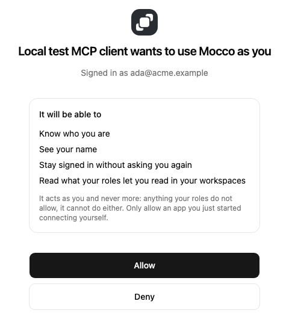

# Connect Mocco to your agent

Mocco speaks the Model Context Protocol, so the assistant you already code with can
answer "is the deploy stuck, and on what?" without you leaving the terminal.

The server is **remote and hosted by us** — nothing to install, nothing to keep updated.
You sign in once in the browser and the client holds the token.

```
https://www.mocco.club/api/mcp
```

> The read tools are in, and so is the workspace switch for deciding (below). The deciding
> tools themselves (approving, resuming, promoting) come next. Until they do, an agent can
> tell you a deploy is blocked but can't unblock it, whatever the switch says. The plan is
> in the [design spec](../../specs/2026-10-02-mcp-and-cli-design.md).

## What it can do

**It reads as you.** You see what your Mocco roles let you see, in whichever workspaces
you belong to — never more, because the server has no privileges of its own.

| Tool | Answers |
|---|---|
| `mocco_runs_search` | Which runs are running, waiting or failed. Filter by `awaiting_gate` for "what is blocked" |
| `mocco_runs_get` | One run: its steps, and the gate holding it with what would release it |
| `mocco_approvals_search` | What is waiting on a human right now |
| `mocco_approvals_get` | One request: the change it pins, the requirements, and the votes so far |

Reads take a `responseFormat`: `concise` by default, `detailed` when the agent wants the
commit and the gate requirements too. That keeps a search from spending your context on
rows you did not ask about.

**Which workspace?** If you belong to one, say nothing. If you belong to several, the
tool asks which and names them — and a workspace you are not a member of is refused
whether or not it exists.

**Deciding is separate and off by default.** Approving, resuming and promoting are
switched on per workspace by an owner. Until then your agent can tell you the deploy is
blocked on a second approval; it cannot be that approval.

When they are on, each one asks you to confirm — the client shows you the run, the gate
and the policy before anything happens. That confirmation is the protocol's own step, not
a prompt we wrote, and it is what stops a page of text your agent read somewhere from
turning into a production deploy.

## What it will never do

- **Act as anyone but you.** Every action goes through the same check the console does,
  with your identity. An agent cannot approve what you could not approve.
- **Accept an API key for a decision.** A key is a project, not a person, and an approval
  has to name someone who could have been asked. Keys get the read tools.
- **Hide anything from the audit trail.** A vote cast through an agent appears in the
  chain exactly like one cast in the console, naming you.

## Add it

### Claude Code

```bash
claude mcp add --transport http mocco https://www.mocco.club/api/mcp
```

Then run `/mcp` and pick **mocco** to sign in. Check it took with:

```bash
claude mcp list
```

### Claude Desktop and claude.ai

**Settings → Connectors → Add custom connector**, and paste the URL above. The browser
sign-in happens inline.

### Cursor

`.cursor/mcp.json` in the project, or `~/.cursor/mcp.json` for every project:

```json
{
  "mcpServers": {
    "mocco": {
      "url": "https://www.mocco.club/api/mcp"
    }
  }
}
```

Cursor opens the browser for sign-in by itself. Leave out any headers — this server uses
OAuth, not a token you paste.

### VS Code

`.vscode/mcp.json`:

```json
{
  "servers": {
    "mocco": {
      "type": "http",
      "url": "https://www.mocco.club/api/mcp"
    }
  }
}
```

VS Code runs the OAuth flow itself, so there is nothing to put in `headers` or `inputs`.

### Anything else

Any client on the **2026-07-28** MCP revision works: point it at the URL and let it
discover the rest. An unauthenticated call is answered with a `401` that points to the
protected-resource metadata at `/.well-known/oauth-protected-resource/api/mcp`, which names
the authorization server; its own metadata is at
`/.well-known/oauth-authorization-server/api/auth`. A conforming client follows both
without being told.

It serves that revision only, over `POST`. A client still on the older HTTP+SSE transport
will not connect — upgrade it, or use the `mocco` CLI in the meantime.

## Approving the connection

The first time a client connects, your browser opens Mocco. Sign in if you aren't already,
and Mocco asks whether to let that app act as you:



**Allow** sends you back to the client, which finishes connecting by itself. **Deny** tells
the client you said no, and it gets nothing. Once you allow an app, Mocco remembers, so
reconnecting it later doesn't ask again.

Only allow an app you just started connecting. If this screen appears and you didn't start
anything, choose Deny.

## Turning the deciding tools on

An owner or admin enables them per workspace: **Settings → Agents → Allow agents to
decide**. Switching it on records who did, and every tool it unlocks is still bound by the
roles of whoever calls it.

Leave it off for workspaces where an agent only needs to report. That is most of them.

## If it will not connect

| What you see | What it means |
|---|---|
| The client asks for a token or header | It is treating this as a key-authenticated server. Remove the header; this one is OAuth |
| `405 Method Not Allowed` on connect | The client is trying `GET` or `DELETE`. It is on the old transport — upgrade it |
| Sign-in succeeds, tools are missing | The deciding tools are off for that workspace, or your roles do not include them |
| The browser opens Mocco's sign-in and then lands on your workspaces instead of the client | The page was opened without the client's request in its address. Start the connection again from the client |
| Tools from the wrong workspace | You belong to several. Ask the agent to switch workspace, or pin one in the client config |
