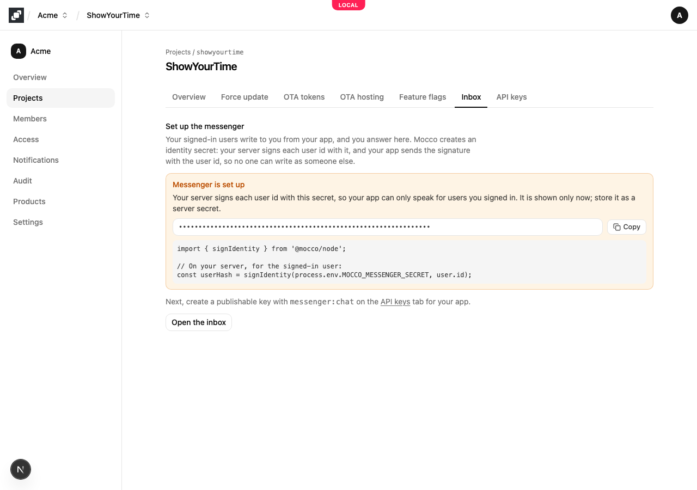
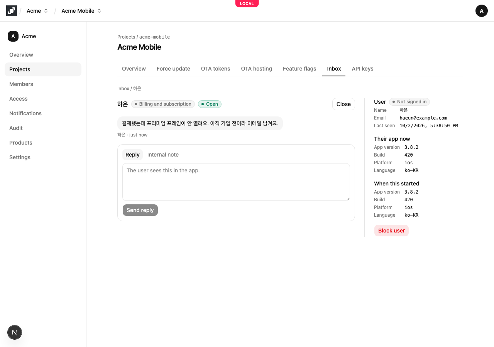
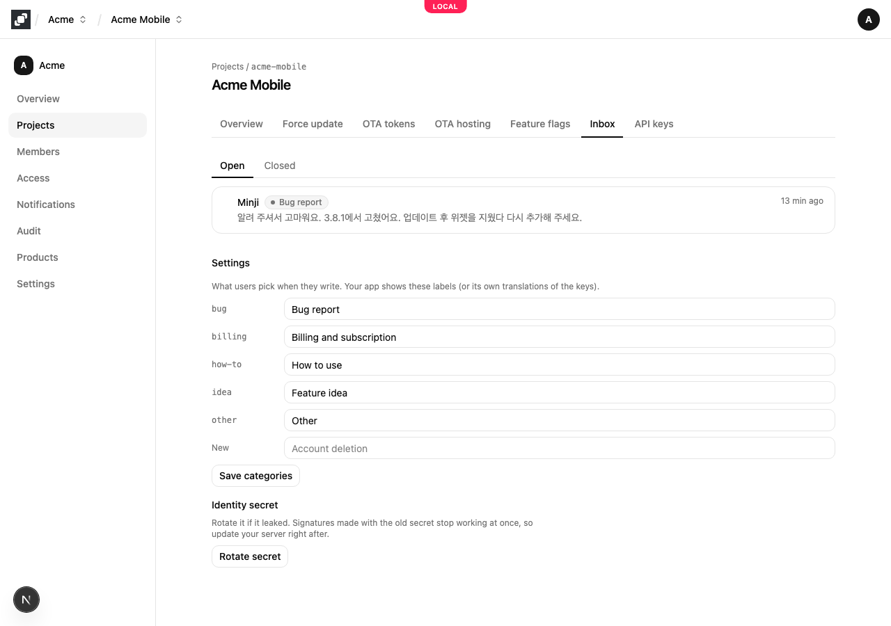
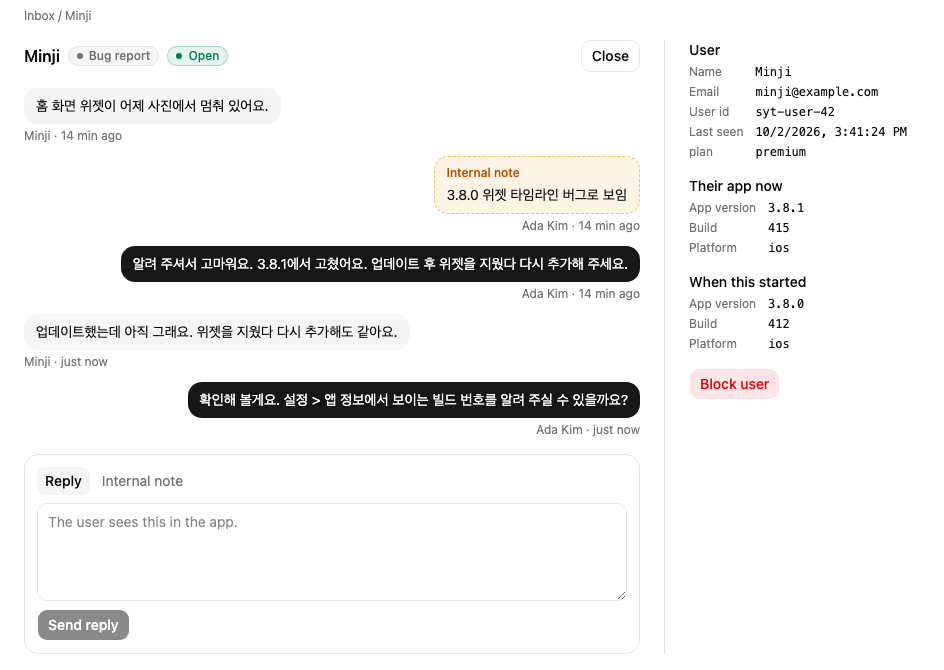
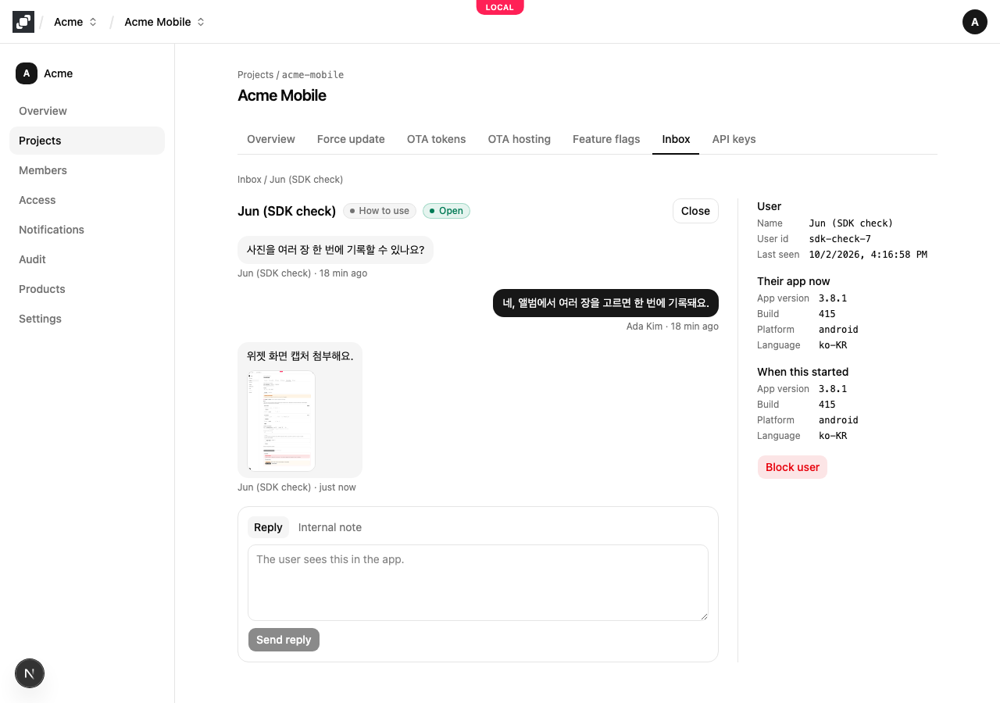
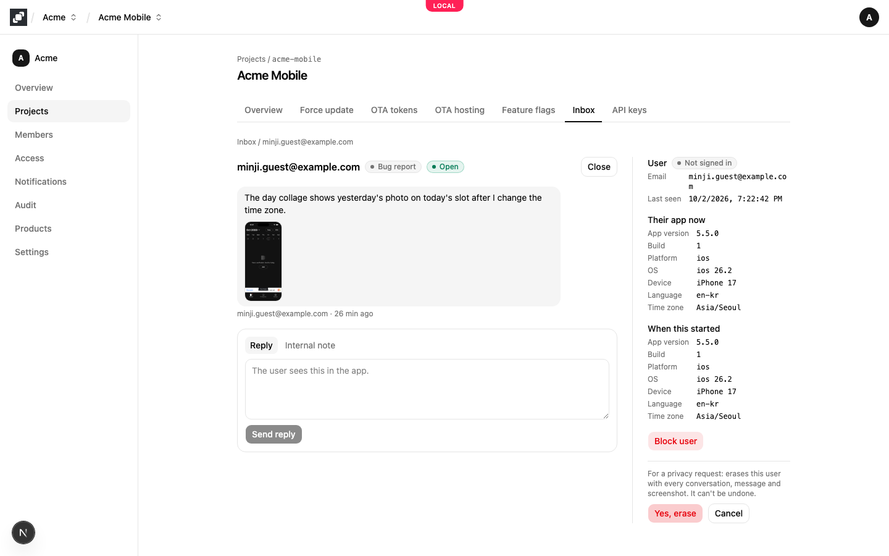

# In-app contact with Mocco Messenger

Messenger lets the people signed in to your app write to your team without leaving the app, and lets your team answer from one inbox in Mocco. Each request is a conversation: the user picks a category, writes, and can keep replying in the same thread. Your app version, build and platform come along, so you know what they were running.

## 1. Turn on Messenger

A workspace member turns on **Messenger** on the workspace's **Products** page. Each project then shows an **Inbox** tab.

## 2. Set up the messenger

On the project's **Inbox** tab, choose **Set up messenger**. Mocco creates the project's **identity secret** and shows it once: copy it and store it as a secret on your server (for example `MOCCO_MESSENGER_SECRET`).



The secret is how Mocco knows a request really comes from your user. Your server signs each signed-in user's id with it, and your app sends that signature along with the id. Someone who only has your app can't write as another user, because they can't make the signature.

If the secret leaks, choose **Rotate secret** in the inbox settings. Signatures made with the old secret stop working at once, so put the new one on your server right away.

## 3. Create a key for your app

On the **API keys** tab, create a **Publishable** key with the **messenger:chat** scope. It is safe to ship in the app: on its own it can't open anything without a signature from your server.

## 4. Sign the user id on your server

Give your app the signature for its signed-in user, for example from an endpoint your app already calls after sign-in:

```ts
import { signIdentity } from '@mocco/node';

// For the signed-in user only.
const userHash = signIdentity(process.env.MOCCO_MESSENGER_SECRET!, user.id);
```

`signIdentity` is HMAC-SHA256 of the user id, as hex. Any language can compute the same value.

## 5. Contact your team from the app

### React Native

Install the SDK (it is plain JavaScript, so it runs in Expo Go too):

```bash
npm install @mocco/react-native @react-native-async-storage/async-storage
```

Create one messenger for the app and wrap the app in its provider. `identity` asks your server for the signed-in user's signature, or returns `null` while nobody is signed in:

```tsx
import AsyncStorage from '@react-native-async-storage/async-storage';
import { createMessenger, MessengerProvider } from '@mocco/react-native/messenger';
import * as Application from 'expo-application';
import { Platform } from 'react-native';

const messenger = createMessenger({
  publishableKey: 'mk_pub_…',
  identity: async () => {
    const user = await getSignedInUser();
    if (user === null) return null;
    const { userHash } = await api.messengerIdentity(); // your endpoint, signs user.id
    return { userId: user.id, userHash, name: user.name, email: user.email };
  },
  context: () => ({
    appVersion: Application.nativeApplicationVersion ?? undefined,
    build: Application.nativeBuildVersion ?? undefined,
    platform: Platform.OS === 'ios' ? 'ios' : 'android',
  }),
  storage: AsyncStorage,
});

export default function App() {
  return (
    <MessengerProvider client={messenger}>
      <Navigation />
    </MessengerProvider>
  );
}
```

Then draw the screens in your own design with the hooks:

```tsx
import { useConversation, useConversations, useMessengerCategories, useUnreadCount } from '@mocco/react-native/messenger';

function SettingsRow() {
  const unread = useUnreadCount(); // a badge on "Contact us"
  // …
}

function ContactList() {
  const { conversations, start } = useConversations(); // refreshed while the screen is open
  const categories = useMessengerCategories();
  // start({ category: 'bug', body }) to open a new one
}

function Thread({ id }: { id: string }) {
  const { messages, send, isSending } = useConversation(id); // new messages are marked read
  // messages: { seq, author: 'contact' | 'operator', authorName, body, createdAt }
}
```

When a user deletes their account in your app, call `useMessenger().deleteMyData()`: it erases their conversations, messages and screenshots in Mocco and forgets them on the device. When someone signs in to your app, call `useMessenger().reidentify()` so the messenger opens their session. When the user signs out of your app, call `useMessenger().signOut()` so the next user starts fresh.

To attach a screenshot (PNG, JPEG, WebP or GIF, up to 10 MB; up to 3 per message), upload it first and send its id:

```tsx
const messenger = useMessenger();
const picked = await ImagePicker.launchImageLibraryAsync({ mediaTypes: ['images'] });
const asset = picked.assets?.[0];
if (asset !== undefined) {
  // Send bytes: with a Blob, React Native replaces the upload's Content-Type and it is refused.
  const body = new Uint8Array(await (await fetch(asset.uri)).arrayBuffer());
  const attachmentId = await messenger.attach({
    body,
    contentType: 'image/jpeg', // the picked image's real type
    sizeBytes: body.byteLength,
  });
  await send('Here is what I see', [attachmentId]); // from useConversation(id)
}
```

Messages come back with `attachments`, each with a `url` that works for a few minutes; show it with `<Image source={{ uri: attachment.url }} />`.

To get a notification when your team replies while the app is closed, register the device's Expo push token after sign-in, and open the conversation when the user taps the notification:

```tsx
import * as Notifications from 'expo-notifications';
import { messengerConversationIdOf, useMessenger } from '@mocco/react-native/messenger';

const messenger = useMessenger();
const { data: token } = await Notifications.getExpoPushTokenAsync();
await messenger.registerPushToken({ provider: 'expo', token, platform: Platform.OS === 'ios' ? 'ios' : 'android' });

Notifications.addNotificationResponseReceivedListener(response => {
  const conversationId = messengerConversationIdOf(response.notification.request.content.data);
  if (conversationId !== undefined) navigation.navigate('ContactThread', { id: conversationId });
});
```

The notification's title is your project's name and its text is the start of the reply; a reply the user has already read in the app isn't pushed. `signOut()` removes the device, so the next person to sign in on it doesn't get the previous user's replies.

### Any other client

The SDK calls a small HTTP API you can use from anywhere. The base URL is `https://api.mocco.club/v1/messenger`.

```http
POST /sessions
Authorization: Bearer mk_pub_…
Content-Type: application/json

{
  "userId": "user-42",
  "userHash": "4b8d8248…",
  "name": "Minji",
  "email": "minji@example.com",
  "traits": { "plan": "premium" },
  "context": { "appVersion": "3.8.0", "build": "412", "platform": "ios", "locale": "ko-KR" }
}
```

The answer has a `sessionToken` (`mms_…`, valid 30 days) and the project's `categories`. Send the token as `Authorization: Bearer mms_…` on the other calls:

| Call | What it does |
|---|---|
| `GET /conversations` | The user's conversations, newest first. `hasUnread` is true when your team has replied since they last read |
| `POST /conversations` | Start one: `{ "category": "bug", "body": "…", "clientMessageId": "<uuid>", "context": {…} }` |
| `GET /conversations/{id}/messages?afterSeq=0` | The messages, oldest first. Each has a `seq`; pass the last one you have as `afterSeq` to get only new ones |
| `POST /conversations/{id}/messages` | Reply: `{ "body": "…", "clientMessageId": "<uuid>" }` |
| `POST /conversations/{id}/read` | `{ "seq": 5 }` once the user has seen up to that message |
| `POST /push-tokens` | `{ "provider": "expo", "token": "ExponentPushToken[…]", "platform": "ios" }` so replies are pushed to the device; `DELETE /push-tokens` `{ "token": … }` on sign out |
| `DELETE /me` | Erase the user and everything they wrote, for your app's "delete my account" |
| `POST /attachments` | `{ "contentType": "image/png", "sizeBytes": 48213 }` → an `attachmentId` and an `upload` URL to `PUT` the bytes to; then list the id in `attachmentIds` when you start or reply |

Generate a new `clientMessageId` for each message and reuse it if you retry: Mocco stores the message once, however many times the request arrives. A user can send 20 messages a minute and start 5 conversations an hour.

### People who aren't signed in

To let anyone contact you, including people who haven't signed in, turn on **Let people who aren't signed in write** in the inbox settings. They leave an email so you can reach them. In the app, when the messenger's state is `signed_out`, ask for an email and call `continueAsGuest`:

```tsx
const { status } = useMessengerState();
const messenger = useMessenger();

if (status === 'signed_out') {
  // show an email field, then:
  await messenger.continueAsGuest({ email, name });
}
```

The device remembers the guest, so they see your replies the next time they open the app. If they sign in later on the same device and your app calls `reidentify()`, what they wrote moves to their account. In the inbox a guest's conversation is marked **Guest**, with **Not signed in** and their email beside it. Mocco doesn't email them for you yet; reply in the app, or write to the email they left.



## 6. Answer from the inbox

The **Inbox** tab lists open conversations, newest activity first, with unread ones marked. **Closed** lists the rest. The inbox checks for new messages every few seconds while it is open.



Open a conversation to read the thread and answer:

- **Reply** sends a message the user sees in the app.
- **Internal note** is for your team only; the user never sees it.
- **Close** when it is resolved. If the user writes again, it reopens by itself.
- The side panel shows who the user is (as your app described them), the app version and platform they are on now, and what they were running when the conversation started.
- **Block user** stops someone from writing. They can still read what they have.



Screenshots the user attached show in the thread; select one to open it full size.



When someone asks you to delete their data, choose **Erase user's data** in the side panel and confirm. Mocco deletes the user with every conversation, message and screenshot; it can't be undone, and the audit log records only that it happened.



The categories users pick from are in the inbox settings. Your app gets them with each session; it can show the labels as they are or translate them by key.

## 7. Get notified

New conversations (`messenger.conversation.created`) and users writing again (`messenger.message.received`) are Mocco events. Apply the **Mocco** preset on a Discord channel's rules, or add rules for these two events, to hear about them where your team already is (see [Mocco events](../notifications/mocco-events.md#the-mocco-preset)).
