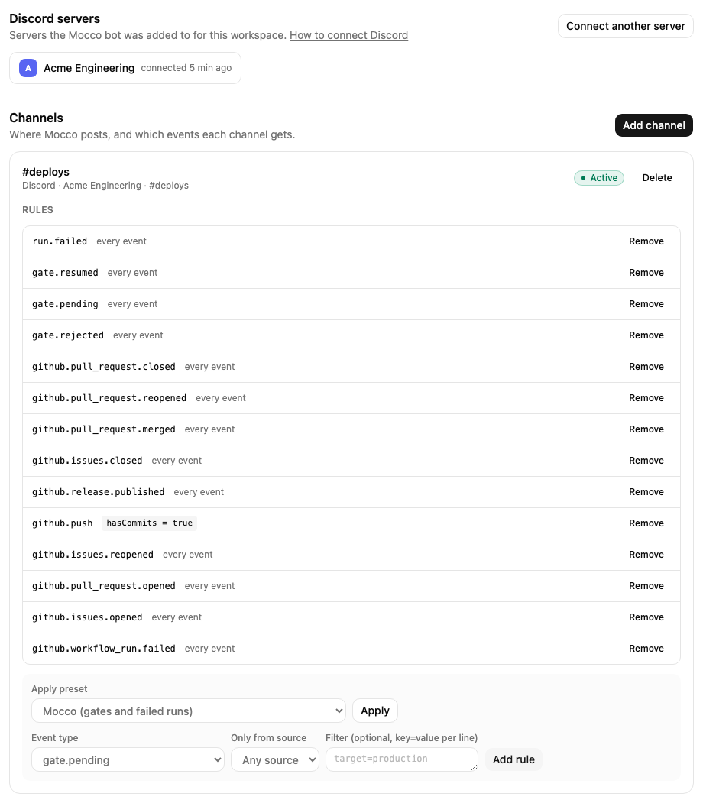
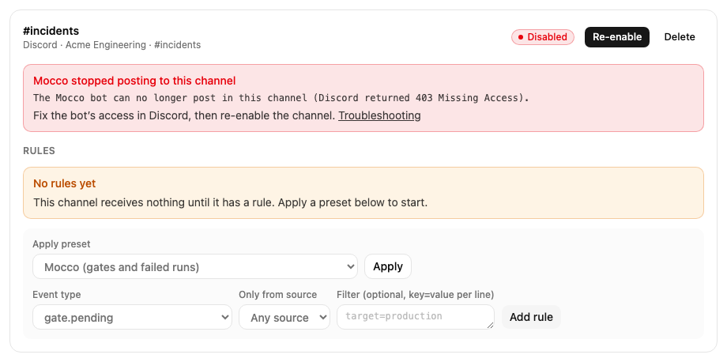

# Connect Discord

Mocco posts through its own Discord bot. You install the bot in your server once, then choose the
channels it posts to. Only owners and admins of the Mocco workspace can do this.

## 1. Install the bot

1. In Mocco, open **Notifications** and stay on the **Channels** tab.
2. Click **Connect Discord**. Mocco sends you to Discord.
3. On Discord, pick the server and approve the bot. Discord only lets you add a bot to a server
   where you are allowed to manage it; ask a server admin if yours is not in the list.
4. Discord sends you back to Mocco. The server now appears under **Discord servers**.

The bot asks for four permissions: **View Channel**, **Send Messages**, **Embed Links** and
**Read Message History**. Mocco posts each notification as an embed, so all four are needed.

If Mocco says Discord is not available, Discord has not been set up for your Mocco deployment yet.
Ask whoever runs it.

If you come back from Discord with an error, the install did not finish: you cancelled it, or the
link was more than 10 minutes old. Click **Connect Discord** again.

## 2. Add a channel

1. Click **Add channel**.
2. Choose the **Server**, then the **Channel**. The list shows the text and announcement channels
   the bot can see right now.
3. Optionally, give it a **Label**. By default it is the channel name, like `#alerts`.
4. Click **Add channel**.

Mocco posts a test message, **Mocco is connected**, and shows the result right away:

- **Test message sent**: the channel works. Add rules next.
- An error from Discord: the bot cannot post there yet. The message says what Discord answered.
  Fix it as described [below](#give-the-bot-access-to-a-private-channel), then click **Re-enable**.

## Give the bot access to a private channel

A private channel is hidden from everyone who has not been given access, and that includes the
Mocco bot. The channel may be missing from the **Channel** list, or the test message fails with
`Missing Access` (code 50001) or a missing-permissions error (code 50013).

In Discord:

1. Right-click the channel and choose **Edit Channel**, then **Permissions**.
2. Click **Add members or roles** and add the Mocco bot (or its role).
3. Allow **View Channel**, **Send Messages**, **Embed Links** and **Read Message History**.
4. Save your changes.

Back in Mocco, click **Re-enable** on the channel, or add it if it was not listed before.

Channel permissions override server roles. If the bot's role may send messages but the channel
denies it, the bot cannot post in that channel. Denying **View Channel** also blocks everything
else in that channel.

## Disabled channels

When Discord tells Mocco the bot cannot reach a channel (it lost access, or the channel was
deleted), Mocco marks the channel **Disabled**, shows Discord's reason, and stops posting to it.
Nothing is sent to a disabled channel until you fix the cause and click **Re-enable**. Mocco then
checks the channel again and posts a new test message. If the bot still cannot post, the channel
stays disabled with the new reason.

If the bot was removed from the server, or removed and added back, Mocco asks you to connect
Discord again. Click **Connect Discord**, then add your channels again.

## 3. Choose what each channel gets

A channel only receives the events its rules ask for. Each channel card has a **Rules** section.

**Apply a preset.** Choose a preset and click **Apply**:

| Preset | Adds rules for |
|---|---|
| Mocco | `gate.pending`, `gate.resumed`, `gate.rejected`, `run.failed` |
| Sentry | `sentry.issue.created` |
| Vercel | `vercel.deployment.succeeded` for production only, `vercel.deployment.error`, `vercel.deployment.canceled` |
| GitHub | `github.push` with commits; pull requests opened, reopened, merged and closed; issues opened, reopened and closed; `github.release.published`; `github.workflow_run.failed` |

For the Sentry, Vercel and GitHub presets you can also pick a source, so the rules only take
events from that source. Applying a preset twice adds nothing new.

**Add a rule by hand** with **Add rule**:

- **Event type**: an exact type like `vercel.deployment.error`, or a whole family ending in `.*`,
  like `github.pull_request.*` or `gate.*`.
- **Only from source** (optional): only events from that source.
- **Filter** (optional): one `key=value` per line. Every line must match the event exactly, for
  example `target=production` or `branch=main`. The keys you can filter on are listed on each
  source's page and on [Mocco events](./mocco-events.md).

Click **Remove** next to a rule to delete it. Deleting a channel also deletes its rules; its past
activity stays visible.

## Next

Add a source: [Sentry](./sentry.md), [Vercel](./vercel.md) or [GitHub](./github.md). If a message
does not arrive, open **Activity** and see [Troubleshooting](./troubleshooting.md).
