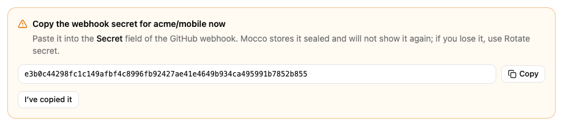

# Connect GitHub

Mocco receives pushes, pull requests, issues, releases and workflow runs from a GitHub repository
or organization webhook. For GitHub, **Mocco generates the signing secret** and you paste it into
GitHub.

This is separate from connecting the Mocco GitHub App for deploy governance. A notification source
is a plain webhook; you can add one for any repository or organization you administer.

You need to be an owner or admin in Mocco, and an admin of the repository (for a repository
webhook) or an owner of the organization (for an organization webhook).

## 1. Create the source in Mocco

1. Open **Notifications > Sources** and click **Add source**.
2. Choose **GitHub** as the **Kind** and give it a **Name**, such as `acme/web`.
3. Click **Create source**.

Mocco shows the new secret once. Click **Copy** and keep it until you have pasted it into GitHub.
**Mocco will not show it again.** If you lose it, click **Rotate secret** on the source to get a
new one (and paste that into GitHub instead).

Copy the source's **Ingest URL** from the list as well.

## 2. Add the webhook in GitHub

For a repository:

1. On GitHub, open the repository and click **Settings**.
2. In the left sidebar, click **Webhooks**, then **Add webhook**.

For an organization: click your profile picture, **Your organizations**, **Settings** next to the
organization, then **Webhooks** and **Add webhook**.

Then fill in the form:

1. **Payload URL**: the source's ingest URL from Mocco.
2. **Content type**: choose **application/json**. Mocco cannot read the form-encoded format; those
   deliveries are recorded as `ignored` with `malformed JSON body`.
3. **Secret**: paste the secret Mocco generated.
4. Under "Which events would you like to trigger this webhook?", choose
   **Let me select individual events** and select the events you want from this list:
   pushes (`push`), pull requests (`pull_request`), issues (`issues`), releases (`release`) and
   workflow runs (`workflow_run`). Other events are recorded as `ignored`.
5. Keep **Active** selected and click **Add webhook**.

GitHub sends a `ping` right away. It appears in Mocco's **Activity** tab as `ignored` with the
reason `ping`, which confirms the URL and the secret are right.

## What you get

| GitHub event | Mocco event |
|---|---|
| `push` | `github.push` |
| `pull_request` opened / reopened | `github.pull_request.opened` / `github.pull_request.reopened` |
| `pull_request` closed, merged | `github.pull_request.merged` |
| `pull_request` closed, not merged | `github.pull_request.closed` |
| `issues` opened / reopened / closed | `github.issues.opened` / `.reopened` / `.closed` |
| `release` published | `github.release.published` |
| `workflow_run` completed with failure, timed out or startup failure | `github.workflow_run.failed` |
| `workflow_run` completed with success | `github.workflow_run.succeeded` |
| any other action or event (`pull_request` edited, `issues` labeled, a cancelled run…) | recorded as `ignored` |

Filter keys:

| Event | Keys |
|---|---|
| `github.push` | `repo` (`acme/web`), `refType` (`branch` or `tag`), `branch` (branch pushes only), `hasCommits` (`true` or `false`) |
| `github.pull_request.*` | `repo`, `baseBranch` (the branch the pull request targets) |
| `github.issues.*`, `github.release.published` | `repo` |
| `github.workflow_run.*` | `repo`, `workflow` (the workflow name), `branch` |

`hasCommits` is a true/false value, not text. The **GitHub** preset adds `github.push` with
`hasCommits` = true (so branch deletions and empty pushes stay quiet), the four pull request
events, the three issue events, `github.release.published` and `github.workflow_run.failed`.
To only hear about pushes to `main`, add a rule on `github.push` with the filter `branch=main`.

## Check that it works

Push a commit to the repository. The push appears in **Activity** with outcome `published`.

In GitHub, open the webhook and click **Recent deliveries** to see the last 3 days of deliveries
and Mocco's answer to each: `202` means Mocco recorded it. If Mocco refused one (for example
`401` after a secret mix-up), fix the cause and click **Redeliver**. Mocco keeps one record per
GitHub delivery ID, so redelivering one it already recorded changes nothing. See
[Troubleshooting](./troubleshooting.md) for the other answers.
