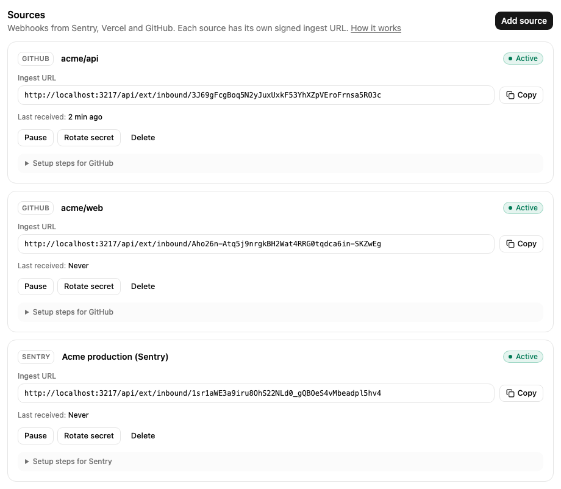

# Notifications overview

Mocco posts the events your team cares about to Discord. Some events come from Mocco itself, like a
deploy gate waiting for approval. Others come from the tools you already use: Sentry, Vercel and
GitHub send them to Mocco as webhooks, and Mocco forwards the ones you ask for.

Open a workspace and choose **Notifications** in the left menu. The page has three tabs:

| Tab | What it is for |
|---|---|
| **Channels** | Connect Discord, choose the channels Mocco posts to, and decide which events each channel gets (its rules). |
| **Sources** | Connect Sentry, Vercel or GitHub. Each source has its own ingest URL and signing secret. |
| **Activity** | Every event Mocco received or produced, and what happened to it in each channel. Use it to answer "why didn't it arrive?". |

Owners and admins of the workspace can change everything. Members can see all three tabs but
cannot change anything.

## How an event travels

1. A tool sends a webhook to the source's ingest URL, or Mocco produces one of its own events.
2. Mocco checks the signature and records the delivery. It shows up in **Activity**.
3. Mocco turns it into an event, such as `vercel.deployment.error` or `gate.pending`.
4. Each active channel with a rule that matches the event gets a message. A channel with no
   matching rule gets nothing, and **Activity** tells you why its rules did not match.

Messages are sent in the background. If Discord is busy or rate limits the bot, Mocco waits and
tries again. The message may arrive a little later, but it is not dropped.

## Set it up in this order

1. [Connect Discord](./connect-discord.md) and add at least one channel.
2. Add rules to the channel. The quickest way is a preset: **Mocco** for your own deploy events,
   or **Sentry**, **Vercel** or **GitHub** for a source.
3. Add the sources you want: [Sentry](./sentry.md), [Vercel](./vercel.md), [GitHub](./github.md).
4. Check **Activity** after the first event arrives.

Each source on the **Sources** tab shows its **Ingest URL** (with **Copy**), when it last
received a delivery, and the actions **Pause** / **Resume**, **Rotate secret** and **Delete**.
Pausing a source makes Mocco refuse its deliveries until you resume it; deleting it also deletes
its activity. **Setup steps** on each source links to its guide.

[Mocco events](./mocco-events.md) lists the events Mocco produces on its own. When something does
not show up, see [Troubleshooting](./troubleshooting.md).

## Limits

- A workspace can forward **5,000** events a day from its sources. Past that, deliveries are still
  recorded but not forwarded (outcome `over_quota`). The limit is approximate: a burst can go a
  little over it.
- Past **20,000** deliveries in 24 hours, Mocco refuses new ones with HTTP `429` and records
  nothing, to protect the service.
- A webhook body can be at most **1 MB**.
- Activity is kept for **30 days**.
