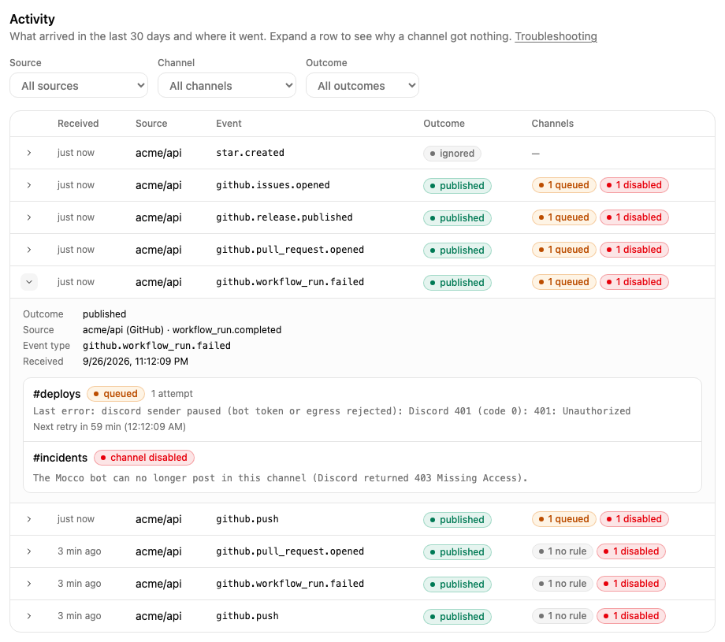

# Notifications troubleshooting

Start in **Notifications > Activity**. Every event Mocco received from a source, and every Mocco
event that was sent to a channel, is listed there for 30 days, newest first. Use the **Source**,
**Channel** and **Outcome** filters to narrow it down; the filters are part of the page address, so
you can share a filtered view with a teammate.

Each row has two parts:

1. **The outcome**: what Mocco did with the delivery it received (below).
2. **Details**: click it to see, for each channel, whether a message was sent and why or why not.

## Nothing shows up in Activity

If the vendor says it sent a webhook but Activity has no row for it, Mocco refused it before
recording anything. Look at the HTTP answer in the vendor's delivery log (GitHub: the webhook's
**Recent deliveries**).

| Answer | Meaning | What to do |
|---|---|---|
| `404 not found` | The URL does not name an active source: it was mistyped, the source was deleted, or it is **Paused**. | Copy the **Ingest URL** from the Sources tab again. Click **Resume** if the source is paused. |
| `401 invalid signature` | The signature does not match the source's secret. | Paste the right secret: Sentry's Client Secret, the Vercel webhook's secret, or the secret Mocco generated for GitHub. When in doubt, click **Rotate secret** and update the vendor side. |
| `400 missing delivery id` | The request lacks the vendor's delivery ID, so it did not come from the vendor's webhook system. | Send it from the vendor's webhook settings, not by hand. |
| `413` | The body is larger than 1 MB. | Nothing to fix in Mocco; very large payloads are not accepted. |
| `429 too many deliveries` | The workspace received more than 20,000 deliveries in 24 hours. | Find the source that floods (often a vendor stuck retrying) and pause it or narrow its events. New deliveries are accepted again as the 24-hour window moves on. |
| `503` | Webhooks are not set up on this Mocco deployment. | Ask whoever runs your Mocco deployment. |

Also check the source's **Last received** time on the Sources tab. **Never** means no valid
delivery ever reached it.

## Receipt outcomes

| Outcome | Meaning | What to do |
|---|---|---|
| `published` | Mocco recorded the delivery and turned it into an event. | Open **Details** to see what each channel did with it. |
| `pending` | Recorded, and the event is being created. This normally takes seconds. | Wait a minute. Mocco retries on its own; a delivery that keeps failing ends as `ignored` with `publishing failed 5 times`. |
| `ignored` | Mocco does not forward this kind of delivery. The reason says which. | See the table below. |
| `over_quota` | The workspace forwarded more than 5,000 events in the last 24 hours, so this one was only recorded. | Narrow what the vendor sends (fewer events or projects), or split the noise off. Forwarding resumes as the 24-hour window moves on. Dropped deliveries are not sent later. |

Common `ignored` reasons:

| Reason | What to do |
|---|---|
| `ping` | Nothing. GitHub sends it when you create the webhook; it means the URL and secret work. |
| `github event "…" is not mapped`, `vercel event "…" is not mapped`, `sentry resource "…" is not mapped` | That event type is not forwarded. Unselect it in the vendor's webhook settings to reduce noise. |
| `github pull_request action "edited" is not mapped`, `sentry action "resolved" is not mapped`, … | Only some actions are forwarded; see [GitHub](./github.md), [Sentry](./sentry.md) and [Vercel](./vercel.md). |
| `github workflow_run conclusion "cancelled" is not mapped` | Only failed and successful runs are forwarded. |
| `malformed JSON body` | For GitHub, set the webhook's content type to **application/json**. |
| `body is not valid UTF-8` | The body is not text Mocco can read. Contact support if it keeps happening. |
| `missing Sentry-Hook-Resource header` | The request did not come from a Sentry integration webhook. |

## Details: per channel

For a `published` event (and for Mocco events), **Details** lists every channel of the workspace
with one of the following.

### No message, and why

| Shown | Meaning | What to do |
|---|---|---|
| No rule matched: `the channel has no rules` | The channel has no rules yet. | Add a rule or apply a preset on the Channels tab. |
| No rule matched: ``no rule for `github.push` `` | None of the channel's rules is for this event type. | Add a rule for the type, or for its family (`github.*`). |
| No rule matched: ``rule `vercel.deployment.succeeded` needs target = "production" (the event has "preview")`` | A rule is for this type, but its filter asks for another value. | Working as intended if you want production only. Otherwise change the filter, or add a second rule. |
| No rule matched: ``rule `…` is limited to another source`` | The rule only takes events from a different source. | Remove the source limit, or add a rule for this source. |
| No rule matched: ``rule `…` matches`` | The channel's rules match now, but did not when the event arrived (the rule was added later). | Nothing; the next event will be sent. |
| Channel disabled | The channel was disabled when the event arrived. | See [Disabled channels](#disabled-channels). |
| Channel added after this event | The channel did not exist yet. | Nothing. |

The explanation is computed against the channel's rules as they are now, with the same matching
Mocco uses to decide what to send.

### A message: delivery status

| Status | Meaning |
|---|---|
| `queued` | Waiting to be sent. The **next retry** time says when Mocco tries again, and the last error says why it waits. |
| `sending` | Mocco is posting it to Discord right now. |
| `sent` | Discord accepted the message. |
| `failed` | Mocco gave up. The last error says why. |
| `suppressed` | The channel was deleted before the message went out. |

**Attempts** counts the times Mocco actually called Discord. Waiting for capacity does not count.

### Errors you may see

| Error | Meaning | What to do |
|---|---|---|
| `discord rate limit` (queued) | Discord asked the bot to slow down. | Nothing. Mocco waits for the time Discord gave and sends it then. |
| `workspace send limit (per minute) reached` (queued) | The workspace sent more than 120 messages in a minute. Mocco spreads the rest over the next minutes. | Nothing, unless it happens often: then fewer rules, or tighter filters. |
| A Discord server error or timeout, like `Discord did not answer within … ms` (queued) | Discord had a temporary problem. | Nothing. Mocco retries with growing pauses for about two hours, then marks it `failed`. |
| `Discord 403 (code 50001): Missing Access` (failed) | The bot cannot see the channel. The channel is now disabled. | Give the bot access ([private channels](./connect-discord.md#give-the-bot-access-to-a-private-channel)), then **Re-enable**. |
| `Discord 403 (code 50013): …` (failed) | The bot can see the channel but lacks a permission, usually **Send Messages** or **Embed Links**. The channel is now disabled. | Allow **View Channel**, **Send Messages**, **Embed Links** and **Read Message History** for the bot in the channel, then **Re-enable**. |
| `Discord 404 (code 10003): Unknown Channel` (failed) | The channel was deleted in Discord. The channel is now disabled. | Delete it in Mocco and add another channel. |
| `channel disabled: …` (failed) | The channel was already disabled when this message was due; the rest is the channel's reason. | Fix the reason and **Re-enable**. Messages that failed this way are not resent. |
| `channel deleted` (suppressed) | The channel was deleted in Mocco. | Nothing. |
| `discord not configured` (queued) | This Mocco deployment has no Discord bot set up right now. | Ask whoever runs your Mocco deployment. Messages wait up to 24 hours. |
| `discord sender paused (bot token or egress rejected): …` (queued) | Discord refused the Mocco bot itself, not your channel. Mocco pauses sending for an hour. | Nothing on your side; the Mocco team is alerted. |
| `expired waiting for capacity (…)` (failed) | The message waited more than 24 hours (rate limits, Discord not configured). | Check why it waited (the part in brackets). The message is not resent. |
| `the delivery job ended before the delivery settled` (failed) | Mocco's background job for this message stopped before it finished. | Rare. If it repeats, contact support with the event time. |

## Disabled channels

A channel is **Disabled** when Discord told Mocco the bot cannot reach it. The reason is shown on
the channel card. Nothing is sent to it while it is disabled.

1. Fix the cause in Discord (give the bot access, or restore the channel).
2. On the Channels tab, click **Re-enable**. Mocco checks the channel and posts a test message.
3. If the bot still cannot post, the channel stays disabled with the new reason.

If Mocco says to connect Discord again, the bot was removed from the server (or removed and added
back). Click **Connect Discord**, then add the channels again. See [Connect Discord](./connect-discord.md).

## A source went quiet

On the Sources tab, **Last received** shows when the source last got a valid delivery. If it is
older than you expect:

- the source may be **Paused** (it then answers `404`);
- the vendor may have disabled the webhook after repeated failures; check its webhook settings;
- for Vercel, check that the webhook still covers the project and that the team is on a plan with
  webhooks (Pro or Enterprise).
