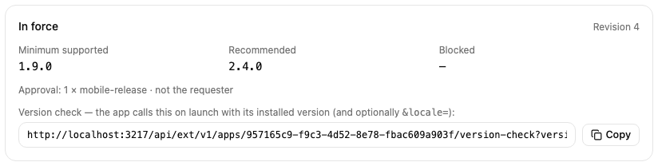
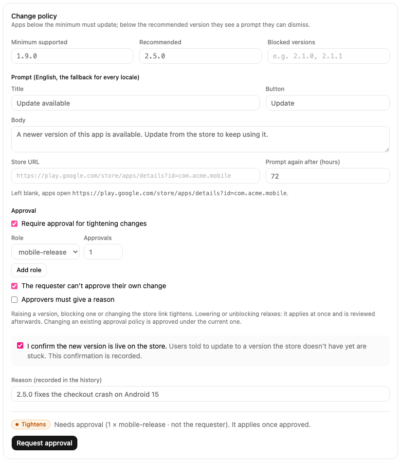
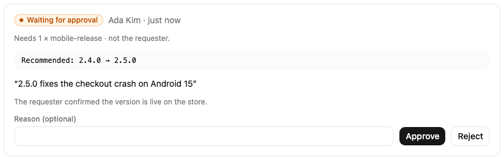
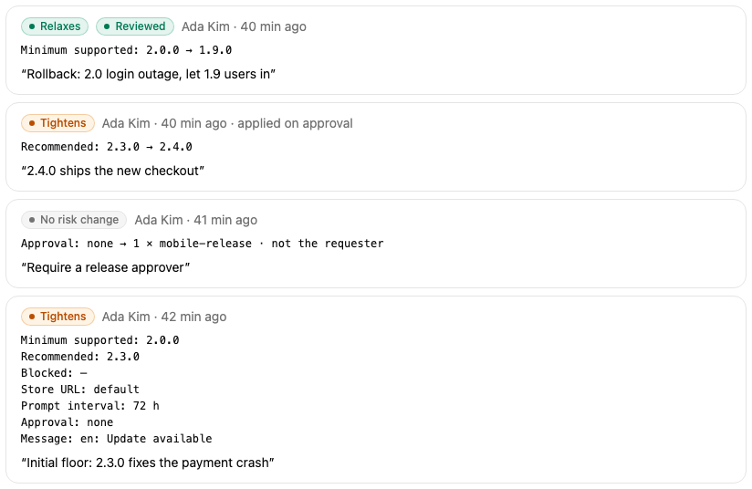

# Force update

Each iOS and Android app of a project has its own version policy. Open the project and choose the **Force update** page, then pick the app at the top.

## What the app is told

On launch your app sends its installed version to Mocco and gets one of three answers:

| Status | When | What the app should do |
|---|---|---|
| `hard` | The version is below the minimum supported version, or it is blocked | Show a screen that can't be dismissed, with a button to the store |
| `soft` | The version is below the recommended version | Show a prompt the user can dismiss; ask again after the prompt interval |
| `ok` | Anything else | Nothing |

An app Mocco doesn't know, or one without a policy, always gets `ok`. A mistake in setup never locks your users out.

The **In force** box shows the policy apps get right now, its revision, and the version check URL for this app.



## Set or change the policy

The form below edits the whole policy: the minimum supported, recommended and blocked versions, the English prompt (the fallback for every language), the store link and how often a dismissed prompt comes back. Leave the store link empty to use the default built from the app's store ID.

Before you submit, the form tells you what kind of change it is. **Tightens** means more users will be asked or forced to update: raising a version, blocking one, or changing the store link. **Relaxes** means fewer will: lowering a version or unblocking one. Copy and prompt-interval edits change neither.

Raising a version also asks you to confirm that the new version is already live on the store. Users told to update to a version the store doesn't have yet are stuck, so the confirmation is recorded with the change.



## Require approval

Tick **Require approval for tightening changes**, then choose how many people from which roles must approve, whether the requester is barred from approving their own change, and whether approvers must give a reason. The first time you set this it applies at once. After that, changing or removing it is itself a tightening change, approved under the policy in force.

With approval on, a tightening change waits under **Open requests** and the current policy stays in force until enough approvers approve. A newer request replaces an older one that is still waiting. Anyone in the required roles can approve or reject from the card; the requester sees no buttons when self-approval is barred.



A relaxing change applies at once, even with approval on, because rolling back must never wait for an approver. It opens a **post-hoc review** instead: the change is marked *Unreviewed* in the history until someone in the required roles marks it reviewed.

## History

Every applied change is listed with what changed, who changed it, the reason, and whether an approval applied it. Each one is also in the workspace **Audit** log.



## Call the version check from your app

The version check is a public `GET` request. Copy the URL from the **In force** box and add the installed version, and optionally the user's language:

```
GET https://<your Mocco domain>/api/ext/v1/apps/<appId>/version-check?version=2.3.1&locale=ko-KR
```

```json
{
  "status": "soft",
  "minSupportedVersion": "2.0.0",
  "recommendedVersion": "2.4.0",
  "message": { "title": "Update available", "body": "…", "action": "Update" },
  "storeUrl": "https://play.google.com/store/apps/details?id=com.acme.mobile",
  "promptIntervalHours": 72,
  "revision": 5
}
```

`message` is `null` when the status is `ok`. It is picked by the exact language tag, then the language (`ko-KR`, then `ko`), then English. Answers are cached for about a minute, so a change reaches devices within a minute or so. The URL needs no key: the policy is shown to every user of the app anyway.

Until Mocco's React Native package is published, call it directly:

```ts
import { Alert, Linking } from 'react-native';
import DeviceInfo from 'react-native-device-info';

const CHECK_URL = 'https://<your Mocco domain>/api/ext/v1/apps/<appId>/version-check';

export async function checkForUpdate(locale: string) {
  const version = DeviceInfo.getVersion();
  const response = await fetch(`${CHECK_URL}?version=${encodeURIComponent(version)}&locale=${encodeURIComponent(locale)}`);
  if (!response.ok) {
    return; // Never block the app because the check failed.
  }
  const answer = await response.json();
  if (answer.status === 'ok' || answer.message === null) {
    return;
  }
  const open = { text: answer.message.action, onPress: () => Linking.openURL(answer.storeUrl) };
  Alert.alert(answer.message.title, answer.message.body, answer.status === 'hard' ? [open] : [{ text: 'Later' }, open], {
    cancelable: answer.status !== 'hard',
  });
}
```

For `soft`, remember when the user dismissed the prompt (for example in AsyncStorage) and wait `promptIntervalHours` before asking again. For `hard`, show the prompt again whenever the app returns to the foreground.
