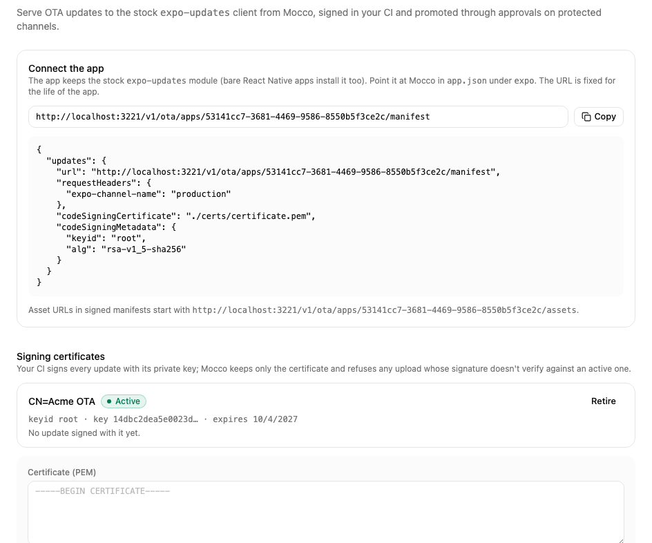
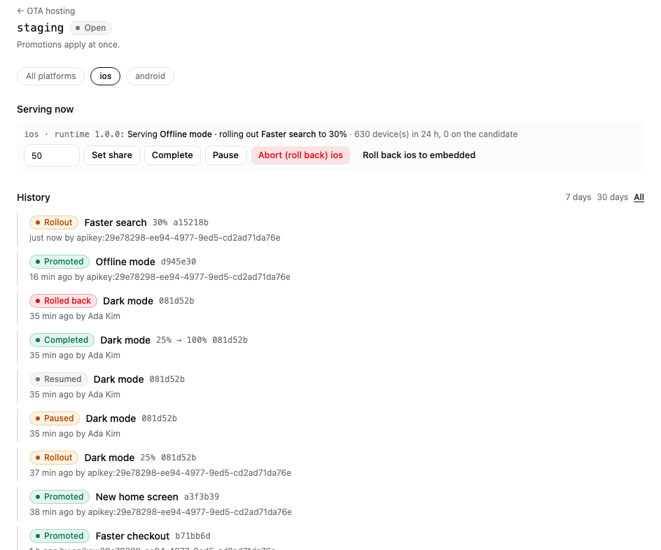
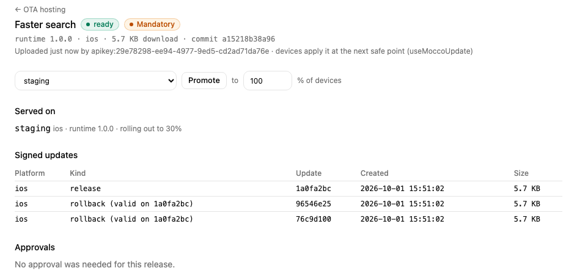

# Host OTA updates on Mocco

Mocco can serve your React Native app's over-the-air updates itself. The app keeps the stock `expo-updates` module (bare React Native apps install it too) and points it at Mocco. Your CI signs every update with a key that never leaves CI; Mocco checks the signature before storing anything and serves the exact signed bytes, so a device only runs what your CI signed.

## 1. Connect the app

On the project's **Overview** page, add your app with the platform **React Native**. Then open **OTA hosting** and choose **Host OTA updates**. Mocco shows the app's manifest URL and the `expo.updates` block for `app.json`.



In your app's repository, run:

```bash
npx mocco ota init --manifest-url <the manifest URL>
```

It creates a signing key pair and a certificate (`keys/private-key.pem`, git-ignored, and `certs/certificate.pem`) and writes the `updates` block into `app.json`. Build and ship a new binary with it: the certificate is embedded in the binary.

Set a `runtimeVersion` in `app.json` if you have none. It is what pairs a JS bundle with a binary, and a device only ever loads an update whose runtime version matches its own — so this is what stops a bundle landing on a binary whose native code can't run it:

```json
"runtimeVersion": { "policy": "fingerprint" }
```

`fingerprint` hashes the native dependencies and config, so the value changes by itself whenever the native side does — nobody has to remember. `mocco ota publish` resolves it per platform with your project's own Expo CLI, which makes iOS and Android separate releases (they hash differently). A literal or the `appVersion` policy works too, and both keep the two platforms in one release.

## 2. Register the certificate

Paste `certs/certificate.pem` under **Signing certificates** (owners and admins). Mocco refuses any update whose signature doesn't verify against an active certificate. Each certificate shows which runtime versions depend on it; retiring one stops updates for the binaries that embed it, so retire it only after those binaries are gone.

Store `keys/private-key.pem` as the CI secret `MOCCO_OTA_SIGNING_KEY`, and back it up. The certificate is embedded in the binary, so replacing the key needs a new store build — losing it means no OTA until one ships.

The key outlives a single OTA app. To point the same app at another Mocco app later — a second environment, a self-hosted move, or connecting for real after a local trial — run `init` again with `--keep-key`: it rewrites only the `updates` block and leaves the key and certificate alone, so the binaries already out there keep verifying. Register the same certificate on the new app.

## 3. Create channels

A build reads updates from the channel in its `expo-channel-name` header (`init` sets `production`; change it per build profile). Create `staging` and `production` under **Channels**. Protect `production` to require an approval for every change; pause and rollback never wait.

## 4. Publish from CI

With GitHub Actions, trust the repository under **Trusted publishing** (its numeric repository id, the ref, optionally the workflow) and pick the channels it may promote to. The job then needs no Mocco secret:

```yaml
permissions:
  id-token: write
  contents: read
steps:
  - uses: actions/checkout@v4
  - uses: fi-workers/mocco/actions/ota-publish@main
    with:
      channel: staging
    env:
      MOCCO_OTA_SIGNING_KEY: ${{ secrets.MOCCO_OTA_SIGNING_KEY }}
```

Elsewhere, create a secret API key with `ota:write` under **API keys** and run `MOCCO_API_KEY=… npx mocco ota publish --channel staging`. `publish` runs `expo export`, uploads only the files Mocco doesn't have yet, signs the manifest (and pre-signs rollbacks), and waits until Mocco has verified the upload before promoting. Add `--mandatory` for an update the app should apply at the next safe point.

## In the app

`expo-updates` checks for updates on launch by itself. For adoption numbers, the crash-fallback alert and mandatory updates, add `@mocco/react-native`:

```tsx
import { MoccoOta, useMoccoUpdate } from '@mocco/react-native/ota';

export default function App() {
  const update = useMoccoUpdate(); // { status, isMandatory, applyNow }
  return (
    <>
      <MoccoOta appId="<your OTA app id>" clientId={installId} />
      {update.status === 'ready' && !update.isMandatory ? <Button title="Restart to update" onPress={update.applyNow} /> : null}
      {/* …your app… */}
    </>
  );
}
```

`<MoccoOta>` reports each launch, including emergency launches (the update crashed and the embedded bundle took over). `useMoccoUpdate()` downloads an available update in the background; a mandatory one (`--mandatory`) applies when the app next comes back to the foreground. `clientId` is any stable per-install id (for example from `expo-application`); Mocco stores only a hash of it. Instead of `mocco ota init` writing `app.json`, you can use the config plugin: `"plugins": [["@mocco/react-native", { "manifestUrl": "…", "channel": "production" }]]`.

## 5. Roll out and roll back

Promote a release to a share of devices (`--rollout 10`, or the percent field next to **Promote**). The channel page shows what each platform serves, how many devices checked in and how many run the candidate, and the history of every change.



- **Set share** adds devices; **Complete** gives the release to everyone.
- **Pause** stops new adoption; devices that already have the update keep it.
- **Roll back** serves the previous release again, re-signed in advance by your CI, so devices on the bad release take it on their next check. During a rollout this is how you abort it.
- **Roll back to embedded** returns devices to the bundle in the binary.

On a protected channel, promoting and changing a rollout create an approval request. Approvers see the release, its size, its commit and the files devices would download; the requester can't approve their own request, also when it comes from CI with their key.

Each release page lists its signed updates (including the pre-signed rollbacks), where it's served, its adoption over the last two weeks and its approvals. Mocco alerts the channels that follow OTA events when many devices fall back to the embedded bundle after an update (emergency launches).


