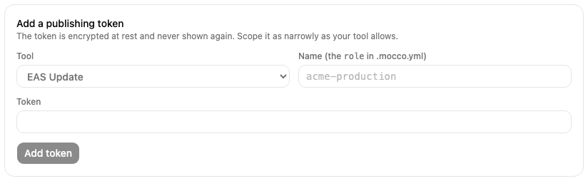
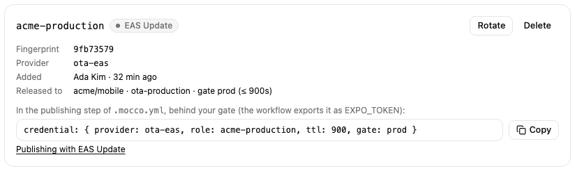
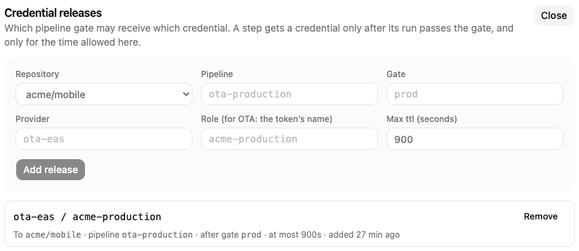

# Release a token to your pipeline

Your OTA tool publishes with a token. Once Mocco holds that token and nobody else does, the only way to publish is a Mocco pipeline run whose gate was approved: the workflow asks Mocco for the token after the gate, and Mocco checks the run, the gate and your allowlist before answering. This page sets that up once; the guide for your tool then shows the publish command.

## 1. Store the token

Create a publishing token in your OTA tool (the tool guides say how, and how narrowly each tool lets you scope it). Then open the project's **OTA updates** page and its **Your OTA tool** tab, choose the tool, give the token a name such as `acme-production`, paste it and choose **Add token**.



The token is encrypted and never shown again. The card shows its fingerprint (the first characters of its hash, to match against your tool), the provider id Mocco uses for it (`ota-eas`, `ota-codepush`, `ota-hot-updater` or `ota-generic`) and the line to copy into `.mocco.yml`.



Remove every other copy of the token afterwards, such as a GitHub Actions secret or a teammate's shell profile. Anyone who still has a copy can publish without approval.

## 2. Allow a pipeline to receive it

A workspace owner or admin opens **Access**, then **Credential releases**, and adds a release: the repository, the pipeline name from `.mocco.yml`, the gate that must be approved, the provider id and the token's name as the role, and the longest time Mocco should treat the grant as valid.



The token card then shows where it is released. A token with no release can't be fetched by any pipeline.

## 3. Request it in .mocco.yml

The publishing step names the token and the gate that must be approved before it. The gate must come earlier in `steps`:

```yaml
version: 2
pipeline: ota-production
steps:
  - kind: step
    run: build-bundle
    executor: github-actions
  - kind: gate
    name: prod
    resume: [{ role: mobile-release, count: 2 }]
    prevent_self: true
    reason_required: true
  - kind: step
    run: publish
    executor: github-actions
    credential: { provider: ota-eas, role: acme-production, ttl: 900, gate: prod }
```

## 4. Fetch it in the workflow

Mocco starts each `github-actions` step with a `repository_dispatch` event of type `mocco-run-step`. The event carries the run id, the step's position in `steps` (counting from 0, gates included: `publish` above is `2`), the commit, and a one-run token the workflow uses to talk back to Mocco. The workflow picks the step by its position, fetches the publishing token, publishes, and reports the result:

```yaml
name: Mocco steps
on:
  repository_dispatch:
    types: [mocco-run-step]

jobs:
  publish:
    if: github.event.client_payload.stepIndex == 2
    runs-on: ubuntu-latest
    env:
      MOCCO_RUN_ID: ${{ github.event.client_payload.runId }}
      MOCCO_STEP: ${{ github.event.client_payload.stepIndex }}
      MOCCO_RUN_TOKEN: ${{ github.event.client_payload.callbackToken }}
      MOCCO_CALLBACK_URL: ${{ github.event.client_payload.callbackUrl }}
    steps:
      - uses: actions/checkout@v4
        with:
          ref: ${{ github.event.client_payload.commitSha }}

      - name: Get the publishing token from Mocco
        run: |
          body=$(jq -nc --arg run "$MOCCO_RUN_ID" --argjson step "$MOCCO_STEP" --arg token "$MOCCO_RUN_TOKEN" \
            '{runId: $run, stepIndex: $step, token: $token}')
          secret=$(curl -fsS -X POST "${MOCCO_CALLBACK_URL%/callback}/credentials" \
            -H 'content-type: application/json' -d "$body" | jq -r '.credentials.value')
          echo "::add-mask::$secret"
          echo "OTA_TOKEN=$secret" >> "$GITHUB_ENV"

      # The publish command for your tool goes here, using $OTA_TOKEN (see the tool guides).

      - name: Report the result to Mocco
        if: always()
        run: |
          status=$([ "${{ job.status }}" = success ] && echo succeeded || echo failed)
          jq -nc --arg run "$MOCCO_RUN_ID" --argjson step "$MOCCO_STEP" --arg token "$MOCCO_RUN_TOKEN" \
            --arg status "$status" '{runId: $run, stepIndex: $step, token: $token, status: $status}' \
            | curl -fsS -X POST "$MOCCO_CALLBACK_URL" -H 'content-type: application/json' -d @-
```

Mocco answers `403 denied` for every refusal, whatever the reason: a run it didn't start, a gate that wasn't approved, or a missing release. A run started by hand in GitHub has no run token, so it can't get the publishing token at all.

## What stays your responsibility

The token itself doesn't expire when Mocco's grant does. A runner that received it could keep it until you rotate it, so publish from GitHub-hosted runners, scope the token as narrowly as your tool allows, and rotate it on a schedule: create a new token in the tool, choose **Rotate** on the card, then revoke the old one in the tool. Mocco marks a token that hasn't been rotated for 90 days.

For rollbacks, add a second pipeline whose gate one on-call engineer can approve alone (`count: 1`, `prevent_self: false`), with its own release in Access. An incident then never waits for a second person, the rollback still gets the token only through Mocco, and its run is in the audit log.
