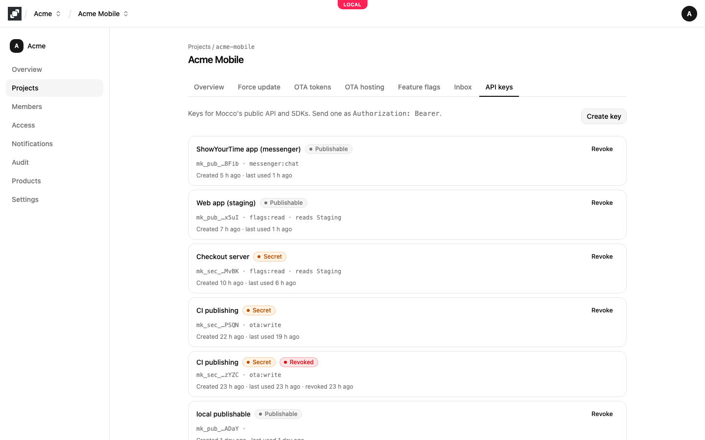
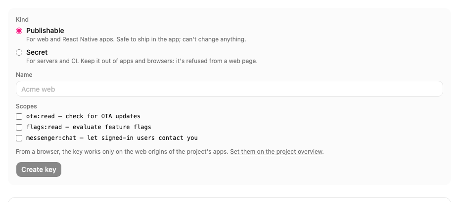

# API keys

Your apps, servers and CI call Mocco's API with a project's API keys. A key belongs to one project and can only reach that project's data. You manage them on the project's **API keys** tab.

## Publishable or secret

There are two kinds of key, and the first characters of a key tell you which one it is.

A **publishable** key (`mk_pub_…`) is made to ship inside your web or React Native app, where anyone can read it. It can only hold the scopes a client app needs, none of which can change your settings. From a browser it works only on the origins of the project's web apps, which you set with **Edit origins** on the project's **Overview** tab. A page on any other site gets `403 origin_not_allowed`.

A **secret** key (`mk_sec_…`) is for your servers and CI. It can hold any scope, so keep it in your secret store, never in an app. Mocco refuses a secret key sent from a web page (`401 secret_key_from_browser`), so frontend code can't use one by mistake. If a secret key ends up in an app or a public repository anyway, revoke it.

| Where the code runs | Key | Scopes |
|---|---|---|
| A web page or a React web app | Publishable | `flags:read` |
| A React Native app | Publishable | `flags:read`, `messenger:chat` |
| Your Node server evaluating flags | Secret | `flags:read` |
| CI uploading and promoting hosted OTA updates | Secret | `ota:write` |

## Scopes

A scope is what a key may do. Give each key only the scopes its code uses.

- `flags:read` evaluates feature flags. A key with it reads exactly one flag environment, which you choose when you create the key; create one key per environment. With a publishable key, apps see only the flags marked client-visible. See [Feature flags in browsers and apps](../flags/browsers-and-apps.md).
- `messenger:chat` lets your signed-in users contact you. Each call also needs the user's identity, signed by your server. See [In-app contact with Mocco Messenger](../messenger/contact-us.md).
- `ota:write` uploads and publishes hosted OTA updates from CI. See [Host OTA updates on Mocco](../ota/hosted-updates.md).
- `ota:read` and `flags:write` are offered in the form, but no Mocco API call needs them yet.

Some calls need no key at all: the force-update version check and the OTA manifest your app's update client downloads.

## Create a key

Owners and admins create keys; members see the list read-only.

1. On the project's **API keys** tab, choose **Create key**.
2. Under **Kind**, choose **Publishable** or **Secret**. A publishable key offers only `ota:read`, `flags:read` and `messenger:chat`.
3. Give the key a **Name** that says where it is used, such as `Acme web` or `CI publishing`.
4. Tick its **Scopes**. With `flags:read`, choose the **Flag environment** the key reads.
5. Choose **Create key**.

Mocco shows the new key once, under **Copy the key now**. Copy it into your app's configuration or your secret store, then choose **Done**. Mocco keeps only a hash of the key, so it can't show it again; if you lose it, revoke it and create a new one.

Send the key as `Authorization: Bearer <key>`. The SDKs do this for you when you pass the key to them.

A key you create here doesn't expire; it works until you revoke it. A key whose expiry date has passed shows **Expired** and is refused.

## Revoke a key

Choose **Revoke** on the key, then **Revoke key** to confirm. Calls with it fail at once (`401 invalid_key`), and the key stays in the list marked **Revoked**.

To replace a key without downtime, create the new one, deploy it, check that the old key's "last used" time stops moving, then revoke the old key. Each key shows when it was created and when it was last used (updated at most once a minute).

Creating and revoking keys is recorded in the [audit log](./audit-log.md) as `apikey.created` and `apikey.revoked`.

## Errors

Mocco answers with a status and a short code:

| Answer | Meaning |
|---|---|
| `401 missing_key` | No key was sent. |
| `401 invalid_key` | The key is unknown, revoked or expired. |
| `401 secret_key_from_browser` | A secret key was sent from a web page. |
| `403 origin_not_allowed` | A publishable key was used on a site that isn't one of the project's web origins. |
| `403 wrong_key_kind`, `403 insufficient_scope` | The key's kind or scopes don't allow this call. |
| `429 rate_limited` | Too many requests; wait for the number of seconds in `Retry-After`. A publishable key may make 600 requests a minute and a secret key 1,200. |
