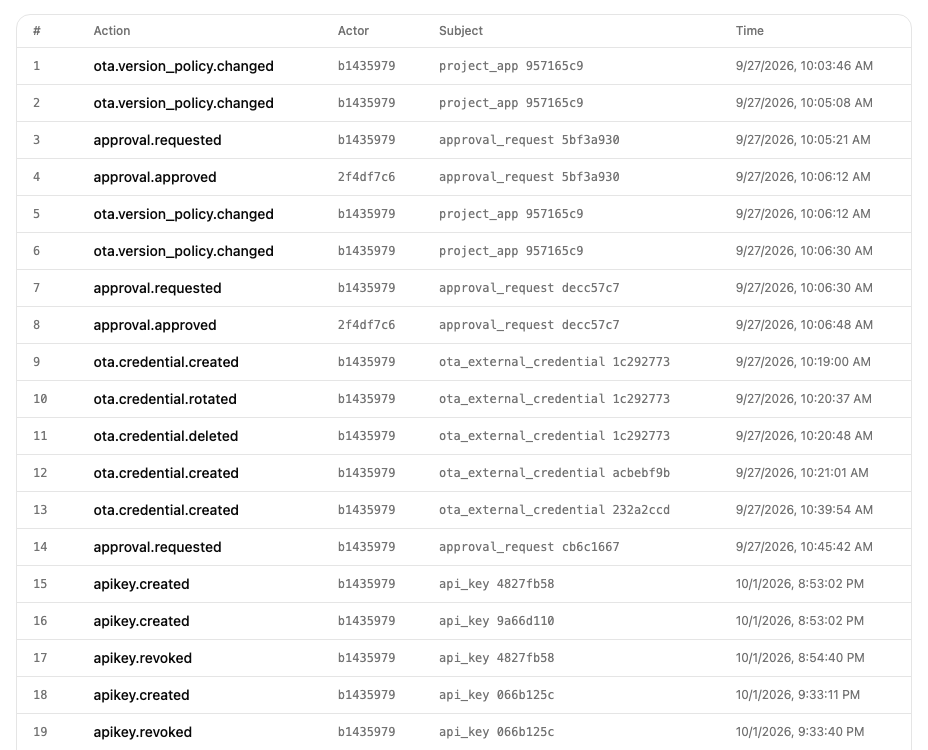

# The audit log

Each workspace has one audit log. Mocco adds an entry whenever someone makes a governed decision or change, and never edits or deletes an entry afterwards. It is always on; there is nothing to set up.

## What is recorded

Entries are named `area.event`. They cover:

- **Deploy governance**: a run started (`run.triggered`), a gate approved or rejected (`gate.resumed`, `gate.rejected`), and a credential handed to a pipeline step or refused (`credential.issued`, `credential.denied`). A credential request with a wrong run token is refused without an entry, since anyone who has seen a run id could send one.
- **Approvals** outside pipelines, such as a protected flag change or OTA promotion: requested, approved, rejected, replaced by a newer request, or expired (`approval.*`).
- **OTA and force update**: version policy changes, publishing tokens added, rotated or removed, hosted OTA apps, certificates, channels, trust policies, uploads and channel changes (`ota.*`).
- **Feature flags**: environments and flags created, changes applied, proposed, rejected, conflicted, withdrawn or expired, protection changes, kill switch and restore, client visibility, and dismissed stale-flag warnings (`flag.*`).
- **Messenger**: messenger set up, identity secret rotated, categories and guest settings changed, and a contact blocked or erased (`messenger.*`).
- **API keys**: created and revoked (`apikey.created`, `apikey.revoked`).

Each entry records who did it, what it was about and when, plus the details of the change, such as the approvers and roles of an approval.

## The Audit page

Open **Audit** in the workspace's side nav. Every workspace member can read it. The table lists the entries oldest first, numbered in the order they were recorded:

- **#**: the entry's position in the log.
- **Action**: what happened, such as `apikey.revoked`.
- **Actor**: the short id of the person who did it, or `system` when Mocco acted on its own, such as answering a pipeline's request for a credential.
- **Subject**: what the entry is about and its short id, such as `api_key 4827fb58`.
- **Time**: when it happened, in your browser's time zone.

The table refreshes itself every few seconds. It has no filters or search yet; to find an entry, search the page in your browser for an action name or an id.

## Proving nothing was changed

Each entry includes a hash of its own content and of the entry before it, so the log forms a chain. Changing or deleting any past entry breaks every hash after it.

When you open the page, Mocco re-checks the whole chain and shows the result next to the **Audit** heading, with the time of the check. **Chain verified** means every entry still matches. **Chain broken at #N** means entry N or its link to the entry before it no longer matches what was recorded: the stored log was altered after it was written, and from that entry on it can't be trusted as evidence. The check reads the whole log, so it doesn't repeat on its own while the table refreshes; **Re-verify** runs it again.

Gaps in the numbering are normal: a number can be used by a write that was then cancelled. A deleted entry shows up as a broken link, not as a gap. One change the chain can't show is the newest entries being deleted, because what is left is still a valid, shorter chain. Signing entries with an external key, which would catch that, is planned.
