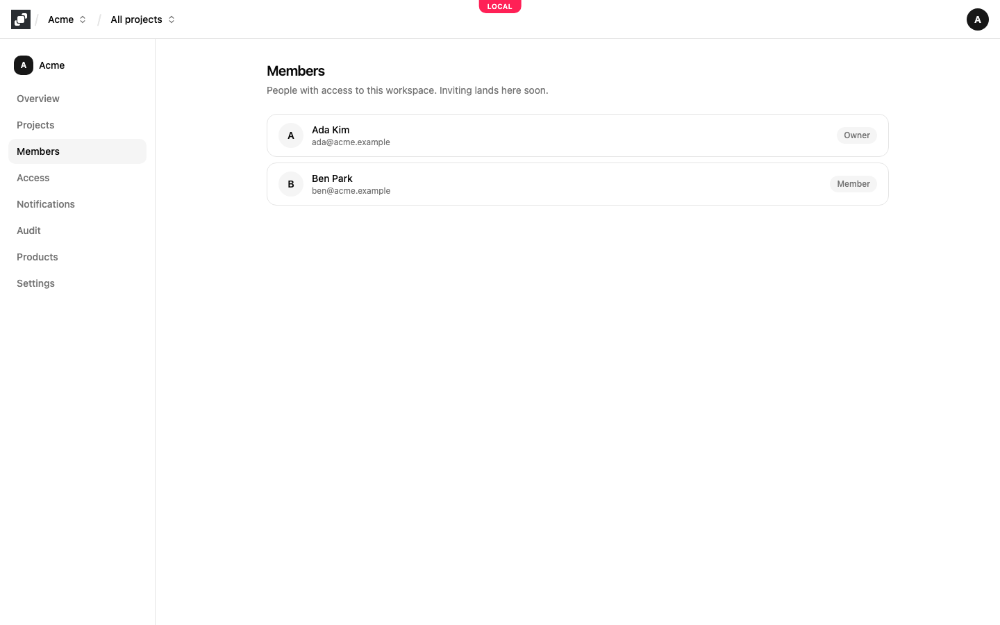
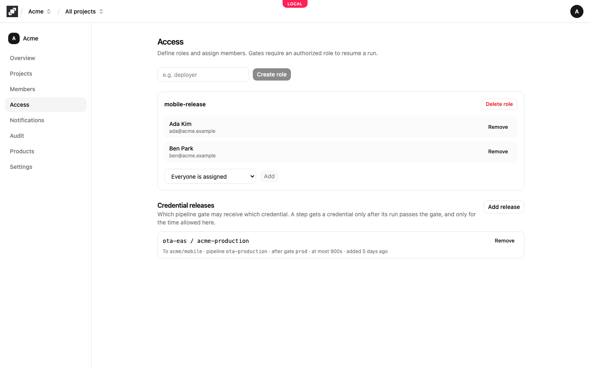

# Members and access

Mocco has two kinds of permission. A person's **workspace role** (owner, admin or member) decides who manages the workspace. **Roles** you define on the **Access** page, such as `deployer` or `mobile-release`, decide who may approve: a gate, a protected flag environment or OTA channel, or a raised minimum app version names a role, and only people in it can approve.

Approvals work this way so that GitHub write access and approving a production change stay separate. Someone can push code without being able to approve its release, and an approver doesn't need to be a repository admin.

## Members

The workspace's **Members** page lists everyone in the workspace with their name, email and workspace role.

Whoever creates a workspace is its owner. Mocco doesn't send invitations yet, and the console can't change a member's workspace role: the Members page lists the people already in the workspace, and inviting will be added there.

## What owners, admins and members can do

Every member can see everything in the workspace and work in its projects: create projects, add apps, turn products on, change flags and OTA settings, reply in the inbox, and start pipeline runs. A change to something protected still waits for approval, whoever makes it.

Owners and admins can also make the changes that decide who has power over what:

- create and delete roles, and add and remove the people in them, on the **Access** page
- add and remove **Credential releases**, which decide which pipeline may receive a production credential
- create and revoke a project's **API keys**
- add and remove notification channels and their rules, and webhook sources
- add OTA hosting trust policies and signing certificates
- choose who may use a flag environment's kill switch

Members see these settings read-only; the page says "You have read-only access; owners and admins manage …". Mocco checks the workspace role on every change, so hiding a button is never the only protection.

Deleting the workspace, on its **Settings** page, is for owners only.

## Roles on the Access page

Open **Access** in the workspace's side nav. Type a role name, for example `deployer`, and choose **Create role**. In the role's card, pick a member from **Select a member…** and choose **Add**. **Remove** takes a person out of the role, and **Delete role** removes the role.

A role means nothing on its own. It takes effect where something names it:

- A gate in a `.mocco.yml` pipeline, such as `resume: [{ role: deployer, count: 2 }]`: two people in `deployer` must approve. See [Deploy governance](../governance/overview.md).
- The protection on a flag environment or an OTA channel, and approvals on a version policy: see the [feature flags quickstart](../flags/quickstart.md#4-protect-an-environment) and [Force update](../ota/force-update.md#require-approval).

When a gate needs several roles, each person counts once, even if they hold more than one of the roles. When self-approval is barred (`prevent_self: true` on a gate, **Not the requester** on a protection), the person who started a run or proposed a change can't approve it.

Because only owners and admins can change roles, a member can't add themselves to an approver role and approve their own change.

## Credential releases

The **Credential releases** section of the Access page lists which pipeline gate may receive which credential: a repository, a pipeline, the gate that must be approved first, the credential's provider and name, and the longest time it is valid. A step gets the credential only after its run passes that gate. See [Deploy governance](../governance/overview.md#credentials-behind-a-gate) and [Release a token to your pipeline](../ota/pipeline.md).

Every resumed or rejected gate, every decided approval request, and every credential Mocco hands out or refuses is recorded in the [audit log](./audit-log.md).
