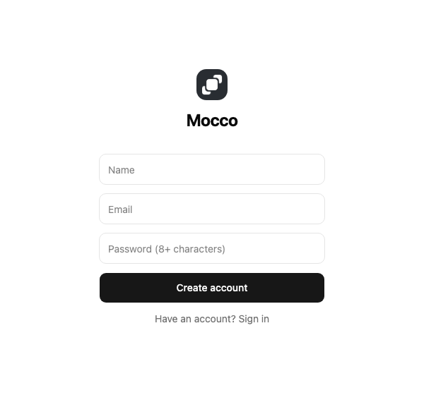
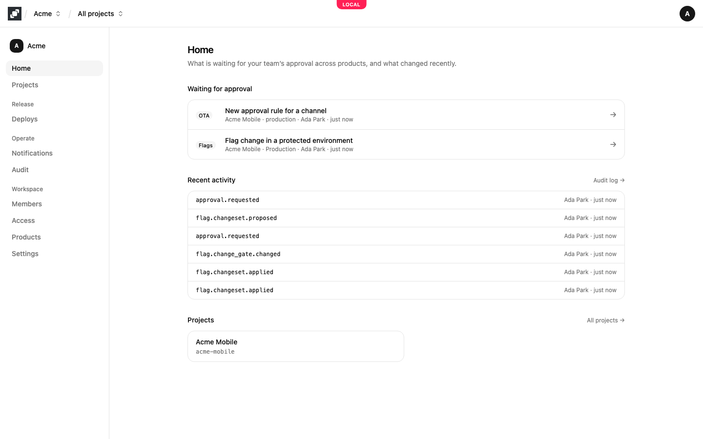
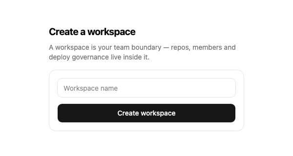
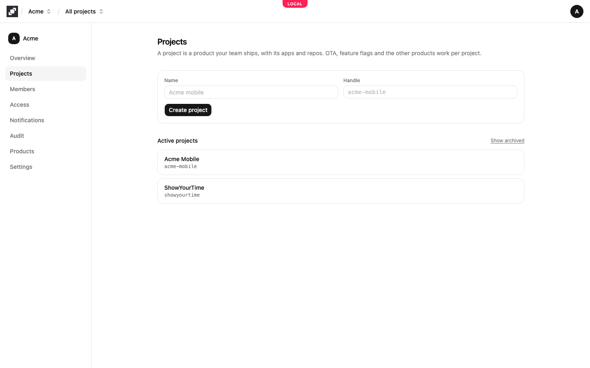
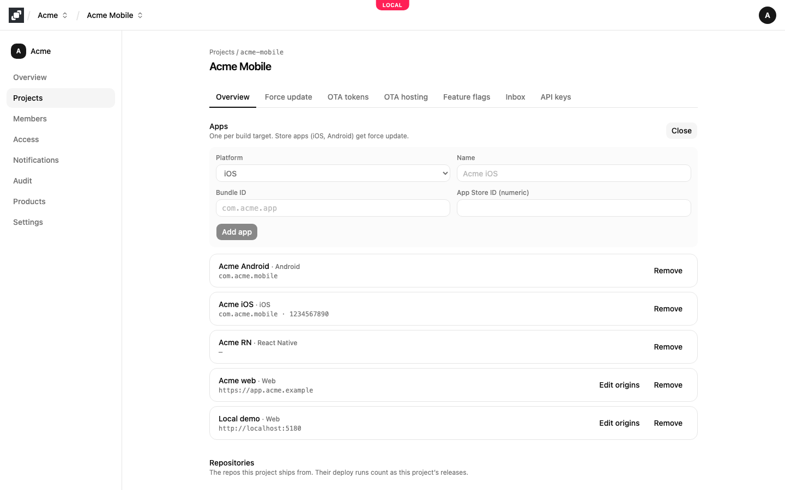
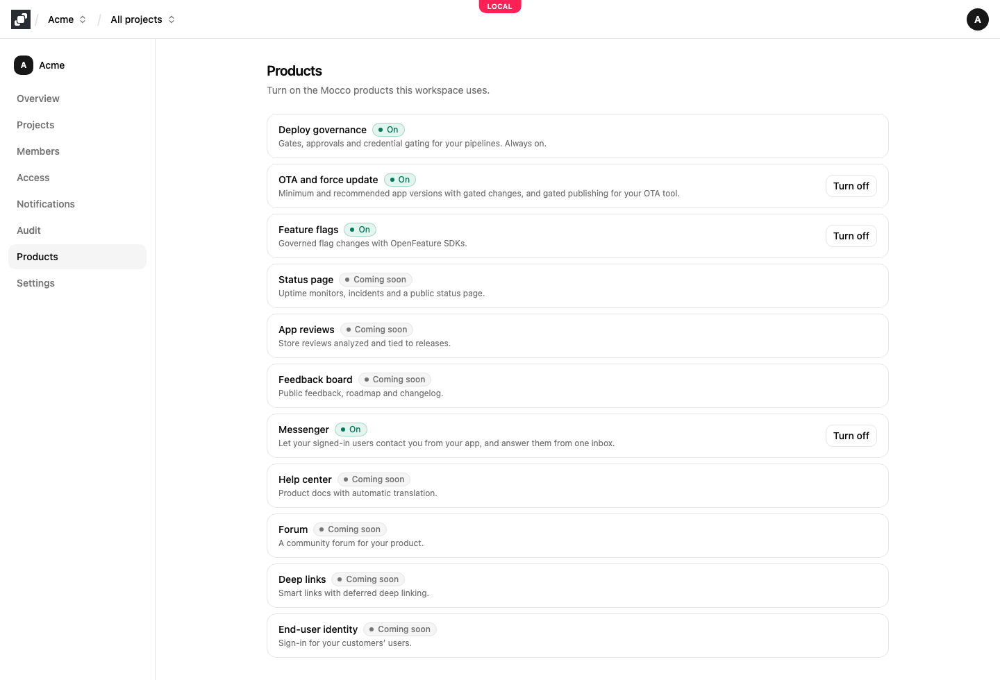

# Set up a workspace and projects

A **workspace** is your team: its members, roles, notification channels and audit log. A **project** inside it is one product you ship, such as your mobile app, with its apps and repositories. Most teams have one workspace and a project per product.

## 1. Create an account

On the sign-up page, enter your name, email and a password of at least 8 characters, and choose **Create account**. If you already have an account, choose **Have an account? Sign in**.

## 2. Create a workspace

A new account has no workspace, so Mocco asks you to create your first one. Give it a name, usually your company or team, and choose **Create workspace**. You become its owner, and Mocco opens its **Home**: the approvals waiting for your team in every product (a deploy paused at a gate, a flag change in a protected environment, a raised minimum app version, a release on a protected OTA channel), the latest entries of the audit log, and your projects. Each waiting approval names its project and what in it the approval is about: the environment of a flag change, the OTA channel, or the app of a minimum version ("QA App · Production"). It links to the screen where you approve it.

You can belong to several workspaces. To create another one or switch between them, open the workspace menu next to the Mocco logo in the top bar and choose **New workspace** or the workspace you want. The workspace's **Settings** page renames it, and an owner can delete it there.

## 3. Create a project

Open **Projects** in the workspace's side nav. Enter the project's **Name** and choose **Create project**. Mocco suggests a **Handle** from the name (`Acme Mobile` becomes `acme-mobile`); you can change it before you create the project. A handle is lowercase letters, digits and inner hyphens, up to 40 characters, and is unique in the workspace.

Mocco opens the new project. The project menu in the top bar switches between projects, and **All projects** goes back to the list.

A project you no longer work on can be archived from the bottom of its **Overview** page with **Archive**. An archived project is read-only and hidden from the list; nothing is deleted. **Show archived** on the Projects page lists it again, and **Unarchive** on its Overview brings it back.

## 4. Register your apps

On the project's **Overview** page, choose **Add app** under **Apps**. Add one app per build target, choose its **Platform** and give it a **Name**:

- **iOS**: the **Bundle ID**, and the numeric **App Store ID** if the app is in the App Store.
- **Android**: the **Application ID**, and the **Play package** if it differs from the application ID.
- **Web**: the **Web origins**, the sites whose pages may use the project's publishable keys, such as `https://app.acme.com`. Separate several with spaces or commas. You can change them later with **Edit origins**.
- **React Native** and **Server**: only a name.

Then choose **Add app**.

Store apps (iOS and Android) are what force update works on. A web app's origins decide where a publishable key may be used from a browser; see [API keys](./api-keys.md).

## 5. Link repositories

Under **Repositories** on the same page, choose a repository and **Link** to say which repos this project ships from. A repository appears here once GitHub is connected and the repository is added on the workspace's **Deploys** page; see [Deploy governance](../governance/overview.md#connect-github). A repository can be linked to more than one project, and **Unlink** removes it.

## 6. Turn on products

Open **Products** in the workspace's side nav and choose **Turn on** next to each product you want. Its pages appear in every project's side nav right away: **Force update** and **OTA updates** for OTA and force update and **Feature flags** under **Release**, and **Inbox** for Messenger and **Help center** under **Support**. **Turn off** hides them again.

Deploy governance is always on. Products marked **Coming soon** aren't available yet.

## Next

- [Members and access](./members-and-access.md): who is in the workspace and who may approve.
- [API keys](./api-keys.md): connect your apps and servers.
- The guide for each product: [OTA and force update](../ota/overview.md), [feature flags](../flags/quickstart.md), [messenger](../messenger/contact-us.md), [status page](../status/status-page.md), [notifications](../notifications/overview.md).
