# Monitor your service

A **monitor** checks your service on a schedule, an HTTP request or a TCP connection, and tells your status page when it stops working. Checks run at **probe locations**: a probe is a small agent you run on a machine that can reach your service. It asks Mocco for work and reports what it saw, so it needs no inbound port.

You need a status page with components first ([Run a status page](./status-page.md)): a monitor changes what its components show.

## 1. Create a private location

Locations belong to the workspace, so every project can use them. On a project's **Status page** section, open **Locations**. Everyone in the workspace can see the list; owners and admins create, rotate and disable locations.

Choose **New private location**, give it a **name** ("Office network") and a **code**. Mocco suggests the code from the name; it is lowercase letters, digits and hyphens, unique in the workspace.

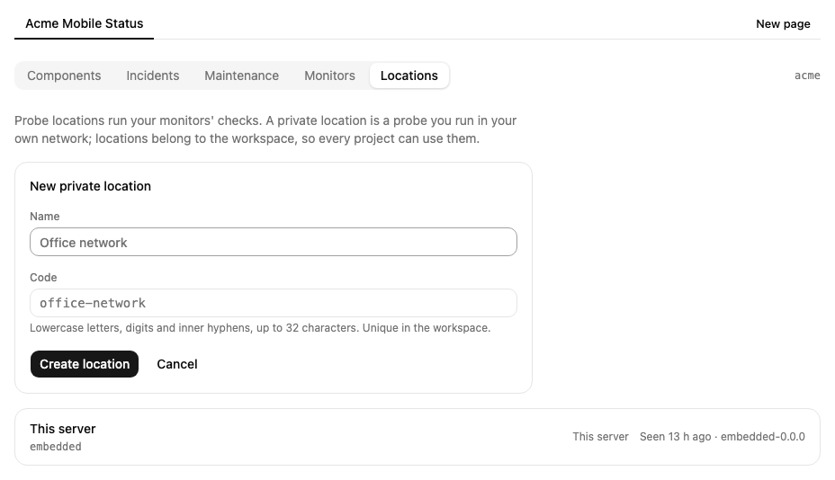

Mocco then shows the location's **token** once, with the commands that run the probe with it. Copy it now: Mocco keeps only a hash of it, so it can't show it again.

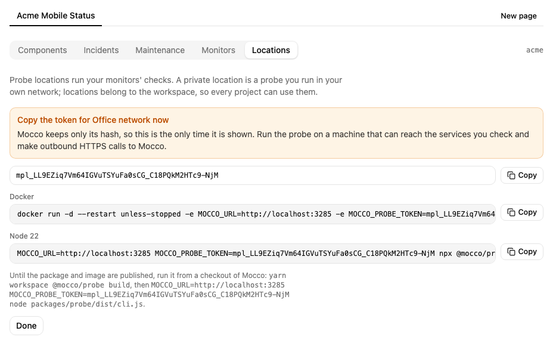

## 2. Run the probe

On a machine that can reach the services you want to check and can make outbound HTTPS calls to Mocco, run one of the commands shown:

```bash
docker run -d --restart unless-stopped \
  -e MOCCO_URL=https://www.mocco.work -e MOCCO_PROBE_TOKEN=mpl_... ghcr.io/fi-workers/mocco-probe
# or, with Node 22
MOCCO_URL=https://www.mocco.work MOCCO_PROBE_TOKEN=mpl_... npx @mocco/probe
```

Until the package and image are published, run it from a checkout of Mocco: `yarn workspace @mocco/probe build`, then `node packages/probe/dist/cli.js` with the same two variables.

Once it is polling, the location shows **Seen just now** and the probe's version. Two probes with one token share that location's work.

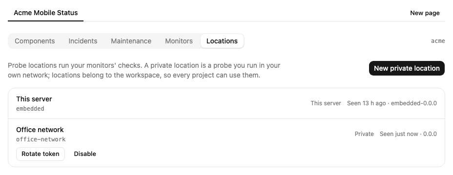

**Rotate token** issues a new token and stops the old one at once: the probe running with it exits, so restart it with the new token. **Disable** stops the location for good; no monitor can use it after that.

## 3. Create a monitor

Open **Monitors** and choose **New monitor**.

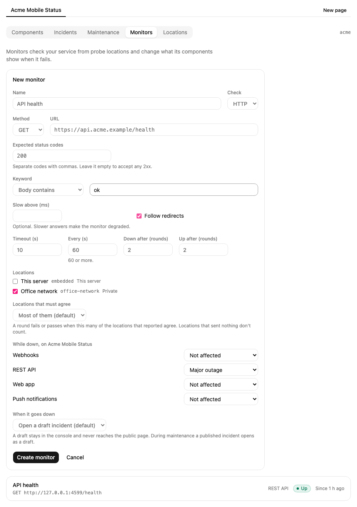

- **Check**: **HTTP** sends a request to a URL with a method (GET, HEAD or POST, with a body for POST); **TCP** opens a connection to a host and port.
- **Expected status codes**: the answers that pass, such as `200, 204`. Leave it empty to accept any 2xx.
- **Keyword**: optionally, the body must contain a word, or must not.
- **Slow above (ms)**: optionally, an answer slower than this still passes but makes the monitor **degraded**.
- **Timeout**: how long one check may take, up to 30 seconds.
- **Every (s)**: how often it runs, at least every 60 seconds.
- **Down after** and **Up after**: how many rounds in a row must fail before the monitor is down, and pass before it is up again. The default is 2, so one bad answer doesn't page anyone.
- **Locations**: where it runs. With several, **Locations that must agree** decides how many of those that reported must fail (or pass) for the round to count; a location that sent nothing never counts as a failure.
- **While down**: what each component shows while the monitor is down, or **Not affected**.
- **When it goes down**: open no incident, a **draft** incident (the default), or a **published** one.

A new monitor is **Pending** until its first round, which runs at once.

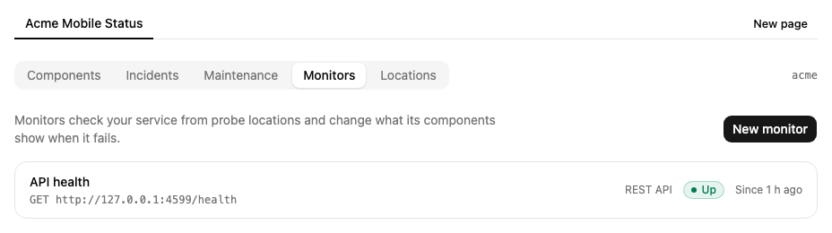

## 4. What happens when it fails

When a round fails, the monitor is **Suspect** and checks again right away. If it is still failing after **Down after** rounds, it is **Down**:

- the components you linked show the impact you chose, on the console and on the public page;
- an incident opens: "API health is down", **Investigating**, on the page holding most of those components. A **draft** stays in the console and never reaches the public page; review it and post your own updates. A published incident opens as a draft while a maintenance window covers the components;
- Mocco sends a **Down** alert (`status.monitor.down`) through your [notification rules](../notifications/mocco-events.md). The alert names only the host and port, never the URL's path, query or credentials.

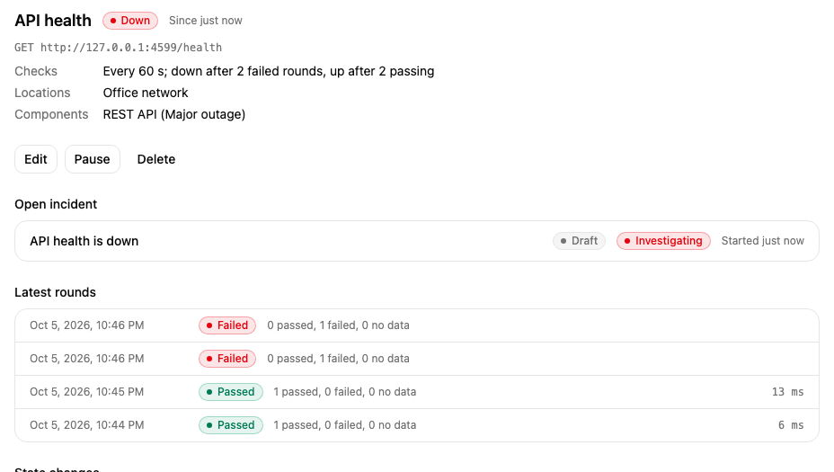

When checks pass again the monitor is **Recovering**, and the incident gets a **Monitoring** update. After **Up after** passing rounds it is **Up**: the incident is **Resolved**, the components go back, and a **Recovered** alert is sent. A false alarm (Suspect, then Up) sends nothing. A slow answer makes it **Degraded** and sends a **Degraded** alert.

The monitor's page lists its latest rounds and every state change. Use **Pause** to stop checking it (for example while you move the service) and **Resume** to start again; **Edit** changes its settings and keeps its state.

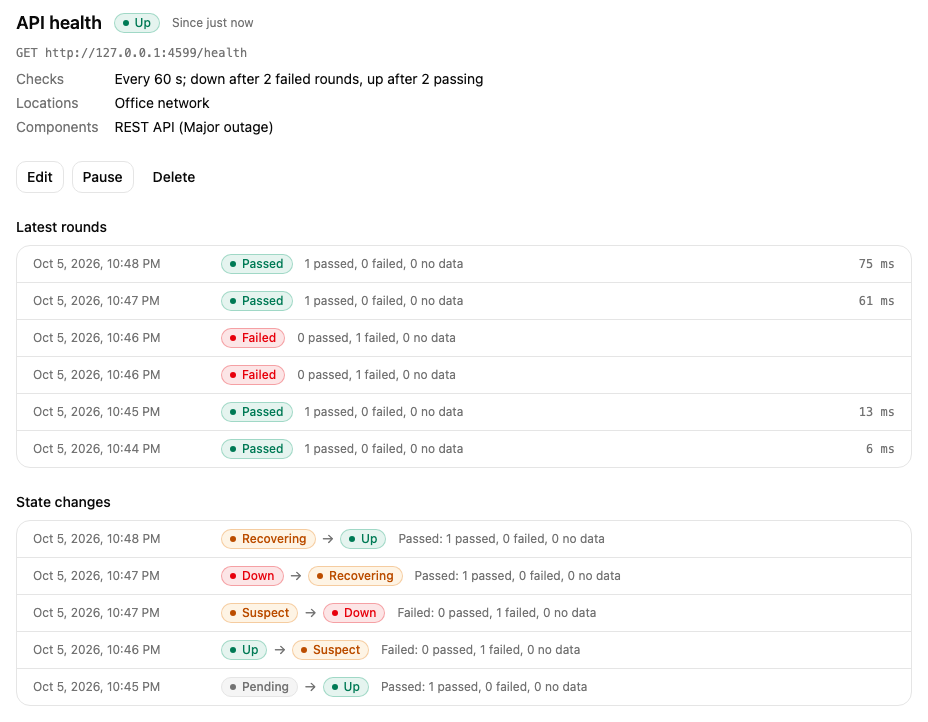

## 5. After a deploy

When a run of a repository linked to the project is released (it succeeded after passing a gate), Mocco **watches** the project's monitors for 15 minutes: they check every 30 seconds instead of every minute. The monitor's page says which run it is watching after, and until when.

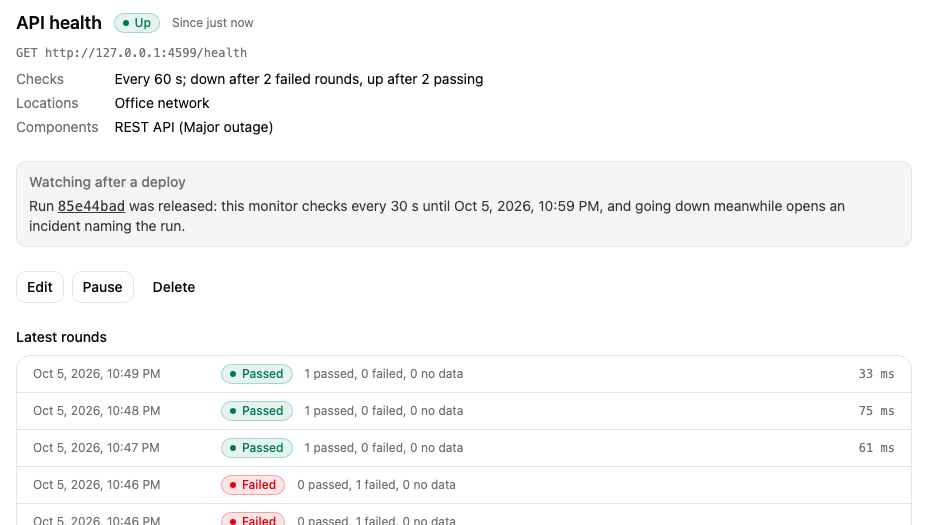

If a monitor goes down during the watch, the incident it opens says it started failing within minutes of a deploy, and the run is listed as **Suspected** under the incident's **Recent deploys**. The run's own timeline records the failed check too. The run itself isn't changed or rolled back.

A pipeline step can also ask for a round right away with `POST /v1/monitors/{id}/check` and a secret key with `status:write`.

## 6. Heartbeats for cron jobs and workers

A probe can't see a nightly backup or a queue worker. A **heartbeat** monitor works the other way round: the job pings Mocco each time it runs, and the monitor goes down when the pings stop or report a failure. It needs no probe and no location.

Choose **New monitor**, then **Check: Heartbeat**:

- **Expected every (min)**: how often the job runs, such as 1440 for a daily job.
- **Grace (min)**: how late a ping may be before it counts as missed, such as 30.
- **While down** and **When it goes down** work as for any monitor.

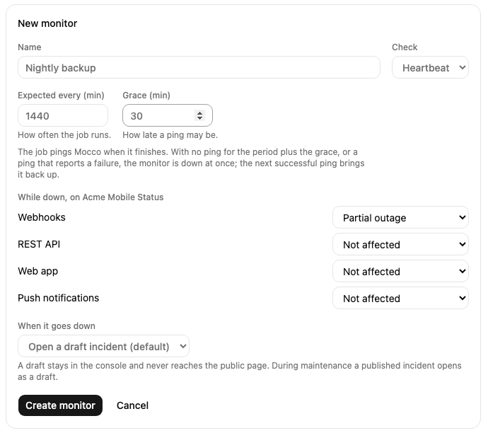

After **Create monitor**, Mocco shows the monitor's **ping URL** once, with commands to copy. The token in the URL is its only credential, and Mocco keeps only a hash of it, so copy it now.

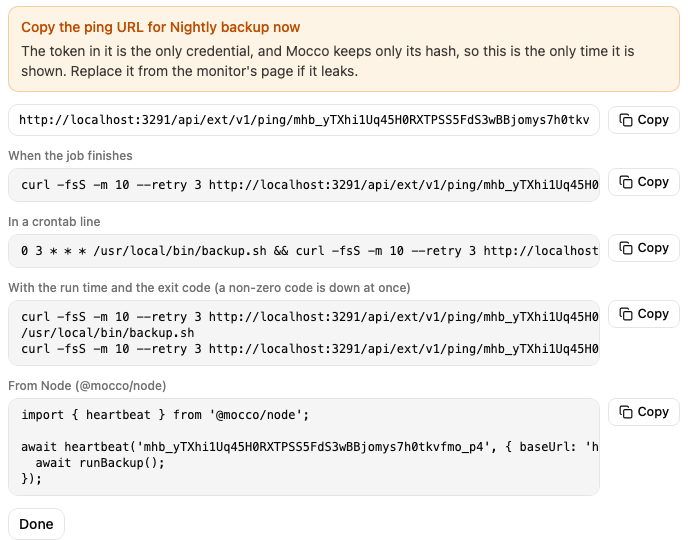

Ping it from the job with `GET` or `POST` (no API key):

```bash
# when the job finishes
curl -fsS -m 10 --retry 3 https://…/v1/ping/mhb_...
# or report the start, then the exit code (0 is a success, anything else is down at once)
curl -fsS -m 10 --retry 3 https://…/v1/ping/mhb_.../start
/usr/local/bin/backup.sh
curl -fsS -m 10 --retry 3 https://…/v1/ping/mhb_.../$?
```

`/fail` reports a failure without a code. From Node, `@mocco/node` does the same around a function: `await heartbeat('mhb_...', { baseUrl }).wrap(async () => runBackup())` pings `/start`, then success, or `/fail` when the function throws. A ping that can't be delivered is logged and never breaks the job.

The monitor is **Down** when no ping arrives for the period plus the grace (a new one, never pinged, counts from its creation), or at once when a ping reports a failure. The next successful ping brings it **Up**; there is no **Down after** or **Up after** to wait for. The components, the incident and the alerts follow as for any monitor ([4. What happens when it fails](#4-what-happens-when-it-fails)), and the downtime counts in the uptime history.

The monitor's page shows when the last ping came and how long the last run took (from `/start` to the finish), and each state change says why: a ping, a failure with its exit code, or no ping in time.

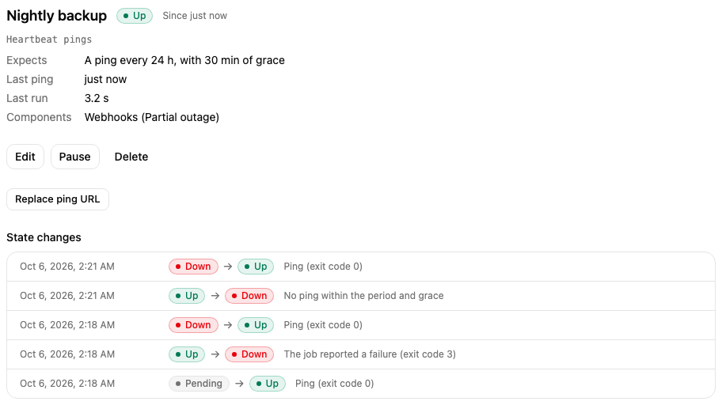

**Replace ping URL** issues a new URL; the old one stops working at once, so update the job. A paused heartbeat still accepts pings and shows them, but they don't change its state, and after **Resume** it waits a full period and grace before a missed ping counts. Pings are limited to five every five seconds per URL.

## What gets recorded

Creating, editing, pausing, resuming and deleting monitors, replacing a heartbeat's ping URL, and creating, rotating and disabling locations, are written to the workspace's [audit log](../start/audit-log.md), as are the incidents a monitor opens and updates.
