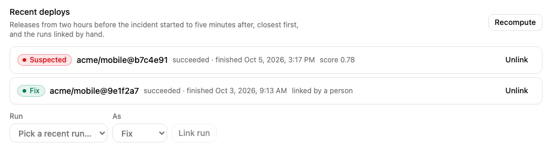
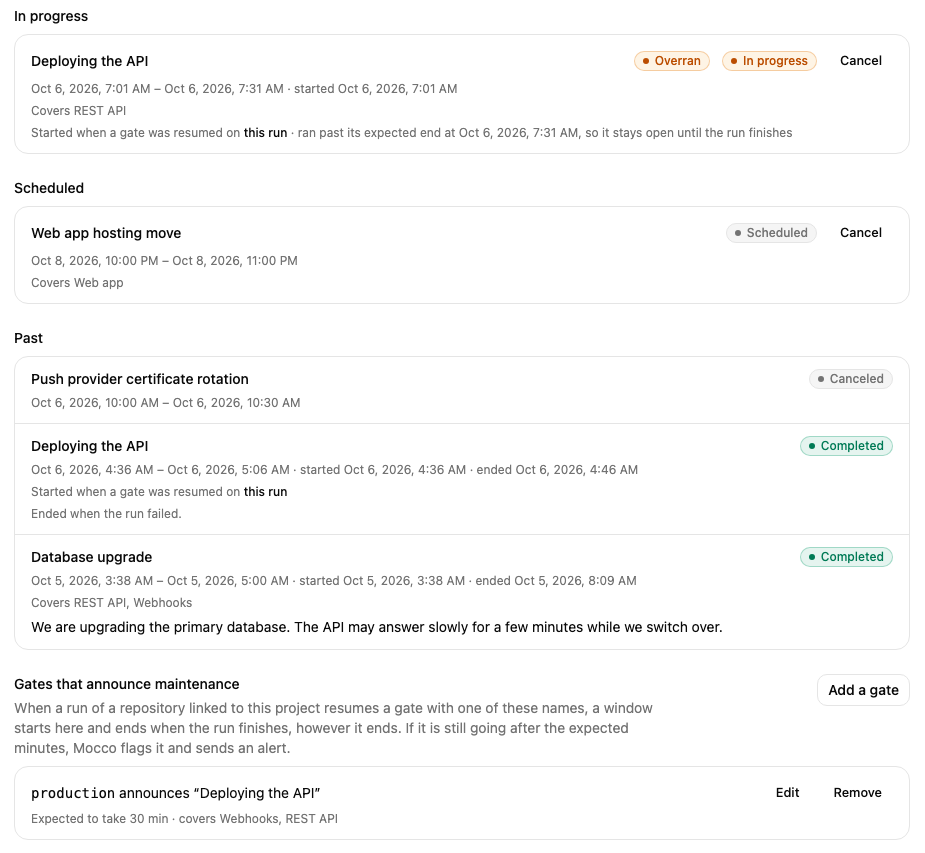

# Run a status page

A status page tells your users whether your service works. You list the parts of your service as **components**, report **incidents** against them while something is wrong, and announce **maintenance** before you do it. Mocco works out what each component shows from what you report.

You manage the page from the console, and Mocco publishes it as the public page your users open. They can follow it by email, signed webhook or its Atom feed ([Let visitors subscribe](./subscribers.md)).

## 1. Turn on the status page

A workspace member turns on **Status page** on the workspace's **Products** page. Each project then shows a **Status page** section.

## 2. Create a page

On the project's **Status page** section, give the page a **title** and an **address**. Mocco suggests the address from the title; it becomes the public page's address, so it must be unique across Mocco and use lowercase letters, digits and hyphens.

A project can have more than one page, for example one for customers and one for your own team. Choose **New page** to add another; each page is a tab.

## 3. List your components

Under **Components**, add each part of your service your users would notice: your API, your web app, push notifications. Put related components in a **group** ("API", "Dashboard") so the page stays readable. Use the arrows to change the order, **Edit** to rename a component, describe it or move it to another group, and **Delete** to remove it.

Each component has two statuses:

- **Reported status** is what you set by hand: Operational, Under maintenance, Degraded performance, Partial outage or Major outage.
- The **badge** next to the name is what the page shows. It is the worst of the reported status, the impact of any open incident on the component, and "Under maintenance" while a maintenance window covering it is in progress. An outage during maintenance still shows as an outage. When an incident or maintenance makes a component show worse than you reported, the row says so.

You rarely need to change the reported status yourself: declare an incident instead, and the component goes back to operational when the incident is resolved.

**Page settings**, below the components, rename the page or change its address. **Delete page** deletes the page with its components, incidents and maintenance windows.

## 4. Declare an incident

Open the **Incidents** tab. It lists the **Open** incidents; **Resolved** lists the closed ones. Both lists keep their place in the link, so you can share them.

Choose **Declare incident** and fill in:

- **Title**: what your users notice, such as "Delayed push notifications".
- **Severity**: Minor, Major or Critical.
- **Status**: where you are. Most incidents start at **Investigating**; pick **Identified** or **Monitoring** if you already know more.
- **First update**: the first message on the incident's timeline.
- **Affected components**: for each component the incident touches, how badly: degraded performance, partial outage or major outage.

## 5. Post updates until it's resolved

Open an incident to see its timeline, newest first, and to post an update. Each update has a message and a status. The status list offers only the steps an incident can take from where it is:

| From | To |
|---|---|
| Investigating | Identified, Monitoring or Resolved |
| Identified | Monitoring or Resolved |
| Monitoring | Identified (the fix didn't hold) or Resolved |
| Resolved | Nothing: a resolved incident is closed |

Keep the current status, marked "(no change)", to post news without moving the incident. **Change** under **Affected components** updates which components are affected and how badly, for example when an outage spreads or eases.

If someone else moved the incident while you were writing, for example resolved it in another tab, Mocco refuses the update, says why, and shows the incident as it is now.

## 6. Check the deploys around it

**Recent deploys** on the incident lists the releases that finished from two hours before the incident started to five minutes after it. A release is a run that succeeded after passing a gate. When the project links repositories, only releases of those repositories count; otherwise every release in the workspace does. The closest is marked **Suspected**, and each shows its score: higher means it finished closer to the start. Mocco fills this in when the incident is declared, by you or by a monitor, and **Recompute** looks again, for example for a release recorded later.

To add a run Mocco didn't suggest, pick it under **Run**, choose **Related** or **Fix** (the run that resolved it), and choose **Link run**. **Unlink** removes a run from the list. The run's own page lists the incidents it is linked to under **Incidents**.

## 7. Write the postmortem

Once the incident is over, write what happened, why, and what you changed in **Postmortem**. It is Markdown. Leave it empty and save to remove it.

## 8. Schedule maintenance

Open the **Maintenance** tab and choose **Schedule maintenance**. Give the window a title, when it starts and ends (in your time zone), optional details, and the components it covers.

Mocco starts each window at its start time and completes it at its end, checking every minute. The tab shows what is **In progress**, what is **Scheduled**, and the **Past** windows. While a window is in progress, the components it covers show "Under maintenance".

To call a window off, choose **Cancel**; a window that is already in progress ends at once. Windows can't be edited: cancel the window and schedule a new one.

## 9. Announce maintenance from a deploy gate

A risky deploy can announce itself. Under **Gates that announce maintenance** on the **Maintenance** tab, choose **Add a gate** and give the name of a gate in your pipeline (for example `production`), the title the window shows, how many minutes the deploy usually takes, and the components it affects.

From then on, when someone resumes a gate with that name on a run of a repository linked to this project, Mocco starts a window on the page right away. When the run finishes, the window completes. That happens however the run ends: if it fails, is canceled, or a later gate rejects it, the window still closes and says why. If the run is still going after the expected minutes, the window is marked **Overran** and Mocco sends a "Maintenance overran" alert to your notification rules (the Mocco preset includes it). The window stays open until the run finishes.

Each run's window links to the run. While it is in progress, the components show "Under maintenance" like any other window: a monitor that goes down on them opens its incident as a draft instead of publishing it, its alerts say "(during maintenance)", and the time doesn't count against uptime. Choose **Edit** to change a gate's title, minutes or components, or **Remove** to stop it announcing; windows it already started carry on.

## What gets recorded

Creating and deleting pages, changing a component's reported status, declaring incidents, posting updates, changing affected components or the postmortem, linking and unlinking runs, scheduling, canceling, starting, completing and overrunning maintenance, and adding, changing and removing the gates that announce it are all written to the workspace's [audit log](../start/audit-log.md).
