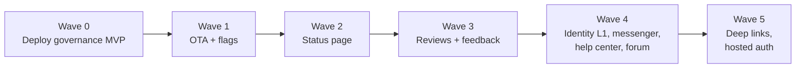

# Product roadmap

Mocco is an all-in-one platform for developers: shipping, operating and supporting a product from one workspace. Deploy governance is the first product line ([feature map](./feature-map.md)). This page covers the ten lines that follow it, the order they ship in, and why.

Tracking: epic [#104](https://github.com/fi-workers/mocco/issues/104) (products) and [#106](https://github.com/fi-workers/mocco/issues/106) (shared foundations). Each product issue has its slices attached as GitHub sub-issues.

## The advantage every product builds on

Mocco knows what reached production, when, and who approved it. None of the competitors researched for these ten lines has that data, and no single platform covers more than three of Mocco's eleven lines ([platform research](../research/all-in-one-platforms-competitors.md)). So each product is designed around one join its standalone competitors cannot make:

| Product | Issue | The join only Mocco can make |
|---|---|---|
| OTA release management | [#99](https://github.com/fi-workers/mocco/issues/99) | A production OTA push goes through the same gate, approvals and audit chain as a deploy |
| Feature flags | [#101](https://github.com/fi-workers/mocco/issues/101) | A production flag change is a gated, audited changeset; N-of-M approvals across roles |
| Status page | [#103](https://github.com/fi-workers/mocco/issues/103) | Incidents list the runs promoted before them; a failing post-deploy check opens an incident that names the run |
| App-review analysis | [#94](https://github.com/fi-workers/mocco/issues/94) | Rating and topic shifts attributed to the release (and its approvers) that caused them |
| Feedback board, roadmap, changelog | [#98](https://github.com/fi-workers/mocco/issues/98) | "Shipped" means the fix reached production, verified against the deployed commit, not that an issue closed |
| Customer messenger | [#95](https://github.com/fi-workers/mocco/issues/95) | The inbox shows which release, OTA bundle and flag state the customer is on |
| Help center | [#96](https://github.com/fi-workers/mocco/issues/96) | Paragraph-level translation memory; later, articles flagged when a deploy touches the code they describe |
| Community forum | [#97](https://github.com/fi-workers/mocco/issues/97) | A thread is marked "fixed in production" when the linked fix deploys |
| Smart deep links | [#102](https://github.com/fi-workers/mocco/issues/102) | Release-aware routing: users on a build too old for the target screen get an update prompt |
| End-user identity and auth | [#100](https://github.com/fi-workers/mocco/issues/100) | One end-user identity shared by messenger, forum and feedback; auth config changes gated and audited |

## Waves

Each wave ships its products together with the foundations they introduce, so no foundation is built before something uses it.

### Wave 0 — deploy governance MVP (in flight)

The wedge in the [feature map](./feature-map.md): gates, credential broker, audit log. Everything later reuses its gate evaluation and audit chain.

### Wave 1 — release suite: OTA (#99) and feature flags (#101)

- **Why first:** both are production changes that today bypass all governance, so they extend the existing product directly and sell to the same buyer. The market is also open right now. CodePush shut down on 2025-03-31 and Microsoft's open-sourced server was archived; Ionic Appflow stops taking new apps on 2026-10-01. Flag vendors have consolidated (Split → Harness, Eppo → Datadog, Statsig → OpenAI → Amplitude, DevCycle → Dynatrace), Hypertune shut down on 2026-08-10, and Firebase Remote Config became paid on 2026-09-01. Everywhere, approvals and durable audit are top-tier-only features.
- **Key decisions:**
  - OTA speaks the Expo Updates protocol v1, so apps use the stock `expo-updates` client. Signing keys stay in CI; Mocco verifies and serves the signed bytes.
  - Flag SDKs are OpenFeature providers over a flagd-format ruleset evaluated locally; web and React Native use OFREP remote evaluation so targeting rules never reach the client.
  - Both reuse `evaluateGate` through a shared *approvals outside runs* service extracted from `GateService`.
- **Foundations introduced:** project/app entity and product enablement, multi-product app shell, SecretBox, job queue, domain events with `deploy.released` and the release registry, API keys and `/v1`, SDK packaging, object storage, approvals outside runs.
- **Exit:** a production OTA promotion and a production flag change are both blocked until an authorized role approves, and both appear in the audit chain.

### Wave 2 — status page (#103)

- **Why next:** it turns deploy data into an operations product, and it brings in the foundations the public-facing products need.
- **Key decisions:** one pull-based probe agent (`@mocco/probe`) runs on our multi-region network and on customer infrastructure; "down" needs a majority of regions on consecutive rounds; the public page is a static snapshot on a CDN, so it stays up when the customer's product or Mocco is down.
- **Foundations introduced:** notifications (Slack, email, webhooks; the governance Slack plan lands here first), public rendering under `pages/_sites/**`, custom domains and TLS.
- **Competitors:** Better Stack and Instatus at about $25–30/month; Statuspage charges $99–399/month for subscribers and has no monitors.

### Wave 3 — product loop: app reviews (#94) and feedback (#98)

- **Why here:** both are small once the job queue, notifications and domain events exist, and together they close the loop from "users complained" to "fix shipped".
- **Key decisions:**
  - Reviews: Google Play only returns the last 7 days of written reviews, so polling runs at least daily and alarms when stale. Apple returns no app version on a review, so the version is inferred from Mocco's release timeline and labeled as inferred. LLM cost is roughly $0.0004–0.0008 per review.
  - Feedback: *Shipped* is suggested only after verifying, through the GitHub App, that the linked PR's merge commit is an ancestor of a released commit. The GitHub App needs *Issues: read* and *Pull requests: read*. Duplicate detection falls back to Postgres full-text search without an LLM key.
- **Foundations introduced:** neutral LLM surface with cost metering; email magic-link identity for voting.
- **Competitors:** AppFollow, Appbot and AppTweak already sell AI tagging, so tagging is table stakes; Canny, Featurebase and the open-source Quackback close posts when an issue closes, never when code ships.

### Wave 4 — support stack: identity layer 1 (#100), messenger (#95), help center (#96), forum (#97)

- **Why later:** the most crowded market (per-seat pricing plus $0.49–0.99 per AI resolution), and the one that most depends on shared end-user identity. It lands once the release suite gives it data to differentiate on.
- **Key decisions:**
  - Identity layer 1 is its own engine on `jose`, not better-auth: better-auth assumes one user pool per instance. Operator auth and end-user auth share no tables, keys, cookies, token formats or domains, and a lint rule bans imports across the boundary.
  - Messenger: Postgres is the source of truth with per-conversation sequence numbers; realtime is only a "fetch now" nudge (polling first, then Ably hosted and SSE over LISTEN/NOTIFY self-hosted). The React Native SDK is pure JS, so it runs in Expo Go, which no competitor's SDK does.
  - Help center: plain Markdown, per-locale states (`auto` / `reviewed` / stale by source hash), paragraph-level translation memory, reviewed text never overwritten.
  - Forum: build, don't embed. Discourse charges $500/month before it accepts your own sign-in, and self-hosting it breaks the Node + Postgres rule.
- **Foundations introduced:** realtime surface, push notifications (Expo, APNs, FCM), embeddings with pgvector.
- **Korea:** Channel Talk repriced on 2025-11-28; integrating with it may be the better first move than competing head-on.

### Wave 5 — deep links (#102) and hosted auth (#100 phase 2)

- **Deep links:** Firebase Dynamic Links has returned 404 since 2025-08-25, but Branch, AppsFlyer and Airbridge absorbed most migrations, so this ships late and positions as "Dynamic Links done right, self-hostable, not an attribution suite". No IP or device fingerprinting on iOS (App Store rules); deferred linking uses a landing page with clipboard handoff on iOS and the Play Install Referrer on Android.
- **Hosted auth (phase 2):** only after a threat model, key-rotation runbook and an external security review (identity slice 8). Korean packaging is the differentiator: Kakao and Naver login, Sign in with Apple (required by App Store rule 4.8 once those are offered), and PASS identity verification through an aggregator.

## Shared foundations

Designed in [platform foundations](../specs/2026-09-24-platform-foundations-design.md), tracked in [#106](https://github.com/fi-workers/mocco/issues/106). Each lands with the first product that needs it.

| Foundation | First needed by | Also used by |
|---|---|---|
| Project/app entity, product enablement, release registry | #99 | all |
| Multi-product app shell and product registry | #99 | all |
| SecretBox (encrypted third-party credentials) | #99 | #94, #95, #100 |
| Approvals outside runs (shared vote policy, `ApprovalService`) | #99 | #101, #100 phase 2 |
| Job queue and scheduler (Postgres table + tick) | #99 | #94, #96, #103 |
| Domain events and `deploy.released` | #99 | #94, #98, #103, #97 |
| API keys, public `/v1`, rate limiting | #99 | #95, #98, #101, #102 |
| SDK packages (MIT) and publishing | #99 | #95, #98, #101, #102 |
| Object storage (S3-compatible, Vercel Blob, filesystem) | #99 | #95, #103 |
| Notifications: Slack, webhooks, delivery outbox | #103 | #94, #95, #98 |
| Email delivery with suppressions and unsubscribe | #103 | #95, #97, #98 |
| Public rendering (SSG/ISR under `_sites`, host routing) | #103 | #96, #97, #98 |
| Custom domains and TLS | #103 | #96, #97, #98, #102 |
| Neutral LLM surface with cost metering | #94 | #95, #96, #97, #98 |
| Usage metering and entitlements | #99 | all |
| Realtime surface | #95 | — |
| Push notifications (Expo, APNs, FCM) | #95 | — |
| Embeddings (pgvector) | #96 | #95, #98 |

End-user identity layer 1 is not in this list on purpose: it is owned by #100 (slices 1–7) and consumed by #95, #97 and #98.

## Cross-cutting decisions

These need ADRs. Numbers follow the platform foundations design and are provisional until each ADR is written (issue #74 also proposes an ADR, so renumber at write time).

1. **Mocco is a multi-product platform:** projects and apps below workspaces, per-workspace product enablement, one app shell.
2. **Background jobs:** a Postgres job table claimed with `FOR UPDATE SKIP LOCKED`, driven by a tick from Vercel Cron, a `yarn worker` loop or any external cron. Vercel Queues and Workflow were rejected as beta or hosted-only; pg-boss keeps its own schema outside Drizzle. Minute-level schedules need Vercel Pro or an external pinger.
3. **Public rendering:** Pages Router SSG/ISR only under `pages/_sites/**`, enforced by lint. The operator app stays client-rendered and ADR 0009 holds.
4. **End-user identity is separate from operator auth** (co-owned with #100).
5. **Public API and SDKs:** versioned `/v1` on the Hono `ext/` surface, publishable (`mk_pub_`) vs secret (`mk_sec_`) keys plus a per-project identity secret, MIT-licensed SDKs (an AGPL library inside customer apps would block adoption). The server stays AGPL.
6. **What counts as a production release without environments:** a run that succeeded after at least one resumed gate emits `deploy.released`; a project can narrow it to a labeled step. Domain events are delivered at least once and are separate from the audit log.

Product-specific ADRs are listed in each spec: the OTA client protocol and signing model, flag evaluation targets and flags-as-code, forum build-vs-embed, the messenger's realtime transport and widget delivery, status probes and static pages, and the `release:` field in `.mocco.yml` for reviews.

## Pricing and packaging

Follow the PostHog pattern the research found works: each product meters its own usage with its own monthly free tier, no bundle discount, and company-level features (SSO, roles, audit retention) sold as add-ons. Products are free while alpha or beta and priced at general availability. Lock-in comes from data joined across products (one gate and audit log across deploys, OTA and flags; incidents linked to runs; feedback closed on deploy), not from discounts.

## Risks

- **Scope:** eleven product lines on a small team. Mitigation: waves, foundations built only when a product needs them, and each product's slices ordered so a thin version ships first.
- **Security surface:** hosted auth and public write endpoints (messenger, forum, feedback). Mitigation: identity phase 2 is gated on an external review; rate limiting and abuse controls are in the first slice of each public surface.
- **Self-host parity:** every foundation needs a self-host driver (worker loop, filesystem storage, Caddy on-demand TLS, polling realtime). The hosted vs self-host matrix is in the platform foundations design.
- **Unverified facts:** the research was cut short by a web-search budget; claims marked "(unverified)" in the research pages need checking before they go into sales material.

## Documents

| Product | Research | Design |
|---|---|---|
| Platform | [All-in-one platforms](../research/all-in-one-platforms-competitors.md) | [Platform foundations](../specs/2026-09-24-platform-foundations-design.md) |
| OTA | [Research](../research/ota-competitors.md) | [Design](../specs/2026-09-24-ota-design.md) |
| Feature flags | [Research](../research/feature-flags-competitors.md) | [Design](../specs/2026-09-24-feature-flags-design.md) |
| Status page | [Research](../research/status-page-competitors.md) | [Design](../specs/2026-09-24-status-page-design.md) |
| App reviews | [Research](../research/app-reviews-competitors.md) | [Design](../specs/2026-09-24-app-reviews-design.md) |
| Feedback | [Research](../research/feedback-competitors.md) | [Design](../specs/2026-09-24-feedback-design.md) |
| Identity | [Research](../research/identity-competitors.md) | [Design](../specs/2026-09-24-identity-design.md) |
| Messenger | [Research](../research/messenger-competitors.md) | [Design](../specs/2026-09-24-messenger-design.md) |
| Help center | [Research](../research/help-center-competitors.md) | [Design](../specs/2026-09-24-help-center-design.md) |
| Forum | [Research](../research/forum-competitors.md) | [Design](../specs/2026-09-24-forum-design.md) |
| Deep links | [Research](../research/deep-links-competitors.md) | [Design](../specs/2026-09-24-deep-links-design.md) |
