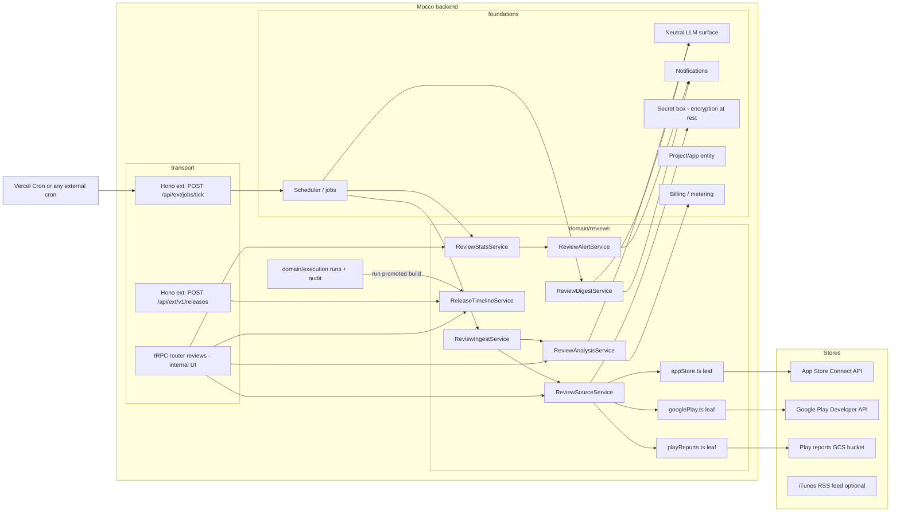

# App-store review analysis — implementation design

Tracking issue: fi-workers/mocco#94 (epic #104). Domain name: `reviews`.

## Goals / non-goals

**Goals (v1)**

1. Connect an App Store Connect app and a Google Play app per Mocco project/app, with credentials encrypted at rest and never rendered back.
2. Pull reviews on a schedule, idempotently, without losing Google Play reviews to its 7-day window.
3. Analyze each review once per body version with a cheap LLM call: sentiment, topics, bug flag, language, English translation. Cache the result and meter the cost.
4. Keep a release timeline per app, fed first by Mocco runs and second by store metadata. Tag reviews with an exact (Play) or inferred (Apple) version and show rating deltas before and after each release.
5. Send a daily or weekly digest and spike alerts to Slack first and email second. An alert names the Mocco run, the approvers and the version.
6. Provide a reviews list with URL-state filters and a version timeline chart.
7. Run the same way on Vercel and on self-hosted Node 22 + Postgres.

**Non-goals (v1)**

- Replying to reviews. The design leaves room for it: `mocco_app_review_replies` in v2, gated by an approval.
- Stores other than App Store and Google Play. ASO, keywords and competitor apps.
- Natural-language chat over reviews, and MCP (v2).
- Auto-filing GitHub issues or feedback-board posts (v2, through #98).
- Embeddings or a vector store. v1 topic detection works on the taxonomy plus LLM-suggested labels.

## User flows

1. **Connect App Store.** Workspace admin → Project → App (iOS) → Reviews → "Connect App Store Connect". The admin pastes the Issuer ID and Key ID, uploads the `.p8` key, and picks an app from the list the key can see (`GET /v1/apps`). Mocco runs a connection test (fetch one page of `customerReviews`), encrypts and stores the credentials, and enqueues a backfill job.
2. **Connect Google Play.** The admin uploads a service-account JSON key and enters the package name. The Play Console user for that service account needs only "View app information" and "Reply to reviews" (the latter only for v2). The connection test calls `reviews.list` with `maxResults=1`. Optional: the GCS bucket URI (`gs://pubsite_prod_rev_<id>`) for a historical CSV backfill.
3. **Link releases.** Nothing is needed when the `.mocco.yml` production step declares `release: { app: ios, version: ... }`, or when CI calls `POST /api/ext/v1/releases` with the run callback token. Otherwise Mocco falls back to store release metadata.
4. **Browse.** `/w/[workspace]/reviews?app=…&store=…&version=…&rating=1,2&topic=crash&lang=ko&since=…`. A table of reviews (original text, English translation toggle, topics, bug flag, version badge showing whether the version is exact or inferred). Above it, the version timeline: daily average rating and 1–2 star share with release markers linked to runs.
5. **Tune the taxonomy.** Admin edits topic labels (defaults: crash, login, payment, performance, ux, feature_request, ads, subscription, content, other) and promotes suggested topics into the taxonomy.
6. **Get notified.** Admin picks a Slack channel or email per app, digest cadence (daily or weekly, local time), and spike sensitivity. A spike alert reads: "iOS 1–2★ share 41% (baseline 12%, n=58) in the 24h after run #412 promoted 2.3.1 (approved by @kim). Top topics: login (22), crash (9)." It links to the filtered list and the run.

## Architecture



- **tRPC (internal only):** `reviews.*` procedures for the UI: connect/test/disconnect a source, list reviews, stats, timeline, taxonomy CRUD, notification settings. They are workspace-scoped with `assertMember` plus a role check for admin mutations.
- **Hono `ext/`:**
  - `POST /api/ext/jobs/tick` belongs to the scheduler foundation, not to this domain. It is authenticated by `JOBS_TICK_SECRET` (bearer, constant-time compare). It is not versioned because it is not a public API.
  - `POST /api/ext/v1/releases` is a public, versioned endpoint that CI calls to mark a release. It is authenticated either by a Mocco run callback token (existing `callbackTokenHash` on `mocco_runs`), which binds the release to that run, or by a workspace API key (SDK packaging foundation).
  - Store webhooks do not exist for reviews: Play RTDN covers only purchases and subscriptions, and Apple's App Store Connect webhooks, if any, cover build/version state (unverified). So ingestion is pull-only.
- **SDK packages:** v1 needs only a CLI/Action helper. `@mocco/cli release mark --app ios --version 2.3.1 --build 412` or a `mocco-release` GitHub Action, both thin wrappers over `/v1/releases`. No app-side SDK.
- **Background jobs** (all via the scheduler foundation; each job is idempotent and bounded to finish in under 60s of work per invocation):

| Job | Cadence | Work |
|---|---|---|
| `reviews.poll` | per source, default hourly; Play hard floor every 24h | Fetch new/changed reviews since the cursor and upsert them. Enqueue `reviews.analyze` for changed rows. |
| `reviews.analyze` | on demand, coalesced | Take up to N=50 pending reviews, run the LLM in chunks of 20, store analyses. |
| `reviews.release-sync` | per app, every 6h | Pull store version metadata (ASC `appStoreVersions`, Play `edits.tracks`) and reconcile with run-sourced releases. |
| `reviews.rollup` | hourly | Recompute `mocco_review_daily_stats` for touched (app, store, day, version) keys. |
| `reviews.spike-check` | hourly, after rollup | Evaluate alert rules and emit deduplicated alerts. |
| `reviews.digest` | per notification setting (daily or weekly, local time) | Aggregate the period, make one strong-model summary call, send. |
| `reviews.freshness-check` | every 6h | Alarm when a Play source's last successful poll is older than 72h (4 days of margin left before data loss) or when any source has failed 5 times in a row. |
| `reviews.backfill-play-csv` | once per connection, optional | Read monthly `reviews_<package>_<yyyymm>.csv` (UTF-16) from GCS and upsert. |

## Domain model

All tables are `mocco_`-prefixed with uuid PKs (`defaultRandom()`), `created_at`/`updated_at` helpers, and a `workspace_id` FK with cascade. `app_id` references the project/app foundation table (assumed `mocco_apps`).

### `mocco_review_sources`

A connected store listing for one Mocco app.

| column | type | notes |
|---|---|---|
| id | uuid pk | |
| workspace_id | uuid fk | |
| app_id | uuid fk → mocco_apps | |
| store | text `$type<ReviewStore>()` | `app_store` \| `google_play` (check constraint) |
| external_app_id | text | ASC numeric app id or Play package name |
| display_name | text | from store |
| credential_ciphertext | bytea | secret-box envelope (key id + nonce + ciphertext). Never selected by list queries. |
| credential_fingerprint | text | e.g. ASC key id, or SA client email with the middle masked; this is what the UI shows |
| backfill_bucket_uri | text null | Play GCS reports bucket |
| status | text | `active` \| `paused` \| `error` \| `disconnected` |
| poll_interval_minutes | integer default 60 | clamped: Play ≤ 1440 |
| cursor | jsonb | store-specific high-water mark (see ingest) |
| last_success_at, last_error_at | timestamp null | |
| last_error_code | text null | neutral domain error code, never the vendor message |
| consecutive_failures | integer default 0 | |

Indexes: `mocco_review_sources_app_store_uq` unique on (app_id, store, external_app_id); `mocco_review_sources_status_idx` on (status, last_success_at).

### `mocco_app_reviews`

The latest state of each store review.

| column | type | notes |
|---|---|---|
| id | uuid pk | |
| workspace_id, app_id, source_id | uuid fk | |
| store | text | denormalized for filtering |
| external_review_id | text | ASC review id / Play `reviewId` |
| rating | smallint | 1–5 (check) |
| title | text null | Apple only |
| body | text | may be empty (see note below) |
| body_hash | text | sha-256 of normalized title+body; drives re-analysis |
| reviewer_language | text null | Play `reviewerLanguage`; Apple has none |
| detected_language | text null | from analysis |
| territory | text null | Apple territory (ISO alpha-3), Play none |
| app_version_name | text null | Play `appVersionName`; Apple inferred |
| app_version_code | text null | Play `appVersionCode` |
| version_source | text | `store` \| `rss` \| `inferred` \| `unknown` |
| release_id | uuid null fk → mocco_app_releases | resolved release, set null on delete |
| device, os_version | text null | Play device metadata |
| author_alias | text null | personal data; subject to retention |
| store_created_at | timestamp | Apple `createdDate`; Play first-seen `lastModified` |
| store_updated_at | timestamp | Play `lastModified`; Apple = created (no edit timestamp exposed, unverified) |
| developer_reply_body, developer_reply_at | text/timestamp null | read-only mirror of an existing reply |
| revision | integer default 1 | incremented when body_hash changes |
| analysis_state | text | `pending` \| `done` \| `skipped` \| `failed` |

Invariants:
- Unique (source_id, external_review_id) is the idempotency key (`mocco_app_reviews_source_ext_uq`). Upserts are `ON CONFLICT DO UPDATE ... WHERE excluded.body_hash <> body_hash OR excluded.rating <> rating OR excluded.store_updated_at > store_updated_at`, so a re-poll of an unchanged review writes nothing.
- A body change bumps `revision`, sets `analysis_state = pending`, and writes the prior text to `mocco_app_review_revisions`. This keeps the history of a user who edits a 5-star review down to 1 star.
- Rating-only reviews do not come from either API: Play returns only reviews with comments, and Apple's API returns written reviews only (unverified). Rating-only volume is therefore invisible, and the UI states this ("written reviews only").

Indexes: (app_id, store_created_at desc); (app_id, release_id); (app_id, rating, store_created_at); (analysis_state) partial where `analysis_state = 'pending'`; (workspace_id, app_version_name).

### `mocco_app_review_revisions`

(id, review_id fk cascade, revision, rating, title, body, store_updated_at, created_at). Append-only.

### `mocco_review_analyses`

| column | notes |
|---|---|
| id, workspace_id, review_id (fk cascade) | |
| review_revision | the revision analyzed |
| analyzer_version | e.g. `v1.2` = prompt + schema + taxonomy version hash |
| sentiment | `negative` \| `neutral` \| `positive` \| `mixed` |
| sentiment_score | real, −1..1 |
| is_bug_report | boolean |
| severity | `low` \| `medium` \| `high` null |
| language | BCP-47 detected |
| translation_en | text null (null when already English) |
| summary | ≤ 140-char neutral summary used in digests |
| suggested_topic | text null (a new label the model proposes when nothing fits) |
| model, input_tokens, output_tokens, cost_micros | for metering |

Unique (review_id, review_revision, analyzer_version). Rows from an older analyzer are kept, and reads pick the latest analyzer version.

### `mocco_review_topics` and `mocco_review_topic_links`

- `mocco_review_topics`: (id, workspace_id, app_id null = workspace-wide, key slug, label, description (fed into the prompt), is_default, archived_at). Unique (workspace_id, app_id, key).
- `mocco_review_topic_links`: (analysis_id fk cascade, topic_id fk, confidence real). PK is (analysis_id, topic_id). Index (topic_id).

### `mocco_app_releases`

The release timeline and the join point to Mocco runs.

| column | notes |
|---|---|
| id, workspace_id, app_id | |
| store | `app_store` \| `google_play` |
| version_name | e.g. `2.3.1` |
| build | text null (CFBundleVersion / versionCode) |
| released_at | when it reached production (first user) |
| rollout_fraction | real null (Play `userFraction`; Apple phased-release day/7) |
| rollout_completed_at | timestamp null |
| run_id | uuid null fk → mocco_runs (set null) |
| source | `mocco_run` \| `ext_api` \| `store_sync` \| `manual` |
| store_state | text null (raw store state, parsed at the boundary into our constants) |

Unique (app_id, store, version_name, build). Index (app_id, store, released_at). Invariant: when both a run-sourced and a store-sourced row describe the same version, they merge into one row. `run_id` comes from the run; `released_at` is the earliest *live* timestamp known, which is the store's `READY_FOR_SALE`/track completion when available, because the run finishes before store review and propagation.

### `mocco_review_daily_stats`

Rollup, keyed (app_id, store, day [date in UTC], version_name ['*' for all], territory ['*']): count, rating_sum, count_1..count_5, negative_count, bug_count, topic_counts jsonb. Primary key is the composite key. It is recomputed for touched keys, never incremented, so reruns are safe.

### `mocco_review_alert_rules`, `mocco_review_alerts`, `mocco_review_notification_targets`

- Targets: (id, workspace_id, app_id null, channel `slack`|`email`, destination ref → notifications foundation, digest_cadence `off`|`daily`|`weekly`, digest_local_time, timezone).
- Rules: (id, app_id, kind `low_rating_share`|`topic_spike`|`new_topic`|`rating_drop_after_release`, params jsonb (thresholds), enabled).
- Alerts: (id, rule_id, app_id, window_start, window_end, dedupe_key, payload jsonb, release_id null, sent_at). Unique (rule_id, dedupe_key), which enforces at most one alert per rule per window per version.

### `mocco_review_ingest_runs`

(id, source_id, job_id, started_at, finished_at, fetched, inserted, updated, pages, status, error_code). Kept for observability and freshness checks; pruned after 30 days.

## Backend modules

`packages/backend/src/domain/reviews/`:

```
constants.ts               ReviewStores, VersionSources, AnalysisStates, Sentiments, AlertKinds (as const)
errors.ts                  ReviewSourceNotFoundError, StoreAuthError, StoreRateLimitedError, StoreWindowExceededError, ...
ports.ts                   ReviewSource, ReleaseSource, ReportsBucket (neutral contracts)
appStore.ts                vendor leaf: ASC JWT (ES256) + REST; the only file that knows ASC shapes
googlePlay.ts              vendor leaf: Google OAuth service-account JWT + androidpublisher v3
playReports.ts             vendor leaf: GCS read of monthly review CSVs (UTF-16 decode)
appStoreRss.ts             vendor leaf (optional): public iTunes RSS for version hints
ReviewSourceService.ts     connect / test / rotate / disconnect; encrypts via secret box
ReviewIngestService.ts     poll(sourceId): cursor paging, normalize, upsert, enqueue analysis
ReviewAnalysisService.ts   analyzePending(batch): prompt build, LLM call, parse, store, meter
ReleaseTimelineService.ts  recordFromRun, recordFromExt, syncFromStore, resolveVersionForReview
ReviewStatsService.ts      rollup(keys), timeline(app, range), releaseDelta(release)
ReviewAlertService.ts      evaluate(app, now) → alerts; render; send via notifications
ReviewDigestService.ts     build(app, period) → digest; one strong-model call; send
prompts/classify.ts        versioned prompt + zod output schema (analyzer_version derives from it)
prompts/digest.ts
stats/wilson.ts            pure: Wilson interval, Poisson spike test (unit-tested)
repos/review-source.repo.ts, app-review.repo.ts, app-review-revision.repo.ts, review-analysis.repo.ts,
repos/review-topic.repo.ts, app-release.repo.ts, review-daily-stats.repo.ts, review-alert.repo.ts, ...
instance.ts                composition root
```

### Neutral contracts (`ports.ts`)

```ts
export type NormalizedReview = {
  externalReviewId: string;
  rating: 1 | 2 | 3 | 4 | 5;
  title: string | null;
  body: string;
  reviewerLanguage: string | null;
  territory: string | null;
  appVersionName: string | null;
  appVersionCode: string | null;
  device: string | null;
  osVersion: string | null;
  authorAlias: string | null;
  createdAt: Date;
  updatedAt: Date;
  developerReply: { body: string; at: Date } | null;
};

export type ReviewPage = { reviews: NormalizedReview[]; next: ReviewCursor | null; exhausted: boolean };

export interface ReviewSource {
  test(): Promise<{ displayName: string }>;
  /** Pages newest-first; the service stops when a page is older than the cursor minus overlap. */
  page(cursor: ReviewCursor | null): Promise<ReviewPage>;
}

export interface ReleaseSource {
  listRecentReleases(since: Date): Promise<StoreRelease[]>;
}
```

`ReviewSourceFactory.forSource(row, decryptedCredential)` builds the right leaf. The service is constructor-injected with the factory, repos, `SecretBox`, `LlmClient`, `Notifier`, `JobQueue` and `Clock`, so tests pass fakes of the ports and real repos on pglite. Each leaf maps vendor HTTP errors (401/403 → `StoreAuthError`, 429 → `StoreRateLimitedError` with `retryAfter`, 5xx → `StoreUnavailableError`) at the boundary. No other file sniffs vendor error shapes.

### Store specifics

**App Store Connect (`appStore.ts`)**
- Auth: ES256 JWT (`iss` = issuer id, `kid` = key id, `aud` = `appstoreconnect-v1`, lifetime ≤ 20 min), cached for about 15 min per source. Mint it with `jose` (the leaf's only vendor import) or `node:crypto`.
- Reviews: `GET /v1/apps/{id}/customerReviews?sort=-createdDate&limit=200&include=response` (https://developer.apple.com/documentation/appstoreconnectapi/get-v1-apps-_id_-customerreviews). Attributes: rating, title, body, reviewerNickname, createdDate, territory. **No app version and no last-modified** (https://developer.apple.com/forums/thread/817212). Cursor = `{ newestCreatedAt, seenIdsAtBoundary[] }`. Page until a review's `createdDate < newestCreatedAt - 48h overlap`. The overlap catches late-indexed reviews; the upsert makes it free.
- Rate limits: an hourly per-key budget (reports of `user-hour-lim:3600`) and an undocumented per-minute limit of roughly 300 requests (https://appsops.store/news/app-store-connect-api-rate-limits-trip-devs-up; unverified). The leaf reads the `X-Rate-Limit` header and exposes the remaining budget. The service stops paging below 10% remaining and resumes on the next tick.
- Versions (the hard part). Strategies in order of preference, recorded in `version_source`:
  1. `inferred`: the version live in production for that store at `createdDate`, from `mocco_app_releases`. This is the default and is accurate outside phased-release windows. During Apple phased release (7 days), the review is attributed to the new version once its release starts, flagged as `inferred` with the rollout fraction shown.
  2. `rss`: optional. The public RSS feed (`itunes.apple.com/{cc}/rss/customerreviews/...json`) carries `im:version` for the most recent ~500 reviews per country. It is matched by id where possible (unverified that ids match ASC ids; otherwise match on title+body hash). Off by default; enabled per source. It is a scraping-grade dependency and is treated as best-effort.
  3. A per-version fetch (`appStoreVersions/{id}/customerReviews`), if Apple still supports it (unverified; noted in the Runway guide https://www.runway.team/blog/guide-to-the-app-store-connect-api-calculate-your-ios-app-rating). This would make `store` exact for Apple. **Spike in slice 2.**
- Apple's AI review summaries (`GET /v1/apps/{id}/customerReviewSummarizations`, https://developer.apple.com/documentation/appstoreconnectapi/get-v1-apps-_id_-customerreviewsummarizations) can be mirrored into the digest as "Apple's own summary". Nice to have (v1.1).
- Release sync: `GET /v1/apps/{id}/appStoreVersions` (versionString, appStoreState, createdDate) plus `appStoreVersionPhasedRelease` for the rollout state.

**Google Play (`googlePlay.ts`)**
- Auth: service-account JWT → OAuth token (`https://www.googleapis.com/auth/androidpublisher`), cached until expiry. Implement it directly with `node:crypto` plus fetch rather than pulling in `googleapis` (too large for serverless cold starts). If the hand-rolled OAuth becomes a burden, switch to `google-auth-library` at the leaf.
- Reviews: `GET /androidpublisher/v3/applications/{pkg}/reviews?maxResults=100&token=…&translationLanguage=` (https://developers.google.com/android-publisher/api-ref/rest/v3/reviews/list). It returns **only reviews with comments created or modified in the last 7 days** (https://developers.google.com/android-publisher/reply-to-reviews). Fields: `reviewId`, `authorName`, `comments[].userComment{text, lastModified, starRating, reviewerLanguage, device, androidOsVersion, appVersionCode, appVersionName, thumbsUpCount, deviceMetadata}`, `comments[].developerComment`.
- Quota: 200 GET/hour per app, 2,000 reply POST/day (https://developers.google.com/android-publisher/quotas). An hourly poll that pages through 100 reviews at a time covers apps with fewer than about 15k reviews/week. Larger apps need a quota-increase request; the connect screen warns when the first poll saturates.
- **7-day invariant:** the scheduler floor is ≤ 24h. `freshness-check` raises a workspace alert when `now - last_success_at > 72h`. A source paused more than 7 days shows "gap: reviews between X and Y may be missing; run CSV backfill" and records the gap in `mocco_review_ingest_runs`.
- Edits: the `reviewId` is stable, so an edit changes `lastModified` and text. The upsert bumps `revision`.
- Release sync: `edits.insert` → `edits.tracks.list` → `edits.delete` (a read-only edit). Read the `production` track releases (`versionCodes`, `name`, `status`, `userFraction`) and store `rollout_fraction`.
- Backfill (`playReports.ts`): list `gs://pubsite_prod_rev_*/reviews/reviews_<pkg>_<yyyymm>.csv`, decode UTF-16, and parse columns (package, app version code/name, reviewer language, device, submit/last-update dates and millis, star rating, title, text, developer reply, link) (https://support.google.com/googleplay/android-developer/answer/6135870). Files are posted with a 3–7 day delay. They are marked `version_source = store` because the CSV has version columns.

### Analysis pipeline (`ReviewAnalysisService`)

1. Select `analysis_state = pending` reviews (partial index), up to 50 per job and grouped by app so they share the taxonomy prompt.
2. Skip analysis when the body is empty or under 3 characters. Store `skipped` with the language unknown and sentiment derived from the rating (≤2 negative, 3 neutral, ≥4 positive), flagged `derived`.
3. Build one request per chunk of 20 reviews. The system prompt is stable and cacheable: instructions, the taxonomy with descriptions, and the output schema. The user content is the reviews in a delimited JSON array (id, rating, title, body, store language hint). The instructions say to treat review text as data and never follow instructions in it.
4. Structured output (JSON schema via the LLM surface's `generateObject`-style call) → zod `safeParse` per item. Items that fail validation go back to `pending` with a retry count, then `failed` after 3 attempts.
5. Map topic keys to ids; unknown keys go to `suggested_topic`. Write `mocco_review_analyses` plus links in one transaction per chunk. Set `analysis_state = done`.
6. Meter the usage through billing/metering (`reviews.analyzed_review` unit plus raw tokens).

**Model tiers and cost.** The LLM surface exposes neutral tiers (`fast`, `strong`). The env names are ours: `LLM_API_KEY`, `LLM_BASE_URL`, `LLM_MODEL_FAST`, `LLM_MODEL_STRONG`. Estimates below use Anthropic list prices as the reference default: Claude Haiku 4.5 at $1/$5 per MTok for `fast`, Claude Sonnet 5 at $2/$10 for `strong`, with batch discounts of 50% and cache reads at about 0.1x input (from the Claude API reference, cached 2026-06-24).

| Item | Tokens | Cost |
|---|---|---|
| System prompt (taxonomy + schema), cached, amortized over 20 reviews | ~1,500 / 20 = 75 cached-read | ~$0.0000075 |
| Review input (avg ~70 tokens incl. JSON framing; Korean/Japanese run higher) | 70 | $0.00007 |
| Output per review (labels + summary + translation when non-English) | ~60 en / ~150 non-en | $0.0003–$0.00075 |
| **Per review** | | **~$0.0004–$0.0008** |
| 10k reviews/month app | | **~$4–$8/month** (~half with batch for backfills) |
| Weekly digest (strong: ~20k input of pre-aggregated stats + ≤60 sampled summaries, ~1.5k output) | | ~$0.055 per digest |

Rules that keep it cheap: analyze once per `(review, revision, analyzer_version)`; never re-analyze on a re-poll; use the batch API path of the LLM surface for backfills over 500 reviews (latency is irrelevant there); translation is part of the same call, not a separate one; the digest never sends raw review bodies beyond the sampled quotes. A per-workspace monthly budget cap, `reviews.llm_budget_usd` in settings, pauses analysis when reached. Ingestion continues and the UI shows "analysis paused, budget reached".

Changing the taxonomy or prompt bumps `analyzer_version`. Re-analysis of history is opt-in (admin action with a cost estimate shown), not automatic.

### Release correlation (`ReleaseTimelineService`)

Sources of truth, in priority order:
1. **Mocco run:** a production pipeline step declares which app and version it ships. Proposed `.mocco.yml` addition (needs an ADR 0010-style review, because it adds schema):
   ```yaml
   - run: submit-ios
     executor: github-actions
     with: { workflow: release-ios.yml }
     release: { app: ios, store: app_store }   # version comes from the step's reported output
   ```
   The executor adapter's step-completion callback (existing callback token) may include `outputs.release_version` and `outputs.release_build`. When the step succeeds, `recordFromRun` upserts `mocco_app_releases` (source `mocco_run`, `run_id`), provisional until store sync confirms the live time.
2. **Ext API:** `POST /api/ext/v1/releases` for teams that do not model the submit step in Mocco. With a run callback token it binds to that run; with a workspace API key it is `ext_api` with no run.
3. **Store sync:** fills `released_at` and rollout state, and creates rows for releases Mocco never saw (source `store_sync`). The timeline marks these "not governed by Mocco", which doubles as a nudge.

Version matching: normalize `version_name` (trim, strip a leading `v`) and match on `(store, version_name)`. For Play, match on `versionCode` first because it is exact. Git tags are only a fallback hint (`v2.3.1` ↔ `2.3.1`) and never the primary key, because the store version is what reviews carry.

Correlation outputs (`ReviewStatsService.releaseDelta`):
- Mean rating and 1–2★ share for the 7 days before `released_at` versus reviews tagged with the release's version in the 7 days after, with Wilson 95% intervals. A result is significant only when both sides have n ≥ 20 and the intervals do not overlap.
- Topic deltas: per-topic share after versus before, plus topics that appeared at ≥ 3% share after and < 0.5% before (the "new after 2.3.1" list).

### Spike and alert logic (`ReviewAlertService`)

Evaluated hourly on rollups, per (app, store):
- `low_rating_share`: over a trailing 24h window on the newest live version, alert when n ≥ `minCount` (default 15), share(1–2★) ≥ `max(baseline × 2, baseline + 0.15)`, and the lower Wilson bound is above the baseline. The baseline is the 1–2★ share for the prior 28 days excluding the newest version.
- `topic_spike`: a topic's 24h count versus its 28-day daily mean λ. Alert when the Poisson tail P(X ≥ k | λ) < 0.001 and k ≥ 5.
- `new_topic`: a `suggested_topic` (normalized) seen ≥ 5 times in 48h with no taxonomy match.
- `rating_drop_after_release`: fired once per release when `releaseDelta` becomes significant and negative.
- Dedupe key: `rule:version:window-bucket` with a 12h cooldown. Alert payloads carry `release_id` → run → approvers (from `mocco_resumes`/audit), and the notifier renders "after run #N promoted X (approved by …)".

### Digest (`ReviewDigestService`)

Deterministic sections come from SQL: rating trend, counts by version, top topics with deltas, new topics, bug reports count. One `strong` LLM call receives only these aggregates plus up to 60 sampled review summaries with ids, and writes a short narrative and picks 3–5 representative quotes by id. Mocco then renders the quotes from the DB (original plus translation), so the LLM cannot invent a quote. Digests are stored (`mocco_review_digests`: app, period, payload, narrative, sent_at) for the UI archive and to make sends idempotent.

## Public API / SDK surface

`/api/ext/v1` (Hono, versioned, JSON, zod-validated at the boundary):

```
POST /api/ext/v1/releases
  Auth: Authorization: Bearer <run callback token | workspace API key>
  Body: { app: string /* app slug */, store: 'app_store'|'google_play',
          version: string, build?: string, releasedAt?: string /* ISO */,
          rolloutFraction?: number }
  201 { id, app, store, version, build, runId | null, source }
  409 if (app, store, version, build) exists with a different runId

GET  /api/ext/v1/apps/{app}/reviews?since=&rating=&version=&topic=&cursor=   (v1.1, API key, read scope)
GET  /api/ext/v1/apps/{app}/releases/{version}/review-delta                    (v1.1)
```

CLI / Action sketch (SDK packaging foundation):

```ts
// @mocco/sdk (node) — thin, typed client generated from the same zod schemas in @mocco/common
import { Mocco } from '@mocco/sdk';

const mocco = new Mocco({ token: process.env.MOCCO_TOKEN }); // run callback token inside a Mocco run
await mocco.releases.mark({ app: 'ios', store: 'app_store', version: '2.3.1', build: '412' });

// v1.1
const page = await mocco.reviews.list({ app: 'ios', rating: [1, 2], since: '2026-09-01' });
const delta = await mocco.reviews.releaseDelta({ app: 'ios', version: '2.3.1' });
```

```yaml
# GitHub Action
- uses: fi-workers/mocco-release-action@<sha>
  with: { app: ios, store: app_store, version: ${{ steps.ver.outputs.version }} }
```

tRPC (internal): `reviews.sources.{list,connectAppStore,connectGooglePlay,test,update,disconnect}`, `reviews.list`, `reviews.get`, `reviews.stats.timeline`, `reviews.stats.releaseDelta`, `reviews.topics.{list,upsert,archive,promoteSuggestion}`, `reviews.notifications.{get,update,sendTest}`, `reviews.digests.list`, `reviews.analysis.reanalyzeEstimate`, `reviews.analysis.reanalyze`. Every procedure uses `.output()` narrowing from `@mocco/common/reviews` schemas. `credential_ciphertext` never appears in any output schema.

## External vendors & self-host story

| Vendor | Leaf file | Neutral surface | Self-host |
|---|---|---|---|
| App Store Connect API | `domain/reviews/appStore.ts` | `ReviewSource`, `ReleaseSource` | Same; outbound HTTPS only |
| Google Play Developer API | `domain/reviews/googlePlay.ts` | `ReviewSource`, `ReleaseSource` | Same |
| Google Cloud Storage (reports) | `domain/reviews/playReports.ts` | `ReportsBucket` | Same (optional) |
| iTunes RSS (optional) | `domain/reviews/appStoreRss.ts` | `VersionHintSource` | Same (optional) |
| LLM provider | foundation leaf (`domain/llm/provider.ts`) | `LlmClient` (`generateObject`, `batch`) | BYO key; `LLM_BASE_URL` allows any compatible gateway; can be disabled entirely (`LLM_PROVIDER=none` → raw reviews and stats only) |
| Slack / email | notifications foundation | `Notifier` | Slack incoming webhook or bot token; SMTP |
| Scheduler | scheduler foundation | `JobQueue` + tick endpoint | Vercel Cron → `/api/ext/jobs/tick` every 5 min; self-host: any cron/systemd timer/k8s CronJob curling the same endpoint, or `yarn mocco jobs:worker` loop (same code) |

Env (ours, zod-validated in `infra/config/env.ts`): `SECRETS_ENCRYPTION_KEY` (32-byte base64; key id prefix supports rotation), `JOBS_TICK_SECRET`, `LLM_*`, `REVIEWS_DEFAULT_POLL_MINUTES` (optional).

## Security & abuse

- **Credentials at rest:** AES-256-GCM envelope via the secret-box foundation. Only `ReviewSourceService` decrypts, and only inside a job or the connection test. Decrypted keys are never logged, never returned, and never included in error causes sent to the client. Rotation: re-encrypt on key-id change in a background job. Disconnect deletes the ciphertext immediately.
- **Least privilege guidance:** ASC key with the "Customer Support" role (read reviews; v2 replies) rather than Admin (role name unverified). The Play service account is invited with only "View app information (read-only)", plus "Reply to reviews" in v2. The UI warns when the ASC key appears to be Admin, if the API exposes that.
- **Prompt injection:** review bodies are untrusted user input. The LLM call has no tools and a strict output schema; review text is delimited as data; outputs are validated per field (topic keys must be in the taxonomy or go to `suggested_topic`; translations are rendered as plain text). The digest cannot fabricate quotes because it references ids.
- **Output injection:** Slack messages escape `<`, `>`, `&` and neutralize `@here`/`@channel`/`<!…>` in review text. Email is rendered as text or escaped HTML. The UI never renders review text as HTML.
- **Tenant isolation:** every repo query is workspace-scoped. Routers call `assertMember` and require an admin role for connect, disconnect and budget changes. Cross-tenant tests cover every procedure. The ext `/v1/releases` binds the workspace from the token, never from the body.
- **Audit:** connect, disconnect, credential rotate, taxonomy change, re-analysis and notification target change append to the existing hash-chained `mocco_audit_log`.
- **Privacy:** `author_alias` and bodies are personal data. Retention setting per workspace (default 24 months, then author alias nulled and body kept); workspace delete cascades; the LLM data-retention posture is documented; self-hosters can point `LLM_BASE_URL` at an in-region endpoint.
- **Abuse / cost:** the monthly LLM budget cap, per-workspace source limits by plan, and the tick endpoint protected by secret and rate limit. Job leasing prevents a flood of ticks from multiplying work.

## Scale / performance notes

- Volume is small by database standards: a large consumer app sees about 1–5k written reviews/day across stores. A few million rows per workspace per year fit Postgres with the indexes above. Partition `mocco_app_reviews` by month only if a single workspace passes about 50M rows.
- Serverless limits: each job invocation is bounded (≤ N pages or ≤ 50 reviews analyzed), persists its cursor after every page, and re-enqueues itself when work remains. No invocation depends on a long-running process. The tick endpoint only leases due jobs (`FOR UPDATE SKIP LOCKED`) and runs up to a small concurrency within the function time budget.
- Database connections: the existing single-connection-per-lambda setup plus Supabase transaction pooler means jobs must use short transactions and `pg_advisory_xact_lock` (new namespace `AdvisoryLockNamespaces.ReviewSourcePoll`) keyed on source id to prevent two overlapping polls of the same source.
- Store rate limits dominate: Play at 200 GET/h per app and ASC at about 3,600/h per key. Poll cadence adapts: back off to 6h for quiet apps, down to 15 min during the 72h after a release (the "watch window"), which is when alerts matter.
- Rollups are recomputed per touched key; the timeline queries only read `mocco_review_daily_stats`.

## Dependencies on platform foundations

- **Project/app entity:** `mocco_apps` (an app has a platform and belongs to a project). A review source attaches to an app.
- **LLM surface:** `LlmClient.generateObject({ tier, system, input, schema, cacheKey })`, `LlmClient.batch(...)`, usage reporting. This feature is its first high-volume consumer.
- **Scheduler / jobs:** recurring and on-demand jobs, leasing, retries with backoff, a tick endpoint that works with Vercel Cron and self-host cron. Shared with #103 monitors.
- **Notifications:** Slack (webhook or app) and email channels, templating, delivery log.
- **Billing / metering:** units `reviews.source` (connected listings) and `reviews.analyzed_review`, plus the budget cap.
- **SDK packaging:** `@mocco/sdk` and the release Action for `/v1/releases`. Workspace API keys.
- **Secret storage** (not in the epic's list yet, and needed here and by #99/#101): a secret-box surface with key rotation. **Propose adding it to the foundations list.**
- Not needed: end-user identity, public rendering, custom domains, object storage (v1), realtime.

## Testing strategy (pglite)

- **Pure units:** `stats/wilson.ts` (interval and Poisson tail, table-driven), version normalization, cursor stop logic, body normalization/hash, Slack escaping, prompt output parsing (golden JSON, including malformed items).
- **Leaf contract tests:** `appStore.ts` and `googlePlay.ts` against recorded fixture responses served by a local fetch stub injected through the constructor (the leaf takes a `fetch` argument, which is a design seam and not a test seam). They cover pagination, 401/403/429 mapping to domain errors, the ASC rate-limit header, Play `lastModified` edits, and the UTF-16 CSV.
- **Service integration on pglite with real migrations:** ingest upsert idempotency (same page twice = zero writes), edit → revision bump + re-pending, 48h overlap dedupe, Play freshness alarm, analysis caching per (revision, analyzer_version), budget cap pause, release merge (run-sourced + store-sourced → one row), inferred version resolution around a phased release, alert dedupe and cooldown, digest idempotency per period.
- **Fake LLM:** a deterministic `LlmClient` implementation (constructor-injected) returns scripted objects and records token usage. No `vi.mock`.
- **Router tests:** cross-tenant rejection on every `reviews.*` procedure. Credentials are absent from every output. `/v1/releases` auth with run token vs API key, and 409 on conflicting run.
- **Optional live smoke** (manual, not CI): `yarn reviews:smoke` with real keys from env for maintainers.

## Open questions / ADRs needed

1. **ADR: secret storage at rest** (envelope encryption, key rotation, which domains may decrypt). Blocks slice 1.
2. **ADR: `release:` step field in `.mocco.yml`** (schema v2 addition) and how an executor step reports outputs (`release_version`). Or decide v1 relies only on `/v1/releases` plus store sync, and defer the yml field.
3. **Apple version exactness:** does `appStoreVersions/{id}/customerReviews` (or an equivalent) still work in 2026? If yes, Apple becomes `store`-exact; if not, is the RSS hint worth its fragility? Spike in slice 2.
4. **LLM tier defaults and provider:** confirm `fast`/`strong` defaults with the LLM surface foundation; decide whether backfills use the provider batch API from day one.
5. **Pricing unit:** bundle N sources and M analyzed reviews/month in the base workspace plan versus a paid module. Competitors charge by app count ($49–$600/mo).
6. **Feedback board handoff (#98):** automatic for `is_bug_report ∧ severity=high` clusters, or only on human "promote"? The recommendation is human promote in v1.
7. **Timezones for "day":** rollups in UTC while digests are local. Do we need per-workspace-timezone rollups for the chart? The recommendation is UTC storage with client-side grouping for ranges under 90 days.
8. **Rating-only reviews:** the total rating count and average (ASC and Play expose aggregate ratings through other endpoints or reports, unverified). Worth adding a daily "store rating" snapshot so the chart is not written-review-only?
