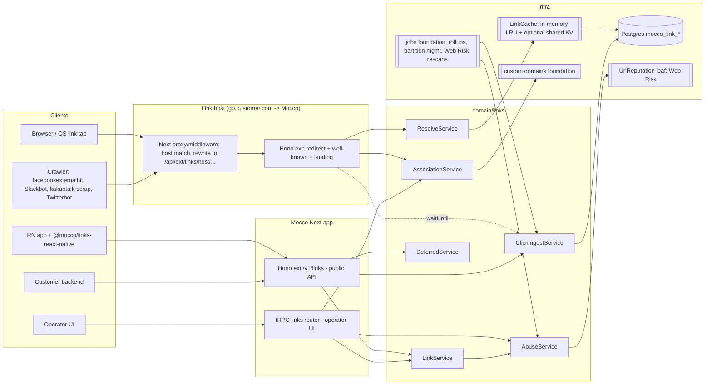

# Smart deep links — implementation design

## Goals / non-goals

**Goals**

1. One link (`https://go.customer.com/summer`) that opens the right screen in the installed app, falls back to
   the right store or web page, and still lands on that screen after install.
2. Links on the customer's own domain (or a Mocco default subdomain), with Mocco hosting
   `/.well-known/apple-app-site-association` and `/.well-known/assetlinks.json` generated from registered apps.
3. Deterministic deferred deep linking: Play Install Referrer on Android; landing page with clipboard handoff on
   iOS. No device fingerprinting by default.
4. Runtime link creation from apps (share buttons) through a public `/v1` API and the RN SDK.
5. OG previews for crawlers, QR codes, per-link and per-campaign analytics (clicks, platform split, first opens,
   re-opens).
6. Redirect path fast enough to be invisible: p95 server time under 50 ms on cache hit, never blocked by analytics
   writes; runs on Vercel and on self-hosted Node 22 + Postgres.
7. Abuse-safe by default: destinations restricted to verified domains and store URLs; kill switch.

**Non-goals (v1)**

- Paid-ad attribution, SKAdNetwork / AdAttributionKit, MMP postbacks, ad-network integrations.
- IP/UA probabilistic matching on iOS. (Android-only opt-in fallback is an open question, see end.)
- A/B destinations, smart banners, ESP click-tracking integrations, opening third-party apps.
- Native Swift/Kotlin/Flutter SDKs (documented REST contract instead).

## User flows

1. **Set up** — an operator registers apps in a project (iOS: team ID + bundle ID + App Store ID; Android: package
   name + SHA-256 signing fingerprints incl. Play App Signing key + Play URL), picks a link domain (default
   `<project>.mocco.link`-style subdomain or a custom `go.customer.com` via the custom-domains foundation), and
   verifies destination web domains (DNS TXT). Mocco generates association files; the UI shows a live checker
   (fetches both files from the public internet and validates JSON, content-type, no redirect).
2. **Create link (UI or API)** — slug (random 7-char base62 or custom), deep-link path (`/product/42?ref=x`),
   fallbacks (iOS: App Store or web; Android: Play or web; desktop: web), campaign/UTM fields, OG title/
   description/image, optional `minBuild` per platform, expiry. Response returns the short URL and QR.
3. **Click, app installed** — iOS/Android open the app directly through Universal Links / App Links (OS never
   hits our server for the navigation; the SDK reports the open with the URL, so we attribute it).
4. **Click, app not installed (or link opened where universal links do not fire)** — our redirect service
   answers: crawlers get OG HTML; Android gets a 302 to the Play Store with
   `referrer=mocco_click%3D<clickToken>`; iOS gets a lightweight landing page ("Get the app" copies a handoff
   token to the clipboard on tap, then goes to the App Store; secondary "Continue on web"); desktop gets 302 to web
   fallback. The click is recorded asynchronously.
5. **First launch after install** — the RN SDK calls `resolveDeferred()`: Android reads Install Referrer, iOS reads
   the pasteboard (only if the host app opts in; iOS shows the system paste prompt unless the app uses
   `UIPasteControl`), then POSTs the token to `/v1/links/deferred/resolve`, receives the link payload once, and
   the app navigates. First-open event is recorded.
6. **Old app build** — when the SDK reports an app build below the link's `minBuild`, the resolve response carries
   `action: "update_required"`; the SDK surfaces a callback so the app can show an update prompt (and store the
   link to replay after update).
7. **Abuse report** — anyone can report a link (`/report` page on the link domain); operators and Mocco staff can
   disable a link, a domain, or a whole project instantly.

## Architecture



- **Host routing.** Requests whose `Host` is a registered link domain are rewritten (Next 16 `proxy.ts` /
  middleware, host match only, no DB) to `/api/ext/links/host/:host/*`. Everything on a link host — `/:slug`,
  `/.well-known/*`, `/_m/landing/:slug`, `/_m/qr/:slug.svg`, `/_m/report` — is served by the Hono ext app. The
  operator app host (`SERVICE_DOMAIN`) never serves link slugs, so Universal Links on link hosts cannot collide
  with the app.
- **Why the ext surface, not tRPC:** public, unauthenticated, crawler- and OS-facing, latency-critical traffic
  (ADR 0011). Redirect/well-known are unversioned (URLs are the contract); the programmatic API is `/v1`.
- **Runtime.** Node runtime (Vercel Fluid compute) rather than the Edge runtime: the Postgres driver, shared
  domain services and self-host parity all need Node, and cache hits keep DB off the hot path. Revisit with an ADR
  if measured TTFB from Vercel regions is not good enough (option: a thin edge resolver reading a KV snapshot).
- **tRPC** (`transport/trpc/routers/links.ts`): operator CRUD for apps-in-links config, domains, links, analytics
  queries, abuse actions.
- **Hono `/v1`** (`transport/ext/links/v1.ts`): link create/get/list/disable, deferred resolve, events, stats —
  authenticated with project API keys (server secret key or a restricted publishable key for apps).
- **SDK packages:** `@mocco/links-react-native` (TS + a small native module for Install Referrer and pasteboard),
  `@mocco/links` (isomorphic TS client for the `/v1` API used by the RN SDK and Node backends).
- **Background jobs (scheduler foundation):** click rollups (every minute -> `mocco_link_stats_daily`), monthly
  click-partition creation and retention drops, deferred-handoff expiry sweep, Web Risk re-scan of active
  destinations, association-file live checker.

### Redirect decision (pure function, `domain/links/routing.ts`)

```
input: link, request { ua, headers, query }, context { apps }
1. link disabled/expired/project suspended  -> 410 page (no redirect)
2. crawler UA                               -> 200 OG HTML (no redirect, no click recorded as human)
3. classify platform: ios | android | desktop | other; detect in-app browser (KAKAOTALK, NAVER, Instagram, FBAN/FBAV, Line)
4. android: if in-app browser -> landing page with intent:// button; else 302 Play URL + referrer=mocco_click=<token>
            (or web fallback if configured / no Android app)
5. ios:     landing page (clipboard handoff + App Store + web); `?mocco_direct=1` or link.iosDirect -> 302 App Store
6. desktop: 302 web fallback (or landing page with QR if no web fallback)
destination params: merge link UTM + allowed passthrough params; never read a destination from the request
```

Notes on platform behaviour (from Apple/Google docs knowledge; verify on devices in slice 5):

- Universal Links open the app only on a user tap that navigates to a different domain; a same-domain navigation
  or a JS redirect does not. The iOS landing page therefore lives on the same link host but its "Open in app"
  button targets an alternate host (`open.<linkdomain>` also listed in AASA) — the Branch `app.link` /
  `app-alternate.link` pattern.
- Apple fetches AASA via its CDN, not directly from the device, so changes can take hours to propagate;
  `applinks:<host>?mode=developer` bypasses the CDN on development devices (unverified in this session — Apple
  docs page did not render; confirm before relying on it).
- AASA served at `/.well-known/apple-app-site-association`, `application/json`, HTTPS, no redirects. Android
  `assetlinks.json` same constraints; Android 15+ reads `dynamic_app_link_components` rules and refreshes about
  weekly [android configure-assetlinks].

## Domain model

All tables `mocco_` prefixed, uuid PKs (`defaultRandom()`), `created_at`/`updated_at` helpers, workspace-scoped.
`project_id` references the **project/app entity** foundation.

| Table | Columns (sketch) | Notes |
|---|---|---|
| `mocco_link_apps` | id, workspace_id, project_id, platform (`ios`/`android`), ios_team_id, ios_bundle_id, app_store_id, android_package, android_sha256[] (text[]), store_url, uri_scheme, min_supported_build, created_at, updated_at | Link-specific settings for an app in the project. If the project/app foundation already stores bundle IDs, this becomes a 1:1 extension table. uq `(project_id, platform, ios_bundle_id/android_package)` |
| `mocco_link_domains` | id, workspace_id, project_id, custom_domain_id (FK foundation), hostname (lowercase), kind (`default`/`custom`), alternate_hostname, status (`pending`/`active`/`disabled`), association_version int, created_at, updated_at | uq `mocco_link_domains_hostname_uq`; hot lookup by hostname |
| `mocco_link_destination_domains` | id, workspace_id, project_id, hostname, verification_token, verified_at, method (`dns_txt`/`well_known`) | Allowlist for web fallbacks; store hosts are built-in constants |
| `mocco_links` | id, workspace_id, project_id, domain_id, slug (case-sensitive), deep_link_path, ios_fallback, android_fallback, web_fallback, ios_behavior (`landing`/`direct`), params jsonb (UTM + custom key/values, size-capped), campaign, og jsonb (title, description, image_url), min_build jsonb ({ios, android}), created_via (`ui`/`api`/`sdk`), created_by (member or api key id), expires_at, disabled_at, disabled_reason, reputation (`unknown`/`clean`/`flagged`), created_at, updated_at | uq `mocco_links_domain_slug_uq (domain_id, slug)`; idx `(project_id, campaign)`, `(project_id, created_at desc)` |
| `mocco_link_clicks` | id (uuid), link_id, project_id, occurred_at, platform, os_version, browser, in_app_browser, is_bot, country, referrer_host, ip_hash (HMAC with daily rotating salt), ua_hash, outcome (`store`/`landing`/`web`/`og`/`blocked`) | **Range-partitioned by `occurred_at` (monthly)**; idx `(link_id, occurred_at)`; retention job drops old partitions. No raw IP stored |
| `mocco_link_handoffs` | id, click_id, link_id, project_id, token_hash (sha256), channel (`play_referrer`/`clipboard`), expires_at, consumed_at, consumed_install_id | Single-use deferred tokens; idx `token_hash` uq; expiry 7 days default |
| `mocco_link_events` | id, project_id, link_id nullable, click_id nullable, install_id (SDK-generated random uuid), type (`open`/`first_open`/`deferred_resolved`/`update_required`), platform, app_build, occurred_at | Also partitioned monthly |
| `mocco_link_stats_daily` | link_id, day, platform, clicks, human_clicks, first_opens, opens, deferred_resolved | Rollup; PK `(link_id, day, platform)`; serves dashboards |
| `mocco_link_abuse_reports` | id, link_id, reporter_email nullable, reason, created_at, handled_at, handled_by | |

**Key invariants**

- `(domain_id, slug)` unique; slugs in a reserved set (`_m`, `.well-known`, `api`, `robots.txt`, `favicon.ico`)
  are rejected.
- Every `*_fallback` URL is either a built-in store URL for a registered app or on a **verified** destination
  domain of the same project; enforced in `LinkService`, re-checked when a destination domain is un-verified
  (links flip to `disabled_reason = destination_unverified`).
- `deep_link_path` is a path + query only (no scheme/host); the app's own domain is implied. A custom-scheme URI
  fallback is derived from `uri_scheme`, never supplied per link.
- A handoff token is consumed at most once (`UPDATE ... WHERE consumed_at IS NULL RETURNING`).
- Association files are pure functions of `mocco_link_apps` + domain; `association_version` bumps on change and is
  recorded in the audit log.

## Backend modules

```
packages/backend/src/domain/links/
  LinkService.ts           create/update/disable, slug generation, destination validation, QR
  ResolveService.ts        host+slug -> ResolvedLink via LinkCache; builds redirect decisions (uses routing.ts)
  routing.ts               pure decision function (platform, crawler, in-app browser, minBuild)
  useragent.ts             UA classification (crawlers, in-app browsers, OS); leaf over a UA parser lib
  AssociationService.ts    builds AASA + assetlinks JSON; live checker
  DeferredService.ts       issue handoff tokens on click; resolve tokens from SDK; minBuild gating
  ClickIngestService.ts    buffered async click/event writes; rollups
  AbuseService.ts          reputation checks, reports, kill switches, rate limits
  DestinationDomainService.ts  DNS TXT verification
  cache.ts                 neutral LinkCache interface + in-process LRU impl
  qr.ts                    leaf over the QR library (SVG/PNG)
  reputation/webrisk.ts    leaf: Google Web Risk Lookup API implementing UrlReputation
  kv/vercel.ts | kv/redis.ts (later)  optional shared-cache leaves implementing LinkCacheBackend
  errors.ts                LinkNotFoundError, SlugTakenError, DestinationNotAllowedError, HandoffConsumedError...
  instance.ts              composition root
  repos/links.repo.ts, link-domains.repo.ts, link-apps.repo.ts, destination-domains.repo.ts,
        clicks.repo.ts, handoffs.repo.ts, events.repo.ts, stats-daily.repo.ts, abuse-reports.repo.ts
```

Neutral interfaces (types derived where possible):

```ts
export interface LinkCache {
  get(host: string, slug: string): Promise<ResolvedLink | null | undefined>; // undefined = miss, null = negative hit
  set(host: string, slug: string, value: ResolvedLink | null, ttlSeconds: number): Promise<void>;
  invalidate(host: string, slug: string): Promise<void>;
}
export interface UrlReputation {
  check(url: string): Promise<{ verdict: 'clean' | 'malicious' | 'unknown'; threats: readonly string[] }>;
}
export interface DnsResolver { txt(hostname: string): Promise<readonly string[]> } // node:dns leaf
export interface GeoLookup { country(headers: Headers, ip: string): string | null } // x-vercel-ip-country / cf-ipcountry / none
```

- Env names are ours: `LINKS_DEFAULT_DOMAIN`, `LINKS_URL_REPUTATION_KEY`, `LINKS_CLICK_SALT_SECRET`,
  `LINKS_KV_URL` (optional). Absent reputation key -> reputation checks degrade to `unknown` + stricter defaults
  (new projects' links show the landing page instead of a blind redirect).
- Error mapping: a `protectedLinksProcedure` middleware in the links router; the ext `/v1` app maps the same
  domain errors to HTTP (404/409/422/429) in one helper colocated with the links ext routes.

## Public API / SDK surface

**Link host (unversioned, public)**

| Method + path | Purpose |
|---|---|
| `GET /:slug` | Redirect / landing / OG (see routing) |
| `GET /.well-known/apple-app-site-association` | Generated AASA (`applinks.details[].appIDs`, `components`) + `webcredentials` optional |
| `GET /.well-known/assetlinks.json` | Generated Digital Asset Links incl. dynamic rules |
| `GET /_m/qr/:slug.svg` / `.png` | QR code |
| `GET /_m/report?slug=` / `POST` | Abuse report |
| `GET /robots.txt` | Allow OG crawlers, disallow indexing of slugs |

**`/api/ext/v1/links` (API key; `Authorization: Bearer mk_live_...`)**

| Method + path | Auth | Purpose |
|---|---|---|
| `POST /v1/links` | secret or publishable key | Create; publishable keys may set only `deepLinkPath`, `params`, `og`, `campaign` from a project-defined allowed set and cannot set fallbacks |
| `GET /v1/links/:id`, `GET /v1/links?campaign=` | secret | Read / list |
| `PATCH /v1/links/:id`, `POST /v1/links/:id/disable` | secret | Update / kill |
| `POST /v1/links/deferred/resolve` | publishable | `{ token?, referrer?, installId, platform, appBuild }` -> `{ link, action: 'navigate' | 'update_required' | 'none' }` |
| `POST /v1/links/events` | publishable | `{ installId, type, url?, clickId?, appBuild }` batch |
| `GET /v1/links/:id/stats?from&to` | secret | Rollup series |

**SDK sketch (`@mocco/links-react-native`)**

```ts
import { MoccoLinks } from '@mocco/links-react-native';

const links = MoccoLinks.configure({
  publishableKey: 'mk_pub_...',
  domains: ['go.customer.com'],
  ios: { readClipboardOnFirstLaunch: true }, // opt-in; shows iOS paste prompt unless using <PasteButton/>
});

const unsubscribe = links.onLink((event) => {
  // event: { url, path: '/product/42', params: { ref: 'x' }, source: 'universal' | 'deferred', linkId }
  navigation.navigate(...router.match(event.path));
});

const deferred = await links.resolveDeferred(); // first launch only; idempotent, cached in storage
// deferred: { status: 'resolved', event } | { status: 'update_required', event } | { status: 'none' }

const { url } = await links.createLink({
  deepLinkPath: '/invite/abc',
  og: { title: 'Join me on Acme' },
  campaign: 'referral',
});

// iOS 16+: a system paste control that reads the clipboard without the prompt
<links.PasteButton onResolved={(event) => ...} />
```

The Android native part uses `com.android.installreferrer:installreferrer` (called once, data valid 90 days
[install referrer]); the iOS native part reads `UIPasteboard` only when configured, and matches only strings with
the `mocco:` handoff prefix. `installId` is a random UUID stored in app storage — not a device identifier.

## External vendors and self-host story

| Concern | Vercel | Self-host | Neutral surface |
|---|---|---|---|
| Custom domain + TLS | Vercel Domains API (foundation) | Caddy on-demand TLS with an `ask` hook to Mocco, or bring-your-own proxy (foundation) | custom domains foundation |
| Link cache | in-process LRU per instance + optional Vercel runtime cache / KV leaf | in-process LRU (+ optional Redis leaf) | `LinkCache` |
| Geo | `x-vercel-ip-country` header | `cf-ipcountry` if behind Cloudflare, else none | `GeoLookup` |
| URL reputation | Google Web Risk Lookup (100K free lookups/month, then $0.50 per 1K [web risk]) | same, optional | `UrlReputation` |
| Click storage | Postgres partitions | Postgres partitions | repos; ClickHouse/Tinybird leaf only if scale demands (ADR) |
| QR / UA parsing | npm libs at leaf files | same | `qr.ts`, `useragent.ts` |

Self-hosters point `go.customer.com` at their own Mocco; links survive even if Mocco Cloud disappears — the FDL
lesson.

## Security and abuse

- **No open redirect:** destinations come only from stored links; the redirect never reads a URL from query
  params. No FDL-style "long links" with `?link=` in v1.
- **Destination allowlist:** web fallbacks must be on verified project domains; store fallbacks are generated from
  registered apps. Publishable (in-app) keys cannot set fallbacks at all, so a leaked app key cannot mint phishing
  links — only deep-link paths into the customer's own app.
- **Reputation:** Web Risk check on create/update and nightly re-scan of links clicked in the last 30 days;
  `malicious` -> auto-disable + notify (notifications foundation) + audit entry.
- **Default shared domain hardening:** links on the Mocco default domain from new/unpaid workspaces always show
  the landing page with the destination host visible (no silent redirect) until the workspace is verified.
- **Rate limits:** per API key and per project for create; per IP on `/v1/links/deferred/resolve` and `/events`;
  handoff tokens are 128-bit random, stored hashed, single-use, 7-day TTL.
- **Kill switches:** link, domain, project; cached negative results with short TTL so a kill propagates within
  the cache TTL (target 30 s) plus explicit invalidation.
- **Privacy:** no raw IP storage; `ip_hash` uses an HMAC with a daily-rotated salt (for bot/dedupe only, cannot be
  joined across days); no fingerprinting; iOS clipboard read only with host-app opt-in; documented data map for
  App Store privacy labels ("Usage data: product interaction, not linked to identity, not used for tracking").
  Apple's rule that apps "may not derive data from a device for the purpose of uniquely identifying it" [apple
  privacy] is why iOS probabilistic matching is excluded.
- **Governance tie-in:** association-file changes (AASA/assetlinks) and link-domain changes are written to the
  hash-chained audit log; optionally gated like a deploy, since a bad AASA breaks every Universal Link.
- **Content:** OG image URLs are fetched once and re-hosted (object storage foundation) to avoid hot-linking
  trackers and SSRF on the preview page; the fetcher blocks private IP ranges.

## Scale / performance notes

- Hot path: `Host` rewrite (no IO) -> `LinkCache.get` (in-process LRU, 60 s TTL, negative caching) -> decision ->
  response; the click write is deferred with `waitUntil` into a per-instance buffer flushed every N events or
  1 s via a multi-row insert. Redirect never awaits Postgres on a cache hit.
- Cold miss: one indexed query by `(hostname)` join `(domain_id, slug)`; the link-domain row is cached separately
  (hosts are few). Target p95 < 50 ms server time on hit, < 150 ms on miss (to be measured in slice 1).
- Redirect responses: `302` (not 301 — browsers cache 301 forever and destinations can change) with
  `Cache-Control: private, max-age=0`; well-known files `Cache-Control: public, max-age=3600` and ETag by
  `association_version`.
- Click volume: Postgres monthly partitions + minute rollups handle tens of millions of clicks/month on a modest
  instance; dashboards read only `mocco_link_stats_daily`. Beyond that, a `ClickSink` leaf to a columnar store
  (ClickHouse/Tinybird) behind the same interface — ADR when needed.
- Supabase transaction pooler: batching inserts keeps connection use low; each serverless instance holds one
  connection (see db-conventions advisory-lock notes).

## Dependencies on platform foundations

- **Project/app entity** — links belong to a project; app registrations (bundle IDs, package names).
- **Custom domains + TLS** — link hosts (`go.customer.com`) plus alternate host for the iOS "open in app" trick.
- **SDK packaging** and the public **`/v1` API** on the `ext/` surface — `@mocco/links`, `@mocco/links-react-native`,
  API keys (secret/publishable).
- **Scheduler / background jobs** — rollups, partitions, re-scans, handoff expiry, association checker.
- **Public rendering** — landing/OG/410/report pages are server-rendered HTML from the Hono ext app (tiny static
  templates, no React SSR needed); aligns with the public-rendering ADR but does not depend on the Pages Router.
- **Object storage** — re-hosted OG images, QR PNG cache.
- **Notifications** — abuse auto-disable, association-file breakage alerts.
- **Billing/metering** — tracked clicks and links per month as the metering unit.
- **Realtime** — not required (dashboards poll rollups).
- **End-user identity** — optional later: authenticated handoff (resolve the deferred link after login when the
  user clicked while signed in on web) — not in v1.
- **LLM surface** — not required.
- **Existing Mocco:** audit log (association changes), gates (optional), OTA/release data for `minBuild` (#99).

## Testing strategy (pglite)

- Pure unit tests: `routing.ts` decision table (platform x crawler x in-app browser x fallbacks x minBuild),
  `useragent.ts` against a fixture corpus of real UAs (iOS Safari, Chrome Android, KakaoTalk, Instagram, NAVER,
  facebookexternalhit, Slackbot, kakaotalk-scrap, Twitterbot, Discordbot, Googlebot), AASA/assetlinks builders
  against golden JSON.
- pglite integration: `LinkService` destination validation, slug uniqueness, disable flows; `DeferredService`
  single-use token consumption under concurrent resolves; click partition insert + rollup job; stats queries.
- Hono ext app tests (like existing `transport/ext/*.test.ts`): request with a link `Host` -> expected status,
  `Location`, content-type of well-known files, no redirect on well-known, 410 for disabled links, OG HTML for
  crawlers, API key auth and publishable-key restrictions on `/v1`.
- Injected fakes for `LinkCache`, `UrlReputation`, `DnsResolver`, `GeoLookup` via constructors (no `vi.mock`).
- SDK: TS unit tests of `@mocco/links` client; RN native modules verified in an example app (manual device
  matrix checklist: iOS Safari/Chrome/Kakao/Instagram, Android Chrome/Samsung Internet/Kakao) per release.

## Open questions / ADRs needed

1. **iOS promise:** is clipboard + landing page good enough? Measure handoff success in beta; decide whether to
   offer authenticated handoff (end-user identity) as the second deterministic channel.
2. **Android probabilistic fallback** (non-Play stores such as ONE store/Galaxy Store without referrer): offer an
   opt-in short-window IP match on Android only, or never? ADR.
3. **ADR: link redirect runtime** — Node (Fluid) vs Edge resolver with a KV snapshot; decide after measuring.
4. **ADR: click analytics store** — Postgres partitions now; threshold for a columnar `ClickSink`.
5. **Default link domain:** buy a dedicated domain (e.g. a short `mocco.link`-style name, unverified availability)
   separate from `mocco.club` so abuse on shared links cannot taint the product domain's reputation.
6. **Pricing unit:** tracked clicks vs links vs MAU; how links bundle with other Mocco products.
7. **Migration importer:** FDL is gone (data not retrievable after 2025-08-25), but Branch/AppsFlyer/Bitly CSV
   imports could be valuable — scope?
8. **KakaoTalk / NAVER in-app behaviour:** confirm which escape mechanisms work today on device before promising.
