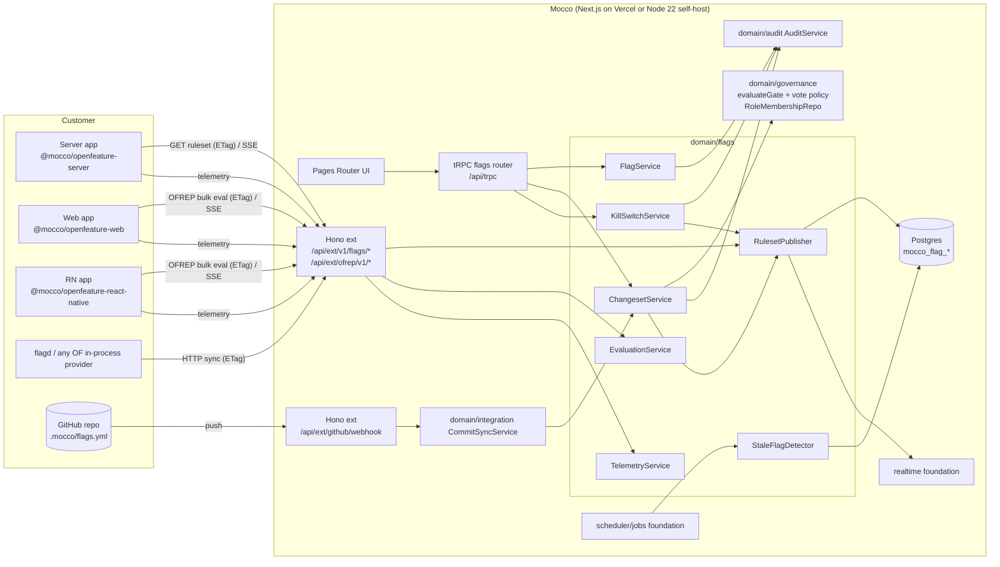

# Governed feature flags — implementation design

A production flag flip is a production change. Mocco hosts flag definitions, targeting and change governance. Customers code against the vendor-neutral OpenFeature API through open-source Mocco providers, or through any flagd/OFREP-compatible OpenFeature provider.

## 1. Goals / non-goals

**Goals**

- Boolean, string, number and JSON flags. Targeting rules on context attributes, per-target segments, and percentage rollout with deterministic bucketing on a stable key.
- **Local evaluation** for server SDKs from an ETag'd, versioned ruleset, with no network call per evaluation. **Bulk remote evaluation** for client SDKs (web, React Native) so targeting rules and segment member lists never reach browsers. Polling plus SSE streaming. Safe defaults offline.
- **Governed changes:** every change to a protected target is a changeset with a diff, gated by the existing gate policy (N-of-M across roles, distinct principals, `prevent_self`, `reason_required`), and lands in the audit chain with before/after.
- **Kill switch:** a one-way "serve the declared off variant" action that may bypass the gate, is always audited, and has a gated restore.
- **Flags-as-code** (second phase of v1): `.mocco/flags.yml` in the repo. A merge to the default branch produces a changeset that still passes the gate.
- **Stale-flag detection** from aggregated evaluation telemetry.
- **Interop:** the ruleset is flagd-compatible, Mocco serves OFREP endpoints, and Mocco-written SDKs are permissively licensed.

**Non-goals (v1)**

- Experimentation statistics, metric analysis, or exposure pipelines beyond aggregated counts.
- Scheduled changes and multi-step release pipelines. They can come later on the scheduler foundation.
- Hand-written SDKs outside JS/TS. Other languages use flagd in-process providers or OFREP.
- A public management REST API or Terraform provider (post-v1, on `/v1`).
- Per-evaluation network calls from server SDKs (remote evaluation is for clients only).

## 2. The environment question vs ADR 0003

ADR 0003 dropped environments as a **governance** axis: policy lives on gates, and "production" is not a type. Flags still need per-target state, because the same flag key must resolve to different rules in the staging app and the production app, and an SDK must be bound to exactly one ruleset.

Resolution (to record as a new ADR, "Flag targets are evaluation scopes, not governance types"):

- Introduce a **flag target**, stored as `mocco_flag_environments` and labelled "Environment" in the UI because that is the industry vocabulary SDK users expect. It is an **evaluation scope**: a named ruleset plus the SDK keys bound to it. It carries no built-in meaning. There is no `production` type and no ordering.
- **Governance stays on gates.** A target is *protected* iff it has a `change_gate` attached. `change_gate` reuses the gate item's shape verbatim: `{ resume: [{role, count}], prevent_self, reason_required }`. An unprotected target applies changes immediately (still audited). A protected target requires the gate. "prod needs 2" becomes "this target's change gate needs 2", which is the same mental model ADR 0003 set for pipelines.
- **Consistent with the reversal condition.** ADR 0003 allows env back as a label or view. Here the target is a data partition, not a governance type, and nothing branches on its name.
- **Pipeline linkage (optional, v1.5):** a target may declare `linked_pipeline` (repo + pipeline name) purely for correlation. The UI then shows "code for this flag's key first reached this pipeline's final step at run X". It never grants or bypasses anything.

## 3. Flags-as-code vs UI changesets

| Option | Pros | Cons |
|---|---|---|
| UI-only with approval changesets | Fast emergency edits, non-engineers can operate, straightforward | Definitions drift from code, and there is no code review context |
| Flags-as-code only (Flipt v2 style) | Diffable, reviewable, on-brand with `.mocco.yml` | Git review becomes the only control ("can merge = can release"), which contradicts ADR 0002. Emergencies are slow. Non-engineers are locked out |
| **Both, one changeset model (chosen)** | A single governance path. Source is only the origin of a changeset | Needs an ownership rule per flag to avoid dual writers |

Decision:

- **One primitive: the changeset.** It is target-scoped, carries an ordered list of ops, is pinned to a `base_version` and has a content hash. UI edits, repo syncs and (later) API calls all create changesets. A changeset is applied immediately on unprotected targets and gated on protected ones.
- **Per-flag ownership:** `managed_by: ui | repo`. Repo-managed flags are read-only in the UI for definition and rules. The **kill switch is an override layer**, not a definition change, so it stays available in the UI for repo-managed flags. A repo sync never un-kills.
- **The file is separate from `.mocco.yml`.** ADR 0010 keeps `.mocco.yml` a lean pipeline/gate core. Flags live in `.mocco/flags.yml`, which has its own zod schema in `@mocco/common` and a generated JSON Schema.
- **Git write is not release.** A push to the default branch goes through the existing `CommitSyncService` path. It parses `.mocco/flags.yml` and emits one changeset per affected target, with `source = repo` and `commit_sha` pinned. For `prevent_self`, the commit author and pusher (linked Mocco identities) count as proposers. GitHub review does **not** satisfy the gate (ADR 0002).

```yaml
# .mocco/flags.yml
version: 1
flags:
  checkout_v2:
    type: boolean
    description: New checkout flow
    lifecycle: temporary          # temporary | permanent (permanent is exempt from staleness)
    variants: { on: true, off: false }
    off_variant: off
    targets:
      staging:
        default: on
      production:
        default: off
        rules:
          - when: { attr: plan, op: in, values: [enterprise] }
            serve: on
          - rollout: { on: 10, off: 90 }   # percentage, bucketed on targetingKey
```

## 4. User flows

1. **Set up:** a workspace admin creates the flags product in a project and adds targets `staging` and `production`. On `production` they attach a change gate (`resume: [{role: release-manager, count: 1}]`, `prevent_self: true`, `reason_required: true`), then mint a server SDK key and a client SDK key per target.
2. **Integrate:** a developer installs `@mocco/openfeature-server` and calls `OpenFeature.setProviderAndWait(new MoccoServerProvider({ sdkKey }))`, then `client.getBooleanValue('checkout_v2', false, ctx)`. Web and RN work the same with the web/RN providers and `@openfeature/react-sdk` hooks.
3. **Change an unprotected target:** the developer edits rules in the UI and saves. A changeset is created and applied at once, a ruleset snapshot is published, and SDKs pick it up via SSE or the next poll. An audit entry `flag.changeset.applied` is written with the diff.
4. **Change a protected target:** the developer edits `production` rules. The UI shows the diff and asks for a reason, and a changeset in state `pending` is created. Approvers are notified (notifications foundation). An approver opens the diff, which shows the rendered rule diff, the changeset hash and the base version, and resumes. When the gate is satisfied the changeset is applied, provided `base_version` still equals the current version. If not, the changeset becomes `conflicted` and the proposer must rebase, which creates a new hash and resets votes.
5. **Kill:** during an incident, any member of the target's `kill_roles` presses Kill with an optional reason. The change is applied immediately without the gate, audited as `flag.killed`, and alerts are sent. **Restore** is a normal changeset (gated on protected targets).
6. **Flags-as-code:** a PR edits `.mocco/flags.yml` and is merged. Mocco creates changesets: `staging` is applied, and `production` is left pending approval with a link to the commit. The UI shows "from commit abc123 by @dev".
7. **Stale cleanup:** a weekly job flags `checkout_v2` as *stale: fully rolled out* (serving `on` to 100% in every target for 30 days) or as *stale: unused* (no evaluations for 30 days). The owner gets a notification with a "remove from code, then archive" checklist.

## 5. Architecture



- **tRPC (internal only):** the `flags` router for UI CRUD, changesets, votes, kill/restore, SDK keys, history and stale reports. It has a router-scoped error middleware for `domain/flags` errors.
- **Hono `ext/` public `/v1` (SDK traffic):** ruleset, stream, OFREP evaluate and telemetry (section 8). Auth is by SDK key, never by session.
- **Webhooks:** the existing `/api/ext/github/webhook` gains a flags-file handler through `CommitSyncService`. It is not versioned.
- **SDK packages (open source, Apache-2.0, separate from the AGPL server):** `@mocco/flags-core` (pure evaluator plus ruleset types, zero dependencies), `@mocco/openfeature-server`, `@mocco/openfeature-web`, `@mocco/openfeature-react-native`, and later `@mocco/flags-cli` (codegen, local validation).
- **Background jobs:** `flags.rollup-telemetry` (hourly), `flags.detect-stale` (daily), `flags.expire-changesets` (hourly). Pending changesets expire after 7 days by default, mirroring gate `expired`.

## 6. Domain model

All tables use the `mocco_` prefix, uuid PKs via `defaultRandom()`, and `workspace_id` for tenant scoping. `project_id` references the **project/app entity** foundation.

| Table | Columns (sketch) | Invariants / indexes |
|---|---|---|
| `mocco_flag_environments` | id, workspace_id, project_id, key (slug), name, change_gate jsonb null (`GateRequirements` shape), kill_roles text[] (role names), current_version bigint default 0, linked_pipeline jsonb null, created_at, updated_at | unique (project_id, key). Protected iff `change_gate IS NOT NULL`. Removing or weakening `change_gate` is itself gated by the *current* gate (monotonic, see section 10) |
| `mocco_flags` | id, workspace_id, project_id, key, type (`boolean`\|`string`\|`number`\|`json`), variants jsonb (`{name: value}`), description, owner_user_id null, lifecycle (`temporary`\|`permanent`), managed_by (`ui`\|`repo`), tags text[], archived_at null, created_at, updated_at | unique (project_id, key). Key pattern `^[a-z0-9][a-z0-9_.-]{0,127}$`. The CHECK on `type` and `lifecycle`; variant values must match `type` (zod, at the service) |
| `mocco_flag_configs` | id, workspace_id, flag_id, environment_id, enabled bool, killed bool, killed_at, killed_by_user_id, default_variant, off_variant, rules jsonb (ordered `Rule[]`), fallthrough jsonb (`{variant}` or `{rollout: {variant: weight}}`), salt text, version bigint, updated_at | unique (flag_id, environment_id). The **head state**. Written only by `RulesetPublisher` inside the apply transaction. `off_variant` must exist in `variants` |
| `mocco_flag_segments` | id, workspace_id, environment_id, key, name, rules jsonb (`Clause[]`, OR of ANDs), included_keys text[], excluded_keys text[], version bigint, updated_at | unique (environment_id, key). Environment-scoped so a segment edit is governed by that target's gate. Size limit of 10K keys (v1) |
| `mocco_flag_changesets` | id, workspace_id, environment_id, state (`draft`\|`pending`\|`applied`\|`rejected`\|`conflicted`\|`expired`\|`superseded`), source (`ui`\|`repo`\|`api`\|`kill`), ops jsonb (`ChangeOp[]`), diff jsonb (rendered before/after per entity), content_hash text (sha-256 of canonical ops + base_version + environment_id), base_version bigint, applied_version bigint null, proposed_by_user_id, commit_sha null, repo_id null, reason text null, requirements jsonb (the `change_gate` **pinned at proposal**), created_at, resolved_at | index (environment_id, state). A partial unique index keeps **at most one `pending` repo-sourced changeset per (environment, repo)**: a newer push supersedes the older one. Approval binds to `content_hash` (ADR 0010 "approvals bind to the pinned artifact") |
| `mocco_flag_changeset_votes` | id, workspace_id, changeset_id, user_id (RESTRICT), role_id (SET NULL), decision (`resume`\|`reject`), reason, content_hash, created_at | unique (changeset_id, user_id). `content_hash` must equal the changeset's hash at vote time |
| `mocco_flag_ruleset_snapshots` | id, workspace_id, environment_id, version bigint, etag text, server_body jsonb (flagd-compatible, full), changeset_id null, created_at | unique (environment_id, version). **Immutable / append-only.** The head is `environment.current_version`. Retain the last N=100 (a job prunes). Rollback = a new changeset whose ops restore snapshot K |
| `mocco_flag_sdk_keys` | id, workspace_id, environment_id, kind (`server`\|`client`), prefix (first 8 characters, displayable), key_hash (sha-256), created_by_user_id, created_at, last_used_at, revoked_at | unique (key_hash). Server keys can read the full ruleset. Client keys can only call OFREP evaluate |
| `mocco_flag_eval_rollups` | environment_id, flag_key, variant, bucket_hour timestamptz, count bigint, last_seen_at | PK (environment_id, flag_key, variant, bucket_hour). Upsert-add. Retention 90 days |
| `mocco_flag_stale_findings` | id, workspace_id, flag_id, kind (`unused`\|`fully_rolled_out`\|`never_evaluated`), detected_at, dismissed_until null, dismissed_by_user_id | unique (flag_id, kind). Rewritten by the job |

**Key invariants**

1. **The head state changes only by applying a changeset** (or a kill, which is itself a system changeset with `source = kill`). Every apply takes the per-environment advisory lock (`infra/db/advisory-locks.ts`), checks `base_version == current_version`, writes configs and segments, bumps `current_version`, compiles and inserts the snapshot, then commits. The audit append runs afterwards and is fail-open, like `GateService`.
2. **A gate's requirements are pinned at proposal.** Changing the target's gate later never re-evaluates in-flight changesets. This matches `run_gates.requirements` being pinned at trigger.
3. **Votes bind to `content_hash`.** A rebase produces a new changeset (and the old one becomes `superseded`), so votes never carry over.
4. **Kill is monotonic in the safe direction.** `killed = true` serves `off_variant`, whatever the rules and `enabled` say. Only a gated changeset can set `killed = false` or change `off_variant`.
5. **Distinct principals.** `evaluateGate` is reused unchanged, so one person fills at most one slot.

## 7. Backend modules

```
packages/backend/src/domain/flags/
  FlagService.ts            # flag + target + segment CRUD (produces changesets, never writes head state directly)
  ChangesetService.ts       # propose / vote / apply / reject / rebase / expire; uses governance vote policy + evaluateGate
  KillSwitchService.ts      # kill (bypass, audited) + restore (delegates to ChangesetService)
  RulesetPublisher.ts       # apply-in-transaction: head state -> compile -> snapshot -> notify realtime
  compile-ruleset.ts        # PURE: head state -> flagd-compatible JSON (+ Mocco metadata)
  diff-changeset.ts         # PURE: ops + base -> before/after diff + canonical content hash
  apply-ops.ts              # PURE: base head state + ops -> next head state (validates)
  EvaluationService.ts      # OFREP bulk/single evaluate (uses @mocco/flags-core), ETag per (version, context hash)
  SdkKeyService.ts          # mint / revoke / resolve (hash lookup, cached)
  TelemetryService.ts       # ingest aggregated counts -> rollups
  StaleFlagDetector.ts      # job: rollups + configs -> findings
  flags-file.ts             # PURE: parse .mocco/flags.yml (zod) -> desired state -> ops against head
  errors.ts                 # FlagNotFoundError, ChangesetConflictError, ChangesetNotPendingError, InvalidRulesetError, SdkKeyInvalidError ...
  repos/                    # one repo per table (ADR 0012): flag-environment.repo.ts, flag.repo.ts, flag-config.repo.ts,
                            # flag-segment.repo.ts, flag-changeset.repo.ts, flag-changeset-vote.repo.ts,
                            # flag-ruleset-snapshot.repo.ts, flag-sdk-key.repo.ts, flag-eval-rollup.repo.ts, flag-stale-finding.repo.ts
  instance.ts               # composition root
packages/backend/src/domain/governance/
  vote-policy.ts            # NEW (extracted from GateService): prevent_self, required-role membership,
                            # reason_required, duplicate-vote guard -> reused by GateService and ChangesetService
packages/backend/src/transport/trpc/routers/flags.ts
packages/backend/src/transport/ext/flags.ts     # Hono routes (ruleset, stream, ofrep, telemetry)
packages/common/src/flags.ts                    # zod: FlagType, Rule, Clause, ChangeOp, Changeset DTOs, ruleset schema, AuditActions additions
```

- **Reusing gates without faking runs.** `mocco_run_gates` is run-scoped (FK to runs and an item index), so changesets get their own vote table. They share the governance logic: `evaluateGate` (the pure N-of-M distinct-principal SSOT) is reused as-is, and a first refactor slice extracts GateService's vote guards into a pure `vote-policy.ts` that both services call. The OTA product (#99) will need the same "gate over a non-run subject", so this extraction pays off twice. A generic `mocco_approvals` table is deliberately deferred until a third consumer exists.
- **Audit:** add to `AuditActions`: `flag.created`, `flag.archived`, `flag.changeset.proposed`, `flag.changeset.applied`, `flag.changeset.rejected`, `flag.changeset.expired`, `flag.killed`, `flag.restored`, `flag.environment.gate_changed`, `flag.sdk_key.created`, `flag.sdk_key.revoked`. The payload carries `{environmentKey, flagKeys, contentHash, baseVersion, appliedVersion, diff, source, commitSha?, principals[]}`. The diff is included so the hash chain covers the before/after itself.
- **Vendor leaves / neutral interfaces:**
  - Realtime fan-out goes behind the **realtime** foundation's neutral `RealtimePublisher.publish(channel, event)`. The Postgres LISTEN/NOTIFY leaf serves self-host, and a hosted pub/sub leaf serves Vercel. Flags publishes `flags:{environmentId}` with `{version, etag}` only (no payload).
  - Jobs are registered with the **scheduler/jobs** foundation. There is no direct cron vendor import.
  - Notifications (approval requested, killed, stale) go through the **notifications** foundation.
  - YAML parsing reuses the existing leaf `domain/pipeline/yaml/decode.ts` (or moves it to a shared `infra` leaf).
  - MurmurHash3 x86_32 is implemented in `@mocco/flags-core` (about 40 lines, test vectors from SMHasher), so there is no dependency.

## 8. Public API / SDK surface

### 8.1 Ruleset format (served to server SDKs and flagd)

It is a flagd flag-definition document, so flagd in-process providers can consume it unchanged, plus a Mocco `metadata` block. The compiler emits only a **restricted JsonLogic subset** (`if`, `and`, `or`, `!`, `==`, `!=`, `<`, `<=`, `>`, `>=`, `in`, `var`, `cat`, `starts_with`, `ends_with`, `sem_ver`, `fractional`), and `@mocco/flags-core` implements exactly that subset.

```json
{
  "$schema": "https://flagd.dev/schema/v0/flags.json",
  "metadata": { "mocco": { "environment": "production", "version": 42, "generatedAt": "2026-09-24T10:00:00Z" } },
  "flags": {
    "checkout_v2": {
      "state": "ENABLED",
      "variants": { "on": true, "off": false },
      "defaultVariant": "off",
      "metadata": { "mocco.offVariant": "off", "mocco.killed": false, "mocco.lifecycle": "temporary" },
      "targeting": {
        "if": [
          { "in": [ { "var": "plan" }, ["enterprise"] ] }, "on",
          { "fractional": [ { "cat": ["s1f9", { "var": "targetingKey" }] }, ["on", 10], ["off", 90] ] }
        ]
      }
    }
  }
}
```

- **Deterministic bucketing:** MurmurHash3 x86_32 (seed 0) over `salt + targetingKey`, normalized per the flagd fractional spec to [0,100) with relative weights. The per-flag `salt` (random, stored on the config) lets an operator "re-randomize" through a changeset. Keeping salt stable across percentage increases means users at 10% stay in at 20% (monotonic ramp: variants are ordered and the `on` bucket range only grows). A missing `targetingKey` resolves to `defaultVariant` with reason `TARGETING_KEY_MISSING` (unverified: exact flagd error code naming). Conformance is tested against the flagd testbed gherkin suite plus golden vectors.
- **Segments** are inlined at compile time as `in` / clause expressions. The server ruleset may include segment key lists, so it is **server-key-only**.
- **Kill:** when `killed` is set, the compiler emits `"state": "ENABLED", "defaultVariant": <off>, "targeting": {}`, so even a stale flagd client that ignores Mocco metadata serves the off variant. `enabled = false` is emitted as flagd `state: DISABLED`, which makes the SDK return the caller's default. Customers are told to prefer Kill, because Kill serves a server-declared value.

### 8.2 Endpoints (Hono, `/api/ext/v1/...`, SDK-key auth `Authorization: Bearer mk_srv_...` / `mk_cli_...`)

| Method + path | Key | Purpose | Caching |
|---|---|---|---|
| `GET /api/ext/v1/flags/ruleset` | server | Full flagd-compatible ruleset for the key's target | `ETag: "<env>-<version>"`, `If-None-Match` returns 304. `Cache-Control: private, no-cache` (auth-bound). The version lookup is served from an in-process LRU (TTL 1 s) of `(key_hash -> env, current_version)` so 304s cost at most one indexed read |
| `GET /api/ext/v1/flags/stream` | server/client | SSE: `event: ruleset` with `data: {version, etag}`, plus heartbeats every 25 s | Not cached. Connections are closed at 240 s on Vercel (SDKs reconnect with `Last-Event-ID`, backoff and jitter). Unlimited on self-host |
| `POST /api/ext/ofrep/v1/evaluate/flags` | client (or server) | OFREP bulk evaluation for a context. Body `{context}`, response `{flags: [{key, value, reason, variant, metadata}]}` | `ETag` = hash(version, canonical context), and `If-None-Match` returns 304 (OFREP semantics). The web provider caches by context |
| `POST /api/ext/ofrep/v1/evaluate/flags/{key}` | client/server | OFREP single evaluation | as above |
| `POST /api/ext/v1/flags/telemetry` | server/client | Aggregated counts `[{flag, variant, count, windowStart}]`, flushed at most every 60 s | Rate limited per key |

- **Edge caching note:** the ruleset is tenant-secret, so it is not CDN-shared by default. Cheap 304s plus streaming carry the load. v1.5 option: a **signed, content-addressed snapshot URL** (`GET /api/ext/v1/flags/snapshots/{env}/{version}?sig=...`, `Cache-Control: public, max-age=31536000, immutable`). The ruleset response returns a `Location` to it, which lets Vercel's CDN or a self-host CDN absorb the body bytes (see open question 4).
- **Offline/safe defaults:** server providers persist the last good ruleset in memory. An optional `bootstrap` (JSON file) allows cold start. On fetch failure they keep serving the stale ruleset indefinitely and emit a `PROVIDER_STALE` event. Web and RN providers persist the last bulk evaluation in `localStorage` or `AsyncStorage` (cache-first, per OFREP's local persistence ADR), otherwise the caller's code default applies.

### 8.3 SDK sketch (TS)

```ts
// @mocco/openfeature-server — local evaluation
import { OpenFeature } from '@openfeature/server-sdk';
import { MoccoServerProvider } from '@mocco/openfeature-server';

await OpenFeature.setProviderAndWait(
  new MoccoServerProvider({
    sdkKey: process.env.MOCCO_FLAGS_SERVER_KEY!,  // customer's own env name
    baseUrl: 'https://mocco.club',                // self-host: your origin
    updates: 'stream',                            // 'stream' | { poll: 30_000 }
    bootstrap: undefined,                         // optional ruleset JSON for cold start
    telemetry: true,
  }),
);
const flags = OpenFeature.getClient();
const on = await flags.getBooleanValue('checkout_v2', false, { targetingKey: user.id, plan: user.plan });

// @mocco/openfeature-web — OFREP bulk remote evaluation, cache-first
import { OpenFeature } from '@openfeature/web-sdk';
import { MoccoWebProvider } from '@mocco/openfeature-web';
await OpenFeature.setContext({ targetingKey: user.id, plan: user.plan });
OpenFeature.setProvider(new MoccoWebProvider({ clientKey: 'mk_cli_...', updates: 'stream' }));
// React: useBooleanFlagValue('checkout_v2', false) from @openfeature/react-sdk

// @mocco/openfeature-react-native — same as web + AsyncStorage persistence + AppState-aware reconnect
import { MoccoReactNativeProvider } from '@mocco/openfeature-react-native';

// @mocco/flags-core — shared pure evaluator (also used by the backend for UI preview)
export function evaluate(ruleset: Ruleset, flagKey: string, context: EvaluationContext): Resolution;
```

- The Vercel Flags SDK is supported through its OpenFeature adapter, so no dedicated package is needed in v1. A docs page covers it.
- Other languages: document using flagd's in-process providers with `HTTP sync` pointed at `/api/ext/v1/flags/ruleset` and a bearer header (flagd 0.16 custom sync headers), or any OFREP provider.

### 8.4 Internal tRPC (`flags` router) — for the UI only

`environments.list/create/update/setChangeGate`, `flags.list/get/create/archive`, `changesets.propose/get/list/vote/rebase/withdraw`, `kill`, `restore`, `sdkKeys.list/create/revoke`, `history.list(flagId)`, `preview.evaluate({environmentId, flagKey, context})`, `stale.list/dismiss`.

## 9. External vendors and self-host story

- **No flag vendor.** Mocco is the flag vendor. SDK dependencies are `@openfeature/server-sdk`, `@openfeature/web-sdk` and `@openfeature/react-sdk`, which are CNCF, Apache-2.0 and imported only in the provider packages.
- **Self-host:** the whole server is in the AGPL Next app on Node 22 + Postgres. Streaming works unbounded on Node, and realtime uses Postgres LISTEN/NOTIFY. Customers can alternatively run flagd next to their services, syncing from Mocco. That cuts Mocco's request load to one poll per flagd instance, and flagd serves OFREP locally.
- **Vercel:** SSE is bounded by function duration, and SDKs reconnect transparently. The realtime foundation provides cross-instance fan-out, since LISTEN/NOTIFY does not span serverless invocations.
- **Licensing:** SDK packages must be Apache-2.0/MIT so customers can embed them without AGPL obligations. This needs an ADR, since the repo is AGPL today.

## 10. Security and abuse

- **SDK keys** are random 32-byte keys shown once and stored as sha-256 hashes. They are scoped to exactly one target, and the `kind` separates server from client. Client keys are public by nature: they can only evaluate, never read the ruleset. Rotation is mint-new then revoke-old. `last_used_at` is sampled.
- **No rule leakage to clients:** OFREP responses contain only the resolved value, variant, reason and whitelisted flag metadata. Segment lists and rules never leave the server. A per-flag `client_visible: boolean` (default false) limits which flags a client key can evaluate, which prevents enumeration of internal flags.
- **Context abuse:** OFREP request bodies are capped at 8 KB and 64 attributes. Client-key requests are rate limited per key and IP (at the edge on Vercel, in-process token bucket on self-host).
- **Governance bypass surface:**
  - `kill` accepts no payload except the flag key and reason. It can only move to the declared `off_variant`.
  - `off_variant` changes, `killed=false` (restore), `change_gate` removal or weakening, `kill_roles` changes, and SDK key creation on protected targets are all gated changes.
  - Changing a target's gate requires the *current* gate (monotonic hardening: adding requirements is gated as well, but can never remove protection without approval).
  - Archiving or deleting a flag that is non-default in any protected target requires that target's gate.
  - Workspace owners do not implicitly bypass. There is no "skip change requests" permission, unlike Unleash.
- **Repo-sourced changesets:** accepted only from the default branch of a connected repo via the verified webhook. `commit_sha` is pinned. The author and pusher are treated as proposers for `prevent_self`.
- **Audit is fail-open, like the rest of Mocco.** The head-state change is durable first, and the audit chain records it after. The `verify` path detects tampering.
- **Telemetry spoofing** can only affect stale detection (advisory). It never drives a governance decision.

## 11. Scale and performance

- The evaluation hot path runs inside the customer process, with zero Mocco calls per evaluation. `flags-core` evaluation is O(rules) with precompiled closures. The target is under 5 microseconds per evaluation for a 20-rule flag (unverified: to benchmark).
- Ruleset polling is the dominant server load: N instances times one request per 30 s, almost all 304s. Streaming reduces it to one refetch per change. At 10K SDK instances that is about 330 req/s of 304s, which is cheap with the in-process key/version cache.
- Ruleset size guard: 5 MB compiled per target (Vercel Flags uses a 10 MB pack), with warnings at 1 MB. Segment key lists are capped at 10K per segment in v1, and larger lists are deferred to server-side "big segments".
- OFREP bulk evaluation for clients is one request per context change and app start, then streaming nudges followed by a conditional re-POST. That is the MAU-shaped cost. Evaluation results are cached per (version, context hash) in an in-process LRU.
- Telemetry: SDKs pre-aggregate (at most one POST per 60 s per instance), and the server upserts hourly rollups in batches.
- Apply is serialized per target by an advisory lock, which is fine because changes are human-rate.

## 12. Dependencies on platform foundations

- **Project/app entity:** flags, targets and SDK keys are project-scoped. This is a hard blocker for slice 2.
- **SDK packaging:** the publishing pipeline for `@mocco/*` public packages (build, provenance, versioning, separate license). It is shared with OTA (#99) and deep links (#102).
- **Public `/v1` API on `ext/`:** SDK-key auth middleware, rate limiting and the versioning policy.
- **Realtime:** SSE fan-out behind a neutral publisher (Postgres NOTIFY leaf for self-host, hosted pub/sub leaf for Vercel).
- **Scheduler / background jobs:** telemetry rollup, stale detection, changeset expiry, snapshot pruning.
- **Notifications:** approval requested, changeset applied/rejected, kill alerts, stale digests.
- **Billing / metering:** meter OFREP evaluate requests (client MAU proxy) and ruleset fetches (like Datadog's MFCR). Governance is not metered.
- **Not needed:** end-user identity (flags use the customer's own `targetingKey`), LLM surface, public rendering, custom domains, object storage (unless signed snapshots go there, v1.5).

## 13. Testing strategy (pglite)

- **Pure units:** `compile-ruleset`, `apply-ops`, `diff-changeset` (canonical hash stability), `flags-file` parsing, `vote-policy` (after extraction, GateService tests must stay green unchanged), and `flags-core` evaluator + MurmurHash3 golden vectors. Add bucketing distribution tests (100K keys within ±1% of the weights) and monotonic-ramp tests (every key in at 10% is still in at 20%).
- **Conformance:** run `flags-core` against the flagd testbed gherkin scenarios for the supported operator subset, and cross-check the compiled rulesets by evaluating them with `@openfeature/flagd-core` in tests only (dev dependency).
- **pglite integration:** ChangesetService end-to-end over real migrations:
  - unprotected apply
  - protected pending, then N-of-M resume, then apply
  - `prevent_self` on the proposer and on the repo commit author
  - reject
  - conflict on stale `base_version`
  - rebase supersedes and resets votes
  - vote with a mismatched hash is rejected
  - the pinned gate ignores later gate edits
  - kill bypasses the gate, restore is gated
  - audit entries written and `verify()` intact
  - concurrent applies on one target serialize (advisory lock)
- **Transport:** Hono ext tests call `app.request()` against pglite:
  - ETag/304
  - key kind enforcement (a client key gets 403 on the ruleset)
  - OFREP response shape validated against the OFREP OpenAPI
  - `client_visible` filtering
  - SSE emits on apply
  - telemetry rate limit
- **SDK packages:** vitest with a mocked `fetch`, covering the provider lifecycle (READY, STALE, ERROR events), cache-first persistence and reconnect backoff. React Native runs in the RN test app only in CI later.
- **No `vi.mock` of the DB.** Services are constructor-injected (ADR 0008 conventions).

## 14. Open questions / ADRs needed

1. **ADR: "Flag targets are evaluation scopes, not governance types".** This reconciles with ADR 0003 (section 2), including whether the UI may say "Environment".
2. **ADR: OpenFeature-first SDKs with a flagd-compatible ruleset and OFREP.** It covers the restricted JsonLogic subset, pinning to a flagd schema version, and what happens when flagd's fractional algorithm changes (the mid-2026 update mentions a bucketing overhaul, unverified details). Mocco should pin its own `bucketing: mocco-v1` in metadata and keep compatibility tests.
3. **ADR: SDK licensing** (Apache-2.0 SDKs in an AGPL repo, or a separate `mocco-sdks` repo).
4. **CDN strategy:** signed immutable snapshot URLs vs private-only 304s. Decide once metering data exists.
5. **Generic approvals primitive:** keep per-product vote tables (flags, OTA) or introduce `mocco_approvals` with a polymorphic subject after #99 lands.
6. **Flags-as-code conflict policy:** can a flag switch `managed_by` from repo to ui (and back) without a gated changeset? Proposal: the switch is itself a gated op on every protected target.
7. **Exposure events (v1 vs later):** v1 ships aggregated counts only. Per-user exposure for experimentation is deferred, possibly as an OpenFeature tracking hook to the customer's analytics.
8. **Deploy-aware guardrails:** block or warn when enabling a flag whose key is not present in the commit most recently deployed via the linked pipeline. This requires a code-reference scan at deploy time (v1.5).
9. **Should a repo PR get a pre-merge "flags plan" check** (like `terraform plan`) posted via the GitHub App, showing which targets will need approval?
