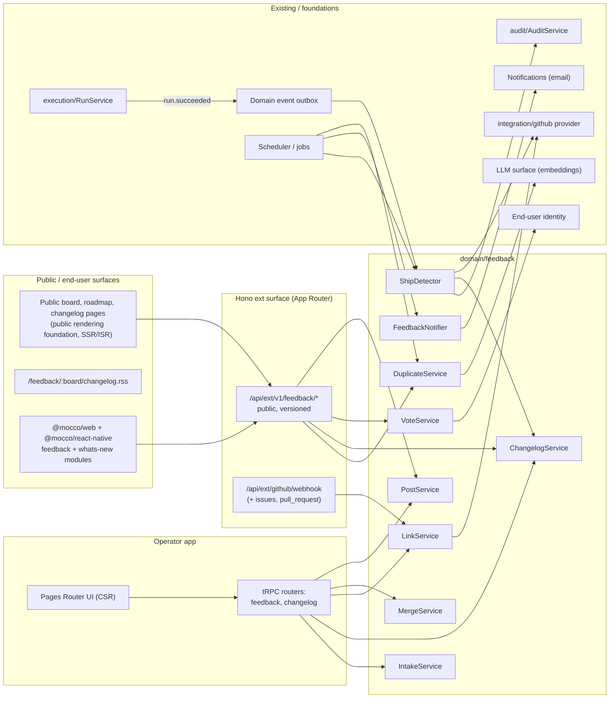

# Feedback board, roadmap, and changelog — implementation design

GitHub issue: fi-workers/mocco#98 (epic #104).

## 1. Goals / non-goals

**Goals (v1)**
- A public board per project. End users submit posts, vote, and comment. Staff set status, write official responses, and merge duplicates, with votes carried over.
- Statuses are an `as const` set: `under_review → planned → in_progress → shipped`, plus `closed`.
- A public roadmap (kanban of planned / in_progress / shipped, filterable by category) and a public changelog with RSS.
- Link posts to GitHub issues and PRs through the **existing GitHub App** (`domain/integration/github/provider.ts`).
- **Deploy-verified loop closing.** When a linked PR's merge commit is contained in the commit of a successful Mocco run that counts as a release, create a *Shipped* suggestion and a draft changelog entry. Once staff accept (or on opt-in auto-apply), email every voter and subscriber.
- LLM duplicate detection at submit time, plus staff merge suggestions, with a non-LLM fallback.
- Intake: "convert to feedback" from reviews (#94), messenger conversations (#95), and forum threads (#97).
- A "what's new" widget for web and React Native, built on the messenger SDK shell.

**Non-goals (v1)**
- Prioritization scoring (RICE), revenue-weighted votes, CRM sync.
- Private or segmented boards, per-account visibility.
- Jira and Linear sync. Third-party intake (Intercom, Zendesk, G2).
- Surveys (NPS/CSAT).
- Reintroducing environments. ADR 0003 stands, and "release" is a per-board designation over pipeline steps (section 5.3).

## 2. User flows

1. **End user submits.** They open the board (public page or widget) and type a title. Debounced `similar` search shows up to five candidates ("Similar posts exist, vote on one instead?"). If they submit anyway, identity is resolved (signed token from the host app, or email magic link), the post is created as `under_review`, the author gets an auto-vote, and an async embedding job runs.
2. **Voting.** A vote is one row per (post, end user). Identified users vote instantly. Email-only users get a verification link, and the vote counts only after they confirm (`pending → counted`).
3. **Staff triage (operator UI, tRPC).** Staff filter the inbox (under_review, newest, most voted, possible duplicates). They set status or category, post an official response (a comment flagged `official`), or merge A into B. Merging moves votes with dedupe by end user, moves subscribers, marks A `merged_into = B`, and redirects A's public URL to B.
4. **Link GitHub.** From a post, staff pick an issue or PR in a connected repo (search through the App). The link is stored. Issue and PR webhooks keep link state current (open, closed, merged, and the `merge_commit_sha`). An issue link resolves to its closing PRs.
5. **Deploy closes the loop.** A run succeeds and the `run.succeeded` domain event fires. `ShipDetector` finds the boards whose release policy matches this run's repo and step. For each linked PR that is merged and not yet shipped, it asks `CommitAncestry.contains(repo, mergeSha, run.commitSha)`. When a post's links are all shipped (or any, depending on policy), it creates a `ship_suggestion(post, run)` and a draft changelog entry grouping every post that shipped in this run. Staff see a banner: "3 posts shipped in run #412 (approved by sre). Mark Shipped and notify 184 voters?"
6. **Accept.** The status becomes `shipped`, a status change is recorded (actor = user, or `system` when auto-applied), the changelog draft is published or edited, and the notification fan-out job emails voters and subscribers.
7. **What's new.** The widget calls `GET /v1/feedback/changelog` and shows an unread badge from a `lastSeenAt` cursor kept per end user (or in local storage when anonymous).
8. **Intake.** From a messenger conversation, review cluster, or forum thread, staff click "Convert to feedback". This pre-fills a post, shows duplicate candidates, and on create records a `post_source` for provenance. The original requester becomes a voter when their end-user identity is known.

## 3. Architecture



- **tRPC (internal only):** `feedback` router (boards, categories, posts admin, merge, links, suggestions, settings) and `changelog` router (drafts, publish). Both use `protectedFeedbackProcedure = protectedProcedure` plus `assertMember` workspace middleware plus feedback error mapping.
- **Hono ext `/v1` (public):** `transport/ext/routes/feedback-v1.ts` under `/api/ext/v1/feedback`. It serves the widget, SDKs, public pages, and third parties, and authenticates with a **publishable project key** plus an optional **end-user token**.
- **GitHub webhook:** the existing `/api/ext/github/webhook` gains `issues` and `pull_request` event kinds in `GithubWebhookEvents` and `webhook-events.ts`, dispatched in the same deferred `waitUntil` pass to `LinkService.applyProviderEvent`.
- **Public pages:** rendered through the *public rendering* foundation (ADR pending), because they must be crawlable. The operator UI stays CSR.
- **Background jobs** (scheduler/jobs foundation): `feedback.embedPost`, `feedback.detectShips` (event consumer plus a reconciler sweep), `feedback.notifyStatusChange` (batched fan-out), and `feedback.linkBackfill` (refresh link state after a missed webhook).
- **SDK packages:** `@mocco/web` and `@mocco/react-native` (SDK packaging foundation) expose `feedback` and `whatsNew` modules over the messenger shell. Their types come from `@mocco/common/feedback` zod schemas.

## 4. Domain model

All tables use the `mocco_` prefix, a `uuid().primaryKey().defaultRandom()` PK, and `workspace_id` for direct tenant scoping. Names follow db-conventions.

### Constants (`@mocco/common/feedback`)

```ts
export const FeedbackPostStatuses = {
  underReview: 'under_review',
  planned: 'planned',
  inProgress: 'in_progress',
  shipped: 'shipped',
  closed: 'closed',
} as const;
export type FeedbackPostStatus = (typeof FeedbackPostStatuses)[keyof typeof FeedbackPostStatuses];

export const RoadmapColumns = [FeedbackPostStatuses.planned, FeedbackPostStatuses.inProgress, FeedbackPostStatuses.shipped] as const;

export const FeedbackVoteStates = { pending: 'pending', counted: 'counted' } as const;
export const FeedbackLinkKinds = { issue: 'issue', pullRequest: 'pull_request' } as const;
export const FeedbackLinkStates = { open: 'open', closed: 'closed', merged: 'merged' } as const;
export const ShipSuggestionStates = { pending: 'pending', accepted: 'accepted', dismissed: 'dismissed', autoApplied: 'auto_applied' } as const;
export const ShipPolicies = { anyLinkShipped: 'any_link_shipped', allLinksShipped: 'all_links_shipped' } as const;
export const ShipModes = { suggest: 'suggest', autoApply: 'auto_apply' } as const;
export const FeedbackSourceTypes = { review: 'review', conversation: 'conversation', forumThread: 'forum_thread', api: 'api' } as const;
export const ChangelogEntryStates = { draft: 'draft', scheduled: 'scheduled', published: 'published' } as const;
export const DuplicateCandidateStates = { open: 'open', merged: 'merged', dismissed: 'dismissed' } as const;
```

Each table `check` constraint lists the same values. Only the `as const` object is the source of truth; the check SQL is written once next to the table.

### Tables

| Table | Columns (sketch) | Notes |
|---|---|---|
| `mocco_feedback_boards` | id, workspace_id, project_id (FK project/app), slug, name, is_public, allow_anonymous_email bool, ship_mode (`suggest`), ship_policy (`all_links_shipped`), release_repo_id (FK `mocco_repos`, null), release_step_name text null, created_at, updated_at | uq `(workspace_id, slug)`. Multiple boards per project allowed (answers the issue's open question), with one default. |
| `mocco_feedback_categories` | id, workspace_id, board_id, name, slug, position | uq `(board_id, slug)` |
| `mocco_feedback_posts` | id, workspace_id, board_id, category_id null, number int (per-board display id), title, body, status, author_end_user_id, merged_into_post_id null (self FK), vote_count int (denormalized), comment_count int, shipped_at null, shipped_run_id null (FK `mocco_runs`, SET NULL), search tsvector (generated), created_at, updated_at | uq `(board_id, number)`. idx `(board_id, status, vote_count desc)`, idx `(board_id, created_at desc)`, GIN on `search`. |
| `mocco_feedback_votes` | id, workspace_id, post_id, end_user_id, state (`pending`/`counted`), source (`web`/`widget`/`intake`/`merge`), created_at | uq `(post_id, end_user_id)`. `vote_count` counts only `counted`. |
| `mocco_feedback_comments` | id, workspace_id, post_id, author_end_user_id null, author_user_id null (staff), body, is_official bool, is_internal bool, created_at, updated_at | check that exactly one author is set. |
| `mocco_feedback_subscriptions` | id, workspace_id, post_id, end_user_id, unsubscribed_at null | uq `(post_id, end_user_id)`. Voters auto-subscribe. |
| `mocco_feedback_status_changes` | id, workspace_id, post_id, from_status, to_status, actor_user_id null, reason (`manual`/`ship_suggestion`/`auto_apply`/`merge`), ship_suggestion_id null, created_at | append-only history |
| `mocco_feedback_links` | id, workspace_id, post_id, repo_id (FK `mocco_repos`), kind, external_number int, external_node_id, title, url, state, merge_commit_sha null, merged_at null, shipped_run_id null, shipped_at null, created_by_user_id, created_at, updated_at | uq `(post_id, repo_id, kind, external_number)`. idx `(repo_id, kind, external_number)` for webhook fan-in. idx `(repo_id) where state='merged' and shipped_run_id is null` for the detector. |
| `mocco_feedback_link_closers` | id, workspace_id, issue_link_id, repo_id, pr_number, merge_commit_sha null, state | PRs that close a linked issue (`closingIssuesReferences`). Treated as derived PR links. |
| `mocco_feedback_ship_suggestions` | id, workspace_id, post_id, run_id, commit_sha, state, changelog_entry_id null, decided_by_user_id null, decided_at null, created_at | uq `(post_id, run_id)` for idempotency. |
| `mocco_changelog_entries` | id, workspace_id, board_id, slug, title, body_md, state, published_at null, source_run_id null, created_by_user_id null, created_at, updated_at | uq `(board_id, slug)`. idx `(board_id, state, published_at desc)`. |
| `mocco_changelog_entry_posts` | changelog_entry_id, post_id, workspace_id | composite PK |
| `mocco_changelog_entry_tags` | changelog_entry_id, tag, workspace_id | composite PK. Tags: `new`, `improved`, `fixed` (as const). |
| `mocco_feedback_post_embeddings` | post_id (PK/FK), workspace_id, model text, dims int, embedding vector(dims), content_hash, created_at | pgvector HNSW index when available (section 7) |
| `mocco_feedback_duplicate_candidates` | id, workspace_id, board_id, post_id, candidate_post_id, score real, method (`embedding`/`fulltext`), state, created_at | uq `(post_id, candidate_post_id)` |
| `mocco_feedback_post_sources` | id, workspace_id, post_id, source_type, source_id text, excerpt, created_by_user_id, created_at | uq `(source_type, source_id, post_id)` |
| `mocco_feedback_changelog_reads` | workspace_id, board_id, end_user_id, last_seen_at | PK `(board_id, end_user_id)` for the widget badge |

### Key invariants
- **Merge:** `merged_into_post_id` must point to a non-merged post on the same board (no chains; merging into a target re-parents that target's children). Votes move with `INSERT ... ON CONFLICT (post_id, end_user_id) DO NOTHING`, and then `vote_count` is recomputed. This runs in one repo transaction guarded by `pg_advisory_xact_lock(AdvisoryLockNamespaces.feedbackPost, hashtext(target_id))`.
- **`vote_count`** equals the count of `counted` votes. It is updated in the same transaction as the vote write, and a reconciler job repairs drift.
- **Status transitions:** any status to any status is allowed for staff (boards are informal), but `shipped` via suggestion requires the suggestion to be `pending`. Every change writes a `status_changes` row. Leaving `shipped` clears `shipped_at` and `shipped_run_id`.
- **Idempotent shipping:** a (post, run) pair yields at most one suggestion, and a link records only its first `shipped_run_id`.
- **Tenant scoping:** a link's `repo_id` must belong to the board's workspace (composite FK `(repo_id, workspace_id)` on `mocco_repos`, the same pattern as the connection FK).

## 5. Backend modules

`packages/backend/src/domain/feedback/`:

| File | Responsibility |
|---|---|
| `constants.ts` | re-exports none. Imports the constants from `@mocco/common/feedback` (single source). Holds only backend-only sets (link-state mapping). |
| `errors.ts` | `FeedbackBoardNotFoundError extends NotFoundError`, `PostNotFoundError`, `PostAlreadyMergedError extends ConflictError`, `InvalidMergeTargetError extends ValidationError`, `VoteRateLimitedError`, `LinkRepoNotInWorkspaceError`. |
| `BoardService.ts` | board and category CRUD, release policy settings |
| `PostService.ts` | create (with auto-vote and embedding enqueue), update, set status, official response, list or filter (public vs staff projections) |
| `VoteService.ts` | vote and unvote, email-pending confirmation, rate limits |
| `MergeService.ts` | merge A into B |
| `LinkService.ts` | link and unlink issue/PR, `applyProviderEvent` (issues and pull_request webhooks), closer resolution |
| `ShipDetector.ts` | consumes `run.succeeded`, runs the containment check, creates suggestions and drafts |
| `ShipSuggestionService.ts` | accept, dismiss, auto-apply |
| `ChangelogService.ts` | drafts, publish, schedule, RSS model, widget feed |
| `DuplicateService.ts` | `similar(query)`, candidate generation after embedding |
| `IntakeService.ts` | `convert(sourceType, sourceId, draft)` through source ports |
| `FeedbackNotifier.ts` | builds status-change and shipped emails and enqueues them to Notifications |
| `ports.ts` | the neutral interfaces below |
| `instance.ts` | composition root |
| `repos/*.repo.ts` | one per table (ADR 0012): `board.repo.ts`, `post.repo.ts`, `vote.repo.ts`, `comment.repo.ts`, `link.repo.ts`, `ship-suggestion.repo.ts`, `changelog-entry.repo.ts`, `post-embedding.repo.ts`, and so on |

### 5.1 Neutral ports (`domain/feedback/ports.ts`)

```ts
/** Implemented by domain/integration/github/provider.ts (the only @octokit importer). */
export interface CommitAncestry {
  /** true when `ancestorSha` is reachable from `headSha` (compare status 'ahead' | 'identical'). */
  contains(repo: RepoRef, ancestorSha: string, headSha: string): Promise<boolean>;
}
export interface IssueTracker {
  search(repo: RepoRef, query: string, kind: FeedbackLinkKind): Promise<TrackerItem[]>;
  get(repo: RepoRef, kind: FeedbackLinkKind, number: number): Promise<TrackerItem>;
  closingPullRequests(repo: RepoRef, issueNumber: number): Promise<TrackerPullRequest[]>;
}
/** LLM surface foundation. Vendor leaf lives in the platform `llm/` domain. */
export interface Embedder { embed(texts: string[]): Promise<{ model: string; dims: number; vectors: number[][] }>; }
/** Implemented by reviews / messenger / forum domains, so feedback never reads their tables. */
export interface FeedbackSourceReader { read(sourceType: FeedbackSourceType, sourceId: string, workspaceId: string): Promise<SourceSnapshot>; }
```

`CommitAncestry` and `IssueTracker` extend the existing integration adapter (`github/provider.ts`), which already owns octokit, throttling, and installation tokens. Nothing in `feedback/` imports octokit. The GitHub App needs two new **read-only** permissions, *Issues: read* and *Pull requests: read*, plus subscriptions to the `issues` and `pull_request` events. Installed orgs have to accept the permission change (the existing `new_permissions_accepted` action already exists in `GithubInstallationActions`).

### 5.2 Domain events (dependency on a foundation)

No event bus exists today. `RunService.finishRun` writes `run.succeeded` into `mocco_run_events` (global `bigserial seq`) and records audit. We propose a small **domain event foundation**, not polling of feature tables:

- `domain/events/DomainEvents.ts` is a typed in-process publisher (`publish(event)`, `subscribe(type, handler)`). `RunService` publishes `RunSucceeded { workspaceId, runId, commitId, commitSha, repoId, stepNames }` after the run row commits, and handlers run in `waitUntil`, as the webhook does.
- Durability comes from an outbox cursor over the existing append-only `mocco_run_events`. A `mocco_event_cursors (consumer text PK, last_seq bigint)` table lets `feedback.detectShips` catch up on any `run.succeeded` whose in-process handler was lost (lambda killed). Delivery is at-least-once, and the `(post_id, run_id)` unique constraint makes it effectively once.
- Feedback subscribes to the event name. It never imports `execution` repos.

### 5.3 What counts as "deployed to production"

ADR 0003 removed environments, so "production" has to be configured. The v1 rule is per board:
- `release_repo_id` is the repo whose runs count.
- `release_step_name` (optional) is a run counts only if this named step `succeeded`. When it is null, any `succeeded` run on the repo's watched branch counts.

This keeps the core env-free: a step name is a label, as ADR 0003 says. An ADR is needed if we later want a `.mocco.yml` `release: true` step marker instead.

### 5.4 Containment algorithm (ShipDetector)

1. Load pending links for `release_repo_id`: PR links with `state = merged`, `shipped_run_id is null`, and closers of issue links.
2. **Fast path:** if `merge_commit_sha` equals the run's commit SHA, it is contained. Otherwise, if the merge SHA exists in `mocco_commits` for the repo and branch with `seq <= run commit seq`, it is a likely candidate. Always confirm with `CommitAncestry.contains`, because force-pushes break `seq` ordering.
3. Batch the checks: at most N (default 50) compare calls per run event. Cache `(repo, ancestor, head) → bool` for the duration of the job.
4. Mark each contained link with `shipped_run_id`. Evaluate the post against `ship_policy`. Create the suggestion. Group every newly shipped post for this run into one changelog draft (`source_run_id`), whose body is pre-filled from post titles and PR titles, optionally polished by the LLM surface.
5. Record audit `feedback.shipped_suggested` (new `AuditActions` key) with the run and gate provenance. Accepting records `feedback.shipped`.
6. With `ship_mode = auto_apply`, accept immediately with `reason = auto_apply`.

### 5.5 Duplicate detection

- **On submit** (`similar`, synchronous and fast): embed the query title (cached, 300 ms budget), then run a kNN over the board's embeddings (`embedding <=> $q`, top 5, cosine above 0.80). On timeout, or when no LLM is configured, fall back to `ts_rank` over `search` plus `pg_trgm` similarity on the title.
- **After create** (job): embed the title and body, store the vector, and upsert `duplicate_candidates` above the threshold for the staff queue. Staff choose merge or dismiss.
- **Model change:** `model` and `dims` live on each row, and a re-embed job runs when the configured model changes. The HNSW index is per dims, so v1 pins one model per deployment.

## 6. Public API / SDK surface

Base: `/api/ext/v1/feedback`, served by Hono. The service projects explicitly, because no `.output()` exists on ext.

Auth works in two layers. `x-mocco-key: pk_...` is a publishable project key that identifies the project and board and is safe to ship in client apps. An optional `Authorization: Bearer <endUserToken>` is either a JWT the customer's backend signs with the project's secret (HS256, with `sub`, `email`, `name`, `exp` of 1 hour or less), or a session from the end-user identity foundation.

| Method | Path | Notes |
|---|---|---|
| GET | `/boards/:slug` | board meta, categories |
| GET | `/boards/:slug/posts?status=&category=&sort=top\|new\|trending&cursor=` | public projection; merged posts excluded |
| GET | `/posts/:id` | includes official responses and public links (issue/PR number, state only) |
| POST | `/boards/:slug/posts` | `{ title, body, categoryId? }`, requires identity |
| GET | `/boards/:slug/similar?q=` | duplicate search, rate-limited |
| POST / DELETE | `/posts/:id/vote` | idempotent |
| POST | `/posts/:id/comments` | |
| POST / DELETE | `/posts/:id/subscription` | |
| GET | `/boards/:slug/roadmap` | grouped by `RoadmapColumns` |
| GET | `/boards/:slug/changelog?cursor=` | published entries |
| GET | `/boards/:slug/changelog/unread` | `{ count, lastSeenAt }` |
| POST | `/boards/:slug/changelog/seen` | |
| POST | `/identify/email` | starts a magic-link verification |
| GET | `/unsubscribe/:token` | signed, one-click (List-Unsubscribe) |

RSS lives at `/feedback/:board/changelog.rss` on the public rendering host, with caching headers. Webhooks out (`post.created`, `post.status_changed`, `post.shipped`, `changelog.published`) are deferred to v1.1.

```ts
// @mocco/web (and @mocco/react-native: same API over the messenger shell)
import { Mocco } from '@mocco/web';

const mocco = Mocco.init({ publishableKey: 'pk_live_...' });
await mocco.identify({ token: await fetchSignedUserToken() }); // or mocco.identifyEmail('a@b.com')

const board = mocco.feedback.board('feature-requests');
const similar = await board.similar('dark mode');
const post = await board.createPost({ title: 'Dark mode', body: '...' });
await board.vote(post.id);
const roadmap = await board.roadmap(); // { planned: Post[], in_progress: Post[], shipped: Post[] }

mocco.whatsNew.mount('#whats-new-button', { board: 'feature-requests', placement: 'popover' });
const { count } = await mocco.whatsNew.unreadCount();
mocco.whatsNew.on('open', () => { /* analytics */ });
```

The React Native module exposes `<WhatsNewBadge />` and `useWhatsNew()` hooks and a `FeedbackSheet` from the messenger shell.

## 7. External vendors and self-host story

| Need | Neutral surface | Default vendor (cloud) | Self-host |
|---|---|---|---|
| Embeddings | LLM surface `Embedder` | provider configured via our env (`LLM_PROVIDER`, `LLM_API_KEY`, `EMBEDDING_MODEL`) | optional. Without a key, the full-text + `pg_trgm` fallback is used and the product is fully functional. Ollama-compatible endpoint supported through the same surface (unverified which foundation adapters land first). |
| Vector search | `post-embedding.repo.ts` | Postgres `pgvector` (Supabase has it) | requires `CREATE EXTENSION vector`. When absent, a migration guard falls back to storing `real[]` and brute-force cosine in SQL, which is fine for small boards. pglite ships a `vector` extension for tests. |
| Email | Notifications foundation | transactional email provider behind `notifications/` | SMTP (`SMTP_URL`) |
| Bot protection | `HumanCheck` port | a captcha vendor leaf (`FEEDBACK_CAPTCHA_SECRET`) | optional, off by default |
| GitHub | existing integration adapter | GitHub App | self-host users register their own App (already documented for governance) |
| Public pages and custom domains | public rendering + custom domains foundations | Vercel ISR | Node 22 `next start`, the same pages |

Every env name is ours. No vendor name appears outside leaf files.

## 8. Security and abuse

- **Vote stuffing:** a vote requires identity (a signed token or a verified email). The unique `(post_id, end_user_id)` constraint holds. Rate limits apply per IP hash and per end user (for example 30 votes/hour and 5 posts/hour) through a neutral rate limiter (Postgres token bucket, `mocco_rate_limits`, so it works without Redis). Pending email votes expire after 7 days.
- **Signed identify:** HS256 with the per-project secret, `exp` of 1 hour or less, clock skew of 60 s or less, and `sub` bound to the project. The secret is never returned after creation (hash plus prefix only, like the run callback token).
- **Spam/moderation:** posts from new identities can require approval (a board setting). An optional LLM moderation flag is only a hint, never an auto-delete.
- **XSS:** bodies are stored as markdown and rendered with a sanitizing renderer (no raw HTML). Changelog markdown is staff-only but still sanitized.
- **Tenant isolation:** every staff procedure calls `assertMember` (cross-tenant tests on every procedure). Public endpoints resolve the workspace only from the publishable key, never from input. Private link details (issue title, PR author) are not exposed publicly; only number and state are, and even those can be hidden (a board setting) for private repos.
- **Information leak via links:** linking requires the staff member to have the repo registered in the workspace (composite FK). Public pages show a PR number only when the repo is public, or when the board opts in.
- **Email:** one-click unsubscribe, a per-post and global opt-out, and a bounce/complaint webhook handled by the notifications foundation. Fan-out is batched and idempotent (`notification_key = post_id:status_change_id:end_user_id`).
- **Audit:** status changes to `shipped`, merges, and ship-mode changes are recorded through `AuditService.record` (fail-open, as today).

## 9. Scale / performance notes

- Board listing reads the denormalized `vote_count` and `(board_id, status, vote_count desc)` index, and public pages are ISR-cached with tag revalidation on post change. Typical boards are 10^2–10^4 posts. The largest public boards (Canny-scale) reach around 10^5 posts, which pgvector HNSW handles comfortably.
- Embedding cost is one call per post create and one per `similar` query (debounced 400 ms client-side, cached by normalized query for 10 minutes).
- The detector is bounded by the number of *pending merged* links per repo (small, partial index), not by commits. Compare calls are capped per event, and the reconciler handles the rest.
- Notification fan-out of 10^4 voters for a hot post runs in the jobs foundation in chunks of 500 and respects provider rate limits.
- Webhook fan-in for `pull_request` events is an indexed lookup `(repo_id, kind, external_number)`. Unlinked PRs are dropped cheaply.

## 10. Dependencies on platform foundations

| Foundation | Used for |
|---|---|
| **Project/app entity** | a board belongs to a project, and the publishable key is per project |
| **End-user identity** | voters, authors, subscribers (`end_user_id`). v1 needs only its lightweight layer: email-verified plus signed-token identify |
| **LLM surface** | embeddings, optional changelog polishing and moderation hints |
| **Scheduler / jobs** | embed, detect-ships reconciler, notify fan-out, link backfill, scheduled changelog publish |
| **Public rendering** | crawlable board, roadmap, and changelog pages plus RSS |
| **Custom domains** | `feedback.customer.com` |
| **Object storage** | changelog images (v1.1, optional) |
| **SDK packaging** | `@mocco/web`, `@mocco/react-native` modules, and the public `/v1` convention |
| **Notifications** | voter and subscriber email, and Slack for staff ("3 posts shipped") |
| **Realtime** | optional live vote counts. v1 does not need it (polling on staff inbox) |
| **Billing/metering** | per-project flat plan. Meter posts and notification emails for fair-use only |
| **Domain events** (new, proposed here) | `run.succeeded` subscription plus a durable cursor (section 5.2) |

## 11. Testing strategy (pglite)

- **Repo and service integration tests** on pglite with the real migrations: post create with auto-vote, vote uniqueness, pending-to-counted vote, `vote_count` consistency, merge (vote dedupe across overlapping voters, subscriber move, redirect, chain re-parenting), and status history.
- **ShipDetector:** construct `RunService` and `ShipDetector` over pglite with a fake `CommitAncestry` (a constructor-injected class implementing the port, not a `vi.mock`). Cases: merge SHA equals head, ancestor, not contained, force-push (seq lies but ancestry says no), `all_links_shipped` vs `any`, duplicate event delivery giving one suggestion, `release_step_name` filtering, and the reconciler catching a missed event through the cursor.
- **LinkService:** feed recorded `issues` and `pull_request` webhook fixtures through the existing webhook test harness. Check tenancy resolution (installation, connection, repo) and that unknown PRs are parked.
- **Duplicate search:** the pglite `vector` extension for the kNN path, plus a test with the extension disabled for the fallback path, and a deterministic fake `Embedder`.
- **Ext `/v1`:** Hono app `request()` tests for key auth, signed-token verification (expired, wrong project), rate limit, public projection (no internal comments, no private link titles), and one-click unsubscribe.
- **Cross-tenant tests** on every tRPC procedure (a non-member gets `NOT_FOUND`).
- **Frontend:** component tests for the roadmap and widget, and an agent-browser smoke test of the public board.

## 12. Open questions / ADRs needed

1. **ADR: Domain events and outbox.** Is it an in-process publisher plus cursor over `mocco_run_events`, or a generic `mocco_domain_events` outbox? This is shared with #94, #101, and #103.
2. **ADR: release designation without environments.** Board-level `release_repo_id` + `release_step_name` (proposed), or a `.mocco.yml` step marker. This touches ADR 0003 and ADR 0010.
3. **Auto-apply default.** Proposed: suggest by default and allow auto-apply per board. Should auto-apply still hold notifications for N minutes to allow an undo?
4. **Rollback semantics.** If a later run deploys a commit that does *not* contain the merge (a revert or rollback), should we flag "shipped, then rolled back"? v1 only detects forward. Proposal: v1.1 detects reverts by checking containment on subsequent release runs.
5. **pgvector requirement for self-host.** Can we guarantee the extension, or keep the `real[]` fallback permanently?
6. **Public rendering ADR** (shared with help center, forum, status page): ISR on Vercel vs SSR on self-host, and how the Pages Router CSR rule is relaxed for public routes.
7. **Monorepo PRs.** When the linked PR is in repo A but the release run is for repo B (for example a mobile app bundle), do we allow a mapping of multiple repos to a board? v1 supports one release repo per board.
8. **Identity merge.** When an email-only voter later signs in via a signed token with the same email, merge the end users. This is owned by the identity foundation.
