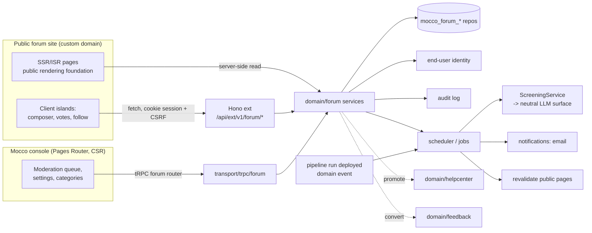

# Community forum — implementation design

Tracks GitHub issue #97 (epic #104). Research: [forum competitors](../research/forum-competitors.md).

## Goals / non-goals

**Goals (v1)**

- A public forum per project: categories, threads (Markdown), tags, replies, votes, accepted answer, staff badges, pinned/locked threads.
- Anonymous read, signed-in write, using the end-user identity foundation. Every post has a verified author.
- Moderation: report/flag, hide, delete (soft), ban, first-post approval queue, LLM spam/toxicity pre-screen that flags and never auto-deletes. Every moderation action is written to the audit log.
- Email notifications (reply to my thread, reply in a followed thread, mention, accepted answer) with one-click unsubscribe.
- Postgres full-text search, sharing the help-center search approach (including Korean).
- Crawlable public pages with structured data, sitemap, custom domain.
- Cross-links: promote to help-center article (#96), convert to feedback post (#98), link to GitHub issue/PR with a "fixed in production" signal from Mocco runs.

**Non-goals (v1)**

- Reputation, trust levels, badges, gamification.
- Private/gated categories, groups, DMs, chat.
- Plugin/theme system (brand logo + accent color only).
- Auto-translation of posts, AI-written answers on the page, federation, native apps, importers.
- Embeddable forum widget inside customer apps (the messenger SDK may surface search results later).

## Build vs embed

Options evaluated:

| Option | What it means | Cost / risk | Reaches cross-links? |
|---|---|---|---|
| A. Resell hosted Discourse per project | Provision a Discourse community per Mocco project, SSO via DiscourseConnect | DiscourseConnect needs Business ($500/mo per community); no multi-tenant reseller plan; one vendor account per customer; theming/SSO glue per instance | Only via webhooks + REST; release context and shared identity are bolted on |
| B. Bundle self-hosted Discourse | Ship a Discourse container next to Mocco | Adds Ruby, Redis, Sidekiq (4 GB RAM recommended); does not run on Vercel; breaks the "Node 22 + Postgres" self-host story; GPLv2 upgrade/ops burden; still one instance per community | Same as A |
| C. Build a small forum on Mocco's stack | New `forum` domain on existing Postgres + Next + Hono ext | Engineering time; feature pressure toward Discourse parity | Native: same DB, same identity, same audit log, same deploy events |
| D. "Connect your existing Discourse" | Customer keeps Discourse; Mocco acts as the IdP (DiscourseConnect provider) and consumes webhooks for cross-links | Small integration; only for customers who already run Discourse | Partial: promote/convert via webhook + API |

Decision proposal: **C for v1, D as an optional later integration.** Rationale: the forum's value to Mocco is the cross-links (identity shared with messenger/feedback, promote to article, convert to feedback, fixed-in-production), and those require the forum's rows to be in our database and its writes to go through our services. The Discourse embed only renders comments and sends users to Discourse to reply, so even the UI cannot be embedded usefully. Revisit (ADR) if customers ask for trust levels, plugins, chat, or groups, the areas where Discourse is years ahead.

Guardrails that keep C small: no plugin system, no trust levels, no realtime in v1 (poll or refresh), one Markdown renderer shared with the help center, reuse notifications/identity/LLM/public-rendering foundations instead of forum-specific versions.

## User flows

1. **Staff sets up the forum.** Operator enables the Forum product on a project, sets the site (Mocco subdomain `forum-<project>.mocco.club` or custom domain `community.example.com`), brand logo/color, creates categories (with type `discussion` or `qa`), toggles "approve first posts".
2. **Anonymous visitor reads.** Lands from search on a server-rendered thread page; sees accepted answer pinned under the question, votes, related help-center articles, "fixed in production" banner if linked.
3. **End user signs in and asks.** Sign-in via end-user identity (email magic link, OAuth, or the customer app's signed JWT). While typing a title the composer shows similar threads and matching help-center articles. On submit the post passes cheap heuristics and rate limits, then:
   - new author and "approve first posts" on -> state `pending`, visible only to author + staff;
   - otherwise -> `published` immediately, LLM screening runs async; a `spam`/`toxic` verdict above threshold creates a moderation item and (for `spam` with high confidence) hides the post pending review. Never deletes.
4. **Others reply and vote.** One vote per end user per post (toggle). Thread author or staff marks an accepted answer (QA categories only); author gets notified, thread shows "Solved".
5. **Notifications.** Followers get an email per reply (debounced into one mail per thread per 15 minutes); mentions notify the mentioned user; each email has a one-click unsubscribe for that thread and a global forum unsubscribe.
6. **Moderation.** Users report posts (reason). Staff open the queue in the Mocco console (tRPC), approve/reject pending posts, hide/unhide, soft-delete, lock/pin, move category, ban (with expiry). Each action is audit-logged with actor, target, reason.
7. **Promote to article.** Staff clicks "Promote to article" on a solved thread: help center creates a draft article (title, question + accepted answer as Markdown, attribution, source link); the thread shows "This answer is now in the docs" once the article is published.
8. **Convert to feedback.** Staff clicks "Convert to feedback post" on a feature-request thread: feedback board creates a post (author = thread author, followers imported as subscribers, a vote from the author), thread gets a system reply linking to it and is optionally locked.
9. **Fixed in production.** Staff links a thread to a GitHub issue/PR. When a Mocco run deploys the fixing merge commit to production, the thread gets a system reply "Fixed in production on <date> (run <id>)" (suggested by default, auto-posted if the project opts in), and followers are notified.

## Architecture



- **Public pages** (thread list, thread, tag, search, user profile) render through the public rendering foundation (SSR/ISR route in the Next app, per the ADR that foundation owns). They call domain services server-side, not HTTP. Pages are cached and revalidated on write via a `forum.page.revalidate` job keyed by path/tag.
- **Public writes and client reads** (post, reply, vote, follow, report, accept, search-as-you-type, similar threads) go to **Hono `ext` `/api/ext/v1/forum/...`**. It is end-user/public traffic, so never tRPC. The same versioned endpoints back the future headless SDK. Auth is the end-user session cookie (host-only, on the forum domain) or a bearer token from the SDK.
- **Operator console** (settings, categories, moderation queue, cross-link actions, analytics) is tRPC `forum` router under `protectedProcedure` with workspace role checks, with a router-scoped error middleware.
- **Background jobs** (scheduler/jobs foundation): `forum.post.screen`, `forum.notify.fanout`, `forum.notify.digest` (debounced), `forum.page.revalidate`, `forum.search.reindex` (backfill only; normal indexing is a generated column), `forum.deploy.fixed` (consumer of the pipeline "deployed to production" event).
- **SDK packages:** v1 only exposes REST. Later, `@mocco/forum-sdk` (or a `forum` namespace inside the shared web SDK) for search + "ask the community" deep links from the messenger.

## Domain model

All tables carry `workspace_id` and `project_id` (FK to the project/app entity), uuid PK `defaultRandom()`, `created_at`/`updated_at`. Every repo query is scoped by `(workspace_id, project_id)`.

**`mocco_forum_sites`** — one per project that enabled the forum.
- `id`, `workspace_id`, `project_id` (unique), `status` (`Active`/`Disabled`), `title`, `description`, `logo_asset_id` (object storage), `accent_color`, `approve_first_posts` bool, `llm_screening_enabled` bool, `fixed_in_prod_mode` (`Suggest`/`Auto`/`Off`), `default_locale`.
- Index: `mocco_forum_sites_project_uq`.
- Hostnames live in the custom-domains foundation, not here.

**`mocco_forum_categories`**
- `id`, `site_id`, `slug`, `name`, `description`, `kind` (`Discussion`/`Qa`/`Announcement` — announcement allows staff-only threads), `position` int, `archived_at`.
- Unique `(site_id, slug)`.

**`mocco_forum_threads`**
- `id`, `site_id`, `category_id`, `slug` (derived from title, not unique; URL is `/t/<slug>/<short_id>`), `short_id` (base58 of a sequence per site, unique `(site_id, short_id)`), `title`, `author_id` (end user), `state` (`Pending`/`Published`/`Hidden`/`Deleted`), `pinned_at`, `locked_at`, `accepted_post_id` nullable, `reply_count`, `vote_count` (of opening post), `view_count` (approximate, batched), `last_activity_at`, `last_post_id`, `search_vector` tsvector (generated: `setweight(to_tsvector('simple', title),'A') || ...` updated by trigger from the opening post body), `github_ref` nullable (`owner/repo#123`), `fixed_in_run_id` nullable.
- Indexes: `(site_id, category_id, state, pinned_at desc nulls last, last_activity_at desc, id)` for listing with keyset pagination; GIN on `search_vector`; GIN trigram on `title` (`pg_trgm`) for Korean/partial matches and similar-thread lookup; `(site_id, author_id)`.

**`mocco_forum_posts`** — opening post and replies in one table.
- `id`, `site_id`, `thread_id`, `author_id` (end user) nullable for `System` posts, `kind` (`Opening`/`Reply`/`System`), `body_markdown`, `body_html` (sanitized render cache), `state` (`Pending`/`Published`/`Hidden`/`Deleted`), `hidden_reason`, `vote_count`, `is_staff` (snapshot of author staff status at write time), `reply_to_post_id` nullable (flat thread with quote context, no nesting), `content_hash` (for duplicate detection), `edited_at`, `search_vector` tsvector.
- Indexes: `(thread_id, created_at, id)`; `(site_id, author_id, created_at)`; GIN `search_vector`; partial `(site_id, state) where state = 'Pending'` for the queue.

**`mocco_forum_post_revisions`** — edit history. `id`, `post_id`, `editor_id` (end user or operator), `editor_kind`, `body_markdown`, `created_at`. Moderators can see prior revisions (spam edited in after approval is a known attack).

**`mocco_forum_votes`**
- `post_id`, `end_user_id`, `value` smallint (1 only in v1; column allows downvotes later), `created_at`. PK or unique `(post_id, end_user_id)` -> `mocco_forum_votes_post_user_uq`.

**`mocco_forum_tags`** and **`mocco_forum_thread_tags`** — `(site_id, slug)` unique; join table unique `(thread_id, tag_id)`. Tags are staff-created in v1 (users choose from the list) to avoid tag spam.

**`mocco_forum_follows`** — `thread_id`, `end_user_id`, `level` (`Watching`/`Muted`), `unsubscribe_token_hash`. Unique `(thread_id, end_user_id)`. Authors and repliers auto-follow.

**`mocco_forum_members`** — per-site end-user state: `site_id`, `end_user_id`, `display_name` override, `first_approved_at` nullable (null = still a "new user" for the approval queue), `banned_until` nullable, `ban_reason`, `post_count`, `staff_role` nullable (`Staff`/`Moderator`, set when an operator links their end-user profile). Unique `(site_id, end_user_id)`.

**`mocco_forum_reports`** — user flags. `id`, `site_id`, `post_id`, `reporter_id`, `reason` (`Spam`/`Abuse`/`OffTopic`/`Other`), `note`, `resolved_at`, `resolution`. Unique open report per `(post_id, reporter_id)`.

**`mocco_forum_moderation_items`** — the queue, one row per post needing a decision regardless of source.
- `id`, `site_id`, `post_id`, `source` (`FirstPost`/`LlmScreen`/`UserReport`/`Heuristic`), `status` (`Open`/`Approved`/`Rejected`), `llm_verdict` jsonb (`{ label, confidence, reasons[], model, promptVersion }`), `decided_by` (operator id), `decided_at`.
- Unique open item per `(post_id)` (partial index `where status = 'Open'`), so reports and LLM flags merge.

**`mocco_forum_links`** — cross-product links.
- `id`, `site_id`, `thread_id`, `kind` (`HelpArticle`/`FeedbackPost`/`GithubIssue`/`GithubPull`), `target_id` (uuid for internal targets) or `target_ref` (text for GitHub), `created_by`, `created_at`. Unique `(thread_id, kind, coalesce(target_id::text, target_ref))`.

**Key invariants**

- `accepted_post_id` references a `Reply` post of the same thread in state `Published`; enforced in the service and by a composite FK `(accepted_post_id, id) -> posts(id, thread_id)` if the extra unique index is acceptable.
- Only QA categories allow accepted answers; only thread author or staff can set/clear it.
- Counters (`reply_count`, `vote_count`, `last_activity_at`) change in the same transaction as the row that causes them; the vote repo does `insert ... on conflict do nothing` then increments only when a row was inserted (idempotent toggle).
- Posts are never hard-deleted by moderation in v1: `Deleted` state + audit entry; a GDPR end-user erasure path (identity foundation) anonymizes `author_id` and body.
- A locked thread rejects replies except from staff; a banned member cannot write anywhere on the site.
- `Pending`/`Hidden`/`Deleted` content is never rendered on public pages, in sitemaps, or in search results for non-staff.

## Backend modules

`packages/backend/src/domain/forum/` (created when slice 1 lands):

- `ForumSiteService.ts` — enable/disable, settings, categories, tags. Repos: `sites.repo.ts`, `categories.repo.ts`, `tags.repo.ts`.
- `ThreadService.ts` — create thread, list, get by short id, pin/lock/move, accept answer, follow. Repos: `threads.repo.ts`, `posts.repo.ts`, `follows.repo.ts`, `thread-tags.repo.ts`.
- `PostService.ts` — reply, edit (revision), vote, render Markdown. Repos: `posts.repo.ts`, `revisions.repo.ts`, `votes.repo.ts`.
- `ModerationService.ts` — reports, queue, approve/reject, hide/delete, ban; writes audit entries via `AuditService`. Repos: `reports.repo.ts`, `moderation-items.repo.ts`, `members.repo.ts`.
- `ScreeningService.ts` — heuristics + LLM verdict; depends on the neutral `LlmClient` from the LLM foundation (no vendor import here). Prompt lives in `screening/prompt.ts` with a `PROMPT_VERSION` constant; output parsed with zod.
- `ForumSearchService.ts` — FTS + trigram query builder; shares `search/query.ts` helpers with the help center (move to a shared `domain/search/` module when the second user lands).
- `ForumNotificationService.ts` — builds notification intents (reply, mention, accepted, fixed-in-prod) and hands them to the notifications foundation; owns debounce keys.
- `ForumLinkService.ts` — promote/convert/link-GitHub; depends on `HelpCenterArticleService` and `FeedbackPostService` through narrow interfaces (`ArticleDraftPort`, `FeedbackIntakePort`) so the forum can ship before or after those products exist.
- `markdown/render.ts` — **vendor leaf** for the Markdown parser + HTML sanitizer (shared with help center; only file importing them). Output: sanitized HTML with `rel="ugc nofollow noopener"` on links, no raw HTML, images only from our object storage or an allowlist.
- `errors.ts` — `ForumSiteNotFoundError extends NotFoundError`, `ThreadLockedError extends ConflictError`, `MemberBannedError extends ForbiddenError`, `RateLimitedError`, `NotThreadAuthorError extends ForbiddenError`, etc.
- `instance.ts` — composition root.

Constants (`as const`): `ThreadStates`, `PostStates`, `PostKinds`, `CategoryKinds`, `ModerationSources`, `ModerationStatuses`, `ReportReasons`, `LinkKinds`, `ScreeningLabels` (`Ok`/`Spam`/`Toxic`/`Nsfw`/`Unsure`), `FixedInProdModes`.

Transport:

- `transport/ext/forum/*.ts` — Hono routes for `/v1/forum`, zod schemas from `@mocco/common/forum`. Error mapping lives in the forum route group.
- `transport/trpc/forum.ts` — console router with `protectedForumProcedure` mapping forum errors.

Vendor leaves outside the forum domain (owned by foundations): LLM provider, email provider, rate-limit store (Postgres-backed default, optional Redis/KV leaf), Markdown/sanitizer.

## Public API / SDK surface

Base: `https://<forum-host>/api/ext/v1/forum` (also reachable at `https://mocco.club/api/ext/v1/projects/:projectId/forum` for SDK use). JSON, cursor pagination (`?cursor=`), errors `{ error: { code, message } }`.

| Method | Path | Auth | Notes |
|---|---|---|---|
| GET | `/categories` | none | |
| GET | `/threads?category=&tag=&sort=latest\|top\|unanswered&cursor=` | none | Published only |
| GET | `/threads/:shortId` | none | Thread + first page of posts |
| GET | `/threads/:shortId/posts?cursor=` | none | |
| GET | `/search?q=&cursor=` | none | Threads + optional help-center hits |
| GET | `/similar?title=` | none | Composer suggestions, rate-limited |
| POST | `/threads` | end user | `{ categoryId, title, bodyMarkdown, tagIds[] }` -> `{ thread, state }` |
| POST | `/threads/:shortId/posts` | end user | reply |
| PATCH | `/posts/:id` | author | edit (revision) |
| PUT/DELETE | `/posts/:id/vote` | end user | idempotent |
| PUT/DELETE | `/threads/:shortId/accepted` | author or staff | `{ postId }` |
| PUT/DELETE | `/threads/:shortId/follow` | end user | |
| POST | `/posts/:id/reports` | end user | |
| GET | `/me/notifications-settings`, POST `/unsubscribe` | token | RFC 8058 one-click (`List-Unsubscribe-Post`) |

Console (tRPC, internal): `forum.site.get/update`, `forum.categories.*`, `forum.tags.*`, `forum.queue.list/approve/reject`, `forum.posts.hide/unhide/delete`, `forum.threads.pin/lock/move`, `forum.members.ban/unban/setStaff`, `forum.links.promoteToArticle/convertToFeedback/linkGithub`, `forum.stats.summary`.

SDK sketch (later, inside the shared web SDK):

```ts
import { createMocco } from '@mocco/web';

const mocco = createMocco({ projectKey: 'pk_live_...' });

const results = await mocco.forum.search({ q: 'push notifications not arriving', limit: 5 });
// results: { threads: { id; title; url; solved: boolean; replyCount: number }[] }

const url = mocco.forum.composeUrl({ categorySlug: 'q-and-a', title: draftTitle });
// deep link into the hosted forum composer, with SSO handoff when the app has signed the user in

await mocco.identity.signIn({ token: signedJwtFromYourBackend }); // shared end-user identity
```

## External vendors & self-host story

- **LLM** (screening): via the neutral LLM surface; env names ours (`LLM_API_KEY`, `LLM_MODEL_SCREENING`). Self-host can point to any compatible endpoint or disable screening (`llm_screening_enabled=false`), which leaves heuristics + queue.
- **Email:** notifications foundation (SMTP on self-host, provider on hosted).
- **Search:** Postgres FTS with `simple` config + `pg_trgm` (standard contrib, available on Supabase and stock Postgres 16). No Elasticsearch. Korean: `simple` tokenizes on whitespace, trigram handles partial words; a Korean morphological analyzer (e.g. mecab-ko extension) is optional later and not required for self-host.
- **Markdown/sanitizer:** a JS library in a leaf file; no network.
- **Optional anti-spam vendor** (e.g. an Akismet-style API) as a second `SpamSignalProvider` leaf; off by default.
- **Self-host:** nothing new beyond Node 22 + Postgres; jobs run on the scheduler foundation's self-host runner; public pages served by the same Next server; custom domains via the self-hoster's reverse proxy (foundation doc).

## Security & abuse

- **Identity:** writes require an end-user session with verified email (or an app-signed JWT whose issuer the project trusts). Staff status comes from an explicit operator -> end-user link (`mocco_forum_members.staff_role`), never from a claim in a user-supplied token.
- **CSRF:** cookie sessions are `SameSite=Lax`, host-only on the forum domain; every mutating ext route checks `Origin` against the site's hostnames and requires a double-submit CSRF token. Bearer-token (SDK) requests skip the cookie path.
- **Rate limits:** per IP and per end user, per action (thread create, reply, vote, report, similar-search), token bucket in Postgres by default (`mocco_rate_limit_buckets`, owned by the platform, keyed by hash). Tighter limits for members without `first_approved_at`.
- **Heuristics before LLM:** link count, new account age, duplicate `content_hash` across threads, burst velocity, disallowed domains. Cheap rules can send a post to the queue without an LLM call.
- **LLM screening:** content passed as delimited data with an instruction to treat it as untrusted; structured JSON output validated by zod; any parse failure or timeout yields `Unsure` (no action, optionally queued). The verdict can only flag/hide pending review; it cannot delete, ban, or publish. Store model + prompt version for auditing false positives. Screening runs on edits too.
- **XSS:** no raw HTML in Markdown; sanitizer allowlist; CSP on public pages; `rel="ugc nofollow"` on user links (SEO spam deterrent).
- **Enumeration:** thread URLs use short ids but content is public anyway; pending/hidden posts return 404 to non-authors.
- **Audit:** approve, reject, hide, unhide, delete, ban, unban, lock, pin, move, set staff, accept-by-staff, promote, convert -> `AuditService.append` with actor, target, reason (hash-chained, per workspace).
- **Privacy:** display names only on public pages; emails never rendered; erasure via identity foundation anonymizes posts ("deleted user").

## Scale / performance notes

- Expected size per project: thousands to low hundreds of thousands of posts; well within one Postgres.
- Reads dominate and are public: ISR/SSR cache per page with on-demand revalidation on write; crawler traffic hits cache. Thread page = 2 queries (thread + posts page) through indexed keyset pagination.
- Denormalized counters avoid `count(*)`. `view_count` is buffered (increment in batches from a job, or approximate from edge logs) to avoid a write per page view.
- Votes: unique index + conditional increment keeps hot threads consistent without advisory locks; accepting an answer is a single update with a guard (`where thread_id = ... and state = 'Published'`).
- Search: GIN indexes on tsvector; trigram index on titles; limit similar-thread queries to titles + first 200 chars.
- Notification fan-out is a job, batched per thread and debounced (15 min window); large followings chunked.

## SEO rendering

- Thread pages rendered server-side through the public rendering foundation; canonical URL `/t/<slug>/<shortId>`; slug changes redirect (301) to canonical.
- JSON-LD: `QAPage` with `Question`/`acceptedAnswer`/`suggestedAnswer` for QA categories; `DiscussionForumPosting` for discussion categories.
- `sitemap.xml` per site (published threads, paged), `robots.txt`, RSS per category.
- `noindex` for: threads with zero replies older than N days in QA categories (optional setting), search result pages, user profile pages of new members.
- Open Graph images generated from title (optional, later).

## Dependencies on platform foundations

- **Project/app entity** — forum site is per project.
- **End-user identity** (#100 layer 1) — sign-in, verified email, app-signed JWT handoff, erasure. Hard blocker for public posting (slice 3); slice 1 (staff-only posting) can ship without it.
- **Neutral LLM surface** — screening, later similar-thread embeddings.
- **Scheduler / jobs** — screening, notification fan-out, digests, revalidation, deploy-event consumer.
- **Public, crawlable rendering** — the SSR/ISR ADR shared with help center, feedback board, status page.
- **Custom domains + TLS** — `community.<customer>.com`.
- **Object storage** — logo, image uploads in posts (v1 may allow images only for staff to reduce abuse).
- **SDK packaging + `/v1` on ext** — public endpoints and later SDK namespace.
- **Notifications** (email) — reply/mention/accepted/fixed emails, unsubscribe.
- **Realtime** — not needed in v1 (refresh/poll); later for live new-reply indicator.
- **Billing/metering** — meter by monthly active posters or published posts; forum enabled per product plan.
- **Existing Mocco:** audit log (`domain/audit`), GitHub integration (issue/PR linking), pipeline runs (deployed-to-production event for fixed-in-prod).

## Testing strategy (pglite)

- Repo tests over pglite with real migrations: keyset pagination ordering (pinned first), counter consistency on concurrent-ish vote toggles, unique constraints (vote, follow, open moderation item), FTS queries returning expected threads for English and Korean samples (`simple` + trigram).
- Service tests constructing real services over pglite with fake leaf implementations injected by constructor: a scripted `LlmClient` returning fixed verdicts (including malformed JSON and timeouts -> `Unsure`), an in-memory notification sink, a recording audit sink or the real `AuditService` over pglite.
- Invariant tests: accepted answer must be a published reply in the same QA thread; locked thread rejects non-staff replies; banned member rejected; pending content absent from public queries, sitemap, search.
- Ext route tests via the Hono app (`app.request`) for CSRF/Origin checks, rate limits, auth required, 404 for hidden content.
- Cross-link tests with fake `ArticleDraftPort` / `FeedbackIntakePort`, and a deploy-event test that feeds a pipeline "deployed" event for a linked PR and asserts a suggested system reply + notification intents.
- Markdown sanitizer golden tests (XSS payload corpus).

## Open questions / ADRs needed

1. **ADR: public rendering** (shared with #96, #98, #103): SSR/ISR inside the existing Next app vs a separate public app. Forum assumes the shared decision.
2. **Anonymous read, signed-in write** — proposed yes; confirm no "guest posting with email only" in v1 (feedback board may allow email-only votes; forum should not, because posts need a verified author).
3. **ADR: build vs embed** — record decision C with reversal conditions (feature pressure toward trust levels/plugins/groups; enterprise customers already on Discourse -> option D).
4. Should staff identity be the operator account itself or a linked end-user profile? Proposed: linked profile, so staff appear as normal members with a badge and the end-user table stays the only author FK.
5. Downvotes in v1? Proposed no (column ready).
6. Image uploads for end users in v1? Proposed staff-only plus paste-link, to limit abuse and storage.
7. Shared search module timing: build in help center first or forum first, depending on which ships first.
8. Metering unit (posts vs active posters vs pageviews) — part of the per-product billing decision in epic #104.
9. Hosted subdomain pattern (`<project>.community.mocco.club` vs `forum-<project>.mocco.club`) — align with the custom domains foundation.
