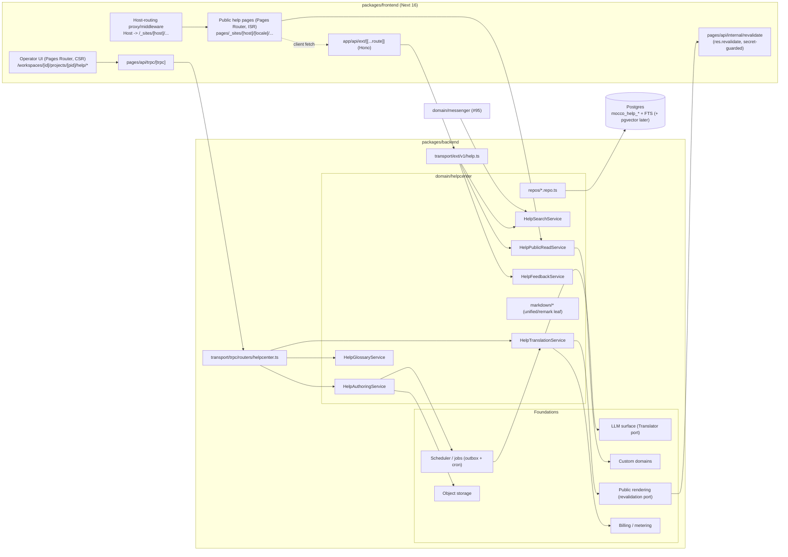
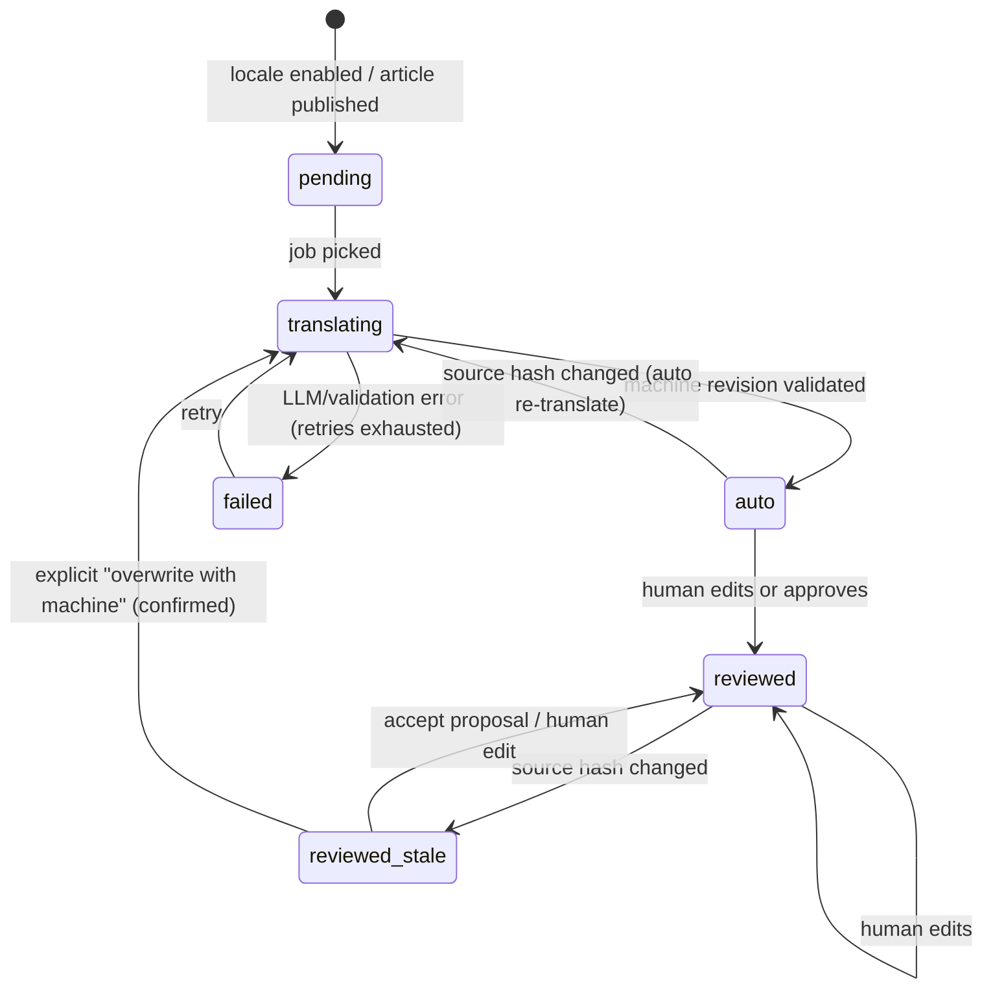

# Help center — implementation design

Issue: fi-workers/mocco#96 (epic #104). Research: `../research/help-center-competitors.md`.

## Goals / non-goals

**Goals (v1)**

- Operators author a help center per **project** in Markdown: collections → sections → articles, draft/published, full revision history with restore, and images.
- A public, **crawlable** site on a Mocco subdomain (`<site>.help.mocco.club`, name TBD) or a custom domain (`help.customer.com`), with per-locale URLs (`/ko/...`), a locale switcher, sitemap and hreflang, and search.
- **Automatic translation** on publish into every enabled locale via the neutral LLM surface. Markdown structure is preserved and validated. A per-project glossary is honored.
- **Per-locale state machine**: `auto` (machine), `reviewed` (human-approved), and staleness computed from a source hash mismatch. Human work is never silently overwritten.
- **Segment-level translation memory**, so a source edit re-translates only changed paragraphs and a reviewed locale keeps its reviewed sentences.
- Per-locale Postgres full-text search, including Korean, Japanese and Chinese. The same `HelpSearchService` is consumed in-process by the messenger (#95) and over a public `/v1` read API.
- "Was this helpful?" feedback per article and locale.

**Non-goals (v1)**

- AI answers on the help-center page itself, private/end-user-gated articles (needs end-user identity), docs-as-code git sync, WYSIWYG block editor, theme templating language, TMS connectors (Crowdin/Lokalise), multi-brand per site.
- Deploy-linked review signals and a publish gate get data-model hooks now and ship post-v1 (see Open questions).

## User flows

1. **Set up:** In a project, the operator enables Help center, picks a source locale (for example `en`) and target locales (`ko`, `ja`), and gets `acme.help.mocco.club`. Optionally they add `help.acme.com` (custom-domain foundation: DNS instructions, then verification, then TLS).
2. **Author:** They create a collection "Getting started", then a section "Install", then an article. The split editor (Markdown left, rendered preview right) autosaves drafts as revisions. Images are pasted, uploaded to object storage and inserted as ``.
3. **Publish:** Publishing creates a published source revision with `content_hash`. The article is revalidated on the public site in the source locale immediately. Translation jobs are enqueued per target locale.
4. **Auto-translate:** For each locale the worker segments the Markdown and reuses translation-memory hits (exact segment hash plus glossary hash). It sends only misses to the LLM with protected tokens, validates the structure and stores a machine revision. The locale becomes `auto` and is revalidated.
5. **Review:** A Korean-speaking teammate opens the Translations tab (a grid of articles x locales with state chips) and edits the `ko` translation side by side with the source. Saving marks it `reviewed` and writes the edited segments to TM with origin `human`.
6. **Source changes:** The author edits and republishes the English article. `ja` (auto) is re-translated automatically, and only the changed segments go to the LLM. `ko` (reviewed) becomes **stale**: the site keeps serving the reviewed `ko` text, optionally with a "source updated" banner by site policy. The worker produces a **proposal** in which unchanged segments keep the human text and changed segments get machine drafts. The reviewer sees a segment diff and clicks Accept (back to `reviewed`) or edits. Forcing a full re-translation of a reviewed locale requires an explicit confirmation.
7. **Glossary:** Adding "Mocco Gate" as do-not-translate marks translations whose segments contain the term. Only those segments are re-translated: `auto` locales automatically, `reviewed` locales as a proposal.
8. **Visitor:** A visitor lands on `help.acme.com/ja/articles/3f9k2-install-the-cli` from Google (a static page), switches locale, searches (client fetch to the `/v1` search endpoint) and votes "helpful".
9. **Messenger:** The messenger widget (#95) calls the search API, or the messenger AI calls `HelpSearchService` in-process, to suggest articles in the visitor's locale.

## Architecture



- **tRPC (internal, operator UI):** all authoring, translation review, glossary, site settings and dashboards (`helpcenter.*` router with a router-scoped error middleware).
- **Hono ext `/v1` (public):** read-only published content, search and feedback under `/api/ext/v1/help/...`, authenticated by a public **site key** (publishable, read-only). There is also a later management API with workspace API keys (import/export, CI docs sync).
- **Public pages:** Pages Router `getStaticProps` + `getStaticPaths({ fallback: 'blocking' })` + on-demand revalidation. They call `HelpPublicReadService` directly (server-side, no HTTP hop). See the proposed ADR below.
- **Background jobs** (scheduler foundation): `help.translate` (per article x locale x source hash), `help.retranslate-glossary` (fan-out), `help.revalidate` (paths), `help.reindex` (search rows; later embeddings). All jobs are idempotent with key `(translation_id, source_hash, glossary_hash)`.
- **SDK:** a `help` module in the SDK family (`@mocco/js` web, reused by `@mocco/react-native`): `help.search`, `help.getArticle`, `help.sendFeedback`. The messenger widget uses it.

### Proposed ADR 0015 — Public crawlable surfaces use ISR on the Pages Router

Context: ADR 0009 and the frontend conventions say "no SSR; SSG landing, CSR app". The help center, status page (#103), forum (#97) and changelog (#98) must be crawlable and fast on first paint, and they are multi-tenant by Host.

Options:

| Option | Pros | Cons |
|---|---|---|
| **A. ISR pages in the existing Next app** (`pages/_sites/[host]/...`, host-rewrite proxy, `getStaticProps` + on-demand `res.revalidate`) | One deployment (ADR 0005), shared domain services, the Vercel Platforms pattern, CDN-cached HTML, no per-request server render | Adds build-time/server data code to the frontend. Self-hosted multi-instance ISR needs a shared cache handler, since `res.revalidate` only clears the local instance ([strapi](https://strapi.io/blog/fixing-isr-revalidation-across-kubernetes-replicas-on-strapi)) |
| B. Separate public app (`packages/sites`, Next or Astro) | Isolation, own bundle and security headers | Second deployment and pipeline, which contradicts the single-Vercel goal. Duplicated session/config |
| C. Hono ext renders HTML strings with `Cache-Control: s-maxage, stale-while-revalidate` | Framework-agnostic, identical on self-host | Re-implements layout/i18n/React components, poor DX, CDN purge semantics differ per host |

**Recommendation: A.** The ADR states: "`getServerSideProps` remains banned; public multi-tenant surfaces may use `getStaticProps`/`getStaticPaths` with ISR and on-demand revalidation; they live under `pages/_sites/**`, read only through a public-read domain service, never touch the operator session, and ship zero tRPC." Interactive parts (search, feedback, locale detection) are client fetches to `/v1`. Revalidation goes through a neutral `PublicPageRevalidator` port whose Next implementation is `pages/api/internal/revalidate.ts` (`res.revalidate` exists only in Pages API routes). The job calls that route with an internal secret (`PUBLIC_REVALIDATE_SECRET`). Self-host: a single `next start` instance works out of the box with the filesystem cache. Multi-instance needs `cacheHandler` (documented; a Postgres-backed handler is possible later). The host-routing file is `proxy.ts` in Next 16 (formerly `middleware.ts`; verify the name against current Next docs when implementing). Middleware does not run for on-demand ISR requests, so revalidate the rewritten path `/_sites/<host>/<locale>/...`.

## Domain model

Everything below is scoped by `workspace_id` + `project_id` (project/app entity foundation). All tables use `mocco_` names, uuid PKs, `created_at`/`updated_at`, and snake_case.

**`mocco_help_sites`**: one per project (v1).
`id, workspace_id, project_id (uq), slug (uq, subdomain label), source_locale, enabled_locales text[], custom_domain_id (fk custom-domains foundation, null), public_key (uq, site key for /v1), stale_policy ('serve_stale' | 'serve_stale_with_banner' | 'fallback_to_source'), auto_translate ('on_publish' | 'manual'), theme jsonb (logo asset, colors, links), glossary_hash, publish_gate_id (null, post-v1)`.
Invariant: `source_locale ∉ enabled_locales` (the targets). Locales are BCP-47 values from a `Locales` const list in `@mocco/common`.

**`mocco_help_collections`** / **`mocco_help_sections`**:
`id, site_id, (collection_id for sections), slug, position int, source_title, source_description, source_hash, icon`.
Index: `mocco_help_sections_collection_position_idx`.

**`mocco_help_node_translations`**: titles and descriptions of collections/sections per locale.
`id, node_kind ('collection'|'section'), node_id, locale, title, description, origin ('machine'|'human'), source_hash_at_translation`. Unique `(node_kind, node_id, locale)`. These are small, so they are translated in the same job batch as their first article.

**`mocco_help_articles`**:
`id, site_id, section_id, short_id (uq per site, 5–8 char base32, stable URL key), slug, position, status ('draft'|'published'|'archived'), draft_revision_id, published_revision_id, published_at, published_by, source_links jsonb (post-v1 deploy-linking: repo paths / flag keys)`.
Public URL: `/{locale}/articles/{short_id}-{slug}`. The slug is cosmetic, and a slug mismatch 308-redirects, so renames never break links.

**`mocco_help_revisions`**: append-only, for source and translations alike.
`id, article_id, locale, title, body_md, content_hash (sha256 of normalized title+body), segments jsonb ([{hash, kind}] ordered), kind ('source_edit'|'machine'|'human_edit'|'proposal'|'restore'), author_user_id (null for machine), based_on_source_hash (translations only), glossary_hash (translations only), llm_model, created_at`.
Indexes: `mocco_help_revisions_article_locale_created_idx`. Never updated or deleted, which gives revision history and restore for free (restore = new revision copying an old body).

**`mocco_help_translations`**: the per-locale state row.
`id, article_id, locale, state ('pending'|'translating'|'auto'|'reviewed'|'failed'), current_revision_id, published_revision_id, proposal_revision_id (null), source_hash_at_translation, glossary_hash_at_translation, reviewed_by, reviewed_at, last_error, attempts`.
Unique `mocco_help_translations_article_locale_uq`.
**Staleness is derived, not stored as a state:** `stale = source_hash_at_translation != article.published_source.content_hash` (and `glossary_stale = glossary_hash_at_translation != site.glossary_hash`). A generated/indexed boolean column `is_stale` may be added for the dashboard query. The display state combines them: `Auto`, `Auto · updating`, `Reviewed`, `Reviewed · stale`, `Pending`, `Failed`.

State machine (per article x locale):



(`reviewed_stale` is `reviewed` plus a hash mismatch, shown as its own node for clarity.)

Invariants:

1. The only automatic transition out of `reviewed` is into proposal generation. The worker **never** writes `current_revision_id` of a `reviewed` translation. Enforced in `HelpTranslationService.applyMachineResult`, with a unit test.
2. A machine revision is accepted only if the structural validator passes (see Markdown pipeline).
3. Publishing a translation happens only through a `published_revision_id` swap, so the public site reads published revisions only.
4. Idempotency: a job whose `(source_hash, glossary_hash)` already equals the translation's current hashes is a no-op.

**`mocco_help_segment_memory`**: translation memory.
`id, site_id, source_locale, target_locale, source_segment_hash, source_text, target_text, origin ('machine'|'human'), glossary_hash, used_count, updated_at`.
Unique `(site_id, target_locale, source_segment_hash, origin)`. Lookups prefer `human` over `machine`. Machine entries with a stale glossary hash are ignored.

**`mocco_help_glossary_terms`**:
`id, site_id, term, case_sensitive bool, rule ('keep'|'fixed'), translations jsonb ({ko:'...', ja:'...'} for 'fixed'), note`.
Unique `(site_id, lower(term))`. `site.glossary_hash` = sha256 of the sorted canonical terms, recomputed on every change.

**`mocco_help_search_entries`**: one per published article x locale.
`id, site_id, article_id, locale, title, body_text, tokens text (app-side tokenization, see Search), tsv tsvector (generated from weighted title+tokens), updated_at`.
Indexes: GIN `mocco_help_search_entries_tsv_idx`; `(site_id, locale)`.
Post-v1 **`mocco_help_chunks`**: `id, entry_id, heading_path, text, embedding vector(N), embedding_model`, with an HNSW index.

**`mocco_help_assets`**: `id, site_id, storage_key, mime, bytes, width, height, uploaded_by`. Stores the object-storage foundation key.

**`mocco_help_feedback`**: `id, article_id, locale, helpful bool, comment (null, max 500), visitor_hash (sha256(ip+ua+daily salt)), created_at`. Unique `(article_id, visitor_hash, date)` for soft dedupe.

**`mocco_help_redirects`**: `id, site_id, from_path (uq per site), to_article_id`. Used for imports from Zendesk/Intercom URL shapes.

## Backend modules

`packages/backend/src/domain/helpcenter/`:

- `HelpSiteService.ts`: create/update site, locales, stale policy, custom domain binding (delegates to the custom-domains foundation).
- `HelpAuthoringService.ts`: collections/sections/articles CRUD, draft save (new revision), publish/unpublish, restore, reorder. On publish it enqueues `help.translate` per target locale and `help.revalidate` + `help.reindex` for the source locale.
- `HelpTranslationService.ts`: the state machine. `translateArticleLocale(job)`, `applyMachineResult`, `saveHumanEdit`, `acceptProposal`, `forceRetranslate(confirm: true)`, `translationGrid(siteId)`.
- `HelpGlossaryService.ts`: term CRUD, glossary hash, affected-segment fan-out.
- `HelpSearchService.ts`: `search({ siteId, locale, query, limit })`, which returns the neutral `HelpSearchHit[]`. It is the only search entry point, used by `/v1`, the public site and messenger.
- `HelpPublicReadService.ts`: resolve host → site → published content for SSG and `/v1`. Only published revisions are exposed.
- `HelpFeedbackService.ts`.
- `errors.ts`: `HelpSiteNotFoundError extends NotFoundError`, `ArticleNotFoundError`, `TranslationOverwriteRequiresConfirmationError extends ConflictError`, `TranslationValidationError`, `LocaleNotEnabledError`.
- `repos/`: `help-sites.repo.ts`, `help-collections.repo.ts`, `help-sections.repo.ts`, `help-articles.repo.ts`, `help-revisions.repo.ts`, `help-translations.repo.ts`, `help-segment-memory.repo.ts`, `help-glossary-terms.repo.ts`, `help-search-entries.repo.ts`, `help-feedback.repo.ts`, `help-assets.repo.ts` (ADR 0012, `find*`/`get*`). `HelpTranslationsRepo.claimForJob` takes `pg_advisory_xact_lock(AdvisoryLockNamespaces.HelpTranslation, hashtext(translation_id))` so two lambdas never translate the same row concurrently.
- `markdown/` (vendor leaf, the only importer of `unified`/`remark-*`/`rehype-*`):
  - `segment.ts`: Markdown → mdast → ordered segments (heading, paragraph, list item, table cell, blockquote paragraph, image alt, link title). Fenced code blocks, HTML, front-matter and math are **opaque** and never sent. Each segment gets `hash = sha256(normalized text)`.
  - `protect.ts`: replaces inline code, URLs, `asset://` refs, autolinks, `{{variables}}`, emoji shortcodes and glossary `keep` terms with placeholders `⟦0⟧, ⟦1⟧...`. Link text stays translatable while the href is protected.
  - `reassemble.ts`: splices translated segment text back into the source mdast and serializes with remark-stringify, so structure comes from the source tree, never from the LLM.
  - `validate.ts`: checks that every placeholder appears exactly once, the placeholder order is plausible, there are no new URLs, the heading count and depth are unchanged, and code fences are byte-identical (guaranteed by opaque handling but asserted anyway).
  - `render.ts`: mdast → sanitized HTML (rehype-sanitize allowlist, no raw HTML in v1), heading anchors and TOC. Used by the preview (client bundle via `@mocco/common`?) and SSG. Open question: share the renderer with the frontend via `@mocco/common`.
- `translate/`:
  - `Translator.ts`: the neutral port type `translateSegments({ sourceLocale, targetLocale, segments: {id, text}[], glossary: {term, rule, target?}[], styleNote? }) → {id, text}[]`, implemented by the **LLM surface foundation** (`domain/llm/...`, vendor leaf). The prompt asks for JSON `{id, text}` per segment, carries protected placeholders verbatim, uses a system message with glossary and style, and batches to about 4k source tokens per call.
  - `pipeline.ts`: pure orchestration: segment → TM lookup → protect → translator → restore → validate (per-segment retry once with a stricter prompt, then fall back to source text for that segment and mark `failed` if more than N% of segments fail) → reassemble.
- `jobs.ts`: job handlers registered with the scheduler foundation (`help.translate`, `help.retranslate-glossary`, `help.reindex`, `help.revalidate`).
- `search/tokenize.ts`: locale-aware tokenization (see Search).

Transport:

- `transport/trpc/routers/helpcenter.ts` with a `protectedHelpProcedure` error-mapping middleware (NotFound → NOT_FOUND, Conflict → CONFLICT, Validation → BAD_REQUEST).
- `transport/ext/v1/help.ts`: Hono routes, zod parsing at the boundary, site-key auth, CORS, rate limiting.

Frontend:

- Operator pages `pages/workspaces/[id]/projects/[pid]/help/{index,articles/[aid],translations,glossary,settings}.tsx`.
- Editor: **CodeMirror 6** (Markdown mode) plus live preview, wrapped in `components/help/MarkdownEditor.tsx` as a vendor leaf. Plain Markdown is the canonical format, which suits hashing, segmentation, LLM round-trips, diffs and future git sync. A TipTap/ProseMirror WYSIWYG that round-trips to the same Markdown can be added later without a data migration.
- Public pages `pages/_sites/[host]/[locale]/index.tsx`, `.../collections/[slug].tsx`, `.../articles/[ref].tsx`, `pages/_sites/[host]/sitemap.xml.ts`, `robots.txt`.

## Search

- **v1: Postgres FTS, per locale, no extensions required** (works on Supabase, Neon, self-host and pglite).
  - Latin-script locales with a Postgres dictionary (`english`, `german`, `french`, `spanish`, `portuguese`, ...) use `to_tsvector('<config>', ...)`. The config is chosen from a `SearchConfigs` const map keyed by locale.
  - **CJK (ko, ja, zh):** Postgres has no Korean/Japanese parser and pg_trgm does not handle CJK ([PGroonga comparison](https://pgroonga.github.io/reference/pgroonga-versus-textsearch-and-pg-trgm.html)). `search/tokenize.ts` emits character **bigrams** for CJK runs plus whole tokens for Latin runs into `tokens`, indexed with the `simple` config. Queries are tokenized the same way and combined with `&`. This is simple, portable and good enough at help-center scale. PGroonga (Supabase supports it, [docs](https://supabase.com/docs/guides/database/extensions/pgroonga)) is an optional upgrade later, but it is not in pglite, so it cannot be the baseline.
  - Ranking: `ts_rank_cd` with title weight A and body weight D, plus a small boost from helpful-ratio. `ts_headline` provides snippets.
- **Later: hybrid with embeddings (pgvector).** Chunk by heading section (about 300–500 tokens) and embed through the LLM surface's embedding port. `HelpSearchService` does reciprocal-rank fusion of FTS and vector hits. The same chunks power messenger AI answers (#95) and later on-page AI answers. The embedding model id is stored per chunk, so a model change triggers `help.reindex`.

## Public API / SDK surface

Public `/v1` (Hono ext, `https://<SERVICE_DOMAIN>/api/ext/v1/help/...`; also reachable on the help site's own host at `/api/help/v1/...` via rewrite to avoid CORS on custom domains):

```
GET  /v1/help/sites/{siteKey}                          -> { name, sourceLocale, locales[], theme }
GET  /v1/help/sites/{siteKey}/search?q=&locale=&limit= -> { hits: [{ articleId, title, snippet, url, locale, score, sectionPath[] }] }
GET  /v1/help/sites/{siteKey}/articles/{articleId}?locale=&format=html|markdown
                                                       -> { id, title, bodyHtml|bodyMarkdown, locale, updatedAt, translationState: 'source'|'auto'|'reviewed', stale: boolean, alternates: [{locale,url}] }
GET  /v1/help/sites/{siteKey}/collections?locale=      -> tree of collections/sections/article summaries
POST /v1/help/sites/{siteKey}/articles/{articleId}/feedback  { locale, helpful, comment? } -> 204
```

Locale negotiation: an explicit `locale` param, then `Accept-Language`, then the source locale. If the requested locale has no published translation, the source locale is returned with `locale` set accordingly.

SDK sketch (`@mocco/js`, module `help`):

```ts
import { createMocco } from '@mocco/js';

const mocco = createMocco({ siteKey: 'hc_pub_...' });

const { hits } = await mocco.help.search('reset password', { locale: 'ko', limit: 5 });
const article = await mocco.help.getArticle(hits[0].articleId, { locale: 'ko', format: 'html' });
await mocco.help.sendFeedback(article.id, { locale: 'ko', helpful: true });

// types
type HelpSearchHit = {
  articleId: string; title: string; snippet: string; url: string;
  locale: Locale; score: number; sectionPath: string[];
};
```

In-process for the messenger AI (no HTTP): `helpSearchService.search({ siteId, locale, query, limit })`, and later `retrieveChunks(...)` for RAG.

Post-v1 management API (workspace API key): `PUT /v1/help/articles/{externalKey}` (upsert from Markdown), `POST /v1/help/import` (Zendesk/Intercom export), enabling a `mocco help sync ./docs` CLI or GitHub Action for docs-as-code.

## External vendors and self-host story

| Concern | Neutral surface | Vercel / hosted | Self-host |
|---|---|---|---|
| LLM translation | `Translator` port on the LLM surface foundation (`LLM_*` env) | Provider chosen by LLM foundation (for example via AI Gateway) | Any OpenAI-compatible endpoint, including local models; `HELP_TRANSLATION_ENABLED=false` disables it |
| Markdown | `domain/helpcenter/markdown/*` (unified/remark/rehype, MIT) | same | same |
| Editor | `components/help/MarkdownEditor.tsx` (CodeMirror 6, MIT) | same | same |
| Search | Postgres FTS (+ pgvector later) | Supabase/Neon | Postgres 16 + pgvector |
| Rendering | ISR + `PublicPageRevalidator` port | Vercel ISR/CDN | `next start` filesystem cache (single instance) or `cacheHandler` |
| Custom domains + TLS | custom-domains foundation `DomainProvider` | Vercel Domains API (soft limit 100k domains/project on Pro, rate-limited to 100 adds/hour; [Vercel limits](https://vercel.com/docs/platforms/multi-tenant-platforms/limits)) | Caddy on-demand TLS with an `ask` endpoint that checks verified domains |
| Images | object storage foundation | Vercel Blob / S3 | S3-compatible (MinIO) or local disk |
| Jobs | scheduler foundation (outbox + cron) | Vercel Cron + job table | same, or a cron container |

## Security and abuse

- **XSS:** Markdown is rendered server-side through a rehype-sanitize allowlist. Raw HTML is disabled in v1. LLM output goes through the same parse → reassemble → sanitize path, so a translation cannot introduce markup the source did not have.
- **LLM output integrity / prompt injection:** Source text is untrusted instructions to the LLM. The model sees only segments with placeholders, and output is accepted only if the validator passes: identical placeholders, no new URLs, identical structure. That blocks link-spam or script injection by a malicious or confused translation. Glossary `fixed` terms are checked post hoc.
- **Tenant isolation:** Host → site resolution uses verified domains only (TXT/CNAME verification in the foundation), which prevents domain takeover of unverified hosts. Every repo query is workspace-scoped. Public reads return published revisions only, and draft IDs never appear in public payloads.
- **Site key:** It is publishable and read-only, scoped to one site, with a per-site CORS allowlist (defaults to site domains plus the messenger origin). It can be rotated.
- **Rate limiting:** `/v1` search is limited per key and IP (about 10 rps per IP, with a burst limit). Feedback is limited to 1 vote per article per visitor hash per day, the comment length is capped, and comments are not shown publicly in v1.
- **Cost abuse:** Translation is triggered on publish, not on every autosave, and debounced so repeated publishes within 60s coalesce. There is a workspace monthly character quota (billing foundation), and a hard stop leaves locales `pending` with a banner in the UI.
- **Revalidation endpoint:** Internal secret, POST only, paths validated against the `_sites/` prefix.
- **Asset uploads:** MIME sniffing, size cap (10 MB), image-only in v1, served from a storage domain.

## Scale and performance notes

- Public pages are static HTML at the CDN. A publish triggers revalidation of about `(1 + L) x (article + section + collection + home) + sitemap` paths. That is bounded (for example 4 locales x 4 pages = 16 revalidations per publish) and batched through `help.revalidate`.
- Translation cost: a 1,500-word article into 3 locales is about 4.5k words, or roughly $0.001–0.003 at current LLM rates ([Crowdin measurements](https://crowdin.com/blog/ai-translation-cost)). Segment TM typically cuts re-translation of an edit to under 10% of that.
- Serverless duration: one job per article x locale, with segments batched about 4k tokens per call. Very long articles are split into multiple calls within the job. If one job would exceed the function limit, it checkpoints the translated segments into TM and re-enqueues itself, so the resumed job gets TM hits.
- Search: GIN on tsvector handles 10^5 entries per site comfortably. `/v1` search responses get `Cache-Control: s-maxage=60` keyed by `(site, locale, q)`.
- The translation grid query uses `(site_id, locale, is_stale)` for a paginated dashboard.

## Dependencies on platform foundations

- **Project/app entity:** a help site belongs to a project.
- **LLM surface:** `Translator` port, and later an embedding port, with usage records for metering.
- **Scheduler / jobs:** `help.translate`, `help.retranslate-glossary`, `help.reindex`, `help.revalidate`, with idempotency keys, retries and backoff.
- **Public rendering:** ADR 0015 (above), host-routing proxy, `PublicPageRevalidator` port. The help center is likely its first or second consumer after the status page (#103).
- **Custom domains:** verification, TLS, and host → site lookup.
- **Object storage:** article images and the site logo.
- **SDK packaging:** `@mocco/js` `help` module and the public `/v1` on `ext/`.
- **Notifications:** "N translations became stale" and "translation failed" digests to Slack/email (post-v1 nice-to-have).
- **Billing/metering:** translated characters per workspace per month, and help sites per plan.
- **End-user identity:** not needed in v1 (private articles later).
- **Realtime:** not needed (optional live translation-progress updates can poll).

## Testing strategy (pglite)

- **Pure units:** `markdown/segment|protect|reassemble|validate` golden tests over a corpus of tricky Markdown (nested lists, tables, code fences with Markdown inside, links with titles, images, HTML blocks, CJK). Property test: `reassemble(segment(md), identityTranslate) === normalize(md)`. The validator rejects crafted bad outputs (dropped placeholder, extra URL, changed heading level). `search/tokenize` gets bigram tests for ko/ja.
- **State machine:** table-driven tests over `(state, event) → (state, effects)`, including invariant 1 (a reviewed translation is never overwritten) and idempotency.
- **Integration over pglite** (real migrations): services constructed with real repos and a deterministic `FakeTranslator` class (for example uppercases text and preserves placeholders), passed through the constructor with no module mocking. Scenarios: publish → jobs → `auto`. Human edit → `reviewed`. Source edit → auto re-translated, reviewed becomes stale with a proposal containing the kept human segments. Glossary change → only affected segments re-translated. Concurrent job claim under the advisory lock. FTS search returns ko/ja/en hits with correct ranking. Public read never returns drafts.
- **Transport:** Hono `/v1` tested with `app.request()` over pglite: site-key auth, locale fallback, rate-limit headers, feedback dedupe. tRPC router error mapping.
- **Frontend:** a Next build of the `_sites` pages with a seeded fixture, plus an `agent-browser` smoke test of the public site (render, locale switch, search) on a preview deploy.

## Open questions / ADRs needed

1. **ADR 0015: public crawlable surfaces use ISR on the Pages Router** (above). Shared with #97, #98 and #103, so decide it in the public-rendering foundation.
2. **Editor:** CodeMirror Markdown is proposed for v1. Is a WYSIWYG (TipTap with a Markdown round-trip) needed for non-technical support staff at launch?
3. **Default target locales and billing:** Proposal: no defaults; the onboarding suggests `en`/`ko`/`ja`. Meter translated **source characters x target locales**, with a monthly included allowance (Featurebase: 250k chars free, then $0.04/1k; GitBook: $0.20/1k words) and pass-through-like overage.
4. **Publish through a Mocco gate:** Optional per-site `publish_gate_id` that reuses governance gates, so a publish waits for an authorized reviewer and is written to the audit log. The hook is in the model now and ships post-v1.
5. **Deploy-linked staleness (differentiator):** `articles.source_links` (repo path globs, flag keys). When a resumed run deploys commits touching linked paths, raise a "source may be outdated" review task. This needs the deploy-events feed. Post-v1.
6. **Stale policy default:** `serve_stale_with_banner` or `fallback_to_source`? Proposal: serve the stale reviewed translation with a subtle banner. Serving stale **auto** translations never happens for long, because auto re-translation runs immediately.
7. **Machine-translation disclosure:** Show an "Automatically translated" label on `auto` locales (Zendesk has none; transparency is proposed on by default, configurable).
8. **Share the Markdown renderer** between the operator preview (client) and SSG (server): via `@mocco/common`, or keep it in the backend and preview through tRPC? Client-side rendering keeps preview latency near zero.
9. **Self-host multi-instance ISR:** Ship a Postgres-backed Next `cacheHandler`, or document single-instance plus a reverse-proxy cache?
10. **Localized slugs** (`/ja/articles/3f9k2-<japanese-slug>`): post-v1. The `short_id` keeps links stable either way.
