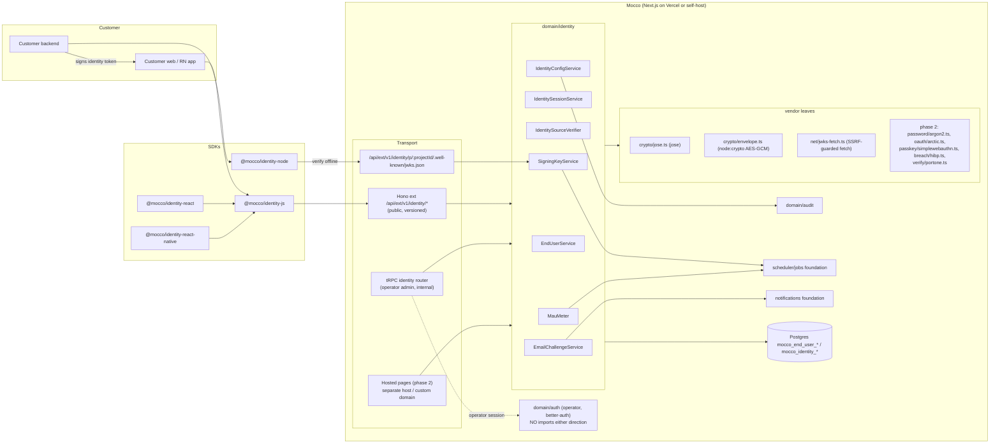

# End-user identity and hosted auth — implementation design

Issue: fi-workers/mocco#100 (epic #104). Research: `../research/identity-competitors.md`.

## Current state (what exists today)

- Operator auth is **better-auth 1.6.23** behind the single vendor leaf `packages/backend/src/domain/auth/provider.ts`. It runs email+password and the `organization` plugin (organization is mapped to `mocco_workspaces`, member to `mocco_members`). Tables are `mocco_users`, `mocco_sessions`, `mocco_accounts`, `mocco_verifications`, and `mocco_invitations`. `advanced.database.generateId: false` lets the DB generate uuid PKs.
- Neutral services: `AuthService` (fetch/Node handler, `getSession(headers)` cookie-based) and `WorkspaceService`. The composition root is `domain/auth/instance.ts` (`getServices()`), fed by `getEnv()` (`AUTH_SECRET`, `SERVICE_DOMAIN`, Vercel URLs, via `resolveAuthOrigins`).
- Transports: tRPC on `pages/api/trpc`, the better-auth handler on `pages/api/auth/[...all]`, and the Hono external app `transport/ext/app.ts` mounted at `app/api/ext/[[...route]]` (ADR 0011).
- The hash-chained audit log `mocco_audit_log` is per workspace (`actor_user_id` references operator `mocco_users`).

Nothing about end users exists yet.

## Goals / non-goals

### Goals — phase 1 (identity foundation, unblocks #95 messenger, #97 forum, #98 feedback)
1. A **per-project end-user directory** (isolated pool per project/app entity): users, linked identities, sessions.
2. **Identity sources:**
   - **Signed identity from the customer backend**: HS256 JWT signed with a per-project identity secret, or the Intercom-style `user_id + user_hash` HMAC-SHA256.
   - **BYO issuer**: an asymmetric JWT from the customer's existing IdP (Clerk, Auth0, Supabase, Firebase, Cognito, WorkOS, any OIDC), verified against a configured JWKS URL.
   - **Email OTP** (6-digit code, optional one-click link) for public pages (forum posting, feedback voting).
   - **Anonymous visitor** (device-bound) for the messenger widget before identification, upgradable.
3. Mocco issues its **own short-lived end-user access JWT** (per-project issuer, ES256) plus a rotating refresh token. Mocco products and customer backends verify it offline via a **per-project JWKS**.
4. **Operator admin**: list/search/view, ban, and delete (GDPR erase plus export) end users, revoke sessions, rotate keys, and manage identity config. Security-relevant changes are written to the audit chain.
5. **MAU metering** feeding the billing/metering foundation.
6. **Strict separation from operator auth** (tables, secrets, cookies, token formats, code imports), enforced by lint and tests.

### Goals — phase 2 (hosted auth, Clerk-like), after threat model plus external review
Email+password (argon2id, breached-password check), social OAuth (Google, Apple, GitHub, Kakao, Naver), passkeys, TOTP MFA, hosted sign-in pages on customer custom domains, React plus React Native components, end-user orgs with roles, impersonation (audited, gateable), webhooks, bot protection, and optional Korean identity verification (PASS via an aggregator).

### Non-goals
- Replacing or merging operator auth. Operators never become end users, and the reverse never happens.
- SAML/SCIM enterprise SSO, SMS OTP, or a general third-party OAuth authorization server (dynamic client registration, consent screens) in v1/v2.
- M2M/API-key identity, AI-agent identity, device fingerprinting.
- Moving operator auth off better-auth.

## User flows

### F1. Messenger with the customer's own auth (signed identity)
1. The operator enables Identity on project P. Mocco generates an **identity secret** (shown once, `mis_...`) and a **publishable key** (`mpk_...`, origin-allowlisted).
2. The customer backend signs `{ sub: "u_123", email, name, iat, exp<=10m }` with HS256 using the secret, or computes `user_hash = HMAC-SHA256(secret, user_id)`.
3. The widget calls `POST /api/ext/v1/identity/sessions/exchange` with `publishableKey` plus `identityToken`. Mocco verifies it and upserts `mocco_end_users` by `(project_id, external_id)`. It returns an access JWT (15 min) plus a refresh token (30 days, rotating).
4. Messenger, forum, and feedback calls carry the access JWT and verify it offline against the project JWKS.

### F2. Customer already on Clerk/Auth0/Supabase (BYO issuer)
1. The operator registers a trusted issuer: `issuer`, `jwksUrl` (HTTPS, SSRF-guarded), `audience`, and a claim mapping (`sub`, `email`, `email_verified`, `name`, `picture`).
2. The widget passes the customer's session JWT to `exchange`. Mocco verifies `iss`/`aud`/`exp`/`nbf`/`kid`/alg allowlist against the cached JWKS, then upserts by `(project_id, provider = issuer, subject = sub)`.

### F3. Public forum or feedback visitor (email OTP)
1. The visitor enters an email. `POST /email/start` always returns `202 { challengeId }` (enumeration-safe) and sends a code via the notifications foundation.
2. `POST /email/verify { challengeId, code }` gives max 5 attempts and a 10-minute TTL. It then finds or creates the end user by verified email in the project pool and returns tokens.
3. If the project also uses signed identity, email-OTP users are **not auto-merged** into signed users. Linking only happens when a signed token asserts the same email with `email_verified: true`, and the project setting `linkVerifiedEmail` is on (default off). This prevents pre-hijacking.

### F4. Anonymous messenger visitor
The widget calls `POST /sessions/anonymous` with the publishable key and gets an anonymous end user (`is_anonymous = true`). A later `exchange` or `email/verify` carrying that anonymous refresh token **upgrades** the user by merging conversations into the identified user. Anonymous users are counted separately for MAU (see metering).

### F5. Operator admin (tRPC, internal)
Workspace member opens Project, then Identity, then Users. They search by email, external id, or name, and view identities, sessions, and product activity (messenger threads, forum posts, feedback votes via product services). From there they can ban (revoke all sessions, reject future exchanges), delete (hard-erase PII, tombstone the id so product content shows "deleted user"), or export JSON.

### F6. Phase 2 hosted sign-in
The customer app redirects to `https://accounts.<customer-domain>/sign-in?redirect_url=...`, or a dev-instance host on a separate Mocco-owned registrable domain. The user signs in with a password, social, passkey, or OTP, plus MFA if enrolled. The host sets its own cookie and redirects back with an **authorization code** (PKCE). The customer SDK exchanges the code for tokens. Customer backends verify the access JWT via JWKS.

## Architecture



- **tRPC (internal only):** `identity` router for operator admin and config: `users.list/get/ban/unban/delete/export`, `sessions.revoke`, `config.get/update`, `secrets.rotate`, `issuers.add/remove`, `keys.list/rotate`, `usage.mau`. It is guarded by the operator session and workspace role, and never accepts end-user tokens.
- **Hono ext `/v1` (public):** everything an end user, widget, SDK, or customer backend calls. It lives in a new file `transport/ext/identity.ts` composed into `transport/ext/app.ts` (Hono stays the ext leaf; the identity routes are a sub-app).
- **Background jobs** (scheduler foundation): `identity.keys.rotate` (daily check: promote pending, then active, then retiring, then prune), `identity.jwks.refresh` (BYO issuer JWKS cache refresh), `identity.challenges.prune`, `identity.sessions.prune`, `identity.mau.rollup` (monthly close into billing), `identity.erase` (async hard delete across products).
- **SDK packages** (SDK packaging foundation): `@mocco/identity-js` (framework-free core: token storage, refresh with single-flight, exchange/OTP/anonymous calls), `@mocco/identity-react` (provider, hooks, phase 2 components), `@mocco/identity-react-native` (secure storage via Keychain/Keystore adapter, phase 2 native components), `@mocco/identity-node` (`verifyToken` with JWKS cache, `signIdentity` helper, server API client).

### Engine decision: own the core in phase 1, ADR for phase 2
Phase 1 does **not** use better-auth. The requirements (exchange of external assertions, per-project issuers and keys, per-project pools with duplicate emails across projects) are small and do not match better-auth's single-instance, globally-unique-email model. They are built on vetted primitives: `jose` for JWS/JWKS, and `node:crypto` for HMAC, AES-GCM, and random values.

Phase 2 needs an ADR choosing between two options.
- **(A) better-auth per project.** One better-auth instance per project, created lazily and cached, over `mocco_eu_*` tables with a `project_id`-scoping adapter wrapper. It uses the jwt plus oauth-provider plus passkey plus two-factor plus organization plugins and a separate secret. Pros: less auth code to own; the same library as operators. Cons: the adapter must inject `project_id` into every query (a single missed scope is a cross-tenant leak), per-request instance construction cost, unique-email assumptions, and upgrade coupling with operator auth.
- **(B) Own engine on primitives.** `jose`, `@simplewebauthn/server`, `arctic` (OAuth clients incl. Kakao/Naver), `@node-rs/argon2`, and `otpauth` (TOTP). Pros: project scoping is structural (repos take `projectId`), and there is no coupling to the operator vendor. Cons: more security-critical code to own and have reviewed.

Recommendation: **(B)**, keeping (A) as the fallback if the external review scores it lower risk. Whichever wins, each vendor stays in one leaf file behind neutral interfaces. This mirrors the issue's "evaluate better-auth" ask and records why pools push against it.

### Hosts and cookies (separation at the browser level)
- Operator UI and cookies: `www.mocco.club` (better-auth cookies). Recommend migrating operator cookies to the `__Host-` prefix in a separate PR so no subdomain can toss or overwrite them.
- End-user **API** (phase 1): `www.mocco.club/api/ext/v1/identity/*`, **bearer tokens only, no cookies**. Widgets keep tokens in memory plus storage scoped to the customer origin. CORS is limited to the project's allowlisted origins, keyed by publishable key.
- End-user **hosted pages** (phase 2): never under `mocco.club`. Production uses the customer custom domain (`accounts.customer.com`, custom-domains foundation). Dev instances use a **separate Mocco-owned registrable domain** (for example `*.mocco-accounts.dev`, name TBD) so end-user cookies can never share a site with operator cookies. Cookie name `__Host-mocco_eu_session`, `SameSite=Lax`, `HttpOnly`, `Secure`.

## Domain model

All tables are `mocco_`-prefixed with uuid PKs `defaultRandom()`, snake_case columns, and `created_at`/`updated_at` helpers. **No foreign key to `mocco_users`, `mocco_sessions`, or `mocco_accounts`** (operator plane). The only link to the operator world is `project_id`, which references the project/app entity (foundation), which references the workspace.

### Phase 1 tables

**`mocco_identity_configs`** — one per project
| column | type | notes |
|---|---|---|
| id | uuid PK | |
| project_id | uuid FK projects, unique | |
| enabled | boolean | |
| allowed_origins | text[] | CORS plus publishable-key origin check |
| sources | jsonb | `{ signedJwt, hmac, byoIssuer, emailOtp, anonymous }` booleans |
| link_verified_email | boolean default false | F3 linking rule |
| access_ttl_seconds | int default 900 | clamp 300–3600 |
| refresh_ttl_seconds | int default 2592000 | clamp 1d–90d |
| token_audience | text | default `mocco:<projectId>` |
| custom_claims | jsonb | allowlisted claim names copied from source to access token |

**`mocco_identity_secrets`** — HMAC/HS256 secrets (must be recoverable to verify, so encrypted, not hashed)
| id | project_id | kind (`identity_hmac`) | ciphertext (bytea, envelope-encrypted) | last4 | status (`active`/`retiring`/`revoked`) | expires_at | created_at |

Invariant: at most one `active` and one `retiring` per project (partial unique index). Rotation gives a 24h overlap.

**`mocco_identity_publishable_keys`** — may come from the project foundation's key model if it provides one
| id | project_id | key_prefix (unique) | status | created_at |

**`mocco_identity_trusted_issuers`**
| id | project_id | issuer | jwks_url | audience | allowed_algs text[] (RS256/ES256/EdDSA only) | claim_map jsonb | jwks_cache jsonb | jwks_fetched_at | status |

Unique `(project_id, issuer)`.

**`mocco_end_users`**
| column | notes |
|---|---|
| id uuid PK | the stable end-user id (`sub` of Mocco tokens) |
| project_id | FK, **every query scoped** |
| external_id text null | customer's user id (signed identity) |
| email text null, email_normalized text null, email_verified bool | |
| name, avatar_url | |
| public_metadata jsonb, private_metadata jsonb | private never leaves the server API |
| is_anonymous bool | |
| status (`active`/`banned`/`deleted`) | `EndUserStatuses` const |
| last_active_at timestamptz | |
| deleted_at | tombstone; PII columns nulled on erase |

Indexes: `mocco_end_users_project_external_uq` unique `(project_id, external_id) WHERE external_id IS NOT NULL`. `mocco_end_users_project_email_idx` on `(project_id, email_normalized)`. Unique only `WHERE email_verified AND status <> 'deleted'` when the project uses email as the account key (email-OTP pools). `mocco_end_users_project_last_active_idx`.

**`mocco_end_user_identities`**
| id | project_id | end_user_id FK cascade | provider (`signed`, `hmac`, `issuer:<issuerId>`, `email_otp`, `anonymous`; phase 2 `password`, `oauth:google`...) | subject | email_at_link | created_at | last_used_at |

Unique `mocco_end_user_identities_project_provider_subject_uq (project_id, provider, subject)`.

**`mocco_end_user_sessions`**
| id | project_id | end_user_id | family_id uuid | refresh_hash (sha256, unique) | parent_id null | source_provider | ip_hash | user_agent | created_at | last_used_at | expires_at | revoked_at | revoke_reason |

Invariant: refresh tokens are opaque (`mrt_` + 32 random bytes), only the hash is stored, and each use rotates the token (new row, parent revoked). **Presenting a revoked token in the same family revokes the whole family** (reuse detection).

**`mocco_identity_signing_keys`**
| id (also `kid`) | project_id | alg (`ES256` default, `RS256` opt-in) | public_jwk jsonb | private_ciphertext bytea | status (`pending`/`active`/`retiring`/`revoked`) | activate_at | retire_at | created_at |

Invariants: exactly one `active` per project. JWKS publishes `pending`, `active`, and `retiring` keys. Tokens are only signed with `active`. `pending` is published for at least 24h before activation (caches pick it up). `retiring` stays at least `access_ttl + 1h`. Emergency revoke skips the grace period and is audited.

**`mocco_identity_email_challenges`**
| id | project_id | email_normalized_hash | code_hash (HMAC with server pepper) | link_token_hash null | attempts smallint | expires_at | consumed_at | ip_hash | created_at |

Index on `(project_id, email_normalized_hash, created_at)` for rate limiting.

**`mocco_identity_mau`** — metering
| project_id | period (`date`, first of month UTC) | end_user_id | kind (`identified`/`anonymous`) | first_seen_at |

PK `(project_id, period, end_user_id)`. Writes are `INSERT ... ON CONFLICT DO NOTHING`.

**Audit:** no new audit table. Security-relevant config and operator actions append to `mocco_audit_log` with new `AuditActions` constants: `identity.config.updated`, `identity.secret.rotated`, `identity.key.rotated`, `identity.key.revoked`, `identity.issuer.added`, `identity.user.banned`, `identity.user.deleted`, `identity.user.exported`, `identity.sessions.revoked`, and phase 2 `identity.user.impersonated`. End-user self-actions (sign-in, refresh) go to a separate high-volume event table (phase 2 `mocco_end_user_events`, time-partitioned or TTL-pruned), not the hash chain.

### Phase 2 tables (sketch)
- `mocco_end_user_passwords` (end_user_id PK, argon2id hash, updated_at, breached_checked_at).
- `mocco_end_user_passkeys` (id, end_user_id, credential_id unique, public_key, sign_count, transports, aaguid, name, last_used_at).
- `mocco_end_user_mfa_factors` (id, end_user_id, kind `totp`/`recovery_codes`, secret_ciphertext, verified_at).
- `mocco_identity_oauth_providers` (id, project_id, provider `google`/`apple`/`github`/`kakao`/`naver`, client_id, client_secret_ciphertext, scopes, enabled). Unique `(project_id, provider)`.
- `mocco_identity_oauth_states` (state hash, pkce_verifier_ciphertext, nonce, redirect_url, expires_at).
- `mocco_identity_redirect_uris` (project_id, uri, exact match only).
- `mocco_identity_auth_codes` (code hash, client, end_user_id, pkce challenge, expires_at 60s, consumed_at).
- `mocco_end_user_orgs`, `mocco_end_user_org_members` (org_id, end_user_id, role), `mocco_end_user_org_invitations`.
- `mocco_identity_webhook_endpoints` (or reuse a platform webhook-delivery foundation if one emerges).
- `mocco_end_user_verifications` (Korean identity verification: end_user_id, provider, di_hash, verified_name_ciphertext, birth_year, is_adult, verified_at). **CI is not stored** by default; see security.

## Backend modules

```
packages/backend/src/domain/identity/
  constants.ts                 EndUserStatuses, IdentityProviders, SigningKeyStatuses, TokenTypes (as const)
  errors.ts                    IdentityTokenInvalidError extends UnauthorizedError, EndUserBannedError extends ForbiddenError,
                               ChallengeExpiredError, RateLimitedError, IssuerUnreachableError, ProjectIdentityDisabledError
  ports.ts                     neutral interfaces (below)
  IdentityConfigService.ts     config, publishable keys, secrets, trusted issuers (audited)
  EndUserService.ts            directory: upsert-from-assertion, link, ban, erase, export, search
  IdentitySourceVerifier.ts    verifies signed JWT / HMAC / BYO-issuer JWT -> neutral VerifiedAssertion
  EmailChallengeService.ts     OTP start/verify, rate limits, enumeration-safe
  IdentitySessionService.ts    issue access+refresh, refresh rotation, reuse detection, revoke
  SigningKeyService.ts         key lifecycle, JWKS document, sign/verify via TokenSigner port
  MauMeter.ts                  record activity (at most once per user per day via token claim), monthly counts
  instance.ts                  composition root: getIdentity()
  repos/                       one per table (ADR 0012): identity-config.repo.ts, identity-secret.repo.ts,
                               trusted-issuer.repo.ts, end-user.repo.ts, end-user-identity.repo.ts,
                               end-user-session.repo.ts, signing-key.repo.ts, email-challenge.repo.ts, mau.repo.ts
  crypto/jose.ts               ONLY importer of `jose` — implements TokenSigner, JwtVerifier
  crypto/envelope.ts           AES-256-GCM envelope encryption — implements SecretBox
  net/jwks-fetch.ts            SSRF-guarded HTTPS fetch for BYO JWKS — implements JwksFetcher
  (phase 2) password/argon2.ts, oauth/arctic.ts, passkey/simplewebauthn.ts, mfa/otpauth.ts,
            breach/hibp.ts (k-anonymity range API), verify/portone.ts, captcha/turnstile.ts
packages/backend/src/transport/ext/identity.ts   Hono sub-app for /v1/identity
packages/backend/src/transport/trpc/routers/identity.ts  operator admin router + router-scoped error middleware
packages/common/src/identity.ts                  zod schemas and neutral types (EndUser, VerifiedAssertion, token claims)
```

Neutral ports (`domain/identity/ports.ts`):

```ts
export interface TokenSigner {
  sign(claims: AccessTokenClaims, key: PrivateSigningKey): Promise<string>;
  generateKeyPair(alg: SigningAlg): Promise<{ publicJwk: PublicJwk; privatePkcs8: Uint8Array }>;
}
export interface JwtVerifier {
  verifyHs256(token: string, secret: Uint8Array, expect: JwtExpectations): Promise<RawClaims>;
  verifyWithJwks(token: string, jwks: JwksDocument, expect: JwtExpectations): Promise<RawClaims>;
}
export interface SecretBox {           // master key from IDENTITY_ENCRYPTION_KEY; self-host may plug a KMS
  seal(plain: Uint8Array, aad: string): Promise<Uint8Array>;
  open(sealed: Uint8Array, aad: string): Promise<Uint8Array>;   // aad = `${projectId}:${purpose}:${rowId}`
}
export interface JwksFetcher { fetch(url: HttpsUrl): Promise<JwksDocument> }
export interface EmailSender { sendOtp(to: Email, code: string, project: ProjectBranding): Promise<void> } // notifications foundation
export interface RateLimiter { hit(bucket: string, limit: number, windowSec: number): Promise<{ allowed: boolean; retryAfterSec: number }> }
export interface Clock { now(): Date }
```

`RateLimiter` has a Postgres implementation (fixed-window counter table with `pg_advisory_xact_lock` per ADR note, or `INSERT ... ON CONFLICT DO UPDATE ... RETURNING count`). An optional Redis/Upstash leaf can come later. Services are constructor-injected (`new IdentitySessionService(repos, signer, keys, meter, clock)`). Tests bind pglite plus real crypto.

Env (our names, in `infra/config/env.ts`):
- `IDENTITY_ENCRYPTION_KEY`: base64 32 bytes, envelope master key. Boot fails if it equals `AUTH_SECRET`.
- `IDENTITY_OTP_PEPPER`.
- `IDENTITY_PUBLIC_ORIGIN`: the issuer base, defaulting to `https://${SERVICE_DOMAIN}`.
- Phase 2: `IDENTITY_HOSTED_DEV_DOMAIN` and `IDENTITY_CAPTCHA_SECRET`.

The identity features self-gate with 503 when the key is absent, following the existing GitHub-App pattern.

**Separation enforcement:**
- ESLint `no-restricted-imports`: `domain/identity/**` cannot import `@backend/domain/auth/*`, and `domain/auth/**` cannot import `@backend/domain/identity/*`. The ext identity sub-app cannot import `domain/auth/instance`.
- The tRPC context resolves only the operator session. The identity router reads the project through the workspace membership check, never an end-user token.
- Token `typ` header `mocco-eu+jwt`, `iss = <origin>/api/ext/v1/identity/p/<projectId>`, and `aud` set to the project audience. Operator sessions are opaque better-auth cookies, so the formats are disjoint.
- Tests (below) assert both directions fail.

## Public API / SDK surface

Base: `/api/ext/v1/identity`. JSON in and out, errors `{ error: { code, message } }` with stable codes. Auth modes:
- **pk** = publishable key header `Mocco-Publishable-Key` plus an allowlisted Origin.
- **at** = end-user access token (`Authorization: Bearer`).
- **sk** = project secret key (server API key from the project foundation).

| Method and path | Auth | Purpose |
|---|---|---|
| `GET /p/:projectId/.well-known/jwks.json` | none | JWKS (`Cache-Control: public, max-age=300, stale-while-revalidate=86400`) |
| `GET /p/:projectId/.well-known/openid-configuration` | none | discovery (phase 2; phase 1 returns issuer plus jwks_uri only) |
| `POST /sessions/exchange` | pk | `{ identityToken }` or `{ userId, userHash, traits }` or `{ externalJwt }` gives tokens |
| `POST /sessions/anonymous` | pk | anonymous user plus tokens |
| `POST /email/start` | pk | `{ email }` gives `202 { challengeId }` |
| `POST /email/verify` | pk | `{ challengeId, code }` gives tokens |
| `POST /sessions/refresh` | pk + refresh token | rotate |
| `POST /sessions/revoke` | at | sign out current session (or `{ all: true }`) |
| `GET /me` / `PATCH /me` | at | profile (name, avatar, public metadata only) |
| `GET /users?query=&cursor=` | sk | server API: search |
| `GET /users/:id` / `PATCH /users/:id` / `DELETE /users/:id` | sk | manage (delete is async erase) |
| `POST /users/:id/ban` / `POST /users/:id/sessions/revoke` | sk | |
| (phase 2) `GET /oauth/authorize`, `POST /oauth/token` | hosted | auth-code plus PKCE for the customer's first-party apps |

Access token claims:

```json
{ "iss": "https://www.mocco.club/api/ext/v1/identity/p/<projectId>", "aud": "mocco:<projectId>",
  "sub": "<endUserId>", "sid": "<sessionId>", "ext": "<externalId|null>", "anon": false,
  "email": "a@b.c", "email_verified": true, "iat": 0, "exp": 0, "mau": "2026-09-24" }
```

SDK sketch:

```ts
// @mocco/identity-js
const identity = createIdentityClient({ publishableKey: 'mpk_live_...', storage: localStorageAdapter });
await identity.identify({ identityToken });          // F1 / F2 (externalJwt)
await identity.startEmail('a@b.c'); await identity.verifyEmail(code);   // F3
await identity.ensureAnonymous();                     // F4
const token = await identity.getAccessToken();        // single-flight refresh
identity.onChange(user => { /* EndUser | null */ });
await identity.signOut();

// @mocco/identity-react
<MoccoIdentityProvider publishableKey="mpk_live_..." identityToken={serverSignedToken}>
  const { user, isLoaded, getToken, signOut } = useEndUser();
  // phase 2: <SignIn />, <SignUp />, <UserButton />, <UserProfile />, <OrganizationSwitcher />
</MoccoIdentityProvider>

// @mocco/identity-react-native — same hooks; storage = SecureStore adapter; phase 2 native <AuthView />

// @mocco/identity-node
const token = signIdentity({ secret: process.env.MOCCO_IDENTITY_SECRET!, user: { id, email, name } }); // HS256, 10 min
const verifier = createVerifier({ projectId, issuerOrigin }); // remote JWKS, cached, kid-miss refetch (rate-limited)
const claims = await verifier.verify(bearer);                 // throws on iss/aud/exp/alg mismatch
const admin = createIdentityAdmin({ secretKey: 'msk_...' }); await admin.users.ban(id);
```

Mocco's own products consume end users through `EndUserService` in-process (`getEndUser(projectId, id)`, `resolveBearer(projectId, token)`), never over HTTP.

## External vendors and self-host story

| Concern | Phase 1 | Phase 2 | Self-host |
|---|---|---|---|
| JWS/JWKS | `jose` (MIT, zero deps) | same | in-process |
| Envelope encryption | `node:crypto` AES-256-GCM with `IDENTITY_ENCRYPTION_KEY` | optional KMS leaf (AWS KMS / GCP KMS / Vault) behind `SecretBox` | env key default |
| Email OTP delivery | notifications foundation (Resend/SES/SMTP leaf) | same | SMTP |
| Rate limiting | Postgres `RateLimiter` | optional Upstash leaf | Postgres |
| Password hashing | — | `@node-rs/argon2` (argon2id, m=19MiB,t=2,p=1 per OWASP) | in-process (native addon; verify Vercel build) |
| Breached passwords | — | HIBP range API (k-anonymity, SHA-1 prefix) — fail-open with flag | optional/off |
| OAuth clients | — | `arctic` (Google, Apple, GitHub, Kakao, Naver) — customer brings their own client ids | same |
| Passkeys | — | `@simplewebauthn/server` | same |
| TOTP | — | `otpauth` | same |
| Captcha | — | Cloudflare Turnstile leaf (`captcha/turnstile.ts`), neutral `HumanCheck` port | optional |
| Korean ID verification | — | PortOne leaf (`verify/portone.ts`) behind `IdentityVerifier` port | customer's PortOne account |

No vendor is required for phase 1 beyond an email transport. Everything runs on Vercel functions and on plain Node 22 with Postgres.

## Security and abuse

### Threat model outline (to be expanded into its own document before phase 2 carries production traffic)
Assets: end-user accounts and sessions, per-project signing keys, identity secrets, PII, operator plane integrity.

| # | Threat | Mitigation |
|---|---|---|
| T1 | **Cross-plane escalation** (end-user token accepted as operator, or reverse) | Disjoint token formats, no shared tables/secrets/cookie names/hosts, import lint ban, bidirectional negative tests, separate env keys with a boot check |
| T2 | **Cross-project token replay** (token of project A used on B) | `iss` and `aud` bound to projectId. Verifiers take projectId from the route/config, never from the token. Repos require projectId. |
| T3 | JWT forgery: `alg: none`, HS/RS confusion, `kid`/`jku`/`x5u` injection | Explicit per-source alg allowlist, never honor `jku`/`x5u`, `kid` resolves only within the project key set, `typ` check, max token length |
| T4 | Signing key or secret compromise | Envelope encryption with per-row AAD, rotation runbook, emergency revoke (JWKS drop plus session family revoke), keys never logged, audit on every rotation |
| T5 | Identity secret leaked to the browser (customer mistake) | Docs and SDK make `signIdentity` server-only (`@mocco/identity-node`), short `exp` (<=10 min) enforced, `iat` freshness, one-click rotation with 24h overlap |
| T6 | **Account pre-hijacking / unsafe linking** | No auto-merge on unverified email. Linking only with verified email from a trusted source plus the project opt-in. Anonymous upgrade needs proof of both. |
| T7 | OTP brute force, email bombing | 6-digit code, 5 attempts per challenge, 10 min TTL, per-email/IP/project rate limits, constant-time compare, codes HMAC-peppered at rest |
| T8 | Account enumeration | `email/start` always 202 with uniform timing. Server API errors do not reveal existence to pk callers. |
| T9 | Magic-link prefetch by mail scanners | Code-first. The link opens a page that requires a click (POST) to consume. |
| T10 | Refresh token theft | Opaque, hashed at rest, rotation with family reuse detection, bound to project, revocation on ban/password change |
| T11 | **SSRF via BYO `jwks_url`** | HTTPS only, DNS resolve plus block private/link-local/metadata ranges, no redirects to other hosts, 5s timeout, 64KB cap, allowlist of known issuers as presets. The same stance as the existing `/executor/generic` callbackUrl note. |
| T12 | CSRF / open redirect (phase 2 hosted) | Exact-match redirect URI allowlist, PKCE required, `state` plus nonce, SameSite=Lax cookies on a separate site |
| T13 | XSS on hosted pages or widgets stealing tokens | Strict CSP, no customer-supplied HTML in hosted pages (branding is data), in-memory access tokens, short TTL |
| T14 | Cookie tossing from sibling subdomains | Hosted pages never on `mocco.club`, `__Host-` cookies, operator cookies moved to `__Host-` |
| T15 | Insider or operator abuse (impersonation, bulk export) | Audited in the hash chain. Impersonation and bulk export optionally require a Mocco gate approval. Impersonation tokens carry an `act` claim, are short-lived, and render a banner. |
| T16 | Credential stuffing / bots (phase 2) | Breached-password check, per-IP/ASN limits, Turnstile on sign-up, progressive delays, lockout notifications |
| T17 | SMS pumping / toll fraud | SMS OTP is out of scope |
| T18 | Privacy / GDPR / Korean PIPA | Erase job nulls PII and deletes identities/sessions/MFA across products. Export endpoint. Data-residency note (Korean overseas-transfer consent). Kakao unlink on delete (phase 2). CI never stored, DI stored hashed. |
| T19 | DoS on JWKS / exchange | CDN cache for JWKS, cheap verification before DB writes, rate limits per publishable key |
| T20 | Clock skew / replay of identity tokens | 60s leeway, `exp - iat <= 600` enforced, optional `jti` replay cache for HMAC tokens |

Gate before phase 2 goes GA: the written threat model, an external security review (penetration test of the hosted flows and token service), a key-rotation drill, and an incident runbook ("customer account takeover" is our incident).

### Governed changes (differentiator)
Config changes marked security-relevant go through a Mocco gate when the workspace opts in. These are: disabling a source, adding a trusted issuer, widening origins or redirect URIs, lengthening TTLs, and emergency key revoke. The change is stored as pending and applied on resume. Every change is audited regardless.

## Scale / performance notes

- **Hot path = token verification**, which happens offline at customers and in-process in Mocco products (JWKS in memory, keyed by project, refreshed on `kid` miss with rate limiting).
- **Exchange/refresh** costs one to three indexed writes. Access TTL of 15 minutes means about 96 refreshes per active user-day at most; the SDK refreshes lazily on use, not on a timer.
- **MAU write amplification:** the access token carries `mau: YYYY-MM-DD`. The refresh handler only inserts into `mocco_identity_mau` when the date changed (at most one write per user per day, usually a no-op conflict). Monthly counts use `count(*)` over `(project_id, period)` PK prefix. A rollup job snapshots them into billing.
- **Metering unit:** identified MAU (distinct identified end users with at least one exchange/refresh in the calendar month UTC). Anonymous users are reported separately and not billed in phase 1. Consider a Clerk-style "first day free" for phase 2 to avoid bot-signup billing.
- `mocco_end_user_sessions` and challenges get pruned by jobs. The phase 2 events table is time-pruned (90 days).
- Serverless connection cap (one connection per lambda): no long transactions. Refresh rotation is a single transaction (`UPDATE ... WHERE refresh_hash = $1 AND revoked_at IS NULL RETURNING`, then insert the child) without advisory locks.
- JWKS response is small (<2KB) and CDN-cacheable on Vercel. Self-host sets the same headers.

## Dependencies on platform foundations

- **Project/app entity** (hard dependency): pools are keyed by `project_id`. Identity config lives per project. Publishable and secret keys ideally come from the project's key model.
- **End-user identity:** this spec *is* that foundation. Messenger (#95), forum (#97), and feedback (#98) depend on `EndUserService` plus `@mocco/identity-js`.
- **Scheduler/jobs:** key rotation, JWKS refresh, pruning, MAU rollup, erase fan-out.
- **Notifications:** email OTP delivery (phase 1), security notifications (phase 2).
- **SDK packaging:** four identity packages, versioned with the `/v1` ext surface.
- **Custom domains:** phase 2 hosted pages on `accounts.<customer>`.
- **Public rendering:** phase 2 hosted sign-in pages must server-render or statically render (no operator-app shell). This follows the public-rendering ADR.
- **Billing/metering:** consumes `mocco_identity_mau` rollups.
- **Realtime:** not required (session revocation propagates by short access TTL). Optional push-revoke to Mocco widgets later.
- **Object storage:** optional avatars (phase 2); phase 1 stores URLs only.
- **LLM surface:** not used.

## Testing strategy (pglite)

- **Repos:** each repo against pglite with real migrations. Cover partial unique indexes (`external_id`, verified email), cascade on end-user erase, and scoping (a query with project B never returns project A rows).
- **Services:** real `jose` and real AES-GCM with test keys, and an injected `Clock` for expiry and rotation. Scenarios:
  - HS256 and HMAC exchange accepted and rejected (bad sig, `alg: none`, RS/HS confusion, stale `iat`, `exp - iat > 600`).
  - BYO issuer via an in-test JWKS served by a `JwksFetcher` fake that returns a fixture, plus a separate unit test of the SSRF guard against private IPs.
  - OTP attempts, expiry, and enumeration-safe responses.
  - Refresh rotation plus family reuse revocation.
  - Key lifecycle (pending published, active signs, retiring still verifies, revoked fails).
  - MAU once-per-day insert.
  - Ban blocks refresh and exchange.
  - Erase nulls PII.
- **Separation tests (must never be deleted):**
  1. An end-user access token sent to `/api/trpc/*` gives UNAUTHORIZED.
  2. An operator better-auth session cookie sent to `/api/ext/v1/identity/me` gives 401.
  3. A project A token presented to project B routes gives 401.
  4. `IDENTITY_ENCRYPTION_KEY === AUTH_SECRET` fails env parse.
  5. The lint rule fixture shows cross-imports fail lint.
- **Transport:** Hono app tests (`app.request(...)`) as in the existing `transport/ext/*.test.ts`, covering CORS/origin enforcement per publishable key, error code mapping, and JWKS cache headers.
- **SDK:** unit tests for the single-flight refresh and storage adapters; a contract test that `@mocco/identity-node` verifies tokens minted by the backend service.
- Phase 2: WebAuthn via `@simplewebauthn` test vectors; OAuth via a fake provider leaf; hosted pages via agent-browser e2e smoke (non-destructive).

## Open questions / ADRs needed

1. **ADR: end-user identity plane is separate from operator auth.** Covers tables, secrets, hosts, cookies, token formats, and the lint boundary. This is slice 1 and blocks everything.
2. **ADR: phase 2 engine**, own primitives (B) vs better-auth per project (A). Decide after a spike measuring per-project instance cost and the adapter scoping risk.
3. **ADR: hosted-pages domain strategy:** a separate registrable dev domain name, custom domain requirement for production, and cookie policy.
4. Signing algorithm default: ES256 (broad support, small) vs EdDSA (better-auth default, weaker support in some JVM/.NET verifiers). The proposal is ES256 with RS256 opt-in.
5. Should BYO-issuer tokens be usable **directly** by Mocco products (skip exchange) for simpler integration? The proposal is no: exchange keeps a single token format and a revocation point.
6. Pricing: bundled free for Mocco-product identity in phase 1, and phase 2 per identified MAU. Confirm with the billing foundation owner, including whether anonymous users count and whether to adopt "first day free".
7. Data residency for Korean customers (PIPA overseas-transfer consent), and whether a KR region or self-host is the answer.
8. Korean identity verification: do we store DI only (dedupe/adult flag), or offer CI to customers under contract? The proposal is DI hash plus verified attributes, no CI.
9. Does the project foundation provide publishable/secret API keys, or does identity own them in phase 1?
10. Email-OTP pools vs signed pools in the same project: default linking behavior and admin "merge users" tool.
