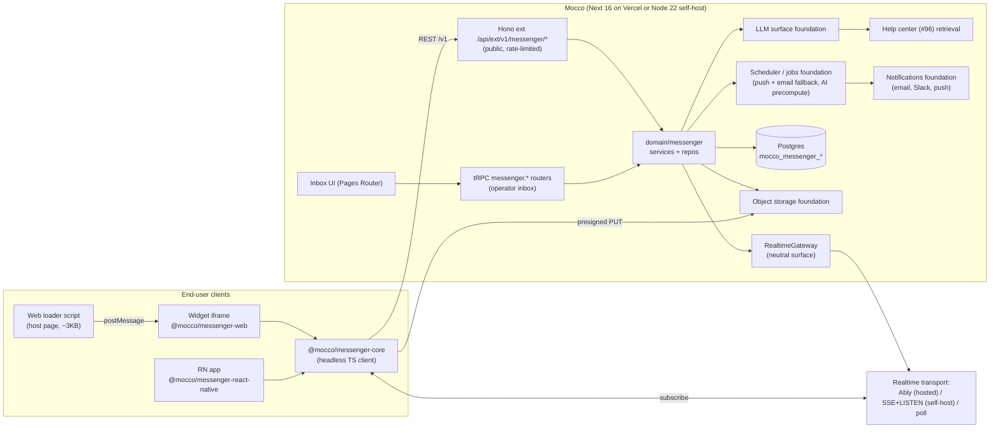

# Messenger — implementation design

GitHub issue: fi-workers/mocco#95 (epic #104).

## Goals / non-goals

**Goals**
- End users of a customer's product can start a conversation from a **web widget** (script snippet or npm) or a **React Native** app (`@mocco/messenger-react-native`). The RN SDK is pure JS and runs in Expo Go.
- Anonymous by default. `identify()` upgrades a visitor to a known contact only with a **verified** identity: HMAC-SHA256 of the user id, or a JWT signed with the app's identity secret, or (later) a Mocco end-user identity token.
- Context is attached automatically: app version, build, platform, OS, locale, timezone, URL or screen, and SDK version.
- **Team inbox** in the Mocco UI: status (open/snoozed/closed), assignee, unread counts, filters in `searchParams`, internal notes, image attachments, a user sidebar, and round-robin assignment.
- **Delivery:** realtime while online; push (Expo push, FCM, APNs) and email fallback when the contact is offline; browser and Slack notifications to operators.
- **AI assist:** an operator-triggered (or auto-precomputed) reply draft grounded in help-center (#96) articles, with citations. A human always sends.
- **Mocco wedge:** a release-context panel that maps the contact's reported app version and environment to Mocco releases, runs, OTA bundles and flags.
- Runs on Vercel (serverless) **and** self-hosted Node 22 + Postgres, with no mandatory third-party vendor.

**Non-goals (v1)**
- An autonomous AI agent, campaigns or outbound messages, product tours, and chatbots/workflow builders.
- Email-in, Kakao, WhatsApp and Instagram channels, and reply-by-email parsing.
- Native iOS/Android SDKs and Flutter.
- CSAT, SLAs and teams/skills routing. v1 has one inbox per app plus round robin.

## User flows

1. **Setup (operator).** Enable Messenger on an app in the workspace. Mocco shows the **public app key** (`mk_pub_...`, safe to embed) and generates an **identity secret** (`mk_sec_...`, shown once, rotatable, with a 24h dual-secret overlap). The operator sets allowed origins and RN bundle ids, toggles "require verified identity", and optionally uploads push credentials (Expo access token, FCM service account, APNs .p8 key).
2. **Anonymous visitor (web).** The loader script creates an iframe from the widget origin. `POST /v1/messenger/sessions` with the public key returns a visitor token (opaque, stored in iframe-partitioned storage) and a short-lived session JWT. The visitor opens the launcher, types a message, and a conversation is created. Operators see it live.
3. **Identify.** The customer's backend computes `hmac_sha256(identitySecret, userId)`, or signs a JWT `{ sub, email?, name?, iat, exp <= 24h }`. The client calls `Mocco.identify({ userId, userHash, traits })`. The server verifies the signature in constant time, then upserts the contact by `(app_id, external_user_id)`. The anonymous visitor's current-device conversations are **merged into** the identified contact; merging never happens by email match. If "require verified identity" is on, unsigned identify returns 401.
4. **Operator reply.** The operator opens the inbox (tRPC), sees the conversation with its sidebar (traits, context, recent conversations, release context), and optionally clicks **Suggest reply**. The draft shows citations to articles. The operator edits, then sends or adds an internal note. The message is persisted, then a realtime poke goes to the contact's channel.
5. **Offline contact.** If no read receipt or live connection arrives within `pushDelaySeconds` (default 0 for push) or `emailDelayMinutes` (default 10), the scheduler job sends push to the contact's registered tokens and then email (if the contact is identified with an email and has not read). The email carries a signed deep link back into the conversation, not reply-by-email.
6. **RN app.** `<MessengerProvider appKey>` wraps the app. `useMessenger().identify(...)`, `<MessengerScreen />`, `useUnreadCount()`, and `registerPushToken({ provider: 'expo' | 'fcm' | 'apns', token })`. A push tap calls `handleNotification(response)`, which opens the conversation.

## Architecture



- **Hono `ext/` `/v1`** carries every end-user-facing call. It is public, versioned and CORS-enabled for allowlisted origins (ADR 0011). Widget traffic never goes through tRPC.
- **tRPC** carries operator inbox, settings, and AI suggestion calls, all workspace-member-authorized.
- **SDK packages** (SDK packaging foundation):
  - `@mocco/messenger-core`: headless client. It owns session/token refresh, the REST client, local message cache and cursor, an outbox with `clientMessageId` retries, transport selection (realtime adapter, then SSE, then poll), and a zod-parsed wire format from `@mocco/common/messenger`.
  - `@mocco/messenger-web`: the iframe app (Preact or React, CSS isolated by the iframe), plus the loader and a `window.Mocco` command queue. It is also published to npm as `import { Messenger } from '@mocco/messenger-web'`.
  - `@mocco/messenger-react-native`: pure-TS RN components with no native module. Optional peers: `expo-notifications` or `@react-native-firebase/messaging` (the app passes tokens in; the SDK never imports a push library), and `@react-native-async-storage/async-storage` for token persistence.
- **Background jobs** (scheduler/jobs foundation):
  - `messenger.deliverOffline(conversationId, seq)`: push, then delayed email.
  - `messenger.aiPrecompute(conversationId, seq)`: optional; drafts a suggestion when a contact message arrives.
  - `messenger.attachmentsSweep`: deletes `pending` uploads older than 24h.
  - `messenger.snoozeWake`: reopens conversations whose `snoozed_until` has passed.

### Realtime decision (the main decision)

**Principle: Postgres is the source of truth; realtime is only a "poke".** Every message gets a monotonic per-conversation `seq`. Realtime events carry `{ conversationId, seq, kind }` and at most a message payload for latency. Clients always reconcile with `GET .../messages?afterSeq=` and a cheap sync endpoint. A dropped event therefore never loses data, and the vendor can be swapped.

| Option | Vercel | Self-host | Cost | Notes |
|---|---|---|---|---|
| **Polling** (adaptive: 3s when panel open, 20–60s idle, ETag/304) | Y | Y | Function invocations | Zero dependencies. Always-on fallback. Poor idle cost at scale. |
| **SSE** from our function | Only up to function max duration (800s on Pro Fluid, 1800s beta), and needs a cross-instance fan-out source ([Vercel limits](https://vercel.com/docs/functions/limitations)) | **Y**, long-lived Node process + Postgres `LISTEN/NOTIFY` on a direct (non-pooled) connection | Memory-time on Vercel (unverified how Fluid bills idle streams) | Good self-host default. Reconnect with `Last-Event-ID` = seq. |
| **Vercel native WebSockets** | Public beta since 2026-06-22. Next.js only via `experimental_upgradeWebSocket`; connections close at max duration; cross-instance fan-out needs Redis ([changelog](https://vercel.com/changelog/websocket-support-is-now-in-public-beta), [docs](https://vercel.com/docs/functions/websockets)) | N/A | Active CPU + transfer | Revisit at GA. Too new, and still needs Redis pub/sub. |
| **Ably** | Y (token auth from our REST) | Y (SaaS, works from anywhere) | Free 6M msgs/mo, 200 conns; Standard $29 + $2.50/M msgs + $1.00/M conn-min ([Ably pricing](https://ably.com/docs/platform/pricing)) | Per-channel capability tokens, connection recovery, history/rewind, first-class RN (ably-js). Linear pricing. |
| **Pusher Channels** | Y | Y (SaaS) | Sandbox 100 conns/200k msgs/day; $49 for 500 conns, $299 for 5k ([pricing](https://pusher.com/channels/pricing/)) | Connection-capped tiers get expensive for always-connected widgets. |
| **Supabase Realtime** | Y (prod DB already on Supabase) | Self-host = run the Elixir Realtime server | Free 200 conns / 2M msgs; Pro 500 conns; $10 per 1k peak conns, $2.50/M msgs; broadcast counts 1 + N recipients ([docs](https://supabase.com/docs/guides/realtime/pricing)) | Couples the product to our DB vendor; heavier self-host. |
| **Cloudflare Durable Objects / PartyServer** | Separate deploy (Workers) | N | $0.15/M requests, duration only when not hibernated ([DO pricing](https://developers.cloudflare.com/durable-objects/platform/pricing)) | Excellent tech, but it is a second runtime outside "single Vercel deploy + self-host Node". |

**Recommendation.**
1. Define a neutral `RealtimeGateway` (server publish + client token minting) and a `RealtimeTransport` client interface in `@mocco/messenger-core`.
2. v1 adapters:
   - **`poll`** is always available and is the fallback on every client.
   - **`ably`** is the hosted default on Vercel (`REALTIME_PROVIDER=ably`, `REALTIME_API_KEY`; env names are ours).
   - **`sse`** is the self-host default, used when running as a long-lived Node server (`REALTIME_PROVIDER=sse`). An in-process hub is fed by Postgres `LISTEN/NOTIFY` on `REALTIME_DATABASE_URL`, a session-mode connection string. The transaction pooler cannot hold `LISTEN`.
3. Mocco cloud runs Ably. A self-hoster gets working realtime with zero vendors (SSE), or can bring an Ably key.
4. Record this in an ADR ("Realtime is a poke over Postgres truth; Ably hosted, SSE self-host"). Re-evaluate Vercel WebSockets at GA, since it could replace Ably on Mocco cloud once paired with a Redis fan-out.

Channel naming: `msgr:{appId}:contact:{contactId}` (the contact's own conversations) and `msgr:{appId}:inbox` (operators, workspace members only). Ably tokens are minted with `subscribe` capability on exactly those channels and a TTL of 1h. Only the server publishes.

## Domain model

All tables carry `workspace_id` (denormalized, for scoping) and `app_id` (the project/app entity foundation). Ids are `uuid defaultRandom()`, with `created_at`/`updated_at` helpers.

| Table | Columns (sketch) | Invariants / indexes |
|---|---|---|
| `mocco_messenger_settings` | `app_id` PK FK, `workspace_id`, `public_key` (unique), `identity_secret_enc`, `identity_secret_prev_enc`, `prev_expires_at`, `require_verified_identity` bool, `allowed_origins` text[], `allowed_bundle_ids` text[], `email_fallback_minutes` int, `ai_precompute` bool, `branding` jsonb, `enabled` bool | Secrets encrypted with the server key (`MESSENGER_ENCRYPTION_KEY`, or the foundation's secrets surface); never returned after creation. `mocco_messenger_settings_public_key_uq` |
| `mocco_messenger_contacts` | `id`, `workspace_id`, `app_id`, `kind` (Anonymous/Identified), `external_user_id` null, `end_user_id` null (end-user identity foundation), `email`, `name`, `traits` jsonb, `last_context` jsonb, `last_seen_at`, `blocked_at` | `mocco_messenger_contacts_app_external_uq (app_id, external_user_id) where external_user_id is not null`; `(workspace_id, last_seen_at)` |
| `mocco_messenger_visitor_sessions` | `id`, `contact_id`, `app_id`, `token_hash` (sha256 of the opaque visitor token), `platform`, `user_agent`, `ip_prefix`, `expires_at`, `revoked_at` | Unique `token_hash`. Raw token never stored. |
| `mocco_messenger_conversations` | `id`, `workspace_id`, `app_id`, `contact_id`, `status` (Open/Snoozed/Closed), `snoozed_until`, `assignee_member_id` null, `last_message_seq` int, `last_message_at`, `last_contact_message_at`, `contact_last_read_seq`, `preview` text, `context_at_open` jsonb, `closed_at` | `(workspace_id, app_id, status, last_message_at desc)` for the inbox list; `(contact_id, last_message_at desc)`; `(assignee_member_id, status)` |
| `mocco_messenger_messages` | `id`, `conversation_id`, `workspace_id`, `seq` int, `author_kind` (Contact/Operator/System/Ai), `author_member_id` null, `visibility` (Public/Internal), `body` text (max 8 KB), `client_message_id` null, `context` jsonb, `suggestion_id` null, `created_at`, `deleted_at` | `mocco_messenger_messages_conv_seq_uq (conversation_id, seq)`; `..._conv_client_uq (conversation_id, client_message_id)` for idempotent sends. `Internal` is never served on `/v1`. |
| `mocco_messenger_attachments` | `id`, `workspace_id`, `conversation_id`, `message_id` null, `storage_key`, `content_type`, `size_bytes`, `width`, `height`, `sha256`, `status` (Pending/Ready/Rejected), `uploader_kind` | Pending attachments are swept after 24h. They can only attach to a message in the same conversation. |
| `mocco_messenger_operator_reads` | `conversation_id`, `member_id`, `last_read_seq` | PK `(conversation_id, member_id)`. Unread = `last_message_seq > last_read_seq`. |
| `mocco_messenger_inbox_members` | `app_id`, `member_id`, `available` bool, `last_assigned_at` | PK `(app_id, member_id)`. Round robin picks the available member with the oldest `last_assigned_at` under `pg_advisory_xact_lock(messengerAssign, hashtext(app_id))`. |
| `mocco_messenger_push_tokens` | `id`, `app_id`, `contact_id`, `provider` (Expo/Fcm/Apns), `token`, `platform`, `environment` (sandbox/production for APNs), `last_seen_at`, `disabled_at`, `failure_count` | `..._app_token_uq (app_id, token)`: a token moves to the latest contact on re-register. Invalid-token responses disable the token. |
| `mocco_messenger_push_credentials` | `app_id`, `provider`, `credentials_enc`, `updated_by` | PK `(app_id, provider)`. Write-only from the UI. |
| `mocco_messenger_ai_suggestions` | `id`, `conversation_id`, `for_seq`, `draft`, `sources` jsonb (`[{articleId, chunkId, title, url}]`), `model`, `input_tokens`, `output_tokens`, `latency_ms`, `outcome` (Shown/SentAsIs/SentEdited/Dismissed), `created_by` | `(conversation_id, for_seq)`. Feeds a quality metric. |
| `mocco_messenger_saved_replies` | `id`, `workspace_id`, `app_id` null, `title`, `body`, `created_by` | Also a retrieval source for AI drafts. |

**Key invariants**
- **Seq allocation:** `UPDATE mocco_messenger_conversations SET last_message_seq = last_message_seq + 1 ... RETURNING` and the message insert run in one transaction. The row lock serializes concurrent sends, and the unique `(conversation_id, seq)` constraint is the backstop.
- **Idempotency:** a retried send with the same `client_message_id` returns the existing message, never a duplicate.
- **Tenancy:** every `/v1` query is scoped by the `app_id` derived from the verified session token, never from the request body. Every tRPC call is `assertMember(workspaceId)`, and the repo also filters by `workspace_id`.
- **Merge:** anonymous to identified happens only through the same visitor session. When a contact merges, its conversations move and the old contact is tombstoned.
- **Audit:** secret rotation, push-credential change, contact block, and settings changes go to `mocco_audit_log` via `AuditService`. Messages do not.

## Backend modules

```
packages/backend/src/domain/messenger/
  MessengerSettingsService.ts   # enable app, keys, rotate secret, origins, push creds (encrypted)
  IdentityVerifier.ts           # HMAC (timingSafeEqual) + JWT (HS256, exp/iat/aud checks); dual-secret window
  SessionService.ts             # visitor token issue/refresh, session JWT (aud=messenger, 1h), identify + merge
  ConversationService.ts        # create/list/get, status, snooze, assign (round robin), read cursors
  MessageService.ts             # send (contact/operator/note), seq + idempotency, publish poke, enqueue offline delivery
  AttachmentService.ts          # presign upload, confirm (size/type sniff), signed read URLs
  DeliveryService.ts            # offline job: push fan-out, then email fallback; token hygiene
  SuggestionService.ts          # retrieve (help center + saved replies) -> LLM draft with citations -> record outcome
  ReleaseContextService.ts      # map contact context (appVersion, platform, env) -> releases/runs/OTA/flags
  RateLimiter.ts                # neutral token-bucket surface
  errors.ts                     # ContactBlockedError, IdentityVerificationError, ConversationNotFoundError, ...
  constants.ts                  # ConversationStatuses, AuthorKinds, PushProviders, ... (as const)
  realtime/gateway.ts           # RealtimeGateway interface + factory by env
  realtime/ably.ts              # the ONLY 'ably' importer (publish + token request)
  realtime/pg-notify.ts         # the ONLY 'pg' LISTEN/NOTIFY user; in-process SSE hub
  realtime/noop.ts              # poll-only deployments
  push/sender.ts                # PushSender interface
  push/expo.ts                  # the ONLY 'expo-server-sdk' importer (throttling, receipts)
  push/fcm.ts                   # FCM HTTP v1 via service-account JWT (fetch, no firebase-admin)
  push/apns.ts                  # APNs HTTP/2 token auth (.p8 ES256), node:http2
  repos/settings.repo.ts, contacts.repo.ts, visitor-sessions.repo.ts, conversations.repo.ts,
  repos/messages.repo.ts, attachments.repo.ts, operator-reads.repo.ts, inbox-members.repo.ts,
  repos/push-tokens.repo.ts, push-credentials.repo.ts, ai-suggestions.repo.ts, saved-replies.repo.ts
  instance.ts                   # composition root
```

Neutral interfaces (types derived where possible):

```ts
export interface RealtimeGateway {
  publish(channel: RealtimeChannel, event: RealtimeEvent): Promise<void>; // best-effort, never throws to caller
  clientAuth(subject: RealtimeSubject): Promise<RealtimeClientAuth>;       // { transport: 'ably', tokenRequest } | { transport: 'sse', url } | { transport: 'poll' }
}
export interface PushSender {
  send(creds: PushCredentials, tokens: PushTarget[], note: PushNote): Promise<PushResult[]>; // result marks invalid tokens
}
export interface RateLimiter {
  take(key: string, rule: RateRule): Promise<{ allowed: boolean; retryAfterSec: number }>;
}
```

- `RateLimiter` default is a Postgres token bucket (`mocco_rate_buckets(key, tokens, refilled_at)`, updated in one statement). It is a foundation candidate. On Mocco cloud, Vercel Firewall rate-limit rules sit in front as the first line.
- The LLM call goes through the **LLM surface** foundation. Retrieval goes through help center (#96) `ArticleSearch.search(appId, query, k)`, which could be pgvector or full-text; that is #96's decision. Messenger depends only on the interface.
- Email and Slack go through the **notifications** foundation. The messenger passes a template id plus data.

## Public API / SDK surface

Base path: `/api/ext/v1/messenger` (Hono). Auth: `Authorization: Bearer <session JWT>`, except `POST /sessions`, which takes the public key. All bodies are zod-parsed from `@mocco/common/messenger`.

| Method | Path | Purpose |
|---|---|---|
| POST | `/sessions` | `{ appKey, visitorToken?, identity?, context }` → `{ sessionToken, expiresAt, visitorToken, contact, realtime }`. Origin/bundle-id checked. |
| POST | `/sessions/refresh` | Rotate the session JWT from the visitor token |
| POST | `/identify` | `{ userId, userHash } \| { jwt }`, plus `traits` → contact (merged) |
| POST | `/logout` | Revoke the visitor session; the client starts a new anonymous session |
| GET | `/sync?cursor=` | Changed conversations since the cursor + total unread (cheap; ETag). Drives polling. |
| GET | `/conversations` | The contact's conversations (paged) |
| POST | `/conversations` | Start a conversation with a first message |
| GET | `/conversations/:id/messages?afterSeq=&limit=` | Public messages only |
| POST | `/conversations/:id/messages` | `{ clientMessageId, body?, attachmentIds?, context }` |
| POST | `/conversations/:id/read` | `{ seq }` |
| POST | `/attachments` | `{ conversationId, contentType, sizeBytes, sha256 }` → `{ attachmentId, uploadUrl, headers }` (presigned PUT) |
| POST | `/attachments/:id/complete` | Server HEADs the object, sniffs magic bytes → Ready/Rejected |
| POST/DELETE | `/push-tokens` | Register or unregister `{ provider, token, platform, environment }` |
| POST | `/realtime/auth` | Mint a transport credential for the contact channel |
| GET | `/stream` | SSE (self-host adapter only); `Last-Event-ID` = last seq cursor |

Widget assets are served as static files at `https://<cdn>/messenger/v1/loader.js` and `/messenger/v1/frame.html`. They are versioned and immutable-cached, and the loader is small and stable.

tRPC (`messenger.*`, `protectedMessengerProcedure` maps messenger domain errors): `inbox.list({ appId, status, assignee, unread, q, cursor })`, `conversation.get`, `conversation.reply`, `conversation.note`, `conversation.setStatus`, `conversation.snooze`, `conversation.assign`, `conversation.markRead`, `contact.get` (sidebar + release context), `contact.block`, `suggestion.create`, `suggestion.recordOutcome`, `settings.get/update`, `settings.rotateSecret`, `settings.setPushCredentials`, `inboxMembers.set`, `savedReplies.*`, `realtime.operatorAuth`.

SDK sketch:

```ts
// web — script snippet
<script>
  (function(w,d){w.Mocco=w.Mocco||function(){(w.Mocco.q=w.Mocco.q||[]).push(arguments)};
   var s=d.createElement('script');s.async=1;s.src='https://cdn.mocco.club/messenger/v1/loader.js';d.head.appendChild(s)})(window,document);
  Mocco('boot', { appKey: 'mk_pub_...' });
</script>

// web — npm
import { Messenger } from '@mocco/messenger-web';
const m = Messenger.boot({ appKey: 'mk_pub_...', context: { appVersion: '4.2.1' } });
await m.identify({ userId: 'u_123', userHash, traits: { plan: 'pro' } }); // or { jwt }
m.show(); m.hide(); m.onUnreadChange((n) => setBadge(n)); m.logout();

// react native
import { MessengerProvider, MessengerScreen, useMessenger, useUnreadCount } from '@mocco/messenger-react-native';
<MessengerProvider appKey="mk_pub_..." context={{ appVersion: Application.nativeApplicationVersion, build: Application.nativeBuildVersion }}
  storage={AsyncStorage}>
  <App />
</MessengerProvider>
const { identify, registerPushToken, handleNotification, logout } = useMessenger();
await identify({ jwt });                                       // minted by customer's backend
await registerPushToken({ provider: 'expo', token: (await Notifications.getExpoPushTokenAsync()).data });
const unread = useUnreadCount();
<MessengerScreen onClose={nav.goBack} theme={{ accent: '#4f46e5' }} />
```

Server helper for customers: `@mocco/messenger-node` exports `signUserHash(secret, userId)` and `signIdentityJwt(secret, claims)`. It is tiny and uses `node:crypto` only.

## External vendors & self-host story

| Concern | Mocco cloud (Vercel) | Self-host (Node 22 + Postgres) | Env (ours) |
|---|---|---|---|
| Realtime | Ably adapter | SSE + `LISTEN/NOTIFY` (needs session-mode connection), or Ably if a key is given, or poll-only | `REALTIME_PROVIDER`, `REALTIME_API_KEY`, `REALTIME_DATABASE_URL` |
| Push | Expo push service (free, 600 notifications/s per project ([Expo FAQ](https://docs.expo.dev/push-notifications/faq/))), direct FCM HTTP v1, APNs token auth, using the **customer's** credentials per app | Same (outbound HTTPS only) | Credentials in DB (encrypted), `MESSENGER_ENCRYPTION_KEY` |
| Email | Notifications foundation (its provider) | Same, SMTP adapter | Foundation-owned |
| Attachments | Object storage foundation (S3-compatible or Vercel Blob adapter) | S3-compatible (MinIO) or local disk adapter | Foundation-owned |
| LLM | LLM surface foundation | Same; AI assist is disabled when unconfigured | Foundation-owned |
| Rate limiting | Vercel Firewall + Postgres token bucket | Postgres token bucket | none |

Push decision: support **both Expo push and direct FCM/APNs** behind `PushSender`. Expo push is simplest for Expo apps (most RN apps today) and ships first. FCM/APNs follow in the same slice family for bare RN and for teams that already hold device tokens. The SDK takes a token plus provider, so it is agnostic about the notification library.

## Security & abuse

- **Two credentials.** The public app key only identifies the app. It is embedded and not secret, so it grants nothing without origin/bundle checks and rate limits. The identity secret stays on the customer's server; Mocco stores it encrypted, and it is rotatable with a 24h overlap.
- **Identity verification.** For HMAC, compare against `hmac_sha256(secret, userId)` hex with `timingSafeEqual`. For JWT, accept HS256 only (reject `alg: none` and asymmetric algorithm confusion), require `sub`, `exp` ≤ 24h, `iat`, and `aud` in (`mocco-messenger`, appId); allow skew ±60s. When `require_verified_identity` is on (the default for new apps, and strongly recommended), any unverified `identify` fails with 401. Anonymous chat remains a separate toggle.
- **Session tokens.** The visitor token is an opaque 256-bit value, stored hashed, lives 180 days, and slides. The session JWT is HS256 with a server key, `aud=messenger`, and lasts 1h; it carries `appId`, `contactId` and `sessionId`. Revocation checks against `visitor_sessions.revoked_at` happen on refresh.
- **Web isolation.** Tokens live inside the widget iframe origin, never in the host page. postMessage only accepts from the known frame origin and validates payloads with zod. Third-party storage partitioning is fine because the visitor is per top-level site. Safari ITP purges can drop anonymous history, which is acceptable because identified users restore on identify.
- **CORS/origin.** `/v1` allows only `allowed_origins`. RN requests carry an `X-Mocco-Bundle-Id` header checked against `allowed_bundle_ids`. This is spoofable and is defense-in-depth only; rate limits are the real control.
- **Rate limits (defaults):**
  - sessions: 10 per minute per IP and 1,000 per hour per app
  - messages: 20 per minute per contact
  - new conversations: 5 per hour per contact
  - attachments: 10 per hour per contact, 10 MB each, `image/png|jpeg|webp|gif` plus `application/pdf`
  - identify: 10 per minute per session
  All return 429 with `Retry-After`. There is also a per-app daily hard cap so a runaway client or abuse cannot run up costs.
- **Content.** Bodies are plain text with markdown-lite rendered as sanitized output; operator HTML is never interpreted. URLs are link-ified with `rel="noopener noreferrer nofollow"`. Attachment type is sniffed by magic bytes, served from a separate storage origin with `Content-Disposition: attachment` for non-images, and read URLs are short-lived signed links.
- **Abuse tools.** Operators can block a contact (hard reject on `/v1`). An optional Turnstile/hCaptcha challenge on anonymous session creation can be switched on under attack (adapter; later).
- **AI safety.** Retrieved article text is wrapped as quoted data; the model is instructed to cite and never follow instructions found in customer messages. The draft is never auto-sent. PII redaction of traits before prompting is configurable.
- **Privacy.** Contact deletion (GDPR/PIPA) is a hard delete of contact, messages and attachments, with an audit entry of the deletion event only. Retention settings per app come later.

## Scale / performance notes

- The inbox list index is `(workspace_id, app_id, status, last_message_at desc)` with keyset pagination. Unread comes from `last_message_seq` versus the read cursor, with no counting queries.
- Polling cost: `/sync` is a single indexed query plus ETag. The client backs off to 60s when the panel is closed and the tab is hidden, and uses realtime when available. At 10k concurrently open widgets with 30s idle polling, that is about 330 req/s. This is why Mocco cloud uses Ably, where 10k connections fit the Standard package.
- Message publish happens after commit (outbox-free "at most once" poke; the poll/sync corrects misses). A publish failure is logged, not surfaced.
- Push fan-out runs in jobs. The Expo sender respects 600/s. Receipts are checked in a follow-up job so invalid tokens get disabled.
- Attachments go directly to object storage through a presigned PUT and never stream through functions.
- AI drafts: retrieve k = 5 chunks, cap context at about 4k tokens, stream the draft to the operator over tRPC (or poll the suggestion row). Precompute is optional and per-app to control cost.

## Dependencies on platform foundations

- **Project/app entity:** conversations, contacts and settings belong to an app inside a workspace. This answers the issue's open question: app-scoped, with `workspace_id` denormalized.
- **End-user identity (#100 layer 1):** `contacts.end_user_id`, and accepting a Mocco end-user token in `/identify` (a later slice). HMAC/JWT works without it.
- **LLM surface:** suggested replies.
- **Scheduler / jobs:** offline delivery, snooze wake, sweeps, AI precompute.
- **Public rendering:** not needed. The widget is a static asset bundle, not a crawlable page.
- **Custom domains:** optional later, to serve the widget and API from `chat.customer.com`.
- **Object storage:** attachments.
- **SDK packaging:** `@mocco/messenger-core`, `-web`, `-react-native` and `-node`, plus the `/v1` ext surface conventions (versioning, CORS, error envelope).
- **Notifications:** operator Slack/browser and contact email.
- **Realtime:** `RealtimeGateway` should be promoted to a foundation. Status page (#103), forum (#97) and flags (#101) streaming can reuse it; the messenger is its first consumer.
- **Billing/metering:** meter MAC (monthly active contacts, meaning contacts with at least one message in the month), operator seats, and AI suggestions.

## Testing strategy (pglite)

- **Repos:** seq allocation under concurrent sends (two transactions against pglite, asserting unique contiguous seqs); idempotent `client_message_id`; keyset pagination; the round-robin advisory lock.
- **Services:**
  - `IdentityVerifier`: known-answer vectors for HMAC; JWT with wrong alg, expired, wrong aud, and prior-secret-within-overlap cases.
  - `SessionService`: anonymous-to-identified merge, and that email never merges.
  - `MessageService`: internal notes are never visible via `/v1` reads.
  - `DeliveryService`: a fake `PushSender` and a fake notifications port, both constructor-injected; covers the delay logic and invalid-token disabling.
- **Transport:**
  - Hono app tests via `app.request()`: origin rejection, 429 with Retry-After, a cross-app token cannot read another app's conversation, and body size limits.
  - tRPC `createCaller` cross-tenant tests: a non-member cannot list, reply, rotate, or read the sidebar.
- **Realtime:** a gateway contract test suite run against `noop` and the in-process SSE hub. Ably is covered by a recorded-fetch fake (no network).
- **SDK:** `@mocco/messenger-core` unit tests against a local Hono instance over pglite (reconnect, cursor catch-up, outbox retry). RN components get React Native Testing Library smoke tests. No e2e on real devices in CI.

## Open questions / ADRs needed

1. **ADR: Realtime surface.** "Postgres is truth, realtime is a poke; Ably on Mocco cloud, SSE + LISTEN/NOTIFY on self-host, poll everywhere." Includes the session-mode `REALTIME_DATABASE_URL` requirement.
2. **ADR: Widget delivery.** A cross-origin iframe with a postMessage API versus a shadow-DOM script. Recommended: iframe, for token isolation and CSS safety.
3. **ADR: Encryption of stored customer secrets** (identity secrets, push credentials). This should likely be a platform foundation shared with OTA signing keys.
4. Pricing unit: MAC plus seats versus seats only. How are AI drafts metered (included credits)?
5. Should the anonymous visitor token be exchangeable across web and RN for the same user? Proposal: no, identify is the bridge.
6. Retrieval backend for AI drafts: pgvector availability on self-host Postgres and pglite (a #96 decision).
7. Release-context mapping: how does a contact's `appVersion`/build map to a Mocco release? This depends on OTA (#99) and a release entity; v1 can match by the version string on the latest successful run's tag (heuristic).
8. When Vercel WebSockets reaches GA, should it replace Ably on Mocco cloud (it needs Redis/fan-out)?
