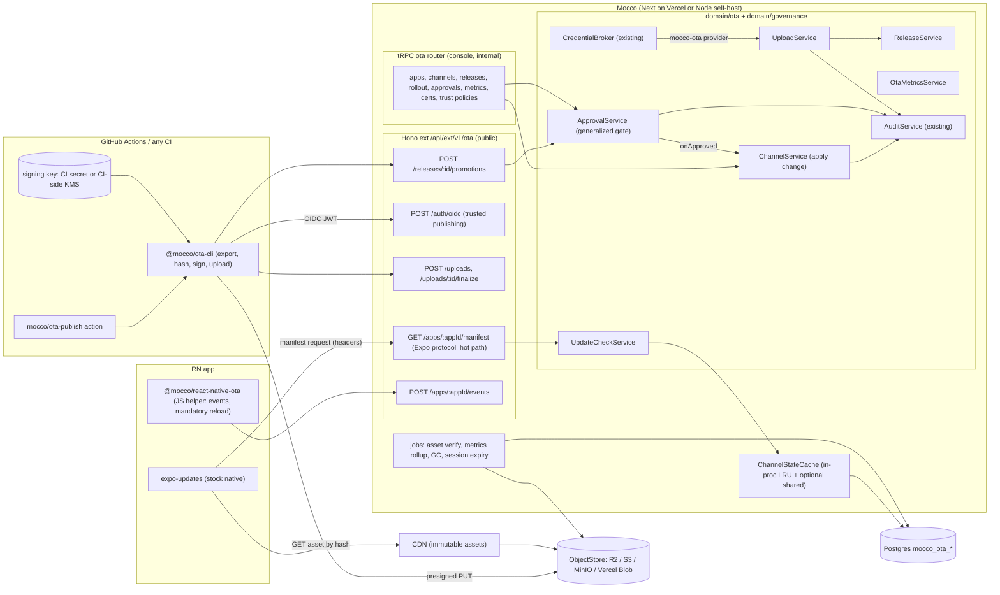

# OTA release management — implementation design

Issue: fi-workers/mocco#99 (epic #104). Research: `../research/ota-competitors.md`.

> **Scope update (2026-09-25).** This document is the design for **phase 3, Expo Updates hosting**. The phase order, the direction rules with post-hoc review, the protocol-neutral domain changes and the other phases are in the [release control design](./2026-09-25-ota-release-control-design.md), which wins where the two disagree.

## 1. Goals / non-goals

### Goals (v1)

1. **Stock client.** React Native apps (Expo or bare) receive updates through the unmodified `expo-updates` native module. Mocco implements the server side of the **Expo Updates protocol v1** ([spec](https://docs.expo.dev/technical-specs/expo-updates-1/)).
2. **Upload from CI without long-lived tokens.** GitHub Actions uploads through OIDC trusted publishing. Mocco-dispatched runs receive a gate-bound upload credential from the existing `CredentialBroker`.
3. **Integrity.**
   - Every update is code-signed in CI with the customer's key. Mocco stores only certificates, verifies each signature at upload, and serves the exact signed bytes.
   - A compromised Mocco database, object store or CDN cannot produce an update that a device accepts.
4. **Channels, promotion and rollouts.**
   - Channels such as `staging` and `production`. A release is promoted, not re-uploaded.
   - Percentage rollout is deterministic per device, and can be paused, resumed, increased and completed.
   - **Instant rollback** to the previous release, to the embedded bundle, or by disabling a release.
5. **Governance.**
   - On a **protected channel**, every change (promote, raise the rollout, complete, re-enable) is an approval request under the existing gate rules: N-of-M distinct principals by role, `prevent_self`, `reason_required`.
   - Rollback and pause are never gated, but they are audited.
   - Every OTA action appends to the per-workspace audit hash chain.
6. **Adoption metrics.** Active devices per release, rollout reach, and emergency-launch (crash fallback) rate per release.
7. **Runs everywhere.** Runs on Vercel and on a self-host (Node 22 + Postgres + S3-compatible storage).

### Non-goals (v1)

- A custom native updater. CodePush wire compatibility for `react-native-code-push` clients (possible v2 migration shim).
- Server-generated bsdiff patches (v1.1; the protocol and the SDK 56 client already support them).
- Automatic rollback on crash-rate regression (needs crash telemetry; v1 exposes the emergency-launch signal only).
- Flutter or Capacitor clients.
- **Native store release management** (App Store Connect phased release, Google Play track promotion). This is phase 2; section 13 sketches it so the v1 model does not block it.

## 2. User flows

1. **Set up an app.**
   - The operator creates an OTA app inside a project (the platform-foundations project/app entity) and gets an `appId`, an update URL and an asset base URL.
   - They run `npx mocco-ota init`. It generates a signing key pair plus a self-signed certificate, uploads the certificate, and writes the Expo config: `updates.url`, `updates.requestHeaders["expo-channel-name"]`, `updates.codeSigningCertificate` and `updates.codeSigningMetadata {keyid, alg: "rsa-v1_5-sha256"}`.
   - The private key goes into a CI secret or a CI-side KMS, never into Mocco.
   - They mark `production` as protected. The policy uses the same shape as `GateRequirements`, for example `resume: [{role: release-manager, count: 1}]`, `prevent_self: true`, `reason_required: true`.
2. **Trust CI.** The operator adds a trust policy for the app. It pins the GitHub repository id, a ref pattern (`refs/heads/main`, `refs/tags/v*`), an optional workflow file and environment, and the channels CI may promote to directly (unprotected channels only).
3. **Publish from CI.**
   - The `mocco/ota-publish` action (or `mocco-ota publish`) runs `expo export`, exchanges the job's OIDC token for a 15-minute upload session, and uploads only the assets whose hashes Mocco lacks.
   - It builds and signs one manifest per platform, plus pre-signed rollback artifacts (section 6.3), and finalizes.
   - It auto-promotes to `staging`.
4. **Test on staging.** Staging builds, or production builds with a debug channel switcher, pick the update up on their next launch.
5. **Request promotion.**
   - `mocco-ota promote --release <id> --channel production --rollout 10`, from CI or the console, creates an **approval request** that pins the exact change.
   - Approvers get a notification (foundation). The console shows the release's git SHA, the Mocco run, the diff in bundle size and assets from the current production release, the staging adoption and emergency-launch rate, and who uploaded it.
6. **Approve.** Once the pinned requirements are met, the change applies atomically. Production then serves the release to 10% of devices, chosen by an `EAS-Client-ID` hash. An audit entry records the approvers and their roles.
7. **Increase or complete.** Moving to 50% or 100% is another approval request (a policy option can pre-authorize a rollout schedule in the original request, v1.1).
8. **Pause or roll back.** Anyone with the `ota:operate` permission can pause, roll back or disable at once, without a gate, because stopping is always safe. It is audited. Devices move to the pre-signed republish of the previous release, or to the embedded bundle.
9. **Watch adoption.** The release page shows active devices on each update, the rollout cohort, and the emergency-launch count.

## 3. Architecture



### Surface split

- **Hono `ext/`, versioned `/v1`, public.** The manifest endpoint, OIDC token exchange, upload sessions, promotion requests from CI, and client events. All of it is machine traffic, so none of it is on tRPC (ADR 0011). Paths live under `/api/ext/v1/ota/...`.
  - The manifest URL is baked into app binaries, so it is a **permanent contract**. Once the custom-domains foundation lands, it can sit on a dedicated host (`u.mocco.club/v1/ota/...`) that rewrites to the same handler.
- **tRPC `ota` router, internal.** Everything the console does. Protected-channel mutations never apply directly: they return an approval request.
- **SDK packages** (SDK packaging foundation):
  - `@mocco/ota-cli`: Node CLI with `init`, `publish`, `promote`, `rollback` and `keys`.
  - `mocco/ota-publish`: a composite GitHub Action that wraps the CLI, with the action and its dependencies SHA-pinned.
  - `@mocco/react-native-ota`: a JS-only package plus an Expo config plugin. There is no native code.
- **Background jobs** (scheduler/jobs foundation):
  - `ota.verifyAssets`: re-hash uploaded objects and mark a release `ready`.
  - `ota.rollupMetrics`: hourly aggregation into daily adoption.
  - `ota.gcAssets`: remove assets unreferenced for more than 30 days after their releases are deleted.
  - `ota.expireSessions`.
  - `approval.expire`: shared with governance.

## 4. Domain model

Every table has a uuid PK (`defaultRandom()`) and a `workspace_id` FK with `ON DELETE CASCADE` for tenant scoping, plus `created_at` and `updated_at` where the rows are mutable. Types are sketched.

### 4.1 OTA tables

**`mocco_ota_apps`**
- **Columns:**
  - `id`, `workspace_id`, `project_id` (foundation FK), `slug`, `name`.
  - `asset_base_url` text: fixed at creation, because it is baked into signed manifests.
  - `signing_required` bool, default true.
  - `created_at`.
- **Indexes:** unique `(workspace_id, slug)`.

**`mocco_ota_signing_certificates`**
- **Columns:**
  - `id`, `workspace_id`, `app_id`, `keyid`.
  - `certificate_pem`, `spki_sha256`, `not_after`.
  - `status` (`active` | `retired`), `created_by_user_id`, `created_at`.
- **Indexes:** unique `(app_id, keyid)`.

**`mocco_ota_channels`**
- **Columns:**
  - `id`, `workspace_id`, `app_id`, `name`.
  - `protected` bool.
  - `policy` jsonb, typed as `GateRequirements`, nullable when unprotected.
  - `access_key_hash` text, nullable: optional gate for pre-release channels.
  - `created_at`, `updated_at`.
- **Indexes:** unique `(app_id, name)`.
- **Check:** `protected` implies `policy IS NOT NULL`.

**`mocco_ota_releases`**
- **Columns:**
  - `id`, `workspace_id`, `app_id`, `runtime_version`.
  - `message`, `git_sha`, `repo_id` (nullable FK `mocco_repos`), `run_id` (nullable FK `mocco_runs`).
  - `uploaded_by_user_id` (nullable) and `uploaded_by_principal` text (e.g. `github:repo:123:ref:refs/heads/main`).
  - `status` (`uploading` | `verifying` | `ready` | `failed` | `disabled`).
  - `mandatory` bool.
  - `created_at`.
- **Indexes:** `(app_id, runtime_version, created_at desc)`.

**`mocco_ota_updates`** (one servable Expo "update" per platform)
- **Columns:**
  - `id`: the Expo update id, a uuid generated in CI and not DB-defaulted. This is the one exception to the DB-generated PK rule, because the id is part of the signed manifest.
  - `workspace_id`, `app_id`, `release_id`, `platform` (`ios` | `android`), `runtime_version`.
  - `kind` (`original` | `republish`).
  - `content_of_update_id`: self for originals; for a republish, the original whose assets it reuses.
  - `supersedes_update_id`, nullable: for a republish, the update it is valid to roll back *from*.
  - `commit_time` timestamptz: the manifest `createdAt`.
  - `manifest_body` text: the exact signed bytes. Never re-serialized.
  - `signature` text (the SFV `sig`), `keyid`.
  - `launch_asset_hash`, `total_bytes`, `created_at`.
- **Indexes:**
  - unique `(release_id, platform, kind, supersedes_update_id)` (nulls not distinct).
  - `(app_id, platform, runtime_version, commit_time)`.

**`mocco_ota_signed_directives`**
- **Columns:**
  - `id`, `workspace_id`, `app_id`, `platform`, `runtime_version`.
  - `type` (`noUpdateAvailable` | `rollBackToEmbedded`).
  - `commit_time`, nullable.
  - `supersedes_update_id`, nullable.
  - `body` text: exact signed bytes. `signature`, `keyid`.
- **Indexes:** unique `(app_id, keyid, type, supersedes_update_id)`.

**`mocco_ota_assets`**
- **Columns:**
  - `workspace_id`, `app_id`.
  - `hash`: base64url SHA-256, as the spec requires.
  - `content_type`, `file_extension`, `size_bytes`, `storage_key`.
  - `verified_at`, nullable. `created_at`.
- **PK:** `(app_id, hash)`. Assets are content-addressed and deduplicated across releases.

**`mocco_ota_update_assets`**
- **Columns:** `update_id`, `app_id`, `asset_hash`, `key`, `is_launch`.
- **PK:** `(update_id, asset_hash)`. Used for GC and integrity checks.

**`mocco_ota_channel_heads`** (the serving state)
- **Columns:**
  - `workspace_id`, `channel_id`, `platform`, `runtime_version`.
  - `active_update_id`, nullable.
  - `candidate_update_id`, nullable.
  - `rollout_bp` smallint, 0..10000 basis points.
  - `rollout_salt` text.
  - `paused` bool.
  - `serve_directive_id`, nullable: set for roll-back-to-embedded.
  - `version` bigint: incremented on every change, used as the cache key.
  - `updated_at`.
- **PK:** `(channel_id, platform, runtime_version)`.

**`mocco_ota_deployments`** (append-only channel history)
- **Columns:**
  - `id`, `workspace_id`, `channel_id`, `release_id`.
  - `kind` (`promote` | `rollout` | `pause` | `resume` | `complete` | `rollback` | `rollback_embedded` | `disable`).
  - `from_bp`, `to_bp`.
  - `actor_user_id`, `actor_principal`.
  - `approval_request_id`, nullable.
  - `reason`, `created_at`.
- **Indexes:** `(channel_id, created_at desc)`.

**`mocco_ota_trust_policies`**
- **Columns:**
  - `id`, `workspace_id`, `app_id`.
  - `provider` (`github`).
  - `repository_id` bigint: numeric, so a repo rename cannot hijack the policy.
  - `ref_pattern`, `workflow_ref`, nullable. `environment`, nullable.
  - `allowed_channels` text[]: unprotected channels only.
  - `created_by_user_id`, `created_at`.

**`mocco_ota_upload_sessions`**
- **Columns:**
  - `id`, `workspace_id`, `app_id`.
  - `token_hash`: stored the same way as `callback-token.ts`.
  - `principal`, `trust_policy_id`, nullable. `run_id`, nullable.
  - `expires_at`, `release_id`, nullable. `created_at`.

**`mocco_ota_devices`** (latest state per install, for adoption)
- **Columns:**
  - `app_id`, `client_id_hash`: SHA-256 of `EAS-Client-ID` with a per-app pepper. The raw id is never stored.
  - `platform`, `runtime_version`, `channel`.
  - `current_update_id`, `embedded_update_id`.
  - `first_seen_at`, `last_seen_at`.
- **PK:** `(app_id, client_id_hash)`.
- **Indexes:** `(app_id, current_update_id, last_seen_at)`.

**`mocco_ota_client_events`**
- **Columns:**
  - `id`, `app_id`, `update_id`, `client_id_hash`.
  - `type` (`downloaded` | `launched` | `emergency_launch` | `error`).
  - `detail` jsonb (bounded), `occurred_at`.
- **Partitioning:** partition by month, or prune after 90 days.

**`mocco_ota_adoption_daily`** (rollup)
- **Columns:** `app_id`, `update_id`, `day`, `active_devices`, `new_devices`, `emergency_launches`.
- **PK:** `(app_id, update_id, day)`.

### 4.2 Governance tables (generalized gate, owned by `domain/governance`)

**`mocco_approval_requests`**
- **Columns:**
  - `id`, `workspace_id`.
  - `subject_type` (e.g. `ota.channel_change`), `subject_id`.
  - `action` jsonb: the pinned intended change, e.g. `{channelId, releaseId, toBp}`.
  - `requirements` jsonb: a `GateRequirements` snapshot taken at creation.
  - `requested_by_user_id`, nullable. `requested_by_principal`.
  - `state` (`pending` | `approved` | `rejected` | `expired` | `superseded` | `applied` | `failed`).
  - `expires_at`, `resolved_at`, `created_at`.
- **Indexes:** `(workspace_id, state, created_at desc)`.

**`mocco_approval_votes`**
- **Columns:**
  - `id`, `workspace_id`, `request_id`, `user_id` (RESTRICT).
  - `role_id` (SET NULL), `decision` (`approve` | `reject`), `reason`, `created_at`.
- **Indexes:** unique `(request_id, user_id)`.

### 4.3 Key invariants

1. **Immutable signed bytes.** `manifest_body` and directive `body` are stored and served byte-for-byte. The server never re-serializes them. An update row is never updated after insert.
2. **Verify before storing.**
   - On an app with `signing_required`, finalize rejects any update or directive whose signature does not verify against an `active` certificate with that `keyid`.
   - Assets must resolve under the app's `asset_base_url`.
   - Every asset hash must exist, and the object must be re-hashed (`verified_at`) before the release can become `ready`.
   - Only `ready` releases can be promoted.
3. **Commit-time bounds.** Clients order updates by `commitTime` (`LoaderSelectionPolicyFilterAware`: `newUpdate.commitTime.after(launchedUpdate.commitTime)`).
   - Finalize rejects `createdAt` more than 10 minutes in the future or more than 24 hours in the past.
   - A far-future timestamp would otherwise block every later update on a device, which would be a denial-of-service against your own users.
   - A republish must have `commit_time` greater than that of the update it supersedes.
4. **Heads stay inside the channel's runtime.** A head's `active_update_id` and `candidate_update_id` belong to the same `(app, platform, runtime_version)` as the head, and are `ready`.
5. **One active rollout per head.** A candidate is set only when `rollout_bp` is between 1 and 9999. Completing the rollout moves the candidate to active and clears it.
6. **Protected heads change only through `ChannelService.apply`.** For a protected channel, `apply` is reachable only from `ApprovalService` after an `approved` request whose pinned `action` equals the change being applied. The exception is the "stop" kinds (`pause`, `rollback`, `rollback_embedded`, `disable`), which are never gated but always audited.
7. **Policy downgrades are gated.** Unprotecting a channel, or weakening its policy, is itself an approval request under the *current* policy.
8. **Requirements are pinned.** The requirements on an approval request are fixed at creation (as `run_gates.requirements` are today). A later policy edit supersedes pending requests; it does not rewrite them.

## 5. Backend modules

These follow the backend conventions: repository per table, constructor-injected services, domain errors in a colocated `errors.ts`, and one vendor per leaf file.

```
packages/backend/src/
  domain/ota/
    UploadService.ts        # sessions, missing-asset diff, presign, finalize (validate+verify), verify job
    ReleaseService.ts       # list/get releases, disable, metadata
    ChannelService.ts       # channels + policy, heads; apply(change) — the only head writer
    UpdateCheckService.ts   # hot path: resolve (headers -> response parts) using ChannelStateCache
    OtaMetricsService.ts    # device upserts (deduped), events ingest, rollups, adoption queries
    TrustPolicyService.ts   # CRUD + match(oidcClaims) -> policy | undefined
    SigningService.ts       # certificates CRUD; verify(body, sig, keyid) via manifest/signature.ts
    manifest/
      schema.ts             # zod: Expo manifest v1 + directive shapes (parse, don't validate)
      signature.ts          # pure: rsa-v1_5-sha256 verify with node:crypto X509Certificate; SFV parse/serialize
      multipart.ts          # pure: build multipart/mixed body from stored parts
      select.ts             # pure: selectResponse(headState, request) -> {kind, updateId|directiveId}
      bucket.ts             # pure: rolloutBucket(salt, clientId) -> 0..9999
    ports.ts                # ObjectStore (foundation), ChannelStateCache, OidcVerifier
    errors.ts               # OtaAppNotFoundError, SignatureInvalidError, ApprovalRequiredError, ...
    repos/*.repo.ts         # one per mocco_ota_* table
    instance.ts             # composition root
  domain/governance/
    gate-policy.ts          # NEW pure: checkVoter(requirements, voter, requester) — extracted from GateService
    ApprovalService.ts      # NEW: request/vote/expire; onApproved handlers injected per subject_type
    repos/approval-request.repo.ts, repos/approval-vote.repo.ts
  domain/credential/providers/
    mocco-ota.ts            # NEW CredentialProvider: mints an OTA upload session for broker-approved steps
    router.ts               # NEW: dispatches CredentialIssueRequest.provider -> provider impl
  domain/integration/github/
    oidc.ts                 # NEW vendor leaf: GitHub Actions OIDC JWT verification (jose + JWKS cache)
  infra/storage/            # object-storage foundation (see section 7)
    s3.ts, vercel-blob.ts, fs.ts
  infra/cache/
    memory-lru.ts, shared.ts  # neutral KeyValueCache; shared adapter optional (Redis / Vercel runtime cache)
  transport/ext/ota.ts      # Hono sub-app mounted at /v1/ota by transport/ext/app.ts
  transport/trpc/routers/ota.ts, approval.ts
```

### Reuse of existing code

- **`evaluateGate`** (`domain/governance/evaluate-gate.ts`) is reused unchanged. It is already pure over `GateRequirement[]` and `ResumeVote[]`. `ApprovalService` maps an `approve` vote to `ResumeDecisions.resume`, or adds a neutral decision constant. The bipartite distinct-principal matching comes for free.
- **Voter guards.**
  - The checks in `GateService.resume` (prevent_self, member of a required role, reason_required, one vote per person) move into a pure `gate-policy.ts`. Both `GateService` and `ApprovalService` call it, so the rules cannot drift.
  - For `prevent_self` on CI-originated requests, the requester is the OIDC `actor` resolved to a linked Mocco user. If the actor cannot be resolved, only an explicit human requester (the person pressing "request") counts, and that is shown in the UI.
- **`AuditService.record`.** New `AuditActions`:
  - `ota.release.uploaded`, `ota.release.disabled`, `ota.channel.changed` (payload: kind, release, from/to bp, approval id), `ota.channel.policy_changed`.
  - `ota.cert.added`, `ota.cert.retired`, `ota.trust_policy.changed`.
  - `ota.upload.authorized`, `ota.upload.denied`.
  - `approval.requested`, `approval.approved`, `approval.rejected`.
  - `record` stays fail-open. `ChannelService.apply` writes the head and the deployment row in one transaction, then records to the audit log.
- **`CredentialBroker`.** A Mocco-dispatched pipeline step can declare `credential: {provider: mocco-ota, role: "publish:<app-slug>", ttl: 900, gate: release}`.
  - The broker applies all of its existing fail-closed checks (run token, step dispatched, gate resumed, allowlist grant).
  - It then calls the new `mocco-ota` provider, which mints an upload session bound to `run_id`.
  - The current single `CredentialProvider` becomes a `ProviderRouter` keyed by `provider`, so the stub or AWS provider and the `mocco-ota` provider coexist.
  - A channel policy may also declare `accept_run_gate: {pipeline, gate}`. A session minted through the broker for a run whose named gate is resumed may then apply a promotion to that protected channel directly. The run gate *is* the approval, and it is recorded as `approval_request_id = null`, `run_id = ...` (open question 3).
- **Callback-token pattern** (`domain/execution/callback-token.ts`): random 32-byte tokens, only their hash stored, constant-time compare. Upload session tokens use the same pattern.

### Neutral ports and their vendor leaves

| Port (domain/ota/ports.ts or foundation) | Leaf implementations | Env (ours) |
|---|---|---|
| `ObjectStore { presignPut(key, {sha256, size, contentType, ttl}), head(key), getStream(key), delete(key), publicUrl(key) }` | `infra/storage/s3.ts` (AWS SDK v3, which covers S3, R2 and MinIO), `vercel-blob.ts`, `fs.ts` (dev/test/self-host without S3; served by the ext asset route) | `OBJECT_STORE_DRIVER`, `OBJECT_STORE_ENDPOINT`, `OBJECT_STORE_BUCKET`, `OBJECT_STORE_ACCESS_KEY_ID`, `OBJECT_STORE_SECRET_ACCESS_KEY`, `OBJECT_STORE_PUBLIC_BASE_URL` |
| `ChannelStateCache { get(key), set(key, value, ttl), bump(appId) }` | `infra/cache/memory-lru.ts`; optional `shared.ts` | `CACHE_URL` (optional) |
| `OidcVerifier { verify(token, audience) -> claims }` | `domain/integration/github/oidc.ts` (the only `jose` importer) | none. `aud` is derived from `SERVICE_DOMAIN`. |
| `CredentialProvider` (existing) | `providers/mocco-ota.ts` | none |

## 6. Public API / SDK surface

### 6.1 Update check (Expo Updates protocol v1)

`GET /api/ext/v1/ota/apps/:appId/manifest`

- **Request headers read** (confirmed in expo-updates `FileDownloader.kt`):
  - `expo-protocol-version` (only `1` is supported; otherwise respond 400).
  - `expo-platform`, `expo-runtime-version`.
  - `expo-channel-name` (from the app's `updates.requestHeaders`).
  - `EAS-Client-ID`: a stable per-install id, used for rollout buckets and adoption.
  - `Expo-Current-Update-ID`, `Expo-Embedded-Update-ID`.
  - `expo-expect-signature`, `accept`.
  - `A-IM: bsdiff`: accepted and ignored in v1.
  - `mocco-channel-key`: optional, required on channels that have `access_key_hash`.
- **Response.** A `multipart/mixed` body assembled from stored parts:
  - a `manifest` part carrying the per-part `expo-signature: sig="...", keyid="..."` header (as in Expo's reference server `pages/api/manifest.ts`);
  - or a `directive` part (`rollBackToEmbedded` or `noUpdateAvailable`, pre-signed);
  - or **204 No Content** ("no-op" per the spec) when no pre-signed `noUpdateAvailable` exists.
- **Headers:** `expo-protocol-version: 1`, `expo-sfv-version: 0`, `cache-control: private, max-age=0`.
- **Errors:**
  - Unknown app, channel or runtime: 204. Never 404, so apps are not enumerable and a misconfigured build is not broken.
  - A `JSON` accept header without multipart: 406 when a directive is required, per the spec.

**Selection** (`select.ts`, pure):

```ts
export type SelectInput = {
  head: HeadState | undefined; // from cache: active/candidate update meta+bytes refs, bp, salt, paused, directive
  clientId: string | undefined;
  currentUpdateId: string | undefined;
};
export function selectResponse(input: SelectInput):
  | { kind: 'update'; updateId: string }
  | { kind: 'directive'; directiveId: string }
  | { kind: 'noop' } {
  // 1 head undefined -> noop
  // 2 head.directive set (rollback-to-embedded) -> directive
  // 3 target = candidate if (!paused && candidate && clientId && rolloutBucket(salt, clientId) < bp) else active
  //   (a missing EAS-Client-ID is always treated as the control group -> active)
  // 4 target undefined or target.id === currentUpdateId -> noop
  // 5 -> update(target)
}
```

**Rollout semantics under `commitTime` ordering.** A device accepts only a newer `commitTime`.

- Lowering a rollout, or aborting a candidate, cannot move devices that already took the candidate back to the older active update.
- `ChannelService` therefore implements "abort" as a **rollback**: it serves the pre-signed republish of the active release (section 6.3), which has a newer `commitTime`, to everyone.
- **Pause** freezes new adoption only (`paused` makes step 3 choose `active` for devices not yet on the candidate). Devices already on the candidate keep it, because they hit step 4 (it is their current id) and get a noop.

### 6.2 CI endpoints

All of these take `Authorization: Bearer <upload-session-token>` except `/auth/oidc`.

| Method and path | Purpose |
|---|---|
| `POST /v1/ota/auth/oidc` `{appId, token}` | Verify the GitHub OIDC JWT (iss `https://token.actions.githubusercontent.com`, `aud` = Mocco origin, `exp`, `repository_id`, `ref`, `job_workflow_ref`, `environment`), match a trust policy, and return `{sessionToken, expiresAt, allowedChannels}`. Any failure is a fixed 403 and is audited as `ota.upload.denied`, like `/credentials`. |
| `POST /v1/ota/uploads` `{runtimeVersion, platforms, assets:[{hash,size,contentType,ext}], gitSha, message, mandatory}` | Create a release (`uploading`) and return `{releaseId, assetBaseUrl, missing:[{hash, putUrl, headers}], rollbackTargets:[{channel, platform, updateId, commitTime, manifestTemplate}], needsNoUpdateDirective: bool}`. |
| `POST /v1/ota/uploads/:releaseId/finalize` `{updates:[{platform, body, signature, keyid}], republishes:[...], directives:[...]}` | Parse, verify signatures, check invariants 2 and 3, insert rows, enqueue `ota.verifyAssets`, and auto-promote to channels the session allows. |
| `POST /v1/ota/releases/:releaseId/promotions` `{channel, rolloutPercent, reason?}` | Unprotected channel: apply if the session allows it. Protected channel: create an approval request and return `{approvalRequestId, url}`. |
| `GET /v1/ota/approvals/:id` | Poll the state, so CI can wait (`--wait`). |
| `POST /v1/ota/apps/:appId/events` | Client telemetry. Batched (up to 50 events), size-capped at 16 KB and rate-limited per client. Unauthenticated, because it is public app traffic. |
| `GET /v1/ota/apps/:appId/assets/:hash` | Only for the `fs` driver or a self-host without a CDN. Otherwise assets are served directly by the CDN, with `cache-control: public, max-age=31536000, immutable`. |

### 6.3 Signing model (CI-held key, pre-signed rollback)

The CLI, running in CI, signs every byte string a device will ever verify for this release:

1. **Manifest per platform.**
   - `id` is uuid v4 and `createdAt` is now. `runtimeVersion` and `launchAsset` are set, and `assets[]` have URLs of the form `${assetBaseUrl}/${hash}`.
   - `metadata: {}`. `extra: {mocco: {releaseId, mandatory, gitSha}}`.
   - The signature is `rsa-v1_5-sha256` over the exact JSON string.
2. **Republishes for rollback.** For each target that Mocco returned in `rollbackTargets`, the CLI signs a copy of that channel head's current active manifest, with a new `id` and `createdAt = release.createdAt + 1 ms`. The target is the release a rollback from this new release would return to. `supersedes_update_id` is set to the new update, so the republish is valid for devices on it.
3. **A `rollBackToEmbedded` directive** with `parameters.commitTime` just after the release's `createdAt`.
4. **A `noUpdateAvailable` directive.** It is a constant body, so it is needed once per `keyid`.

**Rollback flow.** Rolling back release N on a channel repoints the heads to N's pre-signed republish of N-1. This is instant, and Mocco never needs the key.

**Stale republish.** The pre-signed republish can be missing: say N-1 was not the head when N was uploaded, or someone wants to jump back two releases. The console then offers two options:

- (a) roll back to embedded, which is always available;
- (b) a **re-sign job**: Mocco dispatches the customer's `mocco-ota resign` workflow through the existing execution domain (GitHub adapter, workflow_dispatch). The CI signs the needed republish and finalizes it. This takes minutes and is audited.

**Managed signing (opt-in, v1.x, ADR).** Per app, the key can live in a KMS behind a `ManifestSigner` port (AWS KMS, GCP KMS, or an encrypted file for self-host). Mocco then signs only inside `ChannelService.apply`, after governance checks, and records each signature in the audit log. This buys arbitrary instant rollbacks at the cost of Mocco holding signing capability.

**Rotation.** expo-updates embeds one certificate per binary, so rotating requires a new binary and runtime version ([Expo code signing](https://docs.expo.dev/eas-update/code-signing/)). Mocco therefore allows several active certificates per app and shows which runtime versions still depend on each one.

### 6.4 SDK sketches

```ts
// @mocco/ota-cli (programmatic core; the bin wraps it)
export interface PublishOptions {
  appId: string;
  platform: 'ios' | 'android' | 'all';
  channel?: string;                 // unprotected channel to auto-promote to
  message?: string;
  mandatory?: boolean;
  signingKey: { pemEnv: string } | { command: string }; // env var, or an external signer (CI-side KMS)
  auth: { oidc: true } | { brokerRun: { runId: string; stepIndex: number; tokenEnv: string } };
}
export declare function publish(options: PublishOptions): Promise<{ releaseId: string; updates: Record<string, string> }>;
export declare function promote(input: { releaseId: string; channel: string; rolloutPercent: number; reason?: string; wait?: boolean }): Promise<{ applied: boolean; approvalRequestId?: string }>;
```

```yaml
# GitHub Actions
permissions: { id-token: write, contents: read }
steps:
  - uses: mocco/ota-publish@<sha>
    with: { app-id: ${{ vars.MOCCO_OTA_APP_ID }}, channel: staging }
    env: { MOCCO_OTA_SIGNING_KEY: ${{ secrets.MOCCO_OTA_SIGNING_KEY }} }
```

```ts
// @mocco/react-native-ota (JS only; peer dep expo-updates)
// app.config.ts:  plugins: [['@mocco/react-native-ota', { appId, channel: 'production', host?: 'u.mocco.club' }]]
export function MoccoOta(props: { appId: string; reportEvents?: boolean }): null; // mounts once; reports launched /
                                                                                 // emergency_launch (Updates.isEmergencyLaunch) / errors
export function useMoccoUpdate(): {
  status: 'idle' | 'checking' | 'downloading' | 'ready' | 'error';
  mandatory: boolean;            // from manifest.extra.mocco.mandatory of the pending update
  applyNow(): Promise<void>;     // Updates.reloadAsync()
};                               // mandatory => the helper reloads at the next safe point automatically
```

### 6.5 tRPC `ota` router (internal)

- `apps.list/create/get`
- `certs.add/retire`
- `channels.list/create/updatePolicy` (returns an approval request when the change is a downgrade)
- `releases.list(channel?)/get/disable`
- `channels.promote/setRollout/complete` (on protected channels: returns an approval request)
- `channels.pause/resume/rollback/rollbackToEmbedded` (never gated)
- `metrics.adoption(releaseId|channel)`
- `trustPolicies.*`
- `approvals.list/get/vote`

A router-scoped middleware maps OTA domain errors (`ApprovalRequiredError` → `PRECONDITION_FAILED` carrying the request id, `NotFound` → `NOT_FOUND`).

## 7. External vendors and the self-host story

| Concern | Hosted (Vercel) | Self-host |
|---|---|---|
| Object storage | Cloudflare R2 (S3 API; zero egress fees matter here, because OTA is bandwidth-heavy) or Vercel Blob | Any S3-compatible store (MinIO, Ceph, AWS S3), or the `fs` driver for small installs |
| CDN | R2 custom domain / Cloudflare in front of `asset_base_url` | CloudFront, Cloudflare or nginx in front of the bucket; or no CDN, served through `/v1/ota/.../assets/:hash` |
| Update-check compute | Vercel Functions (Fluid compute keeps the in-process cache warm), in the DB region | The same Next server. Horizontal replicas each hold their own LRU; version-bump invalidation goes through a short TTL or a shared cache |
| OIDC | GitHub JWKS (`token.actions.githubusercontent.com/.well-known/jwks`), cached for 1 hour | Same. GitHub Enterprise Server issuers are configurable (open question) |
| Libraries | `jose` (OIDC leaf), `@aws-sdk/client-s3` + `s3-request-presigner` (storage leaf), `structured-headers` or a small SFV serializer (pure, in `manifest/signature.ts`), all pinned exactly | Same |

`asset_base_url` is fixed per app at creation. It goes into signed manifests, so moving the CDN host later requires a new release, not just a config change. The console warns about this.

## 8. Security and abuse

- **Threat: leaked CI secret or compromised runner.**
  - The attacker can upload and sign, but only to unprotected channels.
  - Production still needs an approval from someone other than the requester.
  - OIDC trust policies are pinned to repository id, ref and workflow, so a fork or feature branch cannot mint a session.
  - Sessions last 15 minutes and are scoped to one app.
- **Threat: compromised Mocco DB, storage or CDN.** Devices verify the manifest signature and each asset hash. An attacker who can rewrite rows can at most serve stale signed content (a replay) or nothing at all. Replay of an older signed update is bounded by `commitTime` ordering on the device.
- **Threat: far-future `commitTime`.** Rejected at finalize (invariant 3).
- **Threat: policy downgrade.** Invariant 7. Edits to trust policies and certificates are admin-only and audited.
- **Separation of duties.** Every vote goes through the shared `gate-policy.ts`: prevent_self, role membership, reason_required, one vote per person. Distinct-principal N-of-M comes from `evaluateGate`.
- **Public endpoints.**
  - The manifest endpoint does no DB work on a cache hit and returns 204 for unknown ids.
  - Events are size-capped, rate-limited and sampled beyond a per-app quota, and have no read-back.
  - The optional channel access key keeps pre-release bundles away from casual scraping. It is not a secret against someone who unpacks the app, and the UI says so.
- **Privacy.**
  - `EAS-Client-ID` is peppered and hashed before storage. No IP addresses are stored, and no end-user identity is collected.
  - Retention is 90 days for events; devices unseen for 90 days are pruned.
- **Tenant isolation.** The hot path resolves `appId` → workspace once (cached). Every repo query is workspace-scoped, as ADR 0012 requires.

## 9. Scale and performance notes

- **Load model.** 1M MAU × about 3 launches a day is roughly 35 requests/second on average and 350–500 at peak (morning push, or a release). A response is 2–6 KB of stored bytes.
- **Hot path.**
  - Parse headers, then look up `ChannelStateCache[(appId, channel, platform, runtime)] -> HeadState`, which includes the manifest bytes.
  - Run the pure `selectResponse`, then build the multipart body.
  - The target is p95 under 30 ms server time on a cache hit.
  - On a miss there is one indexed SQL query (heads joined to updates to directives).
  - The TTL is 5 seconds, plus explicit invalidation: `ChannelService.apply` bumps `version` and calls `cache.bump(appId)`. With only the in-process LRU, a replica's staleness is bounded by the TTL.
- **Why the manifest is not cached at the CDN.** The response depends on request headers (platform, runtime, channel, client bucket, current id) and the spec recommends `private, max-age=0`. Caching the head state in-process captures nearly all of the benefit without Vary-header fragility.
- **Metrics writes.**
  - Upserts to `mocco_ota_devices` are deduplicated in-process and written only when `(current_update_id, channel)` changes or `last_seen_at` is more than 12 hours old.
  - Writes are batched through `waitUntil` so they never block the response.
  - Expected rate at 1M MAU is under 20 writes per second. Beyond about 10M MAU, move to an analytics sink port (ClickHouse-class) and keep the same `OtaMetricsService` interface.
- **Bandwidth.** 1M devices × 3 MB × 4 releases a month is about 12 TB/month of asset egress. That is the dominant cost, so zero-egress storage (R2) is the hosted default, and bsdiff (v1.1, about 75% smaller per Expo) is the next lever.
- **Metering** (billing foundation). MAU is the count of distinct `client_id_hash` per app per month, from `mocco_ota_devices.last_seen_at`. Bandwidth is estimated as launch-asset bytes multiplied by the number of transitions to each update, reconciled later with CDN logs.

## 10. Dependencies on platform foundations

- **Project/app entity:** `mocco_ota_apps.project_id`. The console lives under the project.
- **Object storage:** the `ObjectStore` port and its drivers (section 7). OTA is the first consumer.
- **SDK packaging:** publishing `@mocco/ota-cli`, `@mocco/react-native-ota` and the GitHub Action. Also the versioned public `/v1` API conventions on `ext/` (error envelope, auth header, rate-limit headers).
- **Scheduler/jobs:** asset verification, rollups, GC, session and approval expiry.
- **Notifications:** approval requested or decided, rollout paused, emergency-launch spike (a v1 threshold alert).
- **Realtime (optional):** live approval and rollout status in the console. Polling is acceptable for v1.
- **Custom domains:** an optional update and asset host per workspace. Pinned into binaries and manifests, so it must be set before the first release.
- **Billing/metering:** the MAU and bandwidth counters from section 9.
- **Not needed:** end-user identity, the LLM surface, public crawlable rendering.
- **New shared piece this product introduces:** `ApprovalService` and `mocco_approval_requests` in `domain/governance`, meaning gates outside pipeline runs. Feature flags (#101) need the same thing, so it should land as a governance slice before either product. It needs a short ADR.

## 11. Testing strategy (pglite)

- **Pure units (exhaustive):**
  - `bucket.ts`: distribution, stability, and the monotonic cohort when the percentage increases.
  - `select.ts`: the full decision table, including paused, missing client id, current equals target, and the directive.
  - `manifest/schema.ts`: fixtures from Expo's reference server.
  - `signature.ts`: a test key pair plus a self-signed cert checked in as a test fixture PEM. Covers verify, tamper, wrong keyid and SFV round-trip.
  - `multipart.ts`: parsed back with a standard multipart parser.
  - `gate-policy.ts`.
- **Service tests on pglite with real migrations:**
  - `UploadService`: missing-asset diff, finalize invariants (bad signature, a foreign asset URL, future `commitTime`, unverified asset blocking `ready`).
  - `ChannelService.apply`: head transitions, deployment history and audit entries.
  - `ApprovalService`: N-of-M, prevent_self for CI requests, supersede on policy change, expiry.
  - The broker with the `mocco-ota` provider.
  - The `fs` ObjectStore driver in a temp dir, and an in-memory `ChannelStateCache`.
- **Ext tests:** `createExtApp` with injected deps, exercising the manifest endpoint with real expo-updates header sets for each branch (update, rollout cohort, noop/204, rollBackToEmbedded, unknown app), plus the OIDC route with a locally minted JWKS and JWT.
- **Protocol conformance:** a golden-file suite that replays the request and response cases from `expo/custom-expo-updates-server` tests.
- **Client e2e (later):** a sample Expo app in CI (Android emulator plus Maestro) against a preview deploy. The release gate for protocol changes.

## 12. Open questions / ADRs needed

1. **ADR — OTA client contract = Expo Updates protocol v1** (vs our own SDK or CodePush compatibility).
   - Recommended: Expo protocol. It gives a stock, maintained native client and a public spec, with bsdiff already in the client.
   - Cost: bare RN apps must install `expo-updates` (plus `expo-modules-core`).
2. **ADR — Signing model:** CI-held key with pre-signed rollback artifacts by default, and KMS managed signing as an opt-in. Needs a spike to confirm on iOS and Android that:
   - `rollBackToEmbedded` compares `parameters.commitTime` against the launched update as assumed;
   - 204 is accepted when code signing is enforced.
3. **ADR — Approvals outside pipeline runs** (`ApprovalService`, shared with #101). Also decide whether a resumed run gate (`accept_run_gate`) may satisfy a protected-channel policy directly.
4. **ADR — Machine principals and OIDC trusted publishing.** Claim matching (repository_id, ref, workflow and environment), GitHub Enterprise Server issuers, and later GitLab and CircleCI OIDC.
5. Mandatory semantics across skipped releases. CodePush treats an update as mandatory if any skipped release was mandatory; with immutable signed manifests this needs the client helper to query release status. Defer?
6. Presigned PUT with a SHA-256 checksum on R2, MinIO and Vercel Blob (unverified). If unsupported, the `verifyAssets` re-hash job is the only guard, which is acceptable.
7. Pricing unit: MAU plus bandwidth (market norm) vs installs. Is governance a paid tier, or core under AGPL with paid hosting?
8. Protocol version 0 clients (very old expo-updates): unsupported in v1?
9. How to resolve the runtime version in CI when apps use the `fingerprint` policy: the CLI must call the Expo tooling. Verify the exact command (unverified).

## 13. Phase 2 sketch — native store release management

Same governance, different executor:

- **Model.** `mocco_store_apps` (App Store Connect app id / Play package) and `mocco_store_releases` (a build or version code linked to a run). Track moves (`internal → beta → production`, Play `userFraction`; Apple phased release pause/resume) are `ChannelService`-like changes gated by `ApprovalService`.
- **Credentials.**
  - Google Play: the broker issues access through GCP workload identity federation to a Play-enabled service account. The flow is broker to OIDC to STS, so no JSON key is stored.
  - App Store Connect: an API key (`.p8`) stored in the customer's KMS, or in Mocco encrypted at rest, and released only to a resumed run through the broker.
- **Execution.** Either built-in API calls from a Mocco job, or a gated pipeline step running fastlane `supply`/`deliver` with broker-issued credentials.
- **Correlation.** The OTA runtime version is tied to a store build, and a store release page shows which OTA releases target it.
