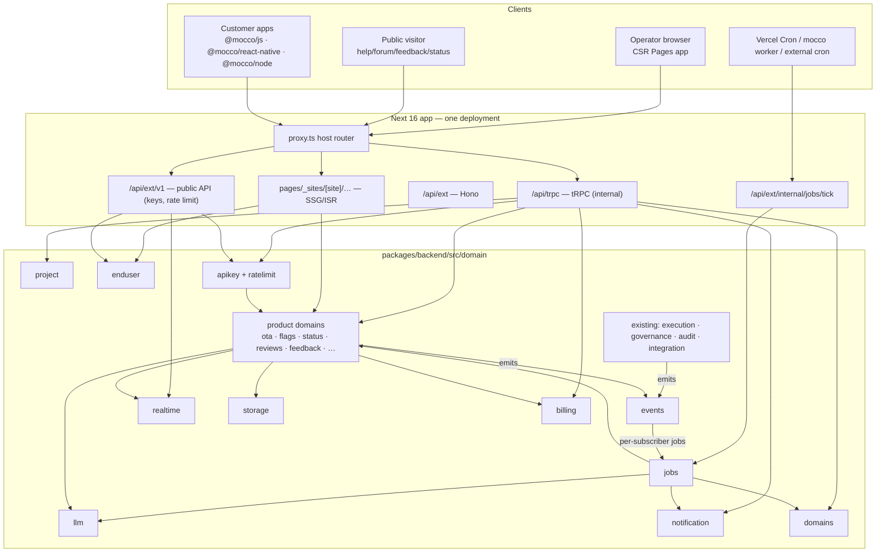
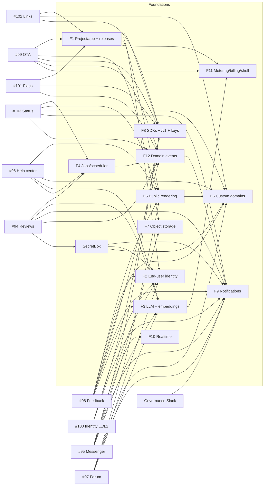

# Platform foundations — implementation design

> Epic fi-workers/mocco#104 lists ten products and a table of shared foundations. This spec designs
> those foundations once, so that each product spec (`2026-09-24-<slug>-design.md`) can reference
> them by name instead of inventing its own jobs table, key scheme, or storage adapter. Every
> foundation stays inside the existing house rules: `transport → domain → infra`, vendor SDKs only
> in leaf files behind neutral interfaces, env names that belong to us, constructor-injected
> services with a lazy composition root (`domain/<d>/instance.ts`), repository per table (ADR 0012),
> zod at every boundary, and pglite integration tests. Everything must run on Vercel **and** on a
> self-hosted Node 22 + Postgres box.

## 0. Summary of decisions

| # | Foundation | Decision (one line) | First product that needs it |
|---|---|---|---|
| F1 | Project / app entity + product enablement | `mocco_projects` → `mocco_project_apps` (per platform, bundle id) → `mocco_project_repos` (links to `mocco_repos`); `mocco_workspace_products` for enablement; a **release registry** (`mocco_releases`) ties versions to runs | #99 OTA, #101 flags |
| F2 | End-user identity (layer 1) | Per-project directory `mocco_end_users`, opaque hashed sessions, HMAC or JWT signed identity, email magic link; **never** shares tables, secrets, cookies or hosts with operator auth | #95 messenger (signed), #98 feedback (magic link) |
| F3 | LLM surface | `domain/llm/` with a neutral `LlmClient` (text, structured object, embeddings), one leaf over the Vercel AI SDK; callers ask for a **tier** (`fast`/`smart`/`embedding`), never a model name; every call metered to `mocco_llm_calls`; pgvector `mocco_embeddings` | #94 reviews |
| F4 | Scheduler / jobs | Our own Postgres job table (`mocco_jobs` + `mocco_job_schedules`) claimed with `FOR UPDATE SKIP LOCKED` by a **tick**; Vercel Cron drives the tick when hosted, a bundled `mocco worker` loop (or any cron) when self-hosted; `waitUntil` for low-latency kicks. pg-boss / Vercel Queues / Inngest stay adapter options behind a `JobQueue` port | #103 status (plus governance Slack) |
| F5 | Public, crawlable rendering | New ADR: public sites render on the **Pages Router with `getStaticProps` + ISR** (plus narrow `getServerSideProps`) in an isolated `pages/_sites/[site]/…` tree reached by host rewrites; the operator app stays CSR | #103 status |
| F6 | Custom domains + TLS | `mocco_domains` with Mocco-owned DNS verification; neutral `DomainProvisioner` with `vercel` (Domains API), `caddy` (on-demand TLS + ask endpoint) and `manual` drivers; host → site resolution in `proxy.ts` | #103 status |
| F7 | Object storage | Neutral `ObjectStore` (put/get/head/delete/presigned upload/public URL) with `s3` (S3, R2, MinIO, NCP), `vercel_blob`, `filesystem` drivers; `mocco_objects` ledger for quota + GC | #99 OTA |
| F8 | SDK packaging + public `/v1` | `packages/sdk-*` (MIT-licensed, not AGPL), changesets + npm trusted publishing; `/api/ext/v1` Hono routers; `mocco_api_keys` with **publishable** (`mk_pub_`) vs **secret** (`mk_sec_`) keys; neutral `RateLimiter` (Postgres driver by default) | #101 flags, #99 OTA |
| F9 | Notifications | `domain/notification/` — channels, subscriptions, and a delivery outbox on F4; senders `slack`, `email` (`smtp`/`resend`), `webhook` (Standard Webhooks signing), `push` (`expo`/`apns`/`fcm`). The first consumer is the existing governance "Slack notifications" feature-map item | governance Slack, then #103 |
| F10 | Realtime | Neutral `RealtimePublisher` + subscribe tokens; v1 driver `poll` (cursor over `mocco_realtime_events`, long-poll ≤25s) runs identically hosted and self-hosted; `ably` (hosted) and `centrifugo` (self-host) drivers when sub-second fan-out is needed | #95 messenger |
| F11 | Metering, billing, shell | `mocco_usage_events` (append, idempotent) → `mocco_usage_daily`; plan catalog as `as const` in `@mocco/common/billing`; `EntitlementService`; `BillingProvider` port (`none` for self-host, `stripe` / `toss` hosted). The shell gets a project switcher and a **product registry** driving the nav | #99/#101 (metering), all (shell) |
| F12 | Domain events | Transactional-ish outbox `mocco_domain_events` + per-subscriber jobs on F4; catalog in `@mocco/common/events`; `deploy.released` is the flagship event (run → project → release registry). Distinct from the audit hash chain and from `mocco_run_events` | #98 feedback, #103, #94 |

Cross-cutting helper that several foundations need first: **SecretBox** (§3.0) — AES-256-GCM
envelope encryption for vendor credentials at rest (store keys, push certs, Slack tokens,
webhook secrets, identity secrets).

## 1. Goals / non-goals

**Goals**

- One way to do each of: scoping data below the workspace, background work, public pages, custom
  hosts, blobs, public API auth, SDK distribution, outbound notification, live updates,
  usage metering, and cross-product events.
- Every foundation lands **with the first product that needs it** (epic rule), is small enough to
  ship in 1–3 PRs, and has a no-external-account default so a fresh clone and a self-host box work.
- Keep existing contracts: `@mocco/backend` export subpaths, the tRPC-internal / Hono-external
  split (ADR 0011), the audit chain semantics (ADR 0010), gates without environments (ADR 0003).

**Non-goals**

- Full hosted customer auth (Clerk-like) — the identity product spec (#100 phase 2) owns it; this
  spec defines only the shared directory + verification layer and the seams phase 2 plugs into.
- A multi-region prober network (status #103 designs its prober on top of F4).
- Choosing a price per product (epic "to decide"); F11 provides the meters and entitlement checks
  only.
- Splitting the monolith. ADR 0005's single Vercel deployment stays; only optional sidecars
  (Caddy, Centrifugo, a worker process) appear in self-host.

## 2. Where we start (current codebase)

- `packages/backend/src/domain/{auth,audit,credential,execution,governance,integration,pipeline}`,
  each with an `instance.ts` composition root; `integration` is env-gated (returns `undefined`
  without GitHub App env) — the pattern every optional vendor foundation below copies.
- `infra/config/env.ts` is the only `process.env` reader (zod, lazy). `infra/db/client.ts` pins
  `max: 1` connections for the Supabase **transaction pooler** — so session-level features
  (`LISTEN/NOTIFY`, session advisory locks) are off the table; `infra/db/advisory-locks.ts`
  registers `pg_advisory_xact_lock` namespaces.
- `transport/ext/app.ts` is a single Hono app at `/api/ext` (GitHub setup/webhook, executor
  callback, credential broker, generic executor). It already uses `waitUntil` for deferred work and
  a verify-first/ack-fast/defer shape. No versioned public API yet.
- Frontend: Pages Router, CSR only, `AppShell` (top bar + workspace switcher) and
  `WorkspaceLayout` with a hard-coded `Section` union (`overview|members|access|audit|settings`).
  The only App Router file is `app/api/ext/[[...route]]/route.ts`.
- Tenancy is the **workspace** (better-auth organization plugin mapped to `mocco_workspaces`).
  Repos (`mocco_repos`) hang off `mocco_provider_connections`; runs are workspace-scoped and pinned
  to a commit. There is no "environment" concept (ADR 0003) and no notion of "project" or "app".
- Async today = `waitUntil` only. ADR 0005 already planned "Vercel Cron + Postgres job/outbox
  table; upgrade to Inngest if needed". The feature map lists "Slack notifications" (prototype
  events `approval.requested`, `deployment.succeeded`, `emergency.override`) and "Billing / Plan"
  as post-MVP.

## 3. Architecture overview



Leaf vendor files (the only importers of each SDK) are listed per foundation. All new domains get
`instance.ts` composition roots and `@mocco/backend/<d>/instance` export subpaths only when the
frontend genuinely needs them (sites and the ext handler do; most do not).

### 3.0 SecretBox (cross-cutting, lands first)

Several foundations store third-party credentials (App Store `.p8`, FCM service accounts, Slack bot
tokens, webhook signing secrets, per-project identity secrets, Vercel domain tokens are env-only).
They must be encrypted at rest and never rendered back.

- `infra/crypto/secret-box.ts` — `seal(plaintext, aad) → string` / `open(sealed, aad) → string`,
  AES-256-GCM via `node:crypto`, output `v1.<keyId>.<iv>.<ciphertext>.<tag>` (base64url). `aad`
  binds the ciphertext to its row (`<table>:<id>`), so a sealed value copied into another row fails.
- Env: `SECRETS_ENCRYPTION_KEYS` — comma-separated `keyId:base64key` list; the first key encrypts,
  all keys decrypt (rotation = prepend a new key, run the `secrets.reseal` job, drop the old key).
- Columns holding sealed values are named `*_sealed` and are **never** in any zod `.output()`.
  Services return a `hasSecret: boolean` projection instead.

## 4. F1 — Project / app entity and product enablement

### Model

A **workspace** stays the team/billing boundary. A **project** is "a product the team ships"
(e.g. "Acme mobile"); every new product's data is project-scoped. A project has several **apps**
(one per platform build target) and links to several **repos**. Governance data (runs, gates,
audit) stays workspace-scoped and is *associated* to projects through repos, so nothing in the
existing governance domain changes.

```
mocco_projects
  id uuid pk, workspace_id → mocco_workspaces (cascade)
  name text, handle text            -- url-safe, unique per workspace; used for default site host
  default_locale text default 'en'
  created_at, updated_at, archived_at
  UNIQUE (workspace_id, handle)  mocco_projects_workspace_handle_uq
  UNIQUE (id, workspace_id)      -- composite FK target (same trick as mocco_provider_connections)
  CHECK handle ~ '^[a-z0-9](?:[a-z0-9-]{0,38}[a-z0-9])?$'

mocco_project_apps
  id uuid pk, workspace_id, project_id  (composite FK → projects(id, workspace_id), cascade)
  platform text  CHECK IN ('ios','android','web','react_native','server')
  name text
  bundle_id text null         -- iOS bundle id / Android application id
  store_app_id text null      -- App Store numeric id / Play package (for reviews #94, links #102)
  apple_team_id text null     -- AASA generation (#102)
  android_sha256_fingerprints text[] null  -- assetlinks.json (#102)
  web_origins text[] null     -- publishable-key origin allowlist (F8), widget embedding (#95)
  created_at, updated_at
  UNIQUE (project_id, platform, bundle_id) WHERE bundle_id IS NOT NULL

mocco_project_repos
  project_id, repo_id → mocco_repos (cascade), workspace_id (composite FK guards drift)
  PRIMARY KEY (project_id, repo_id)
  -- a repo may belong to several projects (monorepo); index on repo_id for run → project lookup

mocco_workspace_products
  workspace_id → mocco_workspaces (cascade), product text, enabled_at, enabled_by_user_id (set null)
  PRIMARY KEY (workspace_id, product)
  CHECK product IN (<Products values>)
```

`Products` is the single source of truth in `@mocco/common/products`:

```ts
export const Products = {
  governance: 'governance', ota: 'ota', flags: 'flags', status: 'status', reviews: 'reviews',
  feedback: 'feedback', messenger: 'messenger', helpcenter: 'helpcenter', forum: 'forum',
  links: 'links', identity: 'identity',
} as const;
export type Product = (typeof Products)[keyof typeof Products];
```

Enablement is **per workspace** (billing lives there); each product decides per project whether it
has any configuration (e.g. a status page exists for project X). `governance` is implicitly enabled
(no row needed) to keep existing workspaces working.

### Release registry (the cross-product "what shipped" table)

Reviews (#94) need "version 2.3.1 ↔ run #412", OTA (#99) creates releases, messenger (#95) shows
the user's version, status (#103) shows releases around an incident, feedback (#98) closes on
release. One table:

```
mocco_releases
  id uuid pk, workspace_id, project_id (composite FK), app_id → mocco_project_apps null
  source text CHECK IN ('run','ota','store','manual')
  version text null, build text null           -- marketing version / build number
  commit_sha text null, run_id → mocco_runs (set null) null
  released_at timestamptz, created_at
  INDEX (project_id, released_at DESC); INDEX (app_id, version)
  UNIQUE (run_id, project_id) WHERE run_id IS NOT NULL
```

Rows are written by the `deploy.released` subscriber (F12) for runs, by the OTA domain on
promotion, and by the reviews ingester when it sees a store version it can't match (source
`store`). Version ↔ run mapping v1: the run's commit is matched to a git tag or to a `version`
reported by CI in the executor callback payload (open question carried from #94).

### Backend module

- `domain/project/ProjectService.ts` (CRUD, archive, link/unlink repo, `assertInWorkspace
  (workspaceId, projectId)` → `ProjectNotFoundError extends NotFoundError`),
  `ProductEnablementService.ts` (`enable`, `disable`, `isEnabled`, `list`),
  `ReleaseService.ts`; repos `project.repo.ts`, `project-app.repo.ts`, `project-repo.repo.ts`,
  `workspace-product.repo.ts`, `release.repo.ts`.
- tRPC `project` router: every procedure takes `workspaceId` and runs `assertMember` (existing
  cross-tenant rule) **and** `assertInWorkspace` for any `projectId`. A reusable
  `protectedProjectProcedure` middleware reads both ids via `getRawInput()`. Product routers
  compose it rather than re-implementing it.
- Product enablement guard: `productProcedure(Products.ota)` = project procedure + `isEnabled`,
  mapping `ProductNotEnabledError` → `FORBIDDEN`.

## 5. F2 — End-user identity (shared layer 1)

The identity product spec (#100) owns hosted auth (passwords, OAuth, passkeys, JWKS, orgs). This
layer is what messenger, forum, and feedback need **before** that exists, and it is the directory
phase 2 must keep using.

### Invariants (non-negotiable)

1. **Separate everything from operator auth**: different tables (`mocco_end_user_*`, never
   `mocco_users`), different secrets, different cookie names, and different **registrable domain**
   (public sites live under `PUBLIC_SITES_DOMAIN` or a customer domain, never under
   `SERVICE_DOMAIN`), so an operator session cookie is never sent to a page that end users can
   script. Lint: `domain/enduser/**` may not import `domain/auth/**` and vice versa.
2. **Per project**: the same email in two projects is two end users. No global end-user account
   in layer 1.
3. **Verification is server-side and constant-time**; unverified `identify()` calls produce an
   anonymous or `unverified` user that can never read another user's data.

### Tables

```
mocco_end_users
  id uuid pk, workspace_id, project_id (composite FK)
  external_id text null        -- customer's user id (signed identity)
  email text null, email_verified_at timestamptz null
  display_name text null, avatar_url text null
  traits jsonb default '{}'    -- customer-supplied, size-capped (8 KB)
  kind text CHECK IN ('anonymous','verified','email')
  first_seen_at, last_seen_at, created_at, updated_at, deleted_at (GDPR tombstone)
  UNIQUE (project_id, external_id) WHERE external_id IS NOT NULL
  UNIQUE (project_id, lower(email)) WHERE email IS NOT NULL AND kind = 'email'
  INDEX (project_id, last_seen_at)       -- MAU (F11)

mocco_end_user_sessions
  id uuid pk, end_user_id (cascade), project_id
  token_hash text unique              -- sha-256 of an opaque 32-byte token
  method text CHECK IN ('anonymous','signed_identity','magic_link','hosted')  -- 'hosted' = #100 phase 2
  user_agent text, ip_hash text, expires_at, revoked_at, created_at, last_used_at

mocco_end_user_magic_links
  token_hash text pk, project_id, email, redirect_path text, expires_at (15 min), consumed_at, created_at
  INDEX (project_id, lower(email), created_at)   -- per-email throttle

mocco_project_identity_configs
  project_id pk, workspace_id
  hmac_secret_sealed text null         -- SecretBox; shown once at creation, rotatable
  previous_hmac_secret_sealed text null, previous_valid_until timestamptz null   -- rotation window
  jwt_mode text CHECK IN ('none','hs256','jwks') default 'none'
  jwt_secret_sealed text null, jwks_url text null, jwt_issuer text null, jwt_audience text null
  require_verified boolean default false   -- reject unsigned identify() entirely
  magic_link_enabled boolean default true
```

### Verification contract

- **HMAC** (Intercom-style, simplest for customers): customer backend computes
  `userHash = hex(HMAC-SHA256(identitySecret, externalId))` (`@mocco/node` ships
  `signIdentity(externalId)`); SDK sends `{ externalId, userHash, traits }`. Server recomputes with
  current and (inside the rotation window) previous secret, compares with `timingSafeEqual`.
- **JWT**: customer passes a short-lived JWT; `hs256` with the sealed secret, or `jwks` fetched
  from `jwks_url` (cached 10 min, `kid` required, `exp` ≤ 1h ahead enforced, `iss`/`aud` checked).
  Library: `jose` in one leaf `domain/enduser/jwt.ts`. This is also the "bring your own auth"
  hook #100 asks about (Clerk/Auth0/Supabase JWTs = the `jwks` mode).
- **Magic link**: `POST /v1/identity/magic-link` (publishable key + site origin) → email via F9 →
  `GET /s/<site>/auth/callback?token=…` consumes, creates an `email` user and a session, sets
  cookie `mocco_eu` (`HttpOnly; Secure; SameSite=Lax; Path=/`; host-only on the site host).
- **Anonymous**: SDK-generated `anonymousId` gets an `anonymous` user + session; a later verified
  identify **merges** the anonymous user's conversations/votes into the verified user in one
  transaction (`EndUserService.merge`, idempotent, emits `enduser.merged`).
- Sessions returned to SDKs are bearer tokens (`Authorization: Bearer eus_…`), on sites a cookie;
  both resolve through `EndUserSessionService.resolve(token)`.

### Module

`domain/enduser/EndUserService.ts`, `EndUserSessionService.ts`, `IdentityVerifier.ts` (pure, HMAC
+ JWT dispatch), `MagicLinkService.ts`, leaf `jwt.ts`. Ext `/v1/identity/*` routes; tRPC
`enduser` router for operator views (search, detail, delete → GDPR hard-delete job).

Phase-2 seam: #100 adds `method = 'hosted'` sessions and its own credential tables keyed by
`mocco_end_users.id`; products never learn which method authenticated the user.

## 6. F3 — Neutral LLM surface

### Interface (`domain/llm/ports.ts`)

```ts
export const ModelTiers = { fast: 'fast', smart: 'smart' } as const;
export type ModelTier = (typeof ModelTiers)[keyof typeof ModelTiers];

export interface LlmCallContext {
  workspaceId: string; projectId: string | null;
  product: Product; purpose: string;          // 'reviews.classify', 'helpcenter.translate'
}
export interface LlmClient {
  generateText(ctx: LlmCallContext, req: { tier: ModelTier; system?: string; prompt: string;
    maxOutputTokens?: number }): Promise<{ text: string; usage: LlmUsage }>;
  generateObject<T>(ctx: LlmCallContext, req: { tier: ModelTier; schema: z.ZodType<T>;
    system?: string; prompt: string }): Promise<{ object: T; usage: LlmUsage }>;
  embed(ctx: LlmCallContext, req: { values: string[] }): Promise<{ vectors: number[][]; usage: LlmUsage }>;
}
```

- `LlmService` (the class products inject) wraps the driver: checks the entitlement/budget (F11),
  calls the driver, records a `mocco_llm_calls` row and a usage event, and maps provider failures
  to `LlmUnavailableError` / `LlmRateLimitedError` / `LlmOutputInvalidError` (a structured output
  that fails the zod schema after one repair retry).
- **One leaf**: `domain/llm/providers/ai-sdk.ts` — the only importer of the Vercel AI SDK (`ai`
  + provider packages). The AI SDK already abstracts OpenAI, Anthropic, Google, the Vercel AI
  Gateway, and OpenAI-compatible servers (Ollama, vLLM, LM Studio), so one leaf covers hosted and
  self-host.
- LLM calls run **only in jobs** (F4), never on a request path, except the messenger "suggested
  reply", which is operator-triggered and streams through tRPC (a later decision for #95).

### Env

| Var | Meaning |
|---|---|
| `LLM_DRIVER` | `gateway` (hosted default: Vercel AI Gateway — no token markup, BYOK supported) · `openai_compatible` (self-host default) · `anthropic` · `openai` · `none` (feature off) |
| `LLM_API_KEY` | key for the chosen driver |
| `LLM_BASE_URL` | for `openai_compatible` |
| `LLM_MODEL_FAST`, `LLM_MODEL_SMART` | model ids per tier (e.g. a small model for per-review classification, a stronger one for digests/translation) |
| `LLM_EMBEDDING_MODEL`, `LLM_EMBEDDING_DIMENSIONS` | e.g. 1536; the vector column dimension is fixed by migration |

`getLlm()` returns `undefined` when `LLM_DRIVER` is `none`/unset — same pattern as `getIntegration()`;
product features that need it show "AI features not configured".

### Metering and caching

```
mocco_llm_calls
  id bigserial pk, workspace_id, project_id null, product, purpose, tier, model
  input_tokens int, output_tokens int, cost_microusd bigint null, latency_ms int
  status text CHECK IN ('ok','error','invalid_output'), created_at
  INDEX (workspace_id, created_at)
```

Cost is computed from a static price table in `domain/llm/prices.ts` keyed by model id (or the
gateway's reported cost when available) — approximate, used for budgets not invoices. Result
caching is a **product concern** (e.g. `mocco_review_analyses` keyed by review id + prompt version),
not a generic cache, so invalidation stays obvious.

### Embeddings (pgvector)

```
mocco_embeddings
  id uuid pk, workspace_id, project_id
  source_type text, source_id uuid, locale text null, chunk_index int
  content_hash text, model text, embedding vector(<LLM_EMBEDDING_DIMENSIONS>)
  created_at
  UNIQUE (source_type, source_id, locale, chunk_index)
  HNSW index (embedding vector_cosine_ops)
```

pgvector is available on Supabase and Neon; self-host must use a Postgres with the extension
(switch `docker-compose` to the `pgvector/pgvector:pg16` image). pglite ships pgvector as an
extension (`@electric-sql/pglite/vector`) so the tests keep running without docker — verify on the
pinned 0.5.4 before the slice lands (unverified). The embeddings migration is isolated in its own
slice so deployments without pgvector can defer it; help-center search keeps Postgres FTS as the
baseline (#96).

Prompt-injection posture: user content (reviews, posts, messages) is passed as data in a delimited
section, outputs are schema-validated, and no LLM output ever triggers a privileged action without
a human (feedback "Shipped" suggestion, moderation flags) — every product spec inherits this.

## 7. F4 — Scheduler, background jobs, queues

### Options considered

| Option | Vercel | Self-host | Fit |
|---|---|---|---|
| **Own `mocco_jobs` table + tick** | Vercel Cron (per-minute on Pro; Hobby is daily-only) hits the tick; `waitUntil` for immediate jobs | same tick from a `mocco worker` loop or any cron | Drizzle-migrated, `mocco_` prefix, pglite-testable, transaction-pooler-safe; ADR 0005's stated plan |
| pg-boss | serverless-compatible fetch mode, cron, retries, DLQ | yes | its own `pgboss` schema and migrations outside drizzle, not `mocco_` prefixed; pooler and pglite behavior unverified |
| graphile-worker | needs a long-running worker | yes | the same problem; Vercel Workflow's Postgres World is built on it and states it "does not work on serverless" |
| Vercel Queues (beta) | push consumers via `vercel.json` triggers, 7-day TTL, fan-out consumer groups, ~$0.60–0.96 per 1M ops | hosted only (poll mode still calls Vercel's API) | good fan-out and retries, but a hosted dependency and still beta |
| Vercel Workflow (WDK) | first-class | Postgres World is a "reference implementation", needs a worker | durable steps are attractive for sagas, not needed yet |
| Inngest / Trigger.dev | managed, works on Vercel | self-host means running their server + Redis/Postgres | ADR 0005 reversal condition ("if durable multi-step orchestration grows") |

**Recommendation: own job table + tick (ADR 0014)**, behind a `JobQueue` port, so a
`vercel_queues` or `pgboss` driver can replace the transport later without changing handlers.
Mocco's workloads are small, idempotent units (poll one app's reviews, check one domain, send one
notification, translate one article, dispatch one event); none needs durable multi-step state yet.

### Tables

```
mocco_jobs
  id uuid pk, kind text, workspace_id null, payload jsonb
  status text CHECK IN ('queued','running','succeeded','failed','dead') default 'queued'
  run_at timestamptz default now(), attempts int default 0, max_attempts int default 8
  locked_until timestamptz null, locked_by text null
  dedupe_key text null, last_error text null, created_at, finished_at
  INDEX (status, run_at) WHERE status = 'queued'   -- claim path
  UNIQUE (kind, dedupe_key) WHERE dedupe_key IS NOT NULL AND status IN ('queued','running')

mocco_job_schedules
  id uuid pk, kind text, workspace_id null, project_id null, payload jsonb
  cron text null, interval_seconds int null           -- exactly one set (CHECK)
  next_run_at timestamptz, enabled boolean default true, last_enqueued_at
  INDEX (next_run_at) WHERE enabled
```

- **Claim**: one transaction, `SELECT id FROM mocco_jobs WHERE status='queued' AND run_at<=now()
  ORDER BY run_at FOR UPDATE SKIP LOCKED LIMIT $n` → `UPDATE … SET status='running',
  locked_until=now()+visibility, attempts=attempts+1`. Works on the transaction pooler (row locks
  are transaction-scoped). Owned by `JobRepo.claim` (ADR 0012: the repo runs the transaction).
- **Run**: handler registry `Map<kind, { payload: ZodType; run(payload, ctx) }>` built in
  `domain/jobs/instance.ts` from each domain's exported handlers; payloads `safeParse`d
  (a bad payload → `dead` immediately, not retried).
- **Retry**: exponential backoff with jitter (`run_at = now() + min(2^attempts * 15s, 6h)`); after
  `max_attempts` → `dead` (visible in an ops page; a `jobs.dead` domain event notifies
  operators). A crashed run is recovered when `locked_until` passes (`reclaimExpired` in the tick).
- **Schedules**: the tick first advances due schedules (`UPDATE … SET next_run_at = next(cron)
  … RETURNING` with SKIP LOCKED) and inserts jobs with `dedupe_key = <scheduleId>:<slot>`, so two
  overlapping ticks never double-enqueue. Cron parsing in one leaf (`cron-parser`).
- **Retention**: a daily `jobs.prune` deletes `succeeded` older than 7 days, `dead` older than 30.
- High-frequency per-entity schedules (status monitors every 60s × thousands) should not be one
  schedule row each; the status spec keeps `next_check_at` on its monitors table and registers a
  single `status.dispatch-due-checks` schedule. The generic table is for coarse schedules
  (daily review pull, weekly digest, domain re-checks).

### Drivers of the tick

- `JobRunner.tick({ budgetMs, maxJobs })` is the only entry point.
- **Hosted**: `vercel.json` `crons: [{ path: '/api/ext/internal/jobs/tick', schedule: '* * * * *' }]`.
  The route checks `Authorization: Bearer <CRON_SECRET>` (Vercel sends this header when the
  `CRON_SECRET` env var is set — a platform-dictated name, read in `env.ts` next to `VERCEL_*`;
  our own alias `JOBS_TICK_SECRET` is accepted for self-host callers). Budget defaults to
  `JOBS_TICK_BUDGET_MS=50000` (below function max duration).
- **Immediate**: `JobQueue.enqueue(job, { kick: true })` also calls `waitUntil(runner.runOne(id))`
  — the latency of the webhook path we already use, with the table as the durable fallback.
- **Self-host**: `yarn worker` (`packages/backend/src/transport/worker/main.ts`, a new transport
  edge) loops `tick` every `JOBS_POLL_INTERVAL_MS` (default 2000) with `JOBS_CONCURRENCY`
  (default 4); `docker-compose` gets a `worker` service using the same image. Operators who prefer
  cron can `curl` the tick instead.
- **Hobby-plan hosted** (daily cron only): documented degradation — minute-level schedules need
  Pro or an external pinger hitting the tick.

## 8. F5 — Public, crawlable rendering (proposed ADR 0015)

### Context

Frontend conventions say "no SSR, CSR app, SSG landing". Help center (#96), forum (#97), feedback
board/changelog (#98) and status page (#103) must be crawlable, fast on first paint, work without
JavaScript for reading, and (status) stay up while the customer's product — or Mocco — is degraded.

### Options

1. **Pages Router SSG/ISR inside the existing app** (`getStaticProps` + `revalidate`, on-demand
   `res.revalidate(path)`), reached by host rewrites.
2. App Router RSC for public sites only (tag revalidation, streaming).
3. A separate lightweight public app (Astro/another Next app).
4. Pre-render to object storage + CDN (static export per site).

### Proposed decision

Option 1, with option 4 as a later hardening for the status page only.

- Public sites live in `packages/frontend/src/pages/_sites/[site]/…` (e.g.
  `_sites/[site]/index.tsx`, `_sites/[site]/[locale]/articles/[slug].tsx`,
  `_sites/[site]/posts/[postId].tsx`). `[site]` is an opaque site key (`<projectId>.<product>`),
  never a hostname, so a crafted Host cannot address arbitrary files.
- `proxy.ts` (Next 16's renamed middleware — verify the exact runtime defaults on 16.2) resolves
  `Host` → site key through `SiteResolver` (F6) and **rewrites** to `/_sites/<site>/<path>`.
  Direct requests to `/_sites/*` on `SERVICE_DOMAIN` return 404.
- Data: `getStaticProps` calls read-only public query services through a new export subpath
  `@mocco/backend/sites/queries` (never tRPC, never an HTTP round trip). `revalidate` defaults per
  product (status 30s, others 300s) and writes trigger on-demand `res.revalidate` through a job
  (`sites.revalidate` with the affected paths), so incidents appear within seconds.
- `getServerSideProps` is allowed **only** under `pages/_sites/**` and only for per-visitor pages
  (search results, "my posts", magic-link callback). Lint: `no-restricted-syntax` bans
  `getServerSideProps`/`getStaticProps` outside `_sites/` — the rest of the app stays CSR, so ADR 0009
  and the frontend conventions still hold for the operator UI.
- Public-site bundles never import `lib/auth-client.ts` or tRPC; interactivity (vote, comment,
  subscribe) posts to `/v1` with the site's publishable key and the `mocco_eu` cookie.
- SEO: per-locale URLs + `hreflang`, canonical to the custom domain, `sitemap.xml` and `robots.txt`
  as ISR routes per site, RSS/Atom for changelog and status history.
- Self-host: `next start` supports ISR with the filesystem cache; multi-instance self-host needs a
  shared cache handler (documented; single instance is the supported default).
- Why not App Router: it would split the frontend into two paradigms for UI (ADR 0009 chose Pages
  deliberately) and the benefits we need — static HTML, timed and on-demand revalidation — exist
  in Pages. Revisit if tag-based revalidation across thousands of pages becomes a bottleneck.
- Status-page resilience (later): a `status.export` job renders the page to static HTML in object
  storage (F7) on every incident update; the status host fails over to it. Tracked in #103.

## 9. F6 — Custom domains, TLS, multi-tenant host routing

### Hosts

| Host | Serves |
|---|---|
| `SERVICE_DOMAIN` (`www.mocco.club`) | operator app, tRPC, `/api/ext` |
| `PUBLIC_API_DOMAIN` (e.g. `api.mocco.club`, optional) | rewrites `/v1/*` → `/api/ext/v1/*` |
| `<handle>-<product>.<PUBLIC_SITES_DOMAIN>` | default site host per project + product (no DNS work for customers) |
| customer domain (`status.acme.com`, `help.acme.com`, `go.acme.com`) | one site each |

`PUBLIC_SITES_DOMAIN` should be a **different registrable domain** from `SERVICE_DOMAIN` (cookie
isolation between tenants and the operator app; consider a Public Suffix List entry later so
tenant subdomains cannot set cookies for each other). A wildcard on Vercel requires Vercel
nameservers for the wildcard certificate.

### Table

```
mocco_domains
  id uuid pk, workspace_id, project_id (composite FK), product text
  hostname text   -- lower-case, IDNA-normalized, no port
  kind text CHECK IN ('default','custom')
  status text CHECK IN ('pending_dns','verifying','active','failed','removed')
  verification_token text, verified_at, tls_ready_at, last_checked_at, last_error text
  provider_ref text null
  created_at, updated_at
  UNIQUE (hostname) WHERE status <> 'removed'
  UNIQUE (project_id, product, kind) WHERE status <> 'removed' AND kind = 'default'
```

### Flow

1. Operator adds `status.acme.com` → row `pending_dns`, UI shows two records: `CNAME status.acme.com
   → sites.<PUBLIC_SITES_DOMAIN>` (or A for apex) and `TXT _mocco-challenge.status.acme.com = <token>`.
2. `domains.verify` job (schedule every 5 min for pending rows, exponential backoff, gives up after
   7 days → `failed`) resolves TXT with `node:dns` — **Mocco verifies ownership itself**, whatever
   the provider, so a dangling CNAME cannot be claimed by another tenant.
3. On TXT success → `DomainProvisioner.attach(hostname)` → poll `status(hostname)` until TLS is
   ready → `active`, emit `domain.activated`, and invalidate the resolver cache.
4. Removal detaches from the provider and marks `removed` (the unique index frees the hostname).

### `DomainProvisioner` port and drivers

```ts
export interface DomainProvisioner {
  attach(hostname: string): Promise<{ providerRef: string | null }>;
  status(hostname: string): Promise<{ routed: boolean; tlsReady: boolean; detail?: string }>;
  detach(hostname: string): Promise<void>;
}
```

- `vercel` (hosted) — leaf `domain/domains/providers/vercel.ts` calling the Vercel REST API (add
  project domain, get domain config, verify, remove). Pro has effectively unlimited custom domains
  (soft cap 100,000 per project); API rate limits are ~100 adds/hour and 50 verifications/hour per
  team, so attach runs through F4 with a per-team limiter. Env: `DOMAINS_DRIVER=vercel`,
  `DOMAINS_API_TOKEN`, `DOMAINS_PROJECT_ID`, `DOMAINS_TEAM_ID`.
- `caddy` (self-host) — Caddy in front of Next with `on_demand_tls { ask
  http://app:3100/api/ext/internal/domains/tls-allowed }`. The ask endpoint returns 200 only for
  hostnames in `mocco_domains` with a verified TXT (or the default wildcard). `attach`/`detach`
  are no-ops; `status` probes `https://<host>/.well-known/mocco-site` and passes when the cert
  validates. Let's Encrypt limits (300 new orders / 3h per account, 50 certs per registered
  domain per week) are why the ask gate is mandatory. Shipped as `infra/selfhost/Caddyfile`.
- `manual` — operator's own proxy (Traefik, nginx + certbot); Mocco only verifies DNS.

### Host routing

`SiteResolver.resolve(host)` → `{ siteKey, projectId, product, canonicalHost } | null`, backed by
`mocco_domains` + an in-process LRU (60s TTL, negative results cached 10s) and invalidated on
`domain.activated`. Link redirects (#102) use the same resolver on the `ext` surface with their own
hot-path cache.

## 10. F7 — Object storage

`domain/storage/` owns the ledger table; drivers are leaves.

```ts
export interface ObjectStore {
  put(key: string, body: Uint8Array | ReadableStream, opts: { contentType: string;
    cacheControl?: string; visibility: Visibility }): Promise<{ etag: string }>;
  get(key: string): Promise<ReadableStream | null>;
  head(key: string): Promise<{ size: number; contentType: string; etag: string } | null>;
  delete(keys: string[]): Promise<void>;
  createUploadUrl(key: string, opts: { contentType: string; maxBytes: number;
    expiresInSeconds: number }): Promise<{ url: string; method: 'PUT' | 'POST'; headers: Record<string,string> }>;
  publicUrl(key: string): string;                                   // visibility = public only
  signedDownloadUrl(key: string, expiresInSeconds: number): Promise<string>;
}
```

- Drivers: `s3` (`@aws-sdk/client-s3` + presigner; works for AWS S3, Cloudflare R2, MinIO,
  Supabase Storage's S3 endpoint, Naver Cloud Object Storage), `vercel_blob` (`@vercel/blob`,
  client uploads), `filesystem` (dev, tests, single-box self-host; serves through a signed
  `/api/ext/internal/storage/*` route).
- Hosted recommendation: **R2 via the `s3` driver** for OTA bundles and attachments — R2 egress is
  free ($0.015/GB-month storage), whereas Vercel Blob bills data transfer (e.g. $0.05/GB in iad1
  beyond the included amount). Vercel Blob stays a supported driver for small deployments.
- Env: `STORAGE_DRIVER`, `STORAGE_BUCKET`, `STORAGE_ENDPOINT`, `STORAGE_REGION`,
  `STORAGE_ACCESS_KEY_ID`, `STORAGE_SECRET_ACCESS_KEY`, `STORAGE_PUBLIC_BASE_URL` (CDN in front of
  the public bucket), `STORAGE_BLOB_TOKEN` (vercel_blob), `STORAGE_FS_ROOT` (filesystem).
- Keys: `w/<workspaceId>/p/<projectId>/<product>/<ulid>/<safe-filename>`; content-addressed
  variants allowed for OTA assets (`…/ota/assets/<sha256>`).

```
mocco_objects
  id uuid pk, workspace_id, project_id null, product text
  key text unique, content_type, size_bytes bigint, sha256 text null, visibility text CHECK IN ('public','private')
  status text CHECK IN ('pending','ready','deleted'), created_by_user_id null, created_by_end_user_id null
  created_at, deleted_at
  INDEX (workspace_id, product)
```

Uploads are two-phase: `StorageService.beginUpload` (quota + content-type allowlist + max size per
product → row `pending` + presigned URL) → client uploads directly to storage → `completeUpload`
(`head` checks size/type → `ready`, usage event `storage_bytes`). A daily `storage.gc` job deletes
`pending` older than 24h and `deleted` objects. Images from end users (#95 attachments) are served
through `signedDownloadUrl` only; never public.

## 11. F8 — SDK packaging and the public `/v1` API

### Packages

```
packages/
  sdk-core/            @mocco/sdk-core        fetch client, retries/backoff, key + session handling, error types
  sdk-js/              @mocco/js              browser: identify, messenger widget loader, flags client, links
  sdk-node/            @mocco/node            server: secret-key client, signIdentity(), webhook verify()
  sdk-react-native/    @mocco/react-native    RN: identify, device registration (push), deep-link handler, updates hooks
  openfeature-web/     @mocco/openfeature-web-provider     (#101)
  openfeature-server/  @mocco/openfeature-server-provider  (#101)
```

- Product features are **subpath exports** of the platform package (`@mocco/js/messenger`,
  `@mocco/react-native/links`) so customers install one SDK per platform and tree-shake the rest;
  OpenFeature providers are separate packages because that ecosystem expects them.
- **License: MIT for every `packages/sdk-*` and provider package** (the server stays AGPL-3.0). An
  AGPL client library embedded in a customer's app would block adoption; recorded in ADR 0017.
  Each SDK package carries its own `LICENSE`.
- Wire types come from `@mocco/common` zod schemas, but SDKs ship **types only** at runtime
  (bundled with `tsup`, no zod in the browser bundle); a contract test in the backend asserts the
  SDK's request/response types against the route schemas. `@mocco/common` stays private.
- Build: `tsup` (ESM + CJS for node/RN, ESM for web, `.d.ts`), size budget check in CI for
  `@mocco/js` (e.g. core ≤ 10 KB gzip, verify in slice). React Native: plain TS, no native code in
  the core; push uses the host app's `expo-notifications`/Firebase via peer dependency.
- Versioning + publishing: **changesets**; one version line per package; `publish.yml` runs on
  `main` merges of the "Version packages" PR, publishes with npm **trusted publishing (OIDC) +
  provenance** — no long-lived npm token (fits the product's own credential philosophy). The npm
  `@mocco` scope must be secured first (unverified availability; fallback `@moccohq`).
- Repo conventions extend to SDK packages (absolute imports via their own alias, no barrels,
  pinned deps), except that published packages need a single public entry per subpath — those
  entry files are `exports` targets, not barrels.

### `/v1` surface

- `transport/ext/app.ts` composes routers from `transport/ext/v1/<product>.ts` under
  `/api/ext/v1`; the lint rule "only `transport/ext/app.ts` imports hono" widens to
  `transport/ext/**`. `PUBLIC_API_DOMAIN` rewrites `/v1/*` there.
- Error format: RFC 9457 `application/problem+json` with stable `type` codes; never vendor/SQL
  detail (existing `onError` rule). Additive changes only within `v1`; breaking → `/v2`.
- `Idempotency-Key` supported on secret-key POSTs that create resources (a
  `mocco_idempotency_keys` table, 24h retention) — added when the first product needs it (OTA
  upload).

### API keys

```
mocco_api_keys
  id uuid pk, workspace_id, project_id (composite FK)
  kind text CHECK IN ('publishable','secret')
  prefix text              -- 'mk_pub_' | 'mk_sec_'; the id part after it is public
  token_hash text unique   -- sha-256 of the full token; plaintext shown once
  last4 text, name text, scopes text[]   -- e.g. {'flags:read','ota:write'}
  created_by_user_id (set null), created_at, last_used_at, expires_at null, revoked_at null
```

- **Publishable** (`mk_pub_…`): safe to embed in web/RN; identifies the project; grants only
  client scopes (widget messages as the session's end user, flags client ruleset, OTA update
  check, link resolve, magic-link start, public votes). For web, the request `Origin` must match a
  project app's `web_origins` (native apps have no origin; they are limited by rate limits and by
  requiring an end-user session for writes).
- **Secret** (`mk_sec_…`): server-to-server; full scopes chosen at creation; never accepted from a
  browser (`Origin` present → reject). CI uploads (OTA) prefer the existing OIDC broker flow over
  a secret key where possible (#99).
- The **identity secret** (F2) is a third, separate credential: it never authenticates API calls.
- Hono middleware `requireKey({ kind, scope })` → `ApiKeyService.authenticate(token)` (hash lookup,
  constant time, `last_used_at` updated at most once per minute via `waitUntil`) → sets
  `c.var.principal = { workspaceId, projectId, keyId, kind, scopes }`.
- Keys are operator-managed in the project settings; creation/revocation writes an audit entry
  (`apikey.created`, `apikey.revoked` added to `AuditActions`).

### Rate limiting

```ts
export interface RateLimiter {
  consume(bucket: string, rule: { limit: number; windowSeconds: number }, cost?: number):
    Promise<{ allowed: boolean; remaining: number; resetAt: Date }>;
}
```

- Drivers: `postgres` (default everywhere — fixed-window counter `mocco_rate_limit_counters
  (bucket, window_start) → count` via `INSERT … ON CONFLICT DO UPDATE … RETURNING`, pruned hourly),
  `redis` (optional, `RATE_LIMIT_REDIS_URL`, for high-volume hosted), `memory` (tests).
- Buckets: `key:<keyId>`, `ip:<ip-hash>:<route-group>`, `enduser:<id>`, `email:<hash>` (magic
  links: 5/hour). Responses carry `RateLimit-*` headers and `429` problem+json.
- **Hot read paths do not hit Postgres per request**: flags rulesets, OTA manifests, and link
  redirects are CDN-cacheable (`Cache-Control: public, s-maxage`, `ETag`), rate-limited only at the
  edge (Vercel Firewall rules hosted; Caddy `rate_limit` or nginx self-host). The Postgres limiter
  guards writes and auth-sensitive endpoints.

## 12. F9 — Notifications

Two audiences, one pipeline:

- **Operator notifications** — to the team: Slack, email, outbound webhook (governance approvals,
  status alerts, review spikes, new conversations).
- **End-user notifications** — to the customer's users: email (magic links, voter "shipped",
  forum replies, messenger offline fallback) and push (messenger, later OTA/links).

### Tables

```
mocco_notification_channels
  id uuid pk, workspace_id, project_id null
  kind text CHECK IN ('slack','email','webhook')
  name text, config jsonb           -- non-secret: slack channel id/name, email recipients, webhook url
  secret_sealed text null           -- slack bot token, webhook signing secret (SecretBox)
  enabled boolean, created_at, updated_at

mocco_notification_rules
  id uuid pk, workspace_id, channel_id (cascade), event_type text   -- exact or 'status.*'
  project_id null, filter jsonb default '{}'                        -- e.g. {"severity":"major"}
  created_at

mocco_notification_deliveries
  id uuid pk, workspace_id, channel_id null, audience text CHECK IN ('operator','end_user')
  event_id uuid null, template text, recipient text      -- channel id / email / device id / url
  status text CHECK IN ('queued','sent','failed','suppressed'), attempts int
  response_code int null, error text null, sent_at, created_at
  INDEX (workspace_id, created_at)

mocco_email_suppressions
  project_id null (null = operator mail), email_hash text, reason text CHECK IN ('unsubscribe','bounce','complaint')
  id uuid pk, created_at
  UNIQUE INDEX on (coalesce(project_id, '00000000-0000-0000-0000-000000000000'), email_hash)

mocco_end_user_devices
  id uuid pk, end_user_id (cascade), project_id, app_id → mocco_project_apps
  provider text CHECK IN ('expo','apns','fcm'), token text, locale text, last_seen_at, disabled_at
  UNIQUE (provider, token)

mocco_project_push_credentials
  project_id, app_id, provider, credential_sealed text, key_id text null, team_id text null, created_at
  PRIMARY KEY (app_id, provider)
```

### Flow

`NotificationService` subscribes to domain events (F12). For each event it matches rules →
creates delivery rows → enqueues `notification.deliver` jobs (F4; dedupe key
`<eventId>:<channelId>`) → a `Sender` sends with retry/backoff. Delivery history is visible per
channel. Rendering: per-event templates in `domain/notification/templates/*.ts` (pure functions
returning Slack Block Kit JSON / email subject+text+HTML / push title+body); no template engine
vendor.

### Senders (neutral `Sender<Kind>` interfaces, one leaf each)

| Sender | Driver(s) | Env | Notes |
|---|---|---|---|
| Slack | Slack OAuth install (bot token, `chat:write`), posts with `chat.postMessage` | `SLACK_APP_CLIENT_ID`, `SLACK_APP_CLIENT_SECRET`, `SLACK_APP_SIGNING_SECRET` | OAuth callback on `/api/ext/slack/oauth`; interactive "Resume" button later goes through `/api/ext/slack/actions` (signed) and still requires Mocco auth — Slack never authorizes a resume on its own (write ≠ deploy) |
| Email | `smtp` (self-host default, `nodemailer`), `resend` (hosted), `ses` later | `EMAIL_DRIVER`, `EMAIL_FROM`, `EMAIL_SMTP_URL`, `EMAIL_API_KEY` | also unblocks operator invitations (workspace.md "deferred"); `List-Unsubscribe` + one-click for end-user mail; bounce/complaint webhooks → suppressions |
| Webhook out | `fetch` | none | Standard Webhooks headers (`webhook-id`, `webhook-timestamp`, `webhook-signature` = HMAC-SHA256); SSRF guard (https only, resolve DNS and refuse private/loopback/link-local ranges, no redirects) |
| Push | `expo` (Expo Push API — simplest for Expo apps), `apns` (HTTP/2, token-based `.p8`), `fcm` (HTTP v1, service account) | per-project credentials in `mocco_project_push_credentials` | invalid-token responses disable the device row |

Korean-market note: KakaoTalk business messages (AlimTalk) are the expected channel for Korean
consumer notifications; it fits as a later `kakao` end-user sender behind the same interface
(provider choice unverified).

### The existing Slack plan becomes slice one

The feature map's "Slack notifications" (prototype events `approval.requested`,
`deployment.succeeded`, `emergency.override`) is implemented as the first consumer: governance
emits `gate.pending`, `gate.resumed`, `gate.rejected`, `run.succeeded`, `run.failed` (F12), and the
default rule set for a new Slack channel subscribes to `gate.pending` + `run.succeeded`.
`emergency.override` maps to break-glass once that exists. This keeps notifications "convenience,
not correctness": a failed Slack post never affects a run.

## 13. F10 — Realtime

```ts
export interface RealtimePublisher {
  publish(channel: RealtimeChannel, event: { type: string; data: unknown }): Promise<void>;
}
export interface RealtimeTokenIssuer {
  issue(principal: RealtimePrincipal, channels: RealtimeChannel[], ttlSeconds: number):
    Promise<{ driver: RealtimeDriver; token: string; endpoint: string }>;
}
```

- Channel names are built only by helpers (`channels.conversation(projectId, id)`,
  `channels.inbox(workspaceId)`), never from client input; authorization happens at token issue
  (end-user session may subscribe only to its own conversations; operators only to their
  workspace's inbox).
- Drivers:
  - `poll` (default, v1, hosted and self-host): `publish` inserts into `mocco_realtime_events
    (seq bigserial, channel, type, data jsonb, created_at)`; clients call
    `GET /v1/realtime/events?channels=…&cursor=…` which long-polls up to 25s (checking every 1s,
    returning early on new rows); rows pruned after 24h. Commit-order caveat of `bigserial`: the
    reader only returns rows older than 1s past the cursor boundary and de-duplicates by id, so
    a late commit is not skipped. Costs function time on Vercel; acceptable for v1 inbox volumes.
  - `ably` (hosted, when needed): publish via REST, token requests signed server-side (Free: 200
    concurrent connections; Standard $29/month + usage).
  - `centrifugo` (self-host and optional hosted sidecar): Apache-2.0, WebSocket/SSE/HTTP
    streaming, JWT connection auth, HTTP publish API, Postgres or Redis engine.
- Env: `REALTIME_DRIVER`, `REALTIME_API_KEY`, `REALTIME_URL`, `REALTIME_TOKEN_SECRET`.
- The SDK side (`@mocco/sdk-core/realtime`) hides the driver: it receives `{ driver, token,
  endpoint }` and picks the matching transport, so switching drivers needs no customer change.
- Presence and typing indicators are explicitly not in v1 (they are what would justify Ably or
  Centrifugo).

## 14. F11 — Metering, billing, and the multi-product shell

### Metering

```
mocco_usage_events
  id bigserial pk, workspace_id, project_id null, product text, meter text, quantity bigint
  occurred_at timestamptz, idempotency_key text unique, created_at
  INDEX (workspace_id, meter, occurred_at)

mocco_usage_daily
  workspace_id, product, meter, day date, quantity bigint
  PRIMARY KEY (workspace_id, product, meter, day)
```

`Meters` in `@mocco/common/billing`: `seats`, `end_user_mau`, `llm_cost_microusd`,
`storage_bytes`, `ota_bandwidth_bytes`, `monitor_checks`, `link_clicks`, `emails_sent`,
`push_sent`. Producers call `UsageService.record(...)` (fail-open, like audit). A `usage.rollup`
job aggregates hourly into `mocco_usage_daily`; high-volume meters (link clicks, OTA bandwidth)
aggregate in memory per request batch or come from CDN logs later, never one row per click.
MAU = distinct `mocco_end_users` with `last_seen_at` in the month, computed by a monthly job
(plus an activity-month table if exactness is needed).

### Plans and entitlements

- Plan catalog is code, not a table: `Plans` in `@mocco/common/billing` (`free`, `team`,
  `business` per product, limits per meter). Changing a price is a PR.
- `mocco_workspace_subscriptions (workspace_id, product, plan, status, current_period_end,
  provider_ref, updated_at)`, one row per paid product.
- `EntitlementService.check(workspaceId, product, meter, delta)` → `allowed | soft_limit |
  hard_limit`; products call it at creation points (new monitor, new link) and the LLM service
  calls it before each call.
- `BillingProvider` port: `none` (self-host default — every entitlement unlimited, no nags; AGPL
  self-host is never license-gated), `stripe` (hosted, global cards, usage-based billing meters),
  `toss` (Toss Payments, for Korean customers; card billing keys — unverified fit for usage
  billing). Env: `BILLING_DRIVER`, `BILLING_API_KEY`, `BILLING_WEBHOOK_SECRET`. Provider webhooks
  land on `/api/ext/billing/webhook` (verify-first, same shape as GitHub).

### App shell and navigation

- URL model: workspace-level stays `/workspaces/[id]/…` (overview, governance: runs/access/audit,
  members, settings). Project-scoped products live under `/workspaces/[id]/p/[projectId]/<product>/…`.
  The project is in the path (URL is state).
- `AppShell` top bar: logo / workspace switcher / **project switcher** / user menu.
  `WorkspaceLayout`'s hard-coded `Section` union becomes a **product registry**
  (`frontend/src/lib/products.ts`): `{ product, label, icon, scope: 'workspace' | 'project',
  sections: [{ key, label, href(ids) }] }`, filtered by `workspace.products` (tRPC) so disabled
  products disappear.
- Settings gain: Projects (apps, repos), Products (enable/disable), Domains, API keys,
  Notifications (channels + rules), Billing (hosted only).
- A "Get started" empty state per product explains what enabling it does; enabling is one
  mutation (`project.enableProduct`), not a wizard.

## 15. F12 — Domain events

### Why a separate mechanism

| | Audit log (`mocco_audit_log`) | Run events (`mocco_run_events`) | Domain events (new) |
|---|---|---|---|
| Purpose | compliance proof, hash chain | one run's timeline | integration between domains/products |
| Mutability | append-only forever | append-only | pruned after 30 days |
| Consumers | humans, verifiers | run detail UI | notification, feedback, status, reviews, webhooks out |

### Table and delivery

```
mocco_domain_events
  id uuid pk, seq bigserial unique, workspace_id, project_id null
  type text, subject_type text, subject_id text, payload jsonb, occurred_at, created_at
  INDEX (workspace_id, occurred_at); INDEX (type, occurred_at)
```

- `EventBus.publish(event)` inserts the row and, for each subscriber registered for its type,
  enqueues a `events.deliver` job with `dedupe_key = <eventId>:<subscriber>` (F4). Handlers must be
  idempotent (at-least-once).
- Transactionality: today services write through repos without a shared transaction. v1 publishes
  **after** the state change (like `AuditService.record`, but fail-closed with a logged error);
  a crash in between loses the event. Where loss matters (`deploy.released`), the subscriber side
  also has a reconciling schedule (e.g. feedback's hourly "runs succeeded since last cursor").
  A later refactor can pass a transaction handle into repos (the repo-owned transaction pattern in
  `AuditRepo.appendChained`) to make publish atomic.
- Subscribers are registered in composition roots: `events.subscribe('deploy.released',
  'feedback.suggest-shipped', handler)`. The subscriber name is stable (it's in dedupe keys).
- Catalog `DomainEventTypes` in `@mocco/common/events`, each with a zod payload schema. Initial
  set: `run.succeeded`, `run.failed`, `gate.pending`, `gate.resumed`, `gate.rejected`,
  `deploy.released`, `domain.activated`, `jobs.dead`, `enduser.merged`; products add theirs
  (`ota.release.promoted`, `flag.changed`, `incident.opened`, `review.spike`, `feedback.shipped`).
- Outbound customer webhooks (F9) subscribe to the same catalog, filtered to a public subset.

### `deploy.released` — mapping runs to "production" without environments

ADR 0003 removed environments; gates are the governance axis. A "release" is therefore defined as:
**a run that succeeded and passed at least one resumed gate**, attributed to every project linked
to the run's repo. Projects can override with a `release_step` label (a step name in
`.mocco.yml` such as `deploy-prod`; a read-only label, which ADR 0003's reversal clause permits),
in which case the event fires when that step succeeds. Payload: `{ runId, repoId, projectIds,
commitSha, previousReleaseSha | null, resumedBy[], releasedAt }`. The subscriber writes
`mocco_releases` rows (F1). Consumers compute "what's in it" (PRs between `previousReleaseSha` and
`commitSha`) via the GitHub compare API in their own job.

## 16. Dependency graph and ordering



Ordering (follows the epic's suggested product order; each foundation ships with the first
product that needs it):

1. **With #99 OTA / #101 flags**: F1 (project/app, enablement, releases) → F11 shell + product
   registry (metering tables, no billing UI) → SecretBox → F4 jobs → F12 events (+
   `deploy.released`) → F8 keys + `/v1` + rate limiter + SDK packaging → F7 storage (OTA).
2. **Governance Slack + #103 status**: F9 notifications (Slack, webhook, email) → F5 public
   rendering ADR + `_sites` → F6 default hosts, then custom domains.
3. **#94 reviews, #98 feedback**: F3 LLM + metering; F2 magic-link identity (feedback voting).
4. **#100 layer 1 → #95 → #96 → #97**: F2 signed identity; F10 realtime; F9 push; F3 embeddings.
5. **#102 links, #100 phase 2**: reuse F6/F8; billing provider + plans before commercial hosting.

## 17. Hosted vs self-host matrix

| Foundation | Hosted (Vercel) default | Self-host default | Zero-config fallback |
|---|---|---|---|
| Jobs | Vercel Cron → tick, `waitUntil` kicks | `worker` container loop | external cron → tick |
| Public rendering | ISR on Vercel CDN | `next start` ISR (filesystem cache, single instance) | same |
| Custom domains | `vercel` driver + wildcard on Vercel NS | Caddy on-demand TLS + ask endpoint | `manual` |
| Storage | `s3` → R2 (or `vercel_blob`) | `s3` → MinIO | `filesystem` |
| LLM | `gateway` | `openai_compatible` (Ollama/vLLM) or any key | `none` (features hidden) |
| Email | `resend` | `smtp` | log-only in dev |
| Push | `expo` / `apns` / `fcm` per project | same (outbound only) | disabled |
| Realtime | `poll` → `ably` later | `poll` → `centrifugo` | `poll` |
| Rate limit | `postgres` (+ Vercel Firewall) | `postgres` (+ Caddy) | `memory` in tests |
| Billing | `stripe` / `toss` | `none` | `none` |

## 18. Security and abuse

- Tenant isolation extends from workspace to project: every project-scoped repo query filters by
  `(workspace_id, project_id)` and composite FKs keep the denormalized `workspace_id` honest;
  cross-tenant tests for every new router (existing rule) plus cross-**project** tests.
- Operator vs end-user auth separation (F2 invariants), different registrable domains, and lint
  bans between `domain/auth` and `domain/enduser`.
- Keys: hashed at rest, shown once, prefix-typed so leaked-secret scanners can match (register
  `mk_sec_` with GitHub secret scanning partner program later); secret keys rejected when an
  `Origin` header is present.
- SecretBox for all third-party credentials; `*_sealed` columns never in outputs.
- Public writes (votes, posts, messages, magic links) require an end-user session or a
  rate-limited anonymous session; CSRF on site forms via `SameSite=Lax` cookie + origin check;
  hCaptcha/Turnstile-style challenge is a per-product option behind a neutral `HumanCheck` port
  (not built until abuse shows up).
- SSRF guards on every outbound URL a tenant controls (webhooks, JWKS URLs, status monitors).
- Domain takeover: Mocco-owned TXT verification before any attach; `removed` domains release the
  hostname only after detach succeeds.
- LLM: untrusted content isolation, schema-validated outputs, no autonomous privileged actions.
- Audit: key creation/revocation, domain attach/detach, product enable/disable, identity secret
  rotation, and end-user deletion append audit entries (new `AuditActions`).

## 19. Scale and performance notes

- Postgres is the single stateful dependency; the hot public paths (flags ruleset, OTA manifest,
  link redirects, public pages) are CDN-cached so request volume does not reach it. Only the
  poll realtime driver and the Postgres rate limiter scale with traffic — both have drop-in
  drivers (Ably/Centrifugo, Redis) when numbers demand it.
- `max: 1` connection per function instance stays; the tick processes jobs with bounded
  in-process concurrency (default 4) sharing that connection sequentially where needed; heavy LLM
  jobs set their own concurrency per kind (`JOBS_CONCURRENCY_<KIND>` not needed in v1).
- Pruning jobs for `mocco_jobs`, `mocco_domain_events`, `mocco_realtime_events`,
  `mocco_rate_limit_counters`, `mocco_llm_calls` (keep 90 days, usage rollups keep forever).

## 20. Testing strategy (pglite)

- Every new table ships its migration and repo tests on pglite (existing harness), including the
  `FOR UPDATE SKIP LOCKED` claim (two concurrent claims over one pglite instance must not return
  the same job — pglite is single-connection, so concurrency is simulated by interleaved
  transactions; the real race is additionally covered by a docker-Postgres test in CI if needed).
- Drivers get contract test suites run against fakes: `ObjectStore` (filesystem driver),
  `RateLimiter` (postgres + memory), `DomainProvisioner` (manual + fake Vercel HTTP via injected
  `fetch`), `RealtimePublisher` (poll), `LlmClient` (a scripted fake driver implementing the port
  — no `vi.mock`, per ADR 0008), `Sender`s (injected `fetch`/transport).
- Time is injected (`Clock` constructor arg) for schedules, backoff, sessions, and magic-link expiry.
- Transport tests: Hono `app.fetch` with publishable/secret/revoked keys, origin mismatch, rate
  limit headers; tRPC cross-tenant and cross-project tests.
- Frontend: `_sites` pages get a Playwright smoke in `packages/e2e` (renders without JS, has
  canonical + hreflang).

## 21. Open questions and ADRs needed

ADRs (numbering continues after 0012):

- **ADR 0013 — Mocco is a multi-product platform**: projects/apps below workspaces, per-workspace
  product enablement, product registry shell, release registry, repositioning (README, AGENTS.md,
  feature map). (Epic "to decide".)
- **ADR 0014 — Background jobs on a Postgres job table driven by a tick** (Vercel Cron / worker /
  external cron); adapters allowed later; supersedes nothing, refines ADR 0005's async row.
- **ADR 0015 — Public sites render with Pages Router SSG/ISR under `_sites`** (scoped exception to
  "no SSR"); amends frontend conventions, not ADR 0009's operator-UI decision.
- **ADR 0016 — End-user identity is separate from operator auth** (tables, secrets, cookies,
  domains) — co-owned with the identity product spec (#100 slice 1).
- **ADR 0017 — Public API `/v1` and SDK licensing** (publishable vs secret keys, MIT SDKs, versioning
  policy, problem+json).
- **ADR 0018 — Domain events vs audit log** (and the `deploy.released` definition under ADR 0003).

Open questions:

1. `deploy.released` definition: "succeeded + passed ≥1 resumed gate" by default, or require an
   explicit `release_step` label per project from day one?
2. Is `PUBLIC_SITES_DOMAIN` a new registrable domain (recommended) — which one, and do we pursue a
   Public Suffix List entry?
3. npm scope: is `@mocco` available/obtainable? (unverified)
4. Hosted realtime: Ably (managed) vs a Centrifugo sidecar outside Vercel (breaks "single Vercel"
   slightly but unifies hosted and self-host)?
5. Stripe vs Toss (or both) for hosted billing; do we bundle products into one plan?
6. Does the poll realtime driver's function-time cost stay acceptable on Vercel at messenger
   launch volumes, or do we start with Ably for #95?
7. pgvector as a hard requirement for self-host from the embeddings slice onward, or keep it
   optional forever with FTS fallback?
8. Should product enablement ever require a gate (e.g. enabling OTA production channels)? Probably
   not — gates stay on releases, not settings.

## Sources

- Vercel Queues (beta; push/poll, fan-out consumer groups): https://vercel.com/docs/queues
- Vercel Queues pricing and limits (4 KiB metering, 7-day TTL, 100 MB messages): https://vercel.com/docs/queues/pricing
- Vercel Queues price range per 1M operations (secondary): https://flexprice.io/blog/vercel-pricing-breakdown
- Vercel cron plan limits (100 per project; Hobby daily, Pro per-minute): https://vercel.com/changelog/cron-jobs-now-support-100-per-project-on-every-plan , https://vercel.com/docs/cron-jobs/usage-and-pricing
- Workflow SDK worlds (Local, Vercel, Postgres): https://workflow-sdk.dev/docs/deploying
- Workflow Postgres World (graphile-worker, long-lived worker, reference implementation): https://workflow-sdk.dev/worlds/postgres
- pg-boss (serverless-compatible, cron, DLQ, Node 22.12+, Postgres 13+): https://github.com/timgit/pg-boss
- pg-boss vs graphile-worker feature notes: https://github.com/fazer-ai/agents/issues/813
- Vercel for Platforms limits (custom domains, wildcard NS requirement, domain API rate limits): https://vercel.com/docs/multi-tenant/limits
- Caddy on-demand TLS: https://caddyserver.com/on-demand-tls
- On-demand TLS ask endpoint and Let's Encrypt limits: https://stackharbor.com/en/knowledge-base/caddy-on-demand-tls/
- Vercel Blob pricing and limits: https://vercel.com/docs/vercel-blob/usage-and-pricing
- Cloudflare R2 pricing: https://developers.cloudflare.com/r2/pricing/
- Vercel AI Gateway pricing (no markup, BYOK): https://vercel.com/docs/ai-gateway/pricing
- Ably pricing: https://ably.com/pricing
- Centrifugo (Apache-2.0, transports, engines): https://github.com/centrifugal/centrifugo
- Standard Webhooks spec: https://www.standardwebhooks.com/ (unverified this session)
- Next 16 `proxy.ts` rename of middleware: https://nextjs.org/blog/next-16 (unverified this session)
