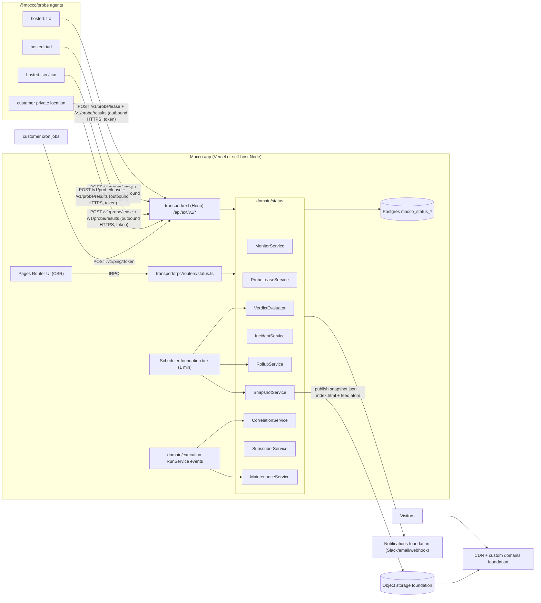

# Status page, monitors and incidents — implementation design

## Goals / non-goals

### Goals

1. **Monitors.** HTTP(S) monitors check status code, keyword present or absent, latency threshold and TLS expiry. TCP monitors check connect and optional banner. Heartbeat monitors take inbound pings and alert on silence. The default interval is 60 s or longer, and a deploy watch temporarily raises the rate to 30 s.
2. **Multi-region consensus.** A monitor is declared down only when a quorum of regions fails for N consecutive rounds. A single region's network blip never pages anyone.
3. **One probe agent for hosted and self-host.** The same stateless agent (`@mocco/probe`) runs in Mocco's hosted regions and on customer infrastructure (private locations). It needs outbound HTTPS only.
4. **Incidents.** Incidents are created manually or from a monitor. Statuses are investigating, identified, monitoring and resolved. Each incident has a timeline, affected components with impact, and a postmortem field. Changes are audit-logged.
5. **Deploy correlation.** An incident shows the Mocco runs that finished in the window before it started, and links both ways. A failing check during a deploy watch opens an incident attributed to the run.
6. **Scheduled maintenance.** Windows can be planned manually or tied to a gated run, opening on resume and closing on finish.
7. **Public status page.** Components and groups, 90-day uptime bars, current incidents, history and custom domain. Visitors subscribe by email, RSS/Atom or signed webhook. **The page keeps serving when the customer's product is down and when the Mocco app or DB is degraded.**
8. **Runs on Vercel and self-hosted** (Node 22 + Postgres) with the same code paths. Only the leaf adapters differ.

### Non-goals (v1)

- On-call schedules, escalation, phone and SMS.
- Browser (Playwright) checks, multi-step API checks, DNS/ICMP monitors.
- Automatic rollback on a failed post-deploy check (an enforcement change that needs a separate ADR).
- Private, SSO-gated or audience-specific pages. White-label sender domains.
- Sub-30 s intervals. Latency charts on the public page (the dashboard only shows them).
- A dedicated time-series database (Timescale, ClickHouse, Tinybird). v1 uses plain Postgres.

## User flows

1. **Set up a page (slice 1).** An operator opens Status, then Pages, then New. They pick a slug (`acme.status.mocco.club`), add component groups and components, and optionally link each component to a Mocco project/app or repo. They publish the page. A snapshot is built and uploaded, and the page is live on the CDN.
2. **Manual incident.** The operator declares an incident with title, affected components and impact, then posts updates and moves the status to resolved. Each change creates a new snapshot, notifies subscribers and appends an audit entry. The incident page lists the "Recent deploys" panel automatically.
3. **Create a monitor.** The operator creates an HTTPS monitor (URL, method, expected status, keyword, latency threshold 2,000 ms, TLS warning at 14 days), picks regions (default: 3 hosted regions, or a private location) and links it to a component. Monitor state drives component status (operational, degraded or major outage).
4. **Outage detected.** Two of three regions fail twice in a row, so the monitor is marked down. A monitor-origin incident is opened as a draft or auto-published (a per-monitor setting), and Slack/email/webhook alerts go out. The incident shows "Run `api#482` succeeded 6 min before first failure (commit `abc123`, gate `prod` resumed by Kim)".
5. **Deploy watch.** A run for repo `acme/api` succeeds. Every monitor linked to components of that repo or app runs at 30 s for 15 min. A down verdict inside the window opens an incident with `suspectedRunId` set and posts to the run's timeline ("Post-deploy check failed").
6. **Heartbeat.** A cron job calls `POST https://hb.mocco.club/v1/ping/<token>` (and `/start`, `/fail`). If no ping arrives within period plus grace, the evaluator marks it down.
7. **Governed maintenance.** A `.mocco.yml` gate is annotated `maintenance: { page: acme, components: [api], expectedMinutes: 20 }`. When the gate is resumed, a maintenance window starts on the page. It completes when the run finishes, or is flagged "overran" if the run is still going after the expected time.
8. **Subscribe.** A visitor enters an email on the public page. The form posts to `/api/ext/v1/status-pages/<slug>/subscribers`. The visitor confirms by double opt-in and can unsubscribe with a signed link. RSS/Atom is a static file in the snapshot bundle.
9. **Self-host private location.** An operator runs `docker run ghcr.io/fi-workers/mocco-probe -e MOCCO_PROBE_TOKEN=... -e MOCCO_URL=https://mocco.internal`. The agent leases work and reports results, and the location shows up as healthy under Status, then Locations.

## Architecture



### Prober architecture: options evaluated

| Option | Multi-region | Hosted | Self-host | Cost | Verdict |
|---|---|---|---|---|---|
| **Vercel Cron + regional functions** | A cron fires once, in the project's function region. Fan-out needs one deployment per region, or function `regions` (which Pro limits, unverified) | Yes (Pro: per-minute cron, 100 jobs per project) ([Vercel cron limits](https://vercel.com/docs/cron-jobs/usage-and-pricing)) | No (Vercel-only) | GB-s per check; cold starts skew latency | **Reject as prober.** Use only as the scheduler tick for the evaluator, rollups and snapshots. Hobby cron is daily-only, so the hosted plan must be Pro |
| **Cloudflare Workers cron** | Cron runs on "a randomly selected, relatively idle edge node". Region can't be pinned for cron; placement hints affect fetch handlers only ([CF placement](https://developers.cloudflare.com/workers/configuration/placement/)) | Yes | No | Very cheap | **Reject for v1.** Location is non-deterministic, and a TCP probe needs `connect()` (available, but adds a second runtime). Could later become a "global edge" pseudo-region |
| **Fly.io machines (one small VM per region)** | Yes, 18 regions (per [Fly pricing docs](https://docs.fly.io/about/pricing/)); OpenStatus runs its Go checker this way at about $4 per probe ([OpenStatus infra](https://www.openstatus.dev/blog/openstatus-infra)) | Yes | The same container runs anywhere | shared-cpu-1x 256 MB is about $2/mo per region plus egress (computed from the per-second price; unverified vs region multiplier up to 3x) | **Adopt for hosted regions**, but only as a host for the generic agent. There is no Fly API coupling in the core |
| **Self-hosted probe agent (pull model)** | Wherever the customer runs it | We run the same agent | Yes | Customer-paid | **Adopt as the core design.** Every probe, hosted or private, is this agent |

**Decision (proposed ADR "status probes are pull-based agents").** A probe is a stateless process, `packages/probe` (`@mocco/probe`, Node 22, no DB). It runs a loop:

1. `POST /api/ext/v1/probe/lease` with its location token. It receives a batch of **check assignments** due in the next ~60 s, each carrying monitor spec, `roundAt` (the scheduled round timestamp) and a `leaseId`.
2. It executes each check at `roundAt` plus jitter, using `undici` for HTTP with `timings`, `node:net` for TCP and `node:tls` for certificate expiry.
3. It posts result batches to `POST /api/ext/v1/probe/results` (idempotent on `(leaseId, monitorId, roundAt, locationId)`).
4. It heartbeats its own liveness. If a location goes silent, it is excluded from quorum and Mocco raises an internal "location unhealthy" alert.

Why pull: private locations behind NAT need no inbound ports (the OpenStatus model). The app stays request-scoped, since leases and results are ordinary short HTTP requests, which fits Vercel functions. Hosted and self-host are identical, and the self-host server can also run an **embedded probe** (the same loop in-process via the scheduler foundation) for single-node installs.

**Scheduling (server side).** `mocco_status_monitors.next_round_at` is the scheduling cursor. A lease call runs `SELECT ... FROM mocco_status_monitor_locations ml JOIN mocco_status_monitors m ... WHERE ml.location_id = $loc AND m.next_round_at <= now() + interval '60 seconds' AND m.paused = false FOR UPDATE SKIP LOCKED LIMIT 200`. It inserts `mocco_status_probe_leases` rows. Each location gets its own lease per round, so regions don't compete. The **evaluator tick** advances `next_round_at` once a round is closed. A round is closed when all assigned locations have reported, or when `roundAt + timeout + 15 s` has passed; a missing report counts as `no_data`, never as a failure.

### Consensus and state machine

- Per round, each location reports `ok | fail | no_data`. The verdict for a round is `fail` if `failCount >= quorum`, where quorum defaults to `ceil(reportingLocations / 2)` and the minimum is 1 for single-location monitors. It is `ok` if `okCount >= quorum`, and `unknown` otherwise.
- Monitor state: `up → suspect` after the first failing round. On suspect, the evaluator schedules an **immediate recheck round** (`next_round_at = now`). The state becomes `down` after `confirmations` consecutive failing rounds (default 2). `down → recovering` after an ok round, and `recovering → up` after `recoveryConfirmations` ok rounds (default 2). `degraded` means the latency threshold was exceeded by quorum while status checks still pass.
- Every state transition writes `mocco_status_monitor_state_changes` (the outage interval source of truth), fires alerts and, if configured, opens or updates an incident.
- TLS expiry is a separate, non-outage **warning** signal (days remaining below threshold). It alerts once per threshold crossing.
- Heartbeat monitors have no probes. The evaluator marks them `down` when `now > last_ping_at + period + grace`, or immediately on a `/fail` ping.

### Surfaces

| Surface | Transport | Consumers |
|---|---|---|
| Operator UI (monitors, incidents, pages, maintenance, locations) | **tRPC** `status.*` router (internal only) | Mocco frontend |
| Probe protocol (`/v1/probe/lease`, `/v1/probe/results`, `/v1/probe/heartbeat`) | **Hono ext `/api/ext/v1/...`** | `@mocco/probe` agents |
| Heartbeat pings (`/v1/ping/:token[/start|/fail|/:exitCode]`, GET and POST) | Hono ext `/v1`, also on host `hb.mocco.club` | Customer cron jobs |
| Public REST API (monitors, incidents, components, maintenance) | Hono ext `/v1`, workspace API keys (SDK packaging foundation) | CI, Terraform later, `@mocco/sdk` |
| Public subscriber endpoints (subscribe, confirm, unsubscribe) | Hono ext `/v1/status-pages/:slug/...`, rate-limited, CORS for page origins | Status page JS |
| Public page content | **Static files on CDN** (no app request on read) | Visitors, RSS readers |

### Background jobs (scheduler/jobs foundation)

| Job | Cadence | Work |
|---|---|---|
| `status.evaluate` | every minute (plus on results ingest, inline and cheap) | Close rounds, compute verdicts, drive the state machine, heartbeat silence, location health |
| `status.snapshot.publish` | on-demand (outbox row) plus every 5 min safety | Build and upload page snapshots for pages whose `dirty_at > published_at` |
| `status.rollup` | hourly, and daily at 00:10 UTC | Raw to hourly to daily rollups; recompute daily uptime from state changes |
| `status.retention` | daily | Drop raw result partitions older than the retention period (default 14 days) |
| `status.notify` | outbox drain | Subscriber and alert deliveries through the notifications foundation |
| `status.maintenance.tick` | every minute | Start and complete scheduled windows; flag overrun on run-linked windows |

On Vercel the tick is a Vercel Cron route (Pro: per-minute). On self-host it is the scheduler foundation's in-process loop. Both call the same `JobRunner` entry.

## Domain model

All tables are `mocco_status_*`, with uuid PKs `defaultRandom()`, `workspace_id` on every row (tenant scoping) and `created_at`/`updated_at` helpers. `project_id` refers to the **project/app entity** foundation.

### Configuration

- **`mocco_status_pages`**: `id, workspace_id, project_id?, slug (uq global), title, locale ('en'|'ko'), custom_domain_id?` (custom domains foundation)`, theme jsonb, visibility ('public'|'draft'), dirty_at, published_at, published_version int, published_etag`. Indexes: `mocco_status_pages_slug_uq`, `mocco_status_pages_workspace_idx`.
- **`mocco_status_component_groups`**: `id, workspace_id, page_id, name, position`.
- **`mocco_status_components`**: `id, workspace_id, page_id, group_id?, name, description, position, status ('operational'|'degraded'|'partial_outage'|'major_outage'|'maintenance'), status_source ('manual'|'monitors'), repo_id?` (-> `mocco_repos`)`, project_id?, show_uptime bool, started_tracking_at`. Invariant: when `status_source='monitors'`, the displayed status is derived as the worst of its linked monitors and active incidents/maintenance, and a manual override is an incident.
- **`mocco_status_locations`**: `id, workspace_id? (null = hosted/global), code ('fra','iad','sin','icn',...), name, kind ('hosted'|'private'|'embedded'), token_hash (uq), last_seen_at, agent_version, disabled_at`.
- **`mocco_status_monitors`**: `id, workspace_id, name, kind ('http'|'tcp'|'heartbeat'), spec jsonb` (zod-typed per kind: url, method, headers (secret refs), body, expected_status[], keyword, keyword_mode, latency_threshold_ms, timeout_ms, follow_redirects, tls_warn_days; tcp host/port)`, interval_s (>=60), confirmations, recovery_confirmations, quorum_mode ('majority'|'any'|'all'), state ('up'|'suspect'|'down'|'recovering'|'degraded'|'paused'|'pending'), state_changed_at, next_round_at, watch_until?, watch_interval_s?, watch_run_id?, incident_policy ('none'|'draft'|'publish'), heartbeat_token_hash? (uq), heartbeat_period_s?, heartbeat_grace_s?, last_ping_at?`. Indexes: `mocco_status_monitors_next_round_idx (next_round_at) WHERE state <> 'paused'`, `mocco_status_monitors_workspace_idx`, `mocco_status_monitors_heartbeat_token_uq`. Check: `interval_s >= 60`.
- **`mocco_status_monitor_locations`**: `monitor_id, location_id` (composite uq), `workspace_id`.
- **`mocco_status_component_monitors`**: `component_id, monitor_id, impact_when_down ('major_outage'|'partial_outage'|'degraded')`.

### Time series

- **`mocco_status_probe_leases`**: `id, workspace_id, monitor_id, location_id, round_at, leased_at, expires_at, reported_at?`. uq `(monitor_id, location_id, round_at)`, which gives idempotent assignment.
- **`mocco_status_check_results`** (raw, **range-partitioned by `round_at` per day**, retention 14 days): `monitor_id, location_id, round_at, workspace_id, outcome ('ok'|'fail'|'no_data'), error_kind ('timeout'|'dns'|'connect'|'tls'|'status'|'keyword'|'latency'|null), status_code smallint?, latency_ms int?, timings jsonb? (dns/connect/tls/ttfb), tls_expires_at?, detail text (truncated 512B)`. PK `(monitor_id, round_at, location_id)`, with no uuid PK. This is a documented exception like `mocco_audit_log`, since the table is append-only time series. Index `(workspace_id, round_at)`. Partitions are created ahead by the retention job. pglite supports declarative partitioning; the migration creates the parent, and the job creates children.
- **`mocco_status_round_verdicts`**: `monitor_id, round_at, verdict ('ok'|'fail'|'unknown'|'degraded'), ok_count, fail_count, no_data_count, p50_latency_ms`. PK `(monitor_id, round_at)`, partitioned like the raw table, retention 30 days.
- **`mocco_status_monitor_state_changes`**: `id, workspace_id, monitor_id, from_state, to_state, at, round_at, reason jsonb, incident_id?`. Index `(monitor_id, at)`. This is the **source of truth for downtime**. Outage intervals run from `down` to the next `up`, and it is kept forever.
- **`mocco_status_rollups_hourly`**: `monitor_id, hour, workspace_id, rounds, ok_rounds, fail_rounds, unknown_rounds, down_seconds, latency_sum_ms, latency_count, latency_hist int[16]` (fixed log buckets, so percentiles can be merged). PK `(monitor_id, hour)`, retention 90 days.
- **`mocco_status_rollups_daily`**: `monitor_id, day, workspace_id, rounds, ok_rounds, down_seconds, maintenance_seconds, uptime_ratio numeric(7,6), latency_hist int[16], p95_ms`. PK `(monitor_id, day)`, kept forever (about 365 rows per monitor per year).
- **`mocco_status_component_days`**: `component_id, day, workspace_id, worst_status, down_seconds, incident_ids uuid[]`. It feeds the 90-day bars directly.

**Uptime math:** `uptime = 1 - (down_seconds - overlap_with_maintenance) / (86400 - maintenance_seconds)`. It is computed from state-change intervals, not by counting ok checks, so an outage between rounds is counted by time. Rounds with `unknown` verdicts (such as location failures) never count as downtime.

**Volume estimate:** 1,000 monitors at 60 s with 3 locations is 4.3M raw rows per day (about 100 B each, roughly 430 MB per day). Across 14 daily partitions that is about 6 GB. That is fine for Postgres at v1 scale, and a whole partition is dropped at once instead of deleting rows. Above roughly 20k monitors, the raw table moves behind a `CheckResultSink` port (see open questions).

### Incidents and maintenance

- **`mocco_status_incidents`**: `id, workspace_id, page_id?, title, status ('investigating'|'identified'|'monitoring'|'resolved'), severity ('minor'|'major'|'critical'), origin ('manual'|'monitor'|'deploy_watch'|'api'), visibility ('draft'|'published'), started_at, identified_at?, resolved_at?, suspected_run_id?` (-> `mocco_runs`, SET NULL)`, postmortem_md text?, postmortem_published_at?, created_by_user_id?`. Indexes `(workspace_id, status)`, `(page_id, started_at desc)`, `(suspected_run_id)`. Invariant: `resolved_at` is set if and only if `status='resolved'`.
- **`mocco_status_incident_updates`**: `id, workspace_id, incident_id, status, body_md, notify_subscribers bool, author_user_id?, created_at`. It is append-only, and each update is also written to the audit log.
- **`mocco_status_incident_components`**: `incident_id, component_id, impact` (uq pair).
- **`mocco_status_incident_monitors`**: `incident_id, monitor_id`. It links the monitor-origin incident; a monitor has at most one open incident (partial uq `WHERE closed_at IS NULL`).
- **`mocco_status_incident_runs`**: `incident_id, run_id, relation ('suspected'|'before_window'|'fix'|'manual'), score real?, linked_by ('system'|user id)`. uq `(incident_id, run_id)`. It provides the two-way link. The run side shows incidents via a reverse index `(run_id)`.
- **`mocco_status_maintenances`**: `id, workspace_id, page_id, title, body_md, status ('scheduled'|'in_progress'|'completed'|'canceled'|'overrun'), scheduled_start, scheduled_end, actual_start?, actual_end?, run_id?, gate_id?` (-> `mocco_run_gates`)`, suppress_alerts bool default true`. Index `(page_id, scheduled_start)`, `(run_id)`.
- **`mocco_status_maintenance_components`**: `maintenance_id, component_id`.

### Subscribers

- **`mocco_status_subscribers`**: `id, workspace_id, page_id, channel ('email'|'webhook'), email_ci citext?, webhook_url?, webhook_secret_enc?, component_ids uuid[]? (null = all), confirmed_at?, unsubscribed_at?, confirm_token_hash, locale, last_delivery_status`. uq `(page_id, channel, email_ci)` and `(page_id, channel, webhook_url)`.
- **`mocco_status_notification_outbox`**: `id, workspace_id, kind ('subscriber'|'alert'), subject_type, subject_id, payload jsonb, dedupe_key (uq), attempts, next_attempt_at, sent_at?`. It hands off to the notifications foundation. The dedupe key guarantees at most one "incident X update Y" delivery per subscriber.
- **`mocco_status_alert_channels`**: `id, workspace_id, kind ('slack'|'email'|'webhook'), config` (secret refs)`, monitor_ids uuid[]? | all`. v1 may reuse notification-foundation channel rows if they exist.

### Snapshot

- **`mocco_status_page_snapshots`**: `id, workspace_id, page_id, version int, etag, body jsonb (the full public JSON), built_at, uploaded_at?, upload_error?`. The last 20 are kept. This allows rollback and lets a self-hoster rebuild the CDN from the DB.

### Key invariants

- A monitor with `kind='heartbeat'` has no monitor_locations rows, and a probe kind has no heartbeat token.
- The only writers of `state` on `mocco_status_monitors` are `VerdictEvaluator` (inside a transaction with an advisory lock per monitor, using the `AdvisoryLockNamespaces.statusMonitor` namespace) and `MonitorService.pause/resume`.
- Every incident or maintenance change marks `page.dirty_at = now()` in the same transaction and enqueues `status.snapshot.publish`.
- Public snapshot JSON contains only published incidents and public component data. The allowlist projection lives in `SnapshotService` (the egress boundary, since there is no tRPC `.output()` stripping).

## Backend modules

`packages/backend/src/domain/status/` (a DB-owning domain, so ADR 0012 repos apply):

| File | Role |
|---|---|
| `MonitorService.ts` | CRUD, spec validation (zod from `@mocco/common/status`), pause/resume, secret header refs |
| `ProbeLeaseService.ts` | Location auth (token hash), lease batch, result ingest (idempotent), location heartbeat |
| `VerdictEvaluator.ts` | Round closing, quorum, state machine, heartbeat silence; pure logic in `consensus.ts` (unit-tested without DB) |
| `IncidentService.ts` | Lifecycle, updates, component impact, monitor-origin open/close, audit appends via `AuditService` |
| `CorrelationService.ts` | Finds candidate runs; handles run-finished events (deploy watch start); computes suspicion score |
| `MaintenanceService.ts` | Scheduled windows, run/gate-linked windows, alert suppression query |
| `ComponentStatusService.ts` | Derives component status (worst of monitors, incidents, maintenance) |
| `RollupService.ts` | Hourly/daily rollups, component days, partition management |
| `SnapshotService.ts` | Builds public JSON, RSS/Atom and HTML shell; publishes via `StaticPublisher`; ETag/version |
| `SubscriberService.ts` | Subscribe, double opt-in, unsubscribe, fan-out into outbox |
| `AlertService.ts` | Operator alerts on state change, dedupe and recovery, via `Notifier` |
| `consensus.ts`, `uptime.ts`, `latency-hist.ts` | Pure functions |
| `errors.ts` | `MonitorNotFoundError extends NotFoundError`, `ProbeAuthError`, `LeaseConflictError`, `IncidentTransitionError extends ConflictError`... |
| `repos/*.repo.ts` | One per table (`monitor.repo.ts`, `check-result.repo.ts`, `incident.repo.ts`, ...) |
| `ports.ts` | `StaticPublisher`, `Notifier`, `RunEventsSource`, `Clock` |
| `instance.ts` | Composition root |

**Neutral interfaces and vendor leaf files:**

```ts
// domain/status/ports.ts
export interface StaticPublisher {            // implemented by object-storage foundation adapters
  put(key: string, body: Uint8Array, opts: { contentType: string; cacheControl: string }): Promise<void>;
  purge(keys: readonly string[]): Promise<void>; // CDN purge; no-op on plain file hosts
}
export interface Notifier {                   // notifications foundation
  send(message: OutboundNotification): Promise<DeliveryResult>;
}
export interface RunEventsSource {            // domain/execution, in-process
  onRunFinished(handler: (e: RunFinished) => Promise<void>): void;
  onGateResumed(handler: (e: GateResumed) => Promise<void>): void;
  runsFinishedBetween(workspaceId: WorkspaceId, from: Date, to: Date, scope: RunScope): Promise<readonly RunSummary[]>;
}
```

Leaf files that are the only vendor importers:
- `domain/status/publish/s3-publisher.ts`: S3-compatible (R2, S3, MinIO) through the object storage foundation's client. Env `STATUS_PUBLISH_BUCKET`, `STATUS_PUBLISH_PURGE_URL`.
- `domain/status/publish/fs-publisher.ts`: self-host directory output (`STATUS_PUBLISH_DIR`), served by any static server.
- `domain/status/publish/vercel-blob-publisher.ts` (optional).
- `packages/probe/src/http-check.ts`: the only `undici` importer.
- No Fly.io API is used by code. Hosted probe deployment is infra (`infra/probe/fly.toml`), outside the backend.

**Transport:** `transport/trpc/routers/status.ts` (with router-scoped `protectedStatusProcedure` mapping `NotFoundError`, `ConflictError` and `ValidationError`, plus `assertMember` on `workspaceId`). `transport/ext/routes/status-probe.ts`, `status-ping.ts`, `status-public.ts` and `status-api-v1.ts` mount onto the existing Hono app.

## Public API / SDK surface

### Ext `/v1` REST (Hono, under `/api/ext/v1`)

```
# probe protocol (Authorization: Bearer <location token>)
POST /probe/lease        { agentVersion, capacity } -> { leases: Lease[], pollAfterMs }
POST /probe/results      { results: ProbeResult[] } -> 202 { accepted, duplicates }
POST /probe/heartbeat    { agentVersion, inflight } -> 204

# heartbeats (token in path; GET allowed for curl/wget one-liners)
GET|POST /ping/:token            -> 200 "OK"
GET|POST /ping/:token/start
GET|POST /ping/:token/fail
GET|POST /ping/:token/:exitCode  (0 = success)

# public subscriber endpoints (unauthenticated, rate-limited, captcha-ready)
POST /status-pages/:slug/subscribers   { channel:'email', email, componentIds? } -> 202
GET  /status-pages/:slug/subscribers/confirm?token=...
GET  /status-pages/:slug/subscribers/unsubscribe?token=...

# management API (workspace API key, scope status:write)
GET/POST          /monitors            PATCH/DELETE /monitors/:id   POST /monitors/:id/pause|resume
POST              /monitors/:id/check  (ad-hoc round, e.g. from a CI step)
GET/POST          /incidents           PATCH /incidents/:id   POST /incidents/:id/updates
GET/POST          /maintenances        PATCH /maintenances/:id
GET               /pages/:id/components  PATCH /components/:id  (manual status)
```

### SDK sketch (`@mocco/sdk`, SDK packaging foundation)

```ts
import { createMocco } from '@mocco/sdk';

const mocco = createMocco({ apiKey: process.env.MOCCO_API_KEY });

// heartbeat wrapper for jobs
await mocco.status.heartbeat('hb_7fk2...').wrap(async () => {
  await runNightlyExport();
}); // pings /start, then / on success or /fail on throw

// monitors as code (CI-friendly, idempotent by key)
await mocco.status.monitors.upsert({
  key: 'api-health',
  kind: 'http',
  spec: { url: 'https://api.acme.com/health', expectedStatus: [200], keyword: '"ok":true', latencyThresholdMs: 1500 },
  intervalS: 60,
  locations: ['fra', 'iad', 'icn'],
  components: [{ id: 'cmp_api', impactWhenDown: 'major_outage' }],
});

// incidents from scripts
const inc = await mocco.status.incidents.create({
  pageId: 'pg_acme', title: 'Elevated API errors', status: 'investigating',
  components: [{ id: 'cmp_api', impact: 'partial_outage' }],
});
await mocco.status.incidents.update(inc.id, { status: 'resolved', body: 'Rolled back.' });
```

`@mocco/probe` is published as both an npm package (`npx @mocco/probe`) and a container image (`ghcr.io/fi-workers/mocco-probe`). Its env: `MOCCO_URL`, `MOCCO_PROBE_TOKEN`, `MOCCO_PROBE_CONCURRENCY`.

### Public snapshot format (static)

`/{slug}/v/{version}/snapshot.json` (immutable, `Cache-Control: public, max-age=31536000, immutable`) and `/{slug}/current.json` (pointer `{ version, etag, builtAt }`, `max-age=15, stale-while-revalidate=60, stale-if-error=604800`). Other files are `/{slug}/feed.atom` and `/{slug}/index.html` (the shell, which fetches `current.json` and then the versioned snapshot). The snapshot holds page meta, groups, components with current status, 90-day bars (from `component_days`), active incidents with updates, upcoming and active maintenance, and the last 50 resolved incidents. `history/{yyyy-mm}.json` is created lazily.

## Public page availability

1. **Read path never hits the Mocco app or DB.** Visitors fetch static objects from the CDN. When the customer's product is down, Mocco is unaffected. When Mocco's app or DB is down, the last published snapshot still serves: the `stale-if-error` headers apply and the objects are immutable.
2. **Write path is push.** Every incident, maintenance or status change creates a new versioned snapshot, uploads it, then flips `current.json` and purges only that key. A failed upload is retried by the 5-minute safety job, and `upload_error` is shown in the operator UI.
3. **Degraded-Mocco operator path (documented runbook plus feature).** If the Mocco app is down, operators can still post an incident through a "break-glass" path. The CLI `mocco status incident --offline` builds a snapshot locally from the last `snapshot.json` plus the new update and uploads it with a page-scoped publish credential (hosted: a pre-signed, short-lived credential that operators download ahead of time; self-host: direct bucket access). This is optional in v1 and listed as a slice stretch.
4. **Hosted domains:** `<slug>.status.mocco.club` plus customer CNAMEs (custom domains foundation). The CDN origin is object storage, **not** the Vercel app, so a Vercel incident affecting Mocco does not take pages down. Rendering the shell with Next ISR was rejected: it would put Vercel's function or runtime in the read path at revalidation time, and a self-hoster would need Next running to serve the page.
5. **Subscribe form** is the only dynamic call from the page. If it fails, the form shows "try again later" and the page itself still works.
6. **Mocco's own status page** runs on the same system, but from a separately deployed probe set and bucket, so we eat our own dogfood without a circular dependency.

## Deploy correlation

- **Which runs count as "promoted to production":** runs in `succeeded` state whose pinned definition contains a production gate that was resumed, or any run whose `triggerSource`/labels mark it as a production deploy (defined by the pipeline domain, unverified naming). The v1 rule: `state='succeeded' AND finished_at IS NOT NULL`, scoped to repos or projects linked to the affected components. If nothing is linked, all runs in the workspace count.
- **Window:** `[incident.started_at - 2h, incident.started_at + 5m]`, configurable per page. Candidates are ranked by `score = 1 / (1 + minutesBeforeFirstFailure / 10)`, multiplied by 1.5 if the run's repo is linked to an affected component and by 2 if the failure happened during that run's deploy watch.
- **Two-way links:** rows in `mocco_status_incident_runs`. The run detail page (execution UI) gets an "Incidents" panel through a tRPC query on the status router. `domain/execution` does not depend on `domain/status`. The dependency is status to execution only, through `RunEventsSource`.
- **Deploy watch:** `CorrelationService.onRunFinished`, on success, sets `watch_until = now + 15m`, `watch_interval_s = 30` and `watch_run_id` on the linked monitors, and pulls `next_round_at` to now. A down verdict with `watch_run_id` set opens an incident with `origin='deploy_watch'`, `suspected_run_id` set and a system update "Started within N min of run X". It also appends a run event (`status.post_deploy_check_failed`), so the run timeline shows the failure. It does not change run state. That would be the auto-rollback ADR.
- **Audit:** incident create, status change, postmortem publish and manual run link or unlink are appended to the existing hash-chained audit log with `subject_type='status_incident'`.

## Maintenance windows

- Manual windows are scheduled with start and end. The tick moves them to `in_progress` (component status becomes `maintenance`, subscribers are notified if opted in) and then to `completed`.
- **Gate-linked:** a gate item in `.mocco.yml` may carry `maintenance:` metadata. This requires an additive schema change to `mocco.schema.json`, with lean-core rules per ADR 0010, and needs review. On `GateResumed`, `MaintenanceService` creates or starts a window linked to `run_id` and `gate_id`. On `RunFinished` (any terminal state), the window completes. If the run is still going after `expectedMinutes`, the window is marked `overran` and the operator is alerted.
- **Alert suppression:** while a window covering a component is active, monitor-origin incidents for monitors on those components are **not auto-published**. Alerts are still sent to operators, labeled "(during maintenance)". Maintenance seconds are excluded from uptime.

## External vendors and self-host story

| Concern | Hosted Mocco | Self-host (Node 22 + Postgres) |
|---|---|---|
| Scheduler tick | Vercel Cron, per-minute (Pro) | In-process loop (scheduler foundation) |
| Probes | `@mocco/probe` on Fly.io machines in about 6 regions (`fra`, `iad`, `sjc`, `sin`, `nrt`, plus `icn` if available (unverified that Fly offers Seoul)) | Embedded probe (single region) and/or any number of `@mocco/probe` containers |
| Page hosting | Object storage (R2 or S3) behind the CDN with custom domains | `fs-publisher` directory served by nginx/Caddy, or S3/MinIO; any CDN optional |
| Email | Notifications foundation (vendor behind neutral `Notifier`) | SMTP adapter |
| TLS for custom domains | Custom domains foundation | Operator's reverse proxy |
| Time series | Postgres | Postgres |

No new env name is vendor-branded: `STATUS_PUBLISH_*`, `STATUS_PROBE_EMBEDDED=true`, `STATUS_RAW_RETENTION_DAYS`.

## Security and abuse

- **SSRF and abuse as a DDoS relay:** the minimum interval is 60 s, and each workspace has a monitor cap (billing/metering). Hosted probes resolve DNS first and **block private, link-local, loopback and metadata ranges** (169.254.169.254, fd00::/8, and so on), with the check applied to the resolved IP at connect time to defeat DNS rebinding. Private locations may target private ranges by design. Redirects are limited to 5, with the same IP check at every hop. The response body is read up to 1 MB (for keyword matching) and then discarded.
- **Target verification (optional hosted setting):** a monitor on a domain not verified for the workspace is capped at a 5 min interval until verified by DNS TXT or a well-known file (unverified that this is needed; it is modeled on abuse controls used elsewhere).
- **Secrets in monitor specs** (auth headers) are stored encrypted, reference the workspace secrets store if one exists, are sent to probes only inside the lease over TLS, and are never written to results or snapshots.
- **Probe tokens:** high-entropy random values, stored only as SHA-256 hashes, scoped to one location, and rotatable. A private-location token can only lease monitors of its own workspace. A hosted token can lease any monitor assigned to that hosted location. Result ingest verifies that every result matches an outstanding lease for that location, so a stolen token cannot forge another location's results.
- **Heartbeat tokens:** unguessable (128-bit) path tokens, rate-limited per token (for example 1 ping per second).
- **Subscriber endpoints:** per-IP and per-page rate limits, double opt-in (no confirmed emails are sent to unverified addresses beyond the one confirmation), a hidden honeypot field, and captcha hook ready. Webhook subscribers are signed with HMAC-SHA256 (`X-Mocco-Signature`) and pass the same SSRF filter on delivery.
- **Snapshot egress:** explicit allowlist projection with no internal ids beyond public component ids, no author emails and no draft incidents. A test asserts that a draft incident never appears in the snapshot.
- **Tenant isolation:** every tRPC procedure calls `assertMember` on `workspaceId`, and cross-tenant tests cover each one.

## Scale and performance notes

- Lease queries use the `next_round_at` partial index and `SKIP LOCKED`. At 1,000 monitors per minute that is about 17 per second with 3 locations, which is trivial.
- Result ingest is batched (up to 200 per request) with a multi-row insert and `ON CONFLICT DO NOTHING`. The evaluator runs inline for the affected monitors only.
- Connection budget: hosted functions use the existing pooled `DATABASE_URL`. Advisory locks are always `pg_advisory_xact_lock` (transaction pooler rule).
- Snapshot build is O(components x 90 days). Coalesce with `dirty_at` so that 20 quick incident updates lead to at most one build every 5 s per page (debounce).
- CDN cost is dominated by `current.json` polls. The page JS polls every 30 s only while the tab is visible.
- Probe latency: hosted agents are long-lived (Fly VMs), so there are no cold starts in latency figures. Timings are measured with `undici` phase timings.

## Dependencies on platform foundations

- **Project/app entity:** components and monitors link to a project or app, and correlation is scoped by project repos.
- **Scheduler / background jobs:** evaluator, rollups, retention, snapshot publish, maintenance tick and outbox drain. #103 is the first heavy consumer, and the embedded probe also runs on it.
- **Public rendering:** the status page is the static-snapshot variant. It pins the shared ADR's decision that "public pages are prebuilt static and pushed to CDN" for this product, and must reconcile it with the help center and forum choice.
- **Custom domains:** `status.acme.com` to the CDN, with TLS provisioning.
- **Object storage:** the `StaticPublisher` implementation.
- **Notifications:** Slack, email and webhook for alerts and subscribers, templated in English and Korean.
- **SDK packaging:** `@mocco/sdk` status namespace and `@mocco/probe`, with API keys for `/v1`.
- **Billing/metering:** monitor count, locations and pages per plan; enforce the minimum interval per plan.
- **Realtime:** optional for the operator dashboard (live monitor state). v1 can poll.
- **End-user identity:** not needed in v1 (subscribers are anonymous email). **LLM surface:** not needed in v1. Incident-update drafting from run diffs is a later idea.

## Testing strategy (pglite)

- **Pure unit tests:** `consensus.ts` (quorum and state machine tables covering flapping, all-no_data and single location), `uptime.ts` (maintenance overlap, day boundaries, DST-free UTC), `latency-hist.ts` (merge and percentile).
- **pglite integration:** lease with `SKIP LOCKED` under two concurrent callers (no double assignment); idempotent result ingest; evaluator transitions writing state_changes; partition creation and retention drop; rollups matching raw data; snapshot projection (drafts excluded); subscriber double opt-in; outbox dedupe.
- **Correlation tests** seed `mocco_runs` through the real execution repos and assert the candidate window, scoring, deploy watch start and run event append.
- **Ext tests** use the Hono app `request()` for the probe protocol (bad token 401, cross-location forgery rejected), ping endpoints and subscriber rate limits.
- **Probe agent tests** run against a local HTTP/TCP fixture server (timeouts, TLS expiry against a self-signed cert with a known notAfter, keyword, redirects, SSRF block list).
- **Fake publisher and notifier:** real classes implementing the ports (in-memory), injected by constructor. No `vi.mock`.
- **Cross-tenant tests** on every `status.*` tRPC procedure.

## Open questions / ADRs needed

1. **ADR: status probes are pull-based agents** (hosted on Fly.io as infra, the same image self-hosted). It records the rejection of Vercel regional functions and Cloudflare cron as probers.
2. **ADR: public pages are static snapshots on object storage and CDN.** This coordinates with the public rendering foundation ADR (help center and forum may choose SSR/ISR instead). Status needs independence from the app, so it may be the exception.
3. **Raw results storage at scale.** Should plain Postgres partitions stay the only option, or should a `CheckResultSink` port get an optional ClickHouse/Timescale adapter at more than 20k monitors? Defer, but keep the port.
4. **Hosted regions and Seoul.** Confirm Fly region availability for `icn` (unverified). Otherwise use another host (Vultr Seoul or AWS ap-northeast-2 Lightsail) for a Korea probe. The agent is host-agnostic.
5. **`.mocco.yml` `maintenance:` on gates.** Is this an additive schema change allowed under ADR 0010's lean core, or should the link be configured in the Status UI (gate name to page) instead? The UI mapping is safer for v1.
6. **What counts as a "production" run** for correlation, until the pipeline model has an explicit production marker. Resolve with the pipeline owner.
7. **Monitor-origin incident default:** draft (safer) or auto-publish? The proposal is draft by default with an opt-in to publish.
8. **Pricing unit:** monitors times locations, or flat monitors? This is part of the epic's pricing decision.
9. **Break-glass offline publish credential:** is it worth building in v1, given its security model (pre-issued, page-scoped, short-lived)?
